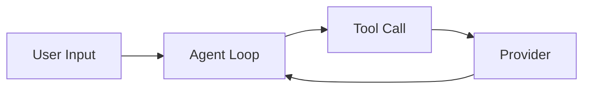

# Contributing to Pi Docs

Pi Docs is a community translation of the [Pi Agent Book](https://www.dgzhuya.com/) source-code reading notes. How to contribute, the style rules, and the local build steps are below.

## Code of Conduct

Be respectful and focus on technical accuracy. Disagreements about translations are resolved by referencing the original Chinese source, the official [pi.dev](https://pi.dev) docs, and the [Pi source code](https://github.com/earendil-works/pi). When in doubt, follow the source code.

## How to Contribute

You can help in several ways:

- **Fix a typo or improve wording** in an existing translation (small PR, single file).
- **Translate a missing chapter** (medium PR, 1-2 files in `src/content/docs/en/` or `src/content/docs/vi/`).
- **Add a new term to `GLOSSARY.md`** when you encounter a technical term that is not yet listed (small PR).
- **Improve validation scripts or CI** in `scripts/` and `.github/workflows/` (medium PR).
- **Report a sync mismatch** between `src/content/docs/zh/`, `src/content/docs/en/`, and `src/content/docs/vi/` by opening an issue.

All contributions go through pull requests. Direct pushes to `main` are not permitted.

## Translation Workflow

Follow these steps to translate or edit a chapter:

1. Identify the source chapter in `src/content/docs/zh/` (Chinese is canonical).
2. Open the matching file in `src/content/docs/en/` or `src/content/docs/vi/`.
3. Preserve the frontmatter schema exactly; only update `status`, `last_updated`, `translator`, `reviewed_by`.
4. Translate the body following the [Style Rules](#style-rules).
5. Run `npm run lint:sync` locally to confirm structural parity with `src/content/docs/zh/`.
6. Open a PR. CI runs `deploy.yml` automatically.

## Style Rules

These rules are enforced manually in review and partially automated by `validate-frontmatter.mjs`:

1. **Never translate code, API names, file paths, or environment variables.** Keep `SessionManager`, `PI_OFFLINE`, `~/.pi/agent/settings.json` as-is.
2. **Inline terms**: first occurrence uses `English term (short explanation)`; after that, English only.
3. **Headings**: write in natural English or Vietnamese; if the heading is a core technical term, keep the English term in parentheses.
4. **Code comments**: if the Chinese source comment is in Chinese, translate the comment to English or Vietnamese; keep all code identifiers unchanged.
5. **Numbers, units, dates**: keep the original format.
6. **Links**: keep the URL unchanged; translate the link text.
7. **Tables**: translate headers and cells; preserve column count.
8. **Frontmatter values** (`title_en`, `title_vi`): translate fully into the target language.
9. **No emojis** in prose, headings, or code comments.
10. **No fluff**: avoid cheerful filler like "Thanks!" or "Hope this helps!": technical prose only.
11. **Concise language**: define jargon before use; prefer concrete examples over abstract summaries.
12. **Structure**: when explaining a non-trivial concept, follow `problem -> example -> solution -> why`.

## Frontmatter Schema

Every chapter `.md` file begins with YAML frontmatter. The schema is defined in `src/content.config.ts`. Example:

```yaml
---
title: Chapter 1: Introduction
chapter: 1
slug: ch01-overview
title_zh: "Chapter 1"
title_en: "Chapter 1: Introduction - Why Pi-Agent Is Worth Your Time"
title_vi: "Chapter 1: Introduction"
source_url: https://www.dgzhuya.com/modules/ch01-overview
language: en
version_pairs:
  zh: src/content/docs/zh/ch01-overview.md
  en: src/content/docs/en/ch01-overview.md
  vi: src/content/docs/vi/ch01-overview.md
original_chars: 6787
code_lines: 82
reading_minutes: 34
translator: your-github-handle
reviewed_by: null
last_updated: 2026-08-20
status: draft
official_refs:
  - https://pi.dev/docs/latest/index
  - https://pi.dev/docs/latest/quickstart
terms_used:
  - Agent Loop
  - Pi-Agent
  - Tool System
mermaid_blocks: 2
code_blocks: 7
---
```

Field reference (all required unless noted):

- `chapter` (int, 1-10): chapter number.
- `slug` (string, matches `^ch[0-9]{2}-[a-z0-9-]+$`): unique identifier.
- `title_zh`, `title_en`, `title_vi`: translated chapter titles.
- `source_url` (URL): original Chinese source on dgzhuya.com.
- `language` (`zh` | `en` | `vi`): language of this file.
- `version_pairs`: sibling file paths in all three languages.
- `original_chars`, `code_lines`, `reading_minutes` (optional): source metrics.
- `translator`, `reviewed_by` (optional): git handles.
- `last_updated` (date): last edit date.
- `status` (`draft` | `translated` | `reviewed` | `published`): workflow state.
- `official_refs` (optional list): official pi.dev URLs used to verify content.
- `terms_used` (optional list): glossary terms that appear in this chapter.
- `mermaid_blocks`, `code_blocks` (int): counts for sync validation.

See `docs/superpowers/specs/2026-08-20-pi-docs-translation-design.md` section 4 for full schema details.

## Glossary

`GLOSSARY.md` at the repository root holds preserved English technical terms that must not be translated. Categories include:

- **Core Pi terms**: Pi Agent, Agent Loop, Tool System, TUI, Skills, Extensions, etc.
- **Official API identifiers**: `SessionManager`, `firstKeptEntryId`, `contextWindow`.
- **Telemetry attributes**: `pi.ai.request`, `pi.harness.run`.
- **Paths and settings**: `~/.pi/agent/settings.json`, `SYSTEM.md`.
- **Environment variables**: `PI_OFFLINE`, `PI_CODING_AGENT`, `ANTHROPIC_API_KEY`.
- **Slash commands**: `/login`, `/resume`, `/compact`.
- **Settings keys**: `defaultProvider`, `defaultThinkingLevel`.
- **Concepts and formats**: JSONL, GGUF, llama.cpp, MCP.

When you encounter a term not yet in `GLOSSARY.md`, add a row with: term | category | short explanation. Do not translate the term itself: use it verbatim in all translations.

## Mermaid Diagrams

Diagrams use the `mermaid` code fence:

````markdown

````

- GitHub renders Mermaid natively in the web view.
- Validate locally before committing: `npm run lint:mermaid` (uses `@mermaid-js/mermaid-cli`).

## Local Development

Prerequisites: [Node 24+](https://nodejs.org/) and [npm](https://www.npmjs.com/).
```powershell
# Build the site
npm run build

# Serve locally for preview
npm run dev
```

Available scripts in `scripts/`:

- `npm run lint:frontmatter`: check frontmatter schema on every chapter file.
- `npm run lint:sync`: confirm structural parity between `src/content/docs/zh/`, `src/content/docs/en/`, `src/content/docs/vi/`.
- `npm run lint:mermaid`: render every Mermaid block to SVG via mermaid-cli.
- `npm run build`: run `astro build`.
- `scripts/inject-title.py`: one-shot script to add `title` field to chapter files.

## Reporting Issues

Open an issue on GitHub with:

- A clear title (e.g. "Sync mismatch: ch03 in zh vs en").
- The file paths involved.
- A short description of the discrepancy (missing section, wrong heading count, broken link).

## License

Pi Docs is released under the MIT License (see `LICENSE`). By contributing, you agree that your contributions will be licensed under the same MIT License.