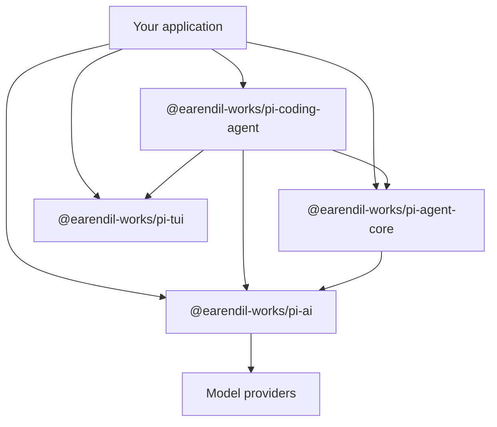

> This is the opening chapter of _Pi Agent in Depth_. It stays above the source-code details long enough to answer the question that should come first: what is Pi, and why is it worth studying? The answer has three parts: Pi is a coding tool, a readable implementation, and a development SDK.

:::info[Version scope]

The facts and examples in this chapter were checked against upstream commit [`005af57d`](https://github.com/earendil-works/pi/commit/005af57d88ee23b33778f343a9595b32e67ff788), package version `0.99.2`. All four foundational packages require Node.js `>=22.19.0`. Later releases may change package catalogs and APIs.

:::

## 1. Opening: three questions, one answer

Readers usually arrive with one of three questions:

1. **“Can I use a focused coding agent today?”** You want a terminal tool that can inspect a repository, edit files, run commands, and keep a session without imposing a large fixed workflow.
2. **“Can I learn how a real Agent works?”** A one-file demo hides the hard parts, while a large framework can bury the model call, Tool execution, events, and persistence under many layers.
3. **“Can I build an Agent for my own product?”** You need a model layer, an Agent Loop, or a complete coding-agent session without adopting one monolithic application.

Pi answers all three in the same repository. The `pi` CLI is the daily tool. The separation between model transport, Agent state, Tool execution, session management, and terminal rendering makes the implementation teachable. The published packages let another application reuse exactly the layer it needs.

That three-part answer sets the order for this chapter. We first map the repository, then inspect Pi as a tool, as learning material, and as an SDK. The later chapters can then discuss individual mechanisms without repeatedly rebuilding the product-level picture.

## 2. What is Pi: a single diagram

### One-sentence definition

**Pi is a minimal, extensible terminal Coding Agent shell written in TypeScript and released under the MIT license.**

Each word narrows the design:

- **Coding Agent shell:** Pi joins a model, a system prompt, project context, Tools, and session state into an application that can read and change a codebase. “Shell” describes the frame and connection points while models and policies remain replaceable.
- **Terminal:** the default interactive interface runs where developers already use shells, version control, and process tools. Regular TUI mode preserves terminal-owned scrollback. Version `0.99.2` also has an experimental fullscreen TUI mode with application-owned scrolling, so “terminal” no longer means only one rendering strategy.
- **Minimal default:** the model receives four Tools by default: `read`, `write`, `edit`, and `bash`. Three optional built-in read-only helpers, `grep`, `find`, and `ls`, are available through Tool options. The separate optional `powershell` Tool can be selected when native PowerShell is needed. Features such as plan mode and sub-agents live outside the default product surface.
- **Extensible:** Extensions can register Tools, commands, shortcuts, event hooks, providers, and UI. Skills, Prompt Templates, Themes, and Pi Packages cover reusable instructions, prompts, presentation, and distribution.

Pi works out of the box, but its defaults are a known-good assembly rather than a closed product definition. You can replace individual parts without maintaining a fork of Pi internals.

### Key numbers and a stable snapshot

Fast-moving popularity and provider counts age badly, so this snapshot records facts that can be checked directly at the pinned revision:

| Metric                    | Pinned value | What it tells you                                                                                     |
| ------------------------- | ------------ | ----------------------------------------------------------------------------------------------------- |
| Package version           | `0.99.2`     | The chapter describes one concrete release, not an unspecified `main` branch.                         |
| Node.js runtime           | `>=22.19.0`  | The same engine requirement appears in the foundational package manifests.                            |
| Default Tools             | 4            | `read`, `write`, `edit`, and `bash` form the default model-facing surface.                            |
| Optional built-in helpers | 3            | `grep`, `find`, and `ls` can be selected through Tool options.                                        |
| Optional shell Tool       | 1            | `powershell` is selectable separately and is not enabled by default.                                  |
| Foundational packages     | 4            | Pi AI, Agent Core, Coding Agent, and TUI divide model, runtime, product, and terminal concerns.       |
| Execution paths           | 4            | Interactive; print or JSON; RPC; and SDK cover people, scripts, processes, and embedded applications. |
| Session shape             | JSONL tree   | `id` and `parentId` support in-place branches while preserving prior paths in one session file.       |

:::note[Why the snapshot avoids popularity counts]

Stars, catalog size, and source-line totals change without changing the architecture. The useful invariant is the boundary: a provider owns models and auth, the Agent Core owns the loop, the Coding Agent assembles product policy, and TUI owns terminal presentation.

:::

### Four foundational packages, each with a job

The package layout can be read in plain text before looking at dependency arrows:

```text
┌───────────────────────────────────────────────────────────────┐
│ @earendil-works/pi-coding-agent                              │
│ CLI + SDK · system prompt · Tools · sessions · Extensions    │
├───────────────────────────────────────────────────────────────┤
│ @earendil-works/pi-agent-core │ @earendil-works/pi-tui       │
│ Agent state · loop · events   │ terminal renderers/components │
├───────────────────────────────┴───────────────────────────────┤
│ @earendil-works/pi-ai                                        │
│ providers · models · auth · streaming · token/cost tracking  │
└───────────────────────────────────────────────────────────────┘
```



`@earendil-works/pi-ai` defines the common model, message, Tool, stream, provider, catalog, and credential abstractions. A `Models` collection holds registered providers and routes a request to the provider that owns the selected model. Provider factories bring in one provider catalog and a lazy API wrapper; `builtinModels()` is the explicit heavier entry point when an application wants every built-in provider.

`@earendil-works/pi-agent-core` adds state and behavior around that model layer. It owns the Agent Loop, Tool execution, message conversion, steering and follow-up queues, and runtime events. The Agent accepts a `streamFn`, so the loop does not hard-code a provider implementation.

`@earendil-works/pi-coding-agent` assembles the product. It discovers context files and resources, creates managed Tools, selects models, manages tree-shaped sessions, performs compaction, loads Extensions, and exposes the same session machinery through an SDK.

`@earendil-works/pi-tui` is orthogonal to the three-layer Agent stack. Its package has no runtime dependency on the other Pi packages, and its source imports none of them. The Coding Agent depends on TUI for interactive presentation, while a server or background worker can use Pi AI and Agent Core without a terminal.

The current workspace also contains `@earendil-works/chord`, `@earendil-works/pi-client`, `@earendil-works/pi-protocol`, `@earendil-works/pi-server`, `@earendil-works/pi-telemetry`, `@earendil-works/pi-durable`, and a separate SQLite session backend. The client/protocol/server trio is an optional experimental sibling boundary for routed Chord services; it is not a fourth mandatory SDK layer. Telemetry, durable execution, and persistence likewise add focused capabilities without replacing the four foundations above. The old experimental `pi-orchestrator` from the baseline chapter is not present at the pinned commit.

## 3. View 1: as a coding agent: a useful daily tool

### 3.1 What Pi is: building blocks, not a finished car

The car analogy from the original chapter still fits. A fully integrated coding tool gives you the finished car: controls, safety policy, navigation, and cabin layout arrive together. Pi gives you an engine, chassis, steering, and a working factory assembly. You can drive the default assembly immediately, then replace the parts that constrain your workflow.

This position explains several product choices:

- Four default Tools keep the permanent capability surface understandable.
- The system prompt, project instructions, and loaded Skills remain inspectable rather than hidden behind a hosted product.
- Plan mode, sub-agents, permission gates, MCP integration, and custom editors can be Extensions or packages instead of mandatory policy.
- Sessions, models, and the interface have public customization points, so ownership does not require a long-lived fork.

The transferable lesson is about ownership:

> A polished default gets a user to the first useful result. Exposed building blocks let the same user decide how the hundredth result should be produced.

The default still matters. Entering `pi` starts a capable coding agent with file and shell Tools, model selection, context discovery, session persistence, and resource loading. “Building blocks” describes where authority lives, not an unfinished installation.

That trade suits developers who are comfortable in a terminal, use version control, and want to inspect or replace policy. A team seeking one centrally prescribed workflow may prefer a more integrated tool. The choice is about operational fit: who should own prompts, capabilities, safety boundaries, and interface behavior?

### 3.2 Five customization levers: build the missing feature

Pi exposes five levers. The first four change a local workflow; the fifth distributes the result.

**Extensions: runtime behavior**

An Extension is a TypeScript module loaded by the Coding Agent. It can register model-callable Tools, slash commands, keyboard shortcuts, flags, event handlers, model providers, message renderers, or terminal components. It can also replace built-in Tools. Auto-discovered Extensions in `~/.pi/agent/extensions/` or `.pi/extensions/` can be reloaded with `/reload`; editing an Extension file alone does not implicitly replace the running instance.

This explicit reload boundary still supports self-modification. An Agent can edit an Extension and then arrange a reload through a command or follow-up message. The upstream `reload-runtime.ts` example demonstrates the lifecycle. After the reload completes, later commands, events, and Tool calls use the new Extension instance.

**Skills: instructions loaded on demand**

A Skill packages instructions, scripts, references, and assets for a class of task. At startup Pi puts Skill names and descriptions in the system prompt. The model reads the full `SKILL.md` only when the task matches or the user invokes `/skill:name`. This progressive disclosure keeps a large instruction library available without placing every instruction in every model call.

**Prompt Templates: repeatable prompts**

Markdown Prompt Templates turn recurring prompts into slash commands and accept arguments. A team can encode the shape of a review, release check, or investigation without adding executable code. They are a good fit when the workflow needs repeatable text but no new runtime capability.

**Themes: presentation**

Themes define the TUI color system. The active custom Theme does support automatic hot reload, a narrower behavior than Extension reload. Presentation stays separate from Agent state and Tool policy.

**Pi Packages: distribution**

A Pi Package bundles Extensions, Skills, Prompt Templates, and Themes. It can use conventional directories or declare resources under the `pi` key in `package.json`, then be installed from npm, git, a URL, or a local path.

```bash
pi install npm:@foo/pi-tools@1.0.0
pi install git:github.com/user/repo@v1
pi install ./relative/path/to/package
pi config
```

:::caution[Package trust]

Pi Packages are executable supply-chain inputs. Extensions run arbitrary code, and Skills can direct the model to run programs. Review a third-party package before installing it. Project trust controls whether project-local settings and executable resources load; it is not a sandbox for later Tool calls.

:::

Together, the five levers form a gradual path from using Pi, to tailoring Pi, to sharing a maintained workflow. Later chapters can examine their implementation; here the architectural point is enough: missing product policy has a defined place to live.

### 3.3 The everyday dividend: useful defaults

Minimalism would be uninteresting if the default agent could not do real work. Pi's defaults cover the full daily loop while keeping each input visible.

**A small Tool surface.** `read`, `write`, `edit`, and `bash` cover inspection, modification, and command execution. When a task benefits from narrower read-only operations, enable `grep`, `find`, and `ls`. You can also use `--tools`, `--exclude-tools`, `--no-builtin-tools`, or `--no-tools` to shape the active set.

**Visible context and resources.** The startup header reports loaded context files, Prompt Templates, Skills, and Extensions. `AGENTS.md`, `CLAUDE.md`, and `AGENTS.override.md` give projects an explicit instruction layer. `/reload` refreshes context and resources after edits.

**Provider and model choice.** Built-in providers own their catalogs and credential resolution. `/model` or `Ctrl+L` selects among available models, while scoped model cycling supports a smaller working set. Pi AI preserves a common message representation and handles provider-specific streaming, which makes a cross-provider hand-off possible even though provider reasoning formats are not identical.

**Tree-shaped sessions.** Sessions are JSONL files whose entries carry `id` and `parentId`. `/tree` moves to an earlier point and continues in the same file, creating another branch instead of erasing the abandoned path. `/fork` and `/clone` create new session files when separation is more useful. Full history remains available even after lossy compaction changes the active model context.

**No per-command approval popups by default.** The model-facing Tools can modify files and run commands without asking before each call. Pi does have project trust for loading project-local settings and executable resources, but that is a startup trust decision rather than a Tool sandbox. Use git for recovery and a container or VM for a stronger security boundary. An Extension can add approval or path-protection policy when a workflow needs it.

**Inspectable outputs.** The interactive transcript includes messages, Tool calls, results, notifications, and errors. Sessions can be exported to HTML or JSONL. Cost and token usage appear in the interface. These facilities make a strange Agent decision something you can investigate from recorded inputs and events.

### 3.4 Up and running in one minute

Check the Node.js version, install the CLI, then start Pi inside the repository it may edit:

```bash
node --version # must satisfy >=22.19.0
npm install -g --ignore-scripts @earendil-works/pi-coding-agent@0.99.2
cd /path/to/project
pi
```

`--ignore-scripts` disables dependency lifecycle scripts during installation; Pi does not need install scripts for a normal npm install. Linux and macOS users may instead run the official `curl -fsSL https://pi.dev/install.sh | sh` installer.

Authenticate in the TUI with `/login`, or provide the API-key environment variable for a built-in provider, such as `ANTHROPIC_API_KEY`. `/login` can also store API keys in `~/.pi/agent/auth.json`. Once Pi starts, ask it to summarize the repository and name the commands used to test it. That first request exercises context discovery, model streaming, and the default read/shell Tool path without requiring customization.

Pi works in the current directory and can change files there. Begin in a clean version-controlled checkout when you want an easy diff and rollback path.

### 3.5 Model definitions and credentials: configure `models.json`

`~/.pi/agent/models.json` adds custom providers and models that speak a supported API: OpenAI Chat Completions, OpenAI Responses, Anthropic Messages, or Google Generative AI. It supplies **model definitions** such as protocol, endpoint, model ID, input types, context window, output limit, cost, and compatibility flags.

Credentials remain a separate concern. Pi can resolve them from `/login` and `auth.json`, the CLI `--api-key`, a provider's `apiKey` field, or an environment variable used by that field. Built-in provider factories also know their standard environment variables. A model definition says what can be called; credential resolution decides whether it is available and how the request is authorized.

This custom gateway example keeps the key out of the JSON file by interpolating an environment variable:

```json
{
  "providers": {
    "company-gateway": {
      "baseUrl": "https://llm.example.com/v1",
      "api": "openai-completions",
      "apiKey": "$COMPANY_LLM_API_KEY",
      "models": [
        {
          "id": "team-coder",
          "name": "Team Coder",
          "reasoning": true,
          "input": ["text", "image"],
          "contextWindow": 128000,
          "maxTokens": 16384,
          "compat": {
            "supportsDeveloperRole": false
          }
        }
      ]
    }
  }
}
```

The important fields have distinct jobs:

- `providers` maps provider IDs. The key `company-gateway` becomes the model's `provider` value.
- `baseUrl` selects the endpoint, while `api` selects the wire protocol Pi uses.
- `apiKey` is optional. It accepts a literal, `$ENV_VAR` or `${ENV_VAR}` interpolation, or a `!command` whose stdout is resolved at request time. Omit it when `/login`, `auth.json`, or `--api-key` supplies auth.
- `models` contains model definitions. `id` is sent to the endpoint; `name` is matching and secondary display metadata. `contextWindow` and `maxTokens` inform request and compaction limits.
- `compat` describes deviations from the selected protocol. Keep these overrides narrow and backed by the gateway's actual behavior.

Open `/model` to reload `models.json` during a session; a process restart is unnecessary. Use `/model` or `Ctrl+L` to select the entry, `--list-models [search]` to inspect loaded models from the CLI, and `defaultProvider` plus `defaultModel` in `settings.json` to choose startup defaults.

Two advanced paths preserve the same separation. `modelOverrides` patches metadata for a known built-in or matching Extension-registered model without replacing the provider catalog. Provider- or model-level `compat` records protocol quirks. For a new wire protocol or custom OAuth flow, write an Extension provider instead of forcing it into `models.json`.

## 4. View 2: as a learning resource: a textbook for Agent design

### 4.1 Why Pi? Because the code path is readable

Pi is useful teaching material because its package boundaries match the questions a reader asks. A prompt enters the Coding Agent, becomes Agent state, reaches a provider through a `Models` collection, returns as stream events, may request Tools, and is finally appended to a session tree. Each boundary has a package and a public vocabulary.

That layout offers several practical reading routes:

- Follow a model call inside `packages/ai` to learn provider factories, auth resolution, message types, and streaming without session or TUI policy.
- Follow `Agent.prompt()` inside `packages/agent` to learn state transitions, Tool execution, queues, and events without Coding Agent resource discovery.
- Follow `createAgentSession()` inside `packages/coding-agent` to see how models, managed Tools, resources, compaction, and session persistence become an application.
- Read `packages/tui` on its own to study differential terminal rendering, components, focus, overlays, and main-screen versus alternate-screen behavior.

The repository is large enough to contain the inconvenient production concerns: cancellation, authentication, retries, compaction, branching, dynamic resources, and multiple integration modes. Its separation lets you study one concern without pretending the others do not exist.

A useful reading discipline is to trace one request end to end before cataloging every type. Start with a user prompt, mark each state or event boundary, and note which package has authority at that point. The chapters that follow use that same path.

### 4.2 What this tutorial covers

The published series contains eleven chapters. The first six establish the execution path; the last five isolate runtime concerns that become clearer once messages and Tools are familiar.

| Chapter    | Topic                     | Question it answers                                                  | Reading role |
| ---------- | ------------------------- | -------------------------------------------------------------------- | ------------ |
| Chapter 1  | Overview                  | What is Pi, and which of its three identities matters to me?         | Orientation  |
| Chapter 2  | Layered architecture      | How do the foundational packages divide responsibility?              | Foundation   |
| Chapter 3  | Agent Loop                | How does a prompt become repeated model and Tool turns?              | Core         |
| Chapter 4  | Model invocation          | How does Pi route one API to different providers and models?         | Core         |
| Chapter 5  | Tool System               | How are Tools defined, validated, selected, and executed?            | Core         |
| Chapter 6  | Message System            | How does conversation state cross Agent and provider boundaries?     | Core         |
| Chapter 7  | Event-driven architecture | Which events expose progress and lifecycle changes?                  | Advanced     |
| Chapter 8  | Context Engineering       | What enters a finite model context, and where can it be transformed? | Advanced     |
| Chapter 9  | Context Compaction        | How does Pi continue when active context approaches its limit?       | Advanced     |
| Chapter 10 | Session Management        | How are sessions appended, restored, navigated, and branched?        | Advanced     |
| Chapter 11 | Testing and evaluation    | How can Agent behavior be tested and evaluated deterministically?    | Advanced     |

:::tip[Reading path]

Read chapters 1–6 in order when you want the full runtime model. Chapters 7–11 can then be used as focused references. Extension internals, remote protocol packages, and deeper TUI work remain useful follow-on topics in upstream source and documentation, but they are outside this eleven-chapter series.

:::

Each technical chapter should answer three questions: what is the mechanism, how does the pinned source implement it, and which trade-off follows from that implementation? A code tour that omits the third question teaches names but not design.

### 4.3 Pi's philosophy of subtraction: learn from the trade-offs

Pi's upstream README states its omissions directly. These are product boundaries, not claims that the omitted capability can never exist:

| The default does not include | Upstream rationale                                                                  | Supported substitute                                                                      |
| ---------------------------- | ----------------------------------------------------------------------------------- | ----------------------------------------------------------------------------------------- |
| MCP integration              | Prefer task-specific CLI tools and instructions over a mandatory protocol surface.  | Use a CLI with a Skill, or install/build an MCP Extension.                                |
| Sub-agents                   | Different workflows need different orchestration and observability.                 | Run Pi instances through `tmux`, use the official example, or build an Extension/package. |
| Permission popups            | A generic confirmation flow cannot encode every environment's security boundary.    | Use a container, or add approval and path policy through Extensions.                      |
| Plan mode                    | A durable file is inspectable and reusable, while teams disagree on plan semantics. | Write `plan.md`, use the official example, or install a package.                          |
| Built-in todos               | A fixed todo mechanism can compete with the model's task state.                     | Use `TODO.md` or an Extension.                                                            |
| Background bash              | Existing terminal process managers already expose and control background work.      | Use `tmux` or implement a workflow-specific Extension.                                    |

Subtraction forces an architectural question: which behavior belongs in the shared runtime, and which belongs at an application or project boundary? Pi keeps streaming, state, Tool execution, sessions, and resource loading in the shared implementation. It leaves orchestration style, approval policy, specialized capabilities, and much presentation policy replaceable.

The design is not free. A team that customizes Pi must review Extension code, distribute packages, document local conventions, test upgrades, and choose a sandbox boundary. The benefit is that those decisions remain visible and changeable. The cost is that Pi does not make every decision on the team's behalf.

This yields four lessons that transfer beyond Pi:

1. Defaults should cover the common path without becoming the only path.
2. An extension system earns its place only when its hooks reach the policies users need to change.
3. Existing operating-system tools can be better boundaries than hidden reimplementations when they preserve observability.
4. Safety needs an explicit threat boundary. A project-trust prompt, a per-command confirmation, version control, and a container solve different problems.

## 5. View 3: as an SDK: build your own Agent

### 5.1 SDK stack: three layers plus one orthogonal UI library

The reusable Agent stack is `@earendil-works/pi-ai` → `@earendil-works/pi-agent-core` → `@earendil-works/pi-coding-agent`. Applications may stop at any layer. `@earendil-works/pi-tui` sits beside that stack because terminal presentation is a different concern.

**Layer 1: Pi AI for model calls**

The current API uses a `Models` collection and provider factories. This example registers one provider, resolves its model, and streams text. The provider owns credential resolution; for Anthropic in Node.js that may come from `ANTHROPIC_API_KEY`, a stored credential, or an explicit request option.

```typescript
import { createModels, type Context } from "@earendil-works/pi-ai";
import { anthropicProvider } from "@earendil-works/pi-ai/providers/anthropic";

const models = createModels();
models.setProvider(anthropicProvider());

const model = models.getModel("anthropic", "claude-sonnet-4-6");
if (!model) throw new Error("Model not found");

const context: Context = {
  systemPrompt: "You are a concise code reviewer.",
  messages: [
    {
      role: "user",
      content: "Name two risks in this diff.",
      timestamp: Date.now(),
    },
  ],
};

const stream = models.stream(model, context);
for await (const event of stream) {
  if (event.type === "text_delta") process.stdout.write(event.delta);
}
context.messages.push(await stream.result());
```

Pi AI has no Agent Loop or terminal dependency. It fits chat, review, extraction, evaluation, or any application that needs typed messages, Tools, provider routing, streaming, auth, and usage accounting. Register only the provider factories you need for smaller bundles, or call `builtinModels()` when the full built-in catalog is appropriate.

**Layer 2: Agent Core for the loop**

Agent Core owns state and repeated model/Tool turns. Injecting `models.streamSimple` keeps the model layer replaceable:

```typescript
import { Agent } from "@earendil-works/pi-agent-core";

const agent = new Agent({
  initialState: {
    systemPrompt: "You are a concise coding assistant.",
    model,
  },
  streamFn: models.streamSimple.bind(models),
});

agent.subscribe((event) => {
  if (
    event.type === "message_update" &&
    event.assistantMessageEvent.type === "text_delta"
  ) {
    process.stdout.write(event.assistantMessageEvent.delta);
  }
});

await agent.prompt("Explain the repository in three bullets.");
```

Add `AgentTool` objects to `agent.state.tools` when the model needs actions. The runtime validates and executes Tool calls, appends results, and continues until the model stops requesting Tools. `transformContext` and `convertToLlm` let an application change or filter messages before a provider call. Steering and follow-up queues let callers alter work during or after a run.

**Layer 3: Coding Agent for a complete session**

The Coding Agent SDK assembles managed Tools, resources, model runtime, session state, and compaction. `SessionManager.inMemory()` is useful when the host application owns persistence:

```typescript
import {
  createAgentSession,
  ModelRuntime,
  SessionManager,
} from "@earendil-works/pi-coding-agent";

const modelRuntime = await ModelRuntime.create();
const { session } = await createAgentSession({
  sessionManager: SessionManager.inMemory(),
  modelRuntime,
});

session.subscribe((event) => {
  if (
    event.type === "message_update" &&
    event.assistantMessageEvent.type === "text_delta"
  ) {
    process.stdout.write(event.assistantMessageEvent.delta);
  }
});

await session.prompt("Read this codebase and explain its architecture.");
```

Use `createAgentSessionRuntime()` and `AgentSessionRuntime` when the host must replace the active session through new, resume, fork, clone, or import flows. A subscription belongs to a specific `AgentSession`, so a host re-subscribes after runtime replacement.

**Side library: Pi TUI for terminal applications**

Pi TUI provides main-screen and alternate-screen renderers, differential updates, synchronized output, focus, overlays, layouts, Markdown, editors, lists, images, and autocomplete. It can power an unrelated CLI dashboard or REPL because it imports no Agent package. This is a clean example of extracting a product necessity into a genuinely independent library.

### 5.2 Extension system: let the Agent modify its capabilities

The Extension system turns customization into runtime behavior instead of source forks. An Extension factory receives `ExtensionAPI`, registers what it contributes, and can subscribe to session, Agent, Tool, input, and resource lifecycle events.

Extensions can provide:

- **Custom Tools or replacements:** register new schemas and executors, or override the default `read`, `write`, `edit`, and `bash` behavior.
- **Commands and shortcuts:** add slash commands, CLI flags, and keybindings for a project workflow.
- **Policy hooks:** inspect or block Tool calls, protect paths, create checkpoints, or customize compaction.
- **Providers and dynamic models:** register standard-compatible or custom streaming providers, including OAuth behavior.
- **Terminal UI:** replace the editor, header, footer, or Tool renderer; add status lines, widgets, dialogs, and overlays.
- **Resource discovery:** contribute Skill, Prompt Template, and Theme paths at startup or reload.

The self-modification loop has a precise boundary. The Agent may edit an auto-discovered Extension, but the running module keeps its old code until `/reload` or `ctx.reload()` completes. Reload emits shutdown and startup lifecycle events, then later calls use the new instance. Code after `await ctx.reload()` still runs in the old call frame, so a reload command should return immediately. This detail turns “the Agent can change itself” from a slogan into a testable lifecycle.

Dynamic registrations are narrower. A Tool or provider registered after startup can become available immediately without a full reload. Active custom Theme files also reload automatically. Knowing which boundary applies prevents stale in-memory state and confusing demonstrations.

The same design supports both personal experiments and maintained team policy. A local Extension can start as a few lines, gain tests and dependencies, then move into a Pi Package when more projects need it.

### 5.3 Four run modes

Pi presents the same session and Agent capabilities through four product paths:

| Mode          | Use case                                                                          | Entry point                                  |
| ------------- | --------------------------------------------------------------------------------- | -------------------------------------------- |
| Interactive   | A person works in the TUI with sessions, commands, and model selection.           | `pi`                                         |
| Print or JSON | A script sends a one-shot prompt and receives final text or JSONL events.         | `pi -p "Summarize this"` or `pi --mode json` |
| RPC           | Another process controls Pi over strict LF-delimited JSONL on stdin/stdout.       | `pi --mode rpc`                              |
| SDK           | A Node.js/TypeScript host embeds `AgentSession` or a replaceable session runtime. | `createAgentSession()`                       |

Print mode also merges piped stdin into the initial prompt. JSON mode emits the event stream for consumers that need more than final text. RPC exposes commands and events to non-Node hosts without asking them to reproduce Pi's session implementation. The SDK gives a TypeScript host direct objects and callbacks.

The modes share implementation rather than defining four unrelated products. A workflow can begin as an interactive experiment, move into a script, and later become an embedded service while retaining the same concepts for models, Tools, messages, and sessions.

### 5.4 Ecosystem examples from the upstream tree

The pinned repository demonstrates the ecosystem without relying on an unverifiable project count. Its Extension examples include `plan-mode`, `subagent`, `permission-gate.ts`, `protected-paths.ts`, `ssh.ts`, `sandbox`, and `gondolin`. UI examples range from a custom footer and modal editor to a Doom overlay. These examples make the subtraction table concrete: omitted defaults remain implementable through published hooks.

The SDK examples form another progression. They start with `01-minimal.ts`, then add custom models, prompts, Skills, Tools, Extensions, context files, Prompt Templates, credentials, settings, and sessions. The final examples show full control and `AgentSessionRuntime`. They are useful executable companions to the conceptual three-layer stack.

Pi Packages carry those resources across projects. npm packages can use the `pi-package` keyword and appear in the package gallery; git refs can be pinned; project-local package settings can be shared after the project is trusted. `pi config` lets users enable or disable resources instead of treating installation as an all-or-nothing choice.

The practical ecosystem pattern is small and repeatable: start with an instruction or Extension near the problem, promote it to a package once its interface settles, and keep security review alongside distribution because installed Extensions execute with the user's access.

## 6. Pi's opposite: two product philosophies

Pi becomes easier to place when compared with an integrated coding-agent product.

The integrated philosophy chooses a broad built-in workflow. Planning, orchestration, approvals, task tracking, model policy, and interface behavior can arrive as one maintained experience. That gives teams a common path and reduces local assembly. It also means users work inside decisions made by the product owner, even when a project needs a different boundary.

Pi chooses a small built-in workflow plus public mutation points. Extensions, Skills, Prompt Templates, Themes, and packages move more responsibility to the user or team. The first local customization takes work, but the resulting policy can match the repository, security environment, and preferred terminal workflow.

Neither philosophy wins every use case:

- Choose an integrated product when consistency, vendor-managed behavior, and a short setup path matter more than replacing internals.
- Choose Pi when you need to inspect model inputs, own session and Tool policy, embed the runtime, or build a workflow the default product intentionally omits.
- Combine the ideas when useful. A team can run Pi with a curated package set and project settings, creating an integrated internal experience on top of replaceable parts.

The comparison is a design tool for this book. When Pi omits a feature, ask whether the responsibility moved to an Extension, a Skill, an operating-system primitive, the host application, or the security boundary. When Pi includes a feature, ask which lower layers require it to remain common.

## 7. Summary

Pi supports three serious uses:

1. **As a coding tool,** it supplies useful terminal defaults: four model-facing Tools, provider and model selection, explicit project context, tree-shaped sessions, and a resource system that can change the workflow.
2. **As learning material,** its boundaries expose the path from prompt to provider stream, Tool execution, events, compaction, and persistence without treating the whole repository as one framework layer.
3. **As an SDK,** its three-layer Agent stack and orthogonal TUI let applications reuse a model collection, an Agent Loop, a complete coding session, or only terminal components.

Pi's subtraction has a price: the team owns more policy, package review, and operational choices. It also leaves those choices visible. Continue with [Chapter 2](ch02-three-layer-arch.md) to inspect the package boundaries, then [Chapter 3](ch03-agent-loop.md) to follow one prompt through the runtime loop.

:::note[Reviewed source]

This chapter describes Pi `0.99.2` at commit [`005af57d`](https://github.com/earendil-works/pi/tree/005af57d88ee23b33778f343a9595b32e67ff788). Links in `official_refs` are pinned to that revision so the claims remain auditable after upstream `main` changes.

:::
