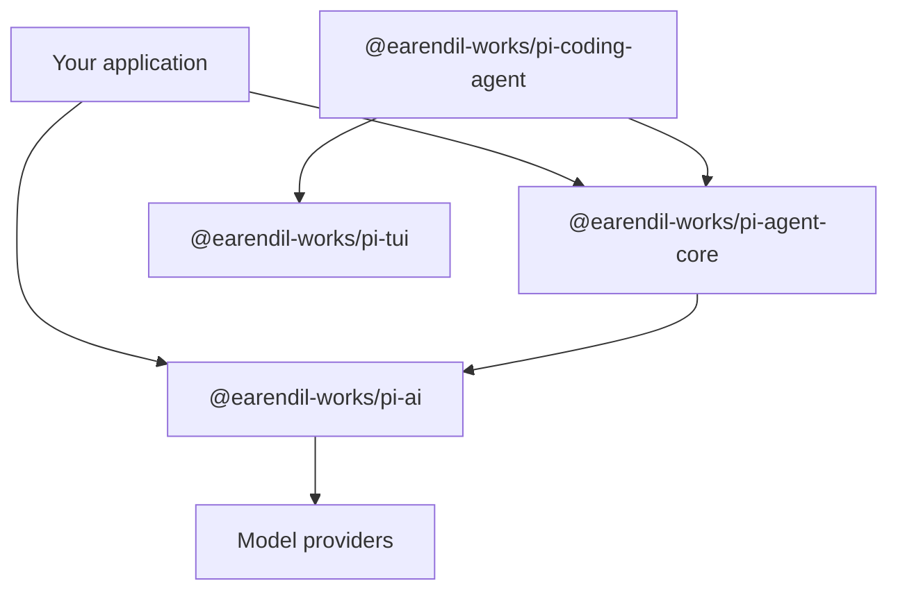

Pi is useful in three different ways: as a coding agent you can run, as a compact codebase you can inspect, and as a set of packages for building your own agent application. This chapter maps those three uses to the repository.

:::info[Version scope]

The examples in this review were checked against upstream commit [`a470b121`](https://github.com/badlogic/pi-mono/commit/a470b121bf683b4c2b9fc0b3a7c807de7e0cfe9c). Package names and APIs may change in later revisions.

:::

## 1. Three reasons to read Pi

### 1.1 Use a focused coding agent

The `pi` CLI provides a terminal interface, model selection, project context, managed file and shell tools, sessions, extensions, and skills. It starts with a small default surface and lets each project add the workflow it needs.

### 1.2 Learn how an agent works

The repository separates model transport, the agent runtime, the coding-agent application, and terminal rendering. You can follow a user prompt from the CLI to the model stream, through tool execution, and back to persisted session state without first learning a large framework.

### 1.3 Build a specialized agent

The npm packages can be used independently. A service can use the model layer without the CLI, embed the agent runtime in another application, or reuse the TUI components for a terminal product.

## 2. The project surface



The arrows show dependency direction. The model package does not know about the agent loop or the terminal. The agent runtime does not depend on the coding-agent CLI.

### 2.1 `@earendil-works/pi-ai`

This package defines model metadata, messages, tools, provider registration, authentication helpers, and streaming APIs. It normalizes provider responses into one event model.

### 2.2 `@earendil-works/pi-agent-core`

This package owns agent state, the model/tool loop, context transformation, message conversion, queue handling, and runtime events. It receives a stream function instead of importing a provider directly.

### 2.3 `@earendil-works/pi-coding-agent`

This is the `pi` application. It assembles the system prompt, discovers project instructions, registers managed tools, loads extensions and skills, and persists sessions.

### 2.4 `@earendil-works/pi-tui`

The TUI package renders interactive terminal components. It is separate from the agent runtime, so a web service or background worker can use the same agent without a terminal dependency.

## 3. Run the coding agent

Install the CLI globally:

```bash
npm install -g --ignore-scripts @earendil-works/pi-coding-agent
```

Start it in a project directory:

```bash
cd /path/to/project
pi
```

Authenticate with `/login` or configure a provider API key. Pi works in the current directory and its tools can modify files, so use version control or another checkpointing workflow.

## 4. Embed the runtime

The following example constructs an `Agent` with one Anthropic provider. It shows the dependency boundary: the application creates the model collection and injects `models.streamSimple` into the agent.

```typescript
import { Agent } from "@earendil-works/pi-agent-core";
import { createModels } from "@earendil-works/pi-ai";
import { anthropicProvider } from "@earendil-works/pi-ai/providers/anthropic";

const models = createModels();
models.setProvider(anthropicProvider());

const model = models.getModel("anthropic", "claude-sonnet-4-6");
if (!model) throw new Error("Model not found");

const agent = new Agent({
  initialState: {
    systemPrompt: "You are a concise coding assistant.",
    model,
  },
  streamFn: models.streamSimple.bind(models),
});

agent.subscribe((event) => {
  if (
    event.type === "message_update" &&
    event.assistantMessageEvent.type === "text_delta"
  ) {
    process.stdout.write(event.assistantMessageEvent.delta);
  }
});

await agent.prompt("Explain this repository in three bullets.");
```

This code contains no terminal UI or session manager. Those are application choices, not requirements of the core runtime.

## 5. Where customization belongs

Use the narrowest layer that solves the problem:

| Requirement | Extension point |
| --- | --- |
| Add or configure a model provider | Pi AI provider registration |
| Change messages before a model call | `transformContext` or `convertToLlm` |
| Give the model a new capability | `AgentTool` or a coding-agent extension |
| Add a slash command or lifecycle hook | Coding-agent extension |
| Reuse instructions across projects | Skill or prompt template |
| Change terminal presentation | Theme, extension, or Pi TUI |

This separation keeps provider code out of the agent loop and application policy out of the model layer.

## 6. Trade-offs

Pi's small core gives you control, but it also makes you responsible for policy. A production agent may need approval rules, sandboxing, observability, retry limits, durable storage, and domain-specific evaluation. Pi exposes the parts needed to build those features; it does not choose every policy for you.

## 7. Reading path

Continue with [Chapter 2](ch02-three-layer-arch.md) for package boundaries, then [Chapter 3](ch03-agent-loop.md) for the runtime loop. Use chapters 4 through 10 as focused references for model calls, tools, messages, events, context, compaction, and sessions.
