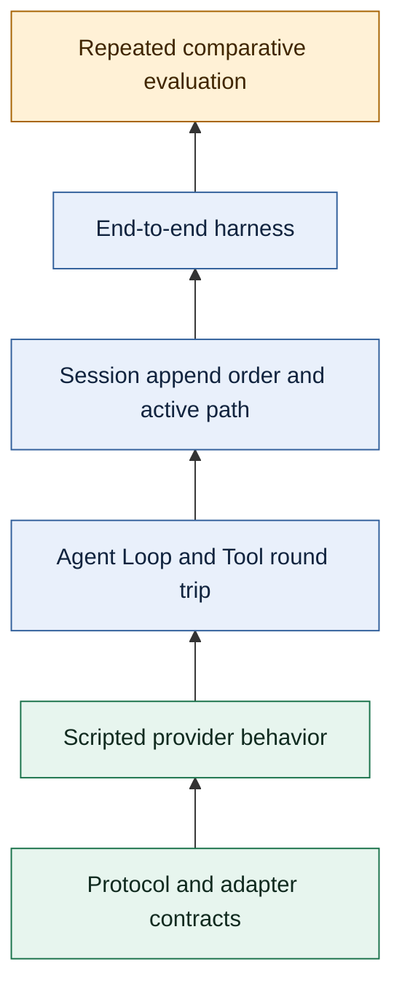

Chapter 10 ended at the durable Session Tree. Persistence makes an Agent run inspectable, but a transcript existing on disk does not prove that the Agent behaved correctly. A useful testing strategy must establish several different facts: the provider adapter obeyed the streaming protocol, the Agent Loop paired every Tool call with a result, the active session path stayed coherent, the application completed a realistic task, and a proposed change performed better than a baseline often enough to justify release.

Those facts do not collapse into one “Agent quality” number. This chapter builds a layered evidence model around Pi `0.87.1`, explains which failures belong at each layer, and ends with a release-ready matrix. The deterministic example compiles against the public `@earendil-works/pi-ai@0.99.2` and `@earendil-works/pi-agent-core@0.99.2` exports. The evaluation material also points into Pi's release-pinned monorepo because `packages/evals` is private workspace tooling, not a published SDK package.

## 1. Treat testing as layered evidence, not one end-to-end score

An end-to-end success is reassuring but ambiguous. It may hide a protocol error that the chosen provider tolerated, a Tool result linked to the wrong call, an inactive session branch leaking into context, or a flaky judge. Conversely, one failed model run does not identify whether the candidate behavior was wrong or the network was unavailable.

Build confidence from narrow, deterministic contracts first, then add broader and more variable observations. Each upper layer assumes the lower layers already hold:



The shape is an evidence pyramid, not a recommendation to maximize the number of model calls. Lower layers should contain many fast cases because they localize defects. Upper layers should contain fewer representative scenarios because they are slower, more expensive, and less reproducible.

| Evidence layer | Test double or fixture | Primary assertion | Characteristic failure signal |
| --- | --- | --- | --- |
| Stream protocol | Recorded events and a synthetic transport | Legal event order and one terminal result | Missing terminal event, malformed delta, wrong stop reason |
| Provider adapter | HTTP/SDK response fixture or local fake transport | Wire fields normalize into Pi `Message` and usage types | Provider-specific field leaks through or content is lost |
| Scripted provider | `fauxProvider()` with queued responses | Exact requests, response consumption, and error behavior | Unexpected request count or exhausted response queue |
| Agent and Tool | Deterministic `AgentTool` plus faux responses | `ToolCall`/`ToolResultMessage` linkage and final transcript | Orphan result, invalid arguments executed, wrong ordering |
| Session | In-memory or temporary session storage | Append order, branch isolation, and active-path projection | Inactive sibling reaches the model or recovery changes history |
| End-to-end harness | Isolated workspace, Agent configuration, and cleanup boundary | User-visible outcome plus trace invariants | Product setup, Tool policy, or resource loading breaks the task |
| Evaluation | Held-out tasks, judge, baseline, candidate, repetitions | Paired verdict and telemetry distributions | Regression, unstable lift, missing score, or invalid observation |

No row replaces another. A model-backed evaluation is poor at diagnosing a broken event stream, while a protocol test cannot tell whether an Agent solves a repository task. A release decision should cite the evidence layer that supports each claim.

## 2. Lock the protocol before testing provider intelligence

Pi's provider boundary is an `AssistantMessageEventStream`. A successful stream starts, emits zero or more typed content updates, and terminates with `done`; a failed or aborted stream terminates with `error`. The stream's result is a final `AssistantMessage`, so a test should validate both the event sequence and that final message. Collecting only rendered text misses stop reasons, usage, Tool calls, and errors.

### Test protocol invariants directly

For a stream fixture, assert at least these properties:

1. `start` precedes content deltas.
2. Every `contentIndex` refers to the block being constructed.
3. A text, thinking, or Tool-call block has matching start and end events.
4. Exactly one terminal event appears.
5. `done.reason` agrees with the final successful message's `stopReason`.
6. `error.reason` is `"error"` or `"aborted"`, and the final message carries an `errorMessage` useful to the host.
7. Cancellation settles the stream; it does not leave a promise or iterator pending.

The assertion should compare semantic content after reconstruction. Chunk boundaries are transport behavior and may vary. A provider is free to emit `"hel"` then `"lo"` or one `"hello"` delta as long as the reconstructed block and lifecycle remain correct.

### Keep provider-adapter fixtures below the Agent

A provider adapter test starts from a provider-shaped fixture—an HTTP response, SDK event, or local fake transport—and observes Pi's normalized event stream. It should cover fields the adapter owns: roles, text and thinking blocks, Tool arguments, usage, stop reasons, request headers, and provider errors. It should not need an `Agent`, session file, or coding Tool.

This boundary is especially important for Tool calls. The adapter only normalizes the provider's representation into a `ToolCall`; it does not authorize or execute the operation. Execution belongs to Agent core. If an adapter fixture fails, the diagnostic should name the provider mapping rather than report that an end-to-end coding task “scored zero.”

Use contract fixtures for supported protocol variants and a small integration test for the real transport. Do not replay secrets or full production payloads. Remove credentials and private prompt content before checking a fixture into source control, and retain the provider/API/version labels needed to reproduce the mapping.

## 3. Script deterministic turns with the public faux provider

`fauxProvider()` is the public Pi AI test double for an explicit `Models` collection. It owns one or more faux models and consumes scripted assistant responses in request-start order. A response may be a ready `AssistantMessage` or a factory that receives the actual `TranscriptContext`, stream options, provider state, and selected model. That factory is the seam for request assertions.

The handle exposes `setResponses()`, `appendResponses()`, `getPendingResponseCount()`, `getModel()`, and counters in `state`. Unlike the legacy compatibility registration, this explicit handle has no `unregister()` method. Cleanup removes its provider from the isolated collection with `models.deleteProvider(faux.provider.id)`.

The following function is synchronized with `tests/fixtures/pi-sdk-0992.contract.ts` and compiled against exact public dependencies `@earendil-works/pi-ai@0.99.2` and `@earendil-works/pi-agent-core@0.99.2`. It covers one complete Tool round trip without an API key, environment secret, filesystem, or network request; its only timer is a failure-only watchdog that aborts and drains a stalled Agent. The first scripted response contains explanatory text and a `ToolCall`; the second is the final assistant response. Assertions inspect both provider requests and the Agent transcript.

```typescript
import assert from "node:assert/strict";

import {
  createModels,
  fauxAssistantMessage,
  fauxProvider,
  fauxText,
  fauxToolCall,
  getCurrentSystemPrompt,
  getCurrentTools,
  Type,
  type TranscriptContext,
} from "@earendil-works/pi-ai";
import { Agent, type AgentTool } from "@earendil-works/pi-agent-core";

async function verifyDeterministicAgentRoundTrip(): Promise<void> {
  type ProviderRequestSummary = {
    roles: Array<TranscriptContext["messages"][number]["role"]>;
    systemPrompt: string;
    toolNames: string[];
    messages: TranscriptContext["messages"];
  };
  const requests: ProviderRequestSummary[] = [];
  const models = createModels();
  const faux = fauxProvider({
    provider: "chapter-11-faux",
    models: [{ id: "chapter-11-model", reasoning: false }],
  });
  models.setProvider(faux.provider);

  const addParameters = Type.Object({
    left: Type.Number(),
    right: Type.Number(),
  });
  const addTool: AgentTool<typeof addParameters, { total: number }> = {
    name: "add",
    label: "Add two numbers",
    description: "Return the sum of two numbers",
    parameters: addParameters,
    async execute(toolCallId, { left, right }) {
      assert.equal(toolCallId, "add-1");
      const total = left + right;
      return { content: [fauxText(String(total))], details: { total } };
    },
  };

  function captureTranscriptRequest(
    requests: ProviderRequestSummary[],
    context: TranscriptContext,
  ): void {
    requests.push({
      roles: context.messages.map((message) => message.role),
      systemPrompt: getCurrentSystemPrompt(context.messages),
      toolNames: getCurrentTools(context.messages).map((tool) => tool.name),
      messages: structuredClone(context.messages),
    });
  }

  faux.setResponses([
    (context) => {
      captureTranscriptRequest(requests, context);
      return fauxAssistantMessage(
        [
          fauxText("I will use the add Tool."),
          fauxToolCall("add", { left: 20, right: 22 }, { id: "add-1" }),
        ],
        { stopReason: "toolUse" },
      );
    },
    (context) => {
      captureTranscriptRequest(requests, context);
      return fauxAssistantMessage(fauxText("The total is 42."));
    },
  ]);

  const WATCHDOG_MS = 2_000;
  const awaitWithFailureWatchdog = async <T>(
    operation: Promise<T>,
    label: string,
    onTimeout: () => void,
  ): Promise<T> => {
    let watchdog: ReturnType<typeof setTimeout> | undefined;
    const timeoutFailure = new Promise<never>((_, reject) => {
      watchdog = setTimeout(() => {
        const message = `${label} did not settle within ${WATCHDOG_MS} ms`;
        try {
          onTimeout();
        } catch (cause) {
          reject(new Error(`${message}; timeout cleanup failed`, { cause }));
          return;
        }
        reject(new Error(message));
      }, WATCHDOG_MS);
    });

    try {
      return await Promise.race([operation, timeoutFailure]);
    } finally {
      if (watchdog !== undefined) clearTimeout(watchdog);
    }
  };

  let agent: Agent | undefined;
  try {
    const model = models.getModel("chapter-11-faux", "chapter-11-model");
    assert.ok(
      model,
      "the isolated Models collection must expose the faux model",
    );

    agent = new Agent({
      streamFn: models.streamSimple.bind(models),
      initialState: {
        systemPrompt: "Use the add Tool for arithmetic.",
        model,
        thinkingLevel: "off",
        tools: [addTool],
      },
    });

    await awaitWithFailureWatchdog(
      agent.prompt("What is 20 + 22?"),
      "Chapter 11 Agent run",
      () => agent?.abort(),
    );

    assert.equal(faux.state.callCount, 2);
    assert.equal(faux.getPendingResponseCount(), 0);
    assert.deepEqual(requests[0]?.roles, ["system", "user"]);
    assert.equal(requests[0]?.systemPrompt, "Use the add Tool for arithmetic.");
    assert.deepEqual(requests[0]?.toolNames, ["add"]);
    assert.deepEqual(requests[1]?.toolNames, ["add"]);
    assert.deepEqual(requests[1]?.roles, [
      "system",
      "user",
      "assistant",
      "toolResult",
    ]);

    const requestToolResult = requests[1]?.messages[3];
    assert.equal(requestToolResult?.role, "toolResult");
    if (requestToolResult?.role !== "toolResult") {
      throw new Error("second provider request must contain a Tool result");
    }
    assert.equal(requestToolResult.toolCallId, "add-1");
    assert.equal(requestToolResult.toolName, "add");
    assert.equal(requestToolResult.isError, false);
    assert.deepEqual(requestToolResult.content, [fauxText("42")]);

    assert.deepEqual(
      agent.state.messages.map((message) => message.role),
      ["system", "user", "assistant", "toolResult", "assistant"],
    );
    const finalMessage = agent.state.messages.at(-1);
    assert.equal(finalMessage?.role, "assistant");
    if (finalMessage?.role !== "assistant") {
      throw new Error("transcript must end with an assistant response");
    }
    assert.equal(finalMessage.stopReason, "stop");
    assert.deepEqual(finalMessage.content, [fauxText("The total is 42.")]);
  } finally {
    try {
      agent?.abort();
      if (agent) {
        await awaitWithFailureWatchdog(
          agent.waitForIdle(),
          "Chapter 11 Agent cleanup",
          () => agent?.abort(),
        );
      }
    } finally {
      models.deleteProvider(faux.provider.id);
      assert.equal(models.getProvider(faux.provider.id), undefined);
    }
  }
}
```

The response factories clone only `TranscriptContext.messages`, which is data-only. They recover the active system prompt and transcript Tool declarations with `getCurrentSystemPrompt()` and `getCurrentTools()`; the executable `AgentTool` remains Agent-owned and is not part of this provider context. The assertions deliberately avoid stream chunk counts. `fauxProvider()` generates the scripted semantic response deterministically, but its default chunk sizes may vary; set equal `tokenSize.min` and `tokenSize.max` only when a test genuinely owns delta granularity.

An exhausted faux queue produces a final assistant error response whose message explains that no responses remain. It is useful as a negative test: prompt once more, then assert `stopReason === "error"`, a useful `errorMessage`, and a settled Agent. Do not accidentally treat queue exhaustion as a failed task verdict; it means the test fixture was incomplete.

## 4. Assert Agent Loop and Tool round-trip invariants

The deterministic example proves more than the string `42`. It proves the causal shape of one Agent run. The first provider request starts with a `SystemMessage` that carries the prompt and Tool declarations, followed by the user message. The assistant then requests `add` with ID `add-1`. Agent core validates the arguments, calls `execute()`, appends a `ToolResultMessage` with the same ID and Tool name, and sends the expanded context to the provider. Only the second assistant response ends the run.

A focused Agent Loop suite should assert these invariants independently of answer prose:

- every emitted `ToolCall.id` has exactly one corresponding `ToolResultMessage.toolCallId`;
- `ToolResultMessage.toolName` matches the requested Tool name;
- the assistant Tool-call message precedes its result, and all results precede the next provider request;
- invalid arguments, an unknown Tool, a pre-hook block, or a thrown Tool error becomes an error result rather than an unpaired call;
- a response stopped for output length does not execute possibly truncated Tool arguments;
- `pendingToolCalls` is empty and `isStreaming` is `false` after settlement;
- the final assistant message and stop reason are visible in state;
- abort settles the run and produces the documented aborted response instead of a hanging Tool or listener.

Event assertions add timing evidence. A normal run begins with `agent_start`, emits `turn_start` before each assistant turn, surrounds each message with start/end events, emits Tool execution events around the effect, and finishes with `agent_end`. Assert ordering where a consumer depends on it. Avoid snapshotting every delta if the UI only needs reconstructed messages; overly broad snapshots turn harmless streaming changes into false regressions.

Tool side effects deserve their own fixture. Give each test a temporary directory or an in-memory dependency, bound output size, pass the active `AbortSignal`, and assert cleanup in `finally` or the test framework's teardown. A faux provider makes the model deterministic; it does not automatically make the Tool safe, isolated, or repeatable.

## 5. Verify session append order and the active path

`Agent.state.messages` is an in-memory transcript. A durable session adds another contract: entry append order, parent linkage, branch selection, projection, and recovery. Do not infer session correctness merely because the direct `Agent` example passed.

For the same Tool run, the active conversation path should project this message order:

```text
user
assistant(ToolCall id=add-1)
toolResult(toolCallId=add-1, isError=false)
assistant(stopReason=stop)
```

At the storage layer, assert entry IDs and parent IDs as well as roles. Each new entry should point to the current leaf. Branching to an earlier entry selects a different leaf; the next append creates a sibling path instead of deleting the abandoned future. `buildSessionContext()` should include only the root-to-active-leaf path, with compaction applied according to the session contract.

A compact branch fixture is enough to catch most projection errors:

1. append a user request, an assistant response, and a Tool result;
2. save the first user's entry ID;
3. append a final assistant response on branch A;
4. move the leaf back to the saved user entry;
5. append a different user instruction and response on branch B;
6. assert that branch B's context excludes branch A's final response;
7. navigate back to branch A and assert the original path is recoverable.

Also test reopen or reload against a temporary session location. The current Coding Agent `SessionManager` uses a parent-linked v3 JSONL format and lazy file creation, while the generic Agent harness has separate asynchronous session contracts. Choose one layer explicitly; their schemas and durability guarantees are not interchangeable. A test named “session persists” should say which manager, version, and recovery rule it proves.

Active-path assertions are stronger than physical-line snapshots. A JSONL file may retain both siblings by design. The model must see the selected projection, not every record in file order. When compaction is present, assert both facts: old raw entries remain recoverable where the storage contract promises it, and the active model context begins with the correct summary boundary.

## 6. Define an end-to-end harness boundary

An end-to-end harness coordinates more components, so its boundary must be explicit. A useful harness owns five things:

- **Input:** one task or a documented sequence such as prompt, reload, prompt.
- **Runtime:** model selection, system prompt, Tools, extensions, settings, and working directory.
- **Isolation:** temporary project, Agent, session, credential, and artifact locations.
- **Observation:** user-visible output, normalized trace, usage, timing, and selected session evidence.
- **Teardown:** abort, subscription disposal, session flush or snapshot, and recursive temporary-workspace cleanup.

Pi carries two relevant examples at the pinned release. `packages/agent/test/e2e.test.ts` drives the public `Agent` with a faux provider and deterministic Tools. It is appropriate for exact lifecycle and transcript assertions. `packages/evals/src/harness.ts` creates a real Coding Agent session in temporary project and Agent directories, selects a configured model, normalizes transcript events, captures usage, snapshots native session JSONL, disposes the session, and deletes the workspace. That second harness is model-backed evaluation infrastructure, not a public `@earendil-works/pi-evals` SDK.

Keep hard setup assertions outside the quality judge. “The requested model exists,” “the temporary workspace was created,” “the Tool result links to a call,” and “cleanup completed” are infrastructure contracts. They should fail the harness or test immediately. “The patch fixes the held-out bug without an unrelated edit” is task behavior; it belongs to assertions or judges selected for the evaluation.

An end-to-end suite should still minimize hidden state. Pin the Pi release, record model/provider identifiers, start with no unexpected extensions, isolate resource directories, and make fixtures independent. If the scenario intentionally tests reload or resource discovery, represent the reload as an explicit input step so the trace explains when configuration changed.

## 7. Separate deterministic judges from model-backed judges

A judge converts run evidence into a score or verdict. Its contract should name the input artifact, decision rule, output scale, and explanation requirements. Without that contract, “passed by the judge” cannot be reproduced or reviewed.

### Prefer deterministic judges for observable facts

A deterministic judge is ordinary code. It can parse JSON, run a test command, compare files, validate a schema, search for a forbidden change, or inspect normalized Tool events. It is the strongest choice when correctness has an executable definition.

Examples include:

- a calculator result equals `42` and links to call `add-1`;
- a generated configuration parses and contains required keys;
- all focused project tests exit zero;
- a patch edits only allowed files;
- the final output matches a normalized exact value.

Return structured evidence with the verdict: observed value, expected value, and the rule that produced the decision. A bare boolean makes triage unnecessarily difficult.

### Use a model-backed judge for semantic criteria

A model-backed judge is useful when correctness depends on meaning that cannot be reduced to a stable executable check: whether an explanation identifies the actual cause, whether a migration plan respects several nuanced constraints, or whether a response is grounded in supplied evidence. Give it a rubric with independent criteria and require a structured result. Keep a deterministic precheck for syntax, tests, file scope, and other facts the model should not guess.

:::caution[Model-backed judges spend money and receive sensitive artifacts]

Every judged repetition may make an additional provider request. Prompts, responses, Tool output, diffs, source code, and session snapshots can contain private data. Make model-backed judging optional; estimate its request count before running; redact or minimize artifacts; restrict retention and access; and never send an unreviewed native session file to a third-party judge.

:::

Calibrate a semantic judge on reviewed examples before trusting it. Include clear passes, clear failures, and difficult boundary cases. Measure agreement with human verdicts and investigate systematic disagreement. A judge that consistently rewards verbosity, recognizes the candidate label, or reads reference answers unavailable at runtime will produce convincing but invalid numbers.

Use held-out evaluation tasks. Development cases guide implementation; held-out cases estimate behavior not directly optimized during the change. Preserve their secrecy where gaming is a risk, but keep enough versioned metadata to reproduce which set was run.

## 8. Compare baseline and candidate across repeated paired runs

One baseline success and one candidate success reveal almost nothing about a stochastic model. Compare the same task, repetition index, judge contract, and execution policy as a pair. Repeat across a representative held-out set, then report eligible pairs, missing observations, pass rates, paired deltas, latency, tokens, and estimated cost separately.

This pseudocode shows the orchestration shape. It is deliberately not presented as Pi public SDK code:

```typescript
// Pseudocode: evaluation orchestration, not a Pi SDK API.
const experiment = {
  release: "0.87.1",
  sourceCommit: "f07218c4d4bbc12bef056a7058c3dd49dfe41abe",
  baseline,
  candidate,
  tasks: heldOutTasks,
  repetitions: 6,
};

for (const task of experiment.tasks) {
  for (let repetition = 1; repetition <= experiment.repetitions; repetition++) {
    for (const harness of [experiment.baseline, experiment.candidate]) {
      const run = await runHarness({ harness, task, repetition });

      if (run.infrastructureError) {
        recordInvalidObservation({ task, repetition, harness, error: run.error });
        continue;
      }

      const verdict = await judge({
        input: task.input,
        output: run.output,
        trace: run.redactedTrace,
        rubric: task.rubric,
      });

      recordScoredObservation({
        task,
        repetition,
        harness,
        verdict,
        tokens: run.tokens,
        latencyMs: run.latencyMs,
        estimatedCostUsd: run.estimatedCostUsd,
      });
    }
  }
}

reportPairedDelta({
  pairBy: ["task.id", "repetition"],
  metrics: ["passRate", "tokens", "latencyMs", "estimatedCostUsd"],
});
```

Pairing reduces noise caused by task difficulty: baseline and candidate observations for the same task and repetition are compared with each other. In Pi `0.87.1`, `plan.ts` assigns each arm an eval set, case ID, variant, model, and run number. `report.ts` pairs the `without_docs` and `with_docs` arms only when the eval set, case ID, model, and run number match.

Choose the repetition count before reading results. More runs improve visibility into variance but multiply runtime, provider cost, and judging cost. Report the count and eligible-pair denominator, not only the winning percentage. If five of thirty pairs disappeared because one harness errored, a lift calculated from the remaining twenty-five needs that diagnostic beside it.

Do not combine correctness, latency, token use, and cost into an unexplained composite score. A candidate can improve pass rate while becoming slower and more expensive. Those are separate product decisions. Preserve per-task observations so an aggregate gain cannot hide a serious regression in one safety-critical category.

## 9. Keep task failure separate from infrastructure failure

A task failure is a valid completed observation that did not satisfy the rubric. An infrastructure failure means no trustworthy task verdict exists. Converting both to score zero biases comparisons toward whichever harness happens to fail less often and hides operational defects inside “quality.”

| Outcome | Example | Record | Evaluation treatment |
| --- | --- | --- | --- |
| Task pass | Correct patch and focused tests pass | Score/verdict plus evidence | Include in paired correctness metrics |
| Task fail | Run completes, but output violates the rubric | Score/verdict plus failed criteria | Include as a scored observation |
| Unscored | Run completes, but required judge output is missing | Diagnostic and retained run metadata | Exclude from correctness pair; investigate judge |
| Harness error | Model missing, auth fails, setup throws, or output cannot be normalized | Error class, stage, and partial safe telemetry | Mark invalid; do not invent a task score |
| Cancelled or timed out | Budget, user, or scheduler stops the run | Cancellation source and elapsed budget | Mark invalid or analyze separately by declared policy |
| Cleanup/artifact error | Session snapshot or teardown fails | Primary outcome plus cleanup diagnostics | Fail infrastructure policy; do not silently discard |

This separation determines where assertions live. The harness should throw or return an explicit infrastructure error when it cannot create the runtime, settle the Agent, normalize output, or clean up required resources. The judge runs only on a valid observation. A low judge score remains evaluation data; in comparative suites it need not make the entire test process fail. Release thresholds can be applied later to the complete report with denominators and diagnostics visible.

Retry policy must preserve the distinction. Retrying a rate limit or transient transport error may recover infrastructure. Retrying a wrong answer until it passes changes the evaluation question and inflates performance. If task-level retries are part of the product, model them as part of both baseline and candidate harnesses and count their tokens, latency, and cost.

## 10. Control artifact privacy, cost, and reproducibility

An evaluation artifact may be more sensitive than its final score. Native sessions can contain user prompts, assistant reasoning or text, Tool arguments, Tool results, repository paths, source code, environment-derived context, and provider metadata. The pinned Pi harness snapshots session JSONL before deleting its temporary workspace, specifically so a run can be diagnosed. Treat that snapshot as sensitive application data.

Define an artifact policy before execution:

1. collect only fields required for judging or debugging;
2. redact credentials, personal data, proprietary source, and unnecessary absolute paths;
3. separate a small normalized report from restricted raw traces;
4. encrypt storage and limit readers when artifacts leave the test machine;
5. set a retention period and test deletion;
6. record whether a model-backed judge received each artifact class;
7. make logs fail closed when redaction cannot be guaranteed.

Estimate cost as a request graph. One task may require several Agent turns, Tool-triggered continuation turns, and one or more judge calls. Multiply by tasks, harness variants, repetitions, and retries. Record actual input/output tokens and estimated provider cost where pricing is available, but keep missing cost as unavailable—not zero.

Reproducibility is a manifest, not a promise. Record at least:

- Pi package version and source commit;
- provider, model ID, and relevant model options;
- baseline and candidate configuration hashes;
- task-set version and stable task IDs;
- judge implementation, rubric version, and model when applicable;
- repetition count and execution-order policy;
- Tool and extension configuration;
- Node.js and platform versions;
- timeout, cancellation, and retry policies;
- artifact schema and redaction policy.

Even with that metadata, a hosted model may change behind a stable ID. Reproducibility therefore means another reviewer can reconstruct the experiment and explain remaining variance, not that every token will be identical. Deterministic lower-layer tests remain the anchor when model behavior drifts.

## 11. Use a practical matrix and a release-pinned source map

The smallest credible release gate covers every layer without making every pull request run the most expensive suite.

| Check | Typical cadence | Acceptance signal |
| --- | --- | --- |
| Protocol and adapter fixtures | Every change to provider code | All normalized events and terminal contracts pass |
| Faux-provider Agent tests | Every Agent, Tool, or prompt change | Exact request/transcript invariants pass offline |
| Session branch and recovery tests | Every session or compaction change | Append order, active path, reopen, and isolation pass |
| Deterministic end-to-end smoke | Pull request and release | Isolated task succeeds; no leaked resource or pending run |
| Model-backed smoke | Scheduled or pre-release, explicitly enabled | Valid observations complete within declared budget |
| Baseline/candidate held-out evaluation | Before behavior-changing release | Threshold met with eligible-pair count and diagnostics reported |
| Artifact and cleanup audit | Before enabling new traces or judges | Redaction, access, retention, and deletion checks pass |

For the deterministic code example in this chapter, acceptance means the release contract compiles and invokes the same function from `tests/fixtures/pi-sdk-0992.contract.ts` against exact `@earendil-works/pi-ai@0.99.2` and `@earendil-works/pi-agent-core@0.99.2` dependencies. The offline run must settle and complete provider cleanup within its watchdog bound.

Before releasing an Agent behavior change, answer these questions from evidence:

- Which narrow test would fail if the protocol, Tool linkage, or session path were wrong?
- Is every scored run distinguishable from setup, provider, timeout, and cleanup failure?
- Are baseline and candidate paired on the same held-out tasks and repetitions?
- Are judge rules, denominators, telemetry, and missing observations visible?
- Can a reviewer reproduce the configuration without receiving unredacted private artifacts?
- Does the candidate meet correctness policy without an unacceptable latency, token, or cost regression?

The following source map is pinned to Pi tag `v0.87.1`, commit `f07218c4d4bbc12bef056a7058c3dd49dfe41abe`:

- [`packages/ai/src/providers/faux.ts`](https://github.com/earendil-works/pi/blob/f07218c4d4bbc12bef056a7058c3dd49dfe41abe/packages/ai/src/providers/faux.ts) defines `fauxProvider()`, response helpers, queue behavior, and request factories.
- [`packages/agent/test/e2e.test.ts`](https://github.com/earendil-works/pi/blob/f07218c4d4bbc12bef056a7058c3dd49dfe41abe/packages/agent/test/e2e.test.ts) demonstrates deterministic Agent, Tool, abort, lifecycle, and multi-turn tests.
- [`packages/agent/src/agent-loop.ts`](https://github.com/earendil-works/pi/blob/f07218c4d4bbc12bef056a7058c3dd49dfe41abe/packages/agent/src/agent-loop.ts) owns Tool preparation, execution, result construction, append order, and turn continuation.
- [`packages/coding-agent/src/core/session-manager.ts`](https://github.com/earendil-works/pi/blob/f07218c4d4bbc12bef056a7058c3dd49dfe41abe/packages/coding-agent/src/core/session-manager.ts) implements the Coding Agent's v3 parent-linked session storage and active-path projection.
- [`packages/agent/test/harness/context.test.ts`](https://github.com/earendil-works/pi/blob/f07218c4d4bbc12bef056a7058c3dd49dfe41abe/packages/agent/test/harness/context.test.ts) and [`jsonl-storage.test.ts`](https://github.com/earendil-works/pi/blob/f07218c4d4bbc12bef056a7058c3dd49dfe41abe/packages/agent/test/harness/jsonl-storage.test.ts) exercise the separate generic harness session contracts.
- [`packages/evals/README.md`](https://github.com/earendil-works/pi/blob/f07218c4d4bbc12bef056a7058c3dd49dfe41abe/packages/evals/README.md), [`evals/smoke.eval.ts`](https://github.com/earendil-works/pi/blob/f07218c4d4bbc12bef056a7058c3dd49dfe41abe/packages/evals/evals/smoke.eval.ts), and [`src/harness.ts`](https://github.com/earendil-works/pi/blob/f07218c4d4bbc12bef056a7058c3dd49dfe41abe/packages/evals/src/harness.ts) define the private model-backed eval entry and Coding Agent harness.
- [`src/plan.ts`](https://github.com/earendil-works/pi/blob/f07218c4d4bbc12bef056a7058c3dd49dfe41abe/packages/evals/src/plan.ts) and [`src/report.ts`](https://github.com/earendil-works/pi/blob/f07218c4d4bbc12bef056a7058c3dd49dfe41abe/packages/evals/src/report.ts) implement repetition planning, exact-arm pairing, session artifact persistence, diagnostics, and comparative summaries.

This boundary prepares the three focused guides that follow: testing an Agent deterministically, running Pi's release-pinned eval suite, and hosting a replaceable session runtime. Keep deterministic tests as the diagnostic foundation; use evaluation to answer broader product questions after those contracts are green.
