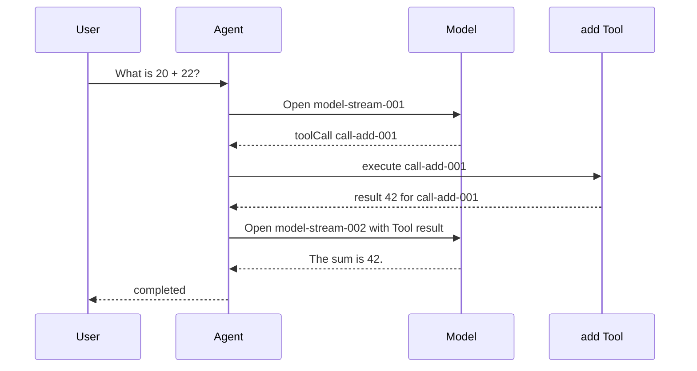

## Outcome

You will read one complete Agent run before separating it into types, streams, and classes. The trace accepts a user request, opens a model stream, receives an `add` Tool call, executes it, appends the matching result, opens a continuation stream, completes the final text, and ends with `status: "completed"`.

The trace is deliberately small, but its contract is architectural. Event order must remain stable. The Tool call and Tool result must carry the same `toolCallId`. The returned event list and nested arguments must not change after the run. The source also uses one `finalText` constant for the final-text event and terminal result. The focused test covers a narrower, explicit set of claims described below.

:::note[Course implementation]

`runPrologue()` is a fixed, offline teaching trace. It does not call a model or execute a real Tool yet. Later checkpoints replace each fixed step with a typed mechanism while preserving the observable order introduced here.

:::

## Prerequisites

Use Node.js 22 and install the repository dependencies from the root. You should be comfortable reading TypeScript object literals, `as const`, `Object.freeze()`, array indexing, and Vitest assertions. Start from the [course overview](index.mdx) if you have not run the workshop setup.

Read these two files together:

| Role | Exact path | What to inspect |
| --- | --- | --- |
| Cumulative source | `course/src/demo/prologue.ts` | The eight immutable events and terminal result |
| Focused evidence | `course/test/00-complete-agent-trace.test.ts` | Event-type order, shared Tool ID, exact terminal result, and deep-freeze checks |

No API key or network connection is used. The input, Tool arguments, Tool output, and final response are fixed fixtures, so a changed assertion points to a protocol regression rather than model variance.

## Mechanism

An Agent run is an ordered protocol; the final sentence is only its terminal output. Intermediate records explain why that output exists. Source inspection shows that the prologue assigns `sequence` values `0` through `7`. The focused test checks the event-type array in that source order, but it does not assert the numeric `sequence` fields. A renderer may show selected events, but the underlying trace must keep the causal sequence.

The first model stream ends with `tool_call_completed`, not with a user-facing answer. `tool_execution_started` shows that execution begins only after a complete call exists. In this fixed trace, `tool_result_appended` marks the point where a runtime would append the result and preserves the original `toolCallId`; checkpoint `00` does not build a transcript. Only then may the second model stream use that result and produce `final_text_completed`.

Stable IDs carry identity across time. The name `add` describes the operation, but it cannot identify one invocation when a model requests `add` twice. `call-add-001` identifies this invocation. A Tool result with the same name but another ID is unrelated and makes the trace invalid.

The trace also separates events from the terminal result. Events are progress records for observers. `result` is the settled value for the caller. In the source fixture, the last event records `status: "completed"`, and one `finalText` constant supplies both `final_text_completed.text` and `result.finalText`. The focused test asserts the exact result object; it does not separately assert the last event's status or compare the two text fields. A later implementation can stream many events while still offering one value to await.

Immutability makes the fixture dependable. The top-level run, event array, every event, nested Tool arguments, and terminal result are frozen. A subscriber cannot rewrite an earlier event and make a later assertion observe a different history.

## Trace or model



| Sequence | Event | Invariant |
| ---: | --- | --- |
| 0 | `user_message_accepted` | The user input enters the run once |
| 1 | `model_stream_opened` | The first model turn starts after input acceptance |
| 2 | `tool_call_completed` | `call-add-001` and its arguments are complete |
| 3 | `tool_execution_started` | Execution refers to `call-add-001` |
| 4 | `tool_result_appended` | Result `42` links back to `call-add-001` |
| 5 | `model_stream_opened` | Continuation starts after the result is available |
| 6 | `final_text_completed` | The final user-facing text is complete |
| 7 | `agent_ended` | The run reaches terminal status `completed` |

The second model turn is not an optional rendering detail. Without it, the model never receives the Tool result and cannot use `42` when composing the final answer.

## Build it

The cumulative module is `course/src/demo/prologue.ts`. The following excerpt is copied verbatim from `course/test/00-complete-agent-trace.test.ts`. It compiles in that test file and shows the exact automated evidence for event-type order, Tool linkage, and the terminal result:

```ts
import { expect, test } from "vitest";

import { runPrologue } from "../src/index";

const expectedEventTypes = [
  "user_message_accepted",
  "model_stream_opened",
  "tool_call_completed",
  "tool_execution_started",
  "tool_result_appended",
  "model_stream_opened",
  "final_text_completed",
  "agent_ended",
] as const;

test("follows one complete Agent trace in exact event order", () => {
  const run = runPrologue();

  expect(run.events.map(({ type }) => type)).toEqual(expectedEventTypes);

  const toolCall = run.events[2];
  const toolResult = run.events[4];

  expect(toolCall).toMatchObject({
    type: "tool_call_completed",
    toolCallId: "call-add-001",
  });
  expect(toolResult).toMatchObject({
    type: "tool_result_appended",
    toolCallId: "call-add-001",
  });
  expect(toolResult.toolCallId).toBe(toolCall.toolCallId);

  expect(run.result).toEqual({
    status: "completed",
    finalText: "The sum is 42.",
  });
});
```

The complete source module returns the same prebuilt snapshot on every call. That is acceptable at checkpoint `00` because the goal is to establish the contract, not to model runtime work. Freezing the array alone would be shallow, so the source separately freezes each event, `arguments`, the terminal result, and the containing object. The second test verifies those freeze boundaries and mutation failures.

When you inspect the test, follow indexes `2` and `4`: they are the Tool call and Tool result. The assertion compares their IDs directly instead of repeating only the expected string. That comparison states the relationship the Agent must preserve.

## Run the focused test

The focused test is `course/test/00-complete-agent-trace.test.ts`. Run this exact command from the repository root:

```bash
npm run test:course:checkpoint -- course/test/00-complete-agent-trace.test.ts
```

Vitest should select one file. One test checks all eight event types in array order, the shared Tool ID, and the exact terminal result. The other checks the deep-freeze boundaries, attempts mutations, and confirms that the trace retains its original length, arguments, and result text.

## Failure experiment

Work in a temporary copy or a disposable branch. In `course/src/demo/prologue.ts`, change only the `toolCallId` on `tool_result_appended` from the shared variable to another value:

```ts
Object.freeze({
  type: "tool_result_appended",
  sequence: 4,
  toolCallId: "call-add-999",
  result: 42,
});
```

Run the focused command again. The event types still appear in the correct order and the arithmetic result is still `42`, but the linkage assertion fails because `run.events[4].toolCallId` no longer equals `run.events[2].toolCallId`. This isolates an identity failure that a final-text-only test would miss. Restore the shared `toolCallId` before continuing.

## Acceptance criteria

- The focused command selects only `course/test/00-complete-agent-trace.test.ts` and passes offline.
- The focused test asserts the eight event types in array order; source inspection confirms numeric `sequence` values `0` through `7`.
- The Tool call and Tool result both use `call-add-001`.
- Source inspection shows the continuation model stream after the Tool result.
- The focused test asserts the exact `{ status: "completed", finalText: "The sum is 42." }` result; source inspection confirms the final event status and shared `finalText` constant.
- The run object, event array, individual events, Tool arguments, and terminal result reject mutation.
- The controlled mismatched-ID edit fails the linkage assertion and passes again after restoration.

## Compare with Pi SDK 0.85.0

:::info[Pi SDK 0.85.0]

The released `@earendil-works/pi-agent-core` exports a richer `AgentEvent` union. Its lifecycle includes `agent_start`/`agent_end`, `turn_start`/`turn_end`, message lifecycle events, and `tool_execution_start`/`tool_execution_update`/`tool_execution_end`. Tool events carry `toolCallId`, so consumers can correlate one execution even when Tool names repeat.

:::

Pi's event names and payloads are not the prologue's event names. Pi also represents model completion through an `AssistantMessage` with a `stopReason`; it does not expose this checkpoint's `{ status, finalText }` result as a compatible public type. Use the prologue to reason about causal order and identity, then use Pi's exported types when integrating the SDK.

The two systems share the underlying engineering requirement: a Tool result must remain associated with the call that produced it, and the Agent lifecycle must settle only after the relevant work has finished. Do not import `runPrologue()` into a Pi application or translate its event strings into claims about the SDK.

## Next checkpoint

[Checkpoint 01](01-typescript-protocols.md) turns the visible trace into closed TypeScript protocols. You will define the message, model, Tool, event, and terminal-result shapes before adding any stateful implementation.
