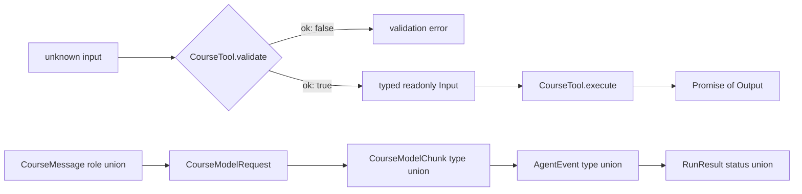

## Outcome

You will turn the trace from checkpoint `00` into a TypeScript vocabulary that later modules can share. The protocol covers normalized messages, assistant content blocks, model requests and chunks, Tool validation and execution, Agent events, and four terminal run results.

After this checkpoint, a message role, content-block type, event type, or run status can be narrowed by its discriminant. Arrays and nested JSON argument values are readonly at compile time. Request, response, message, and Tool-call IDs have explicit aliases, so code shows which identity crosses each boundary. An exhaustive `switch` fails typecheck when the union grows without a corresponding branch.

:::note[Course implementation]

The types in `course/src/protocol.ts` belong to the workshop. Their names, fields, and terminal statuses are not a compatibility layer for Pi. They establish a small closed system that the remaining checkpoints can test without network access.

:::

## Prerequisites

Complete [checkpoint 00](00-complete-agent-trace.md). You should understand union types, literal types, generics, `Readonly<T>`, `readonly` arrays, `unknown`, type-only imports, and control-flow narrowing. You do not need advanced conditional types; `npm run typecheck` evaluates the assertions in the focused test that keep the union discriminants exact.

Read the protocol and its test side by side:

| Role | Exact path | What to inspect |
| --- | --- | --- |
| Cumulative source | `course/src/protocol.ts` | All shared value contracts and `assertNever()` |
| Focused evidence | `course/test/01-typescript-protocols.test.ts` | Runtime assertions plus contracts checked by `npm run typecheck` |

The source intentionally contains no classes, queues, provider adapters, or filesystem operations. Protocol changes should be reviewable without also reasoning about mutable implementation state.

## Mechanism

A discriminated union gives every variant one stable literal field. `CourseMessage` narrows on `role`; `CourseAssistantBlock` and `CourseModelChunk` narrow on `type`; `RunResult` narrows on `status`. Once TypeScript sees a branch such as `message.role === "toolResult"`, it exposes the fields that only that member owns.

Closed unions make change visible. A consumer handles every current member and passes the impossible remainder to `assertNever()`. Adding a new member changes that remainder from `never` to the new type, which creates a compile error at every exhaustive switch that needs a policy decision.

Readonly boundaries express ownership. A model request receives `readonly CourseMessage[]`; an event payload cannot replace its message; a failed result cannot rewrite its nested error code. `CourseJsonObject` and `CourseJsonArray` are recursively readonly, so Tool arguments cannot be mutated through a nested object or array reference at compile time.

Readonly types do not freeze untrusted runtime input. A caller can bypass TypeScript or supply parsed JSON, and an object typed readonly may still reference mutable data. The comment in `course/src/protocol.ts` assigns runtime validation, cloning, and snapshots to later layers. Checkpoint `03` will implement that boundary.

The ID aliases remain strings rather than branded types. Their value is documentary separation: `CourseModelRequestId`, `CourseModelResponseId`, `CourseMessageId`, and `CourseToolCallId` show what a field identifies. Tests still need to prove relational invariants such as a response matching its request and a Tool result matching its call.

Terminal results are data, not exceptions hidden behind one return type. `completed` contains final text; `cancelled` contains a reason; `maxSteps` reports the budget that stopped the loop; `failed` carries a stable error code and message. Every variant retains the message snapshot, which lets the caller inspect the last valid transcript state.

Finally, `CourseTool<Input, Output>` forces a two-stage boundary. `validate()` accepts `unknown` and returns either a typed value or an error. Only the validated `Input` reaches the asynchronous `execute()` function together with `AbortSignal` and `toolCallId` context.

## Trace or model



| Discriminant | Closed members | Consumer decision |
| --- | --- | --- |
| `CourseMessage.role` | `user`, `assistant`, `toolResult` | Select the content shape and transcript rule |
| `CourseAssistantBlock.type` | `text`, `toolCall` | Render text or track a Tool invocation |
| `CourseModelChunk.type` | `textDelta`, `toolCall` | Accumulate text or record a complete call |
| `AgentEvent.type` | `message.accepted`, `model.chunk`, `tool.started`, `tool.finished`, `run.finished` | Update an observer without guessing payload fields |
| `RunResult.status` | `completed`, `cancelled`, `maxSteps`, `failed` | Handle every terminal outcome explicitly |

Protocol types precede classes because classes create ownership and timing choices. Agreeing on the values first lets checkpoint `02` implement delivery, checkpoint `04` implement a model, and checkpoint `07` implement the loop against the same contracts.

## Build it

The cumulative module is `course/src/protocol.ts`. This excerpt is the complete terminal-result union from that file:

```ts
export type CompletedRunResult = Readonly<{
  status: "completed";
  messages: readonly CourseMessage[];
  finalText: string;
}>;

export type CancelledRunResult = Readonly<{
  status: "cancelled";
  messages: readonly CourseMessage[];
  reason: string;
}>;

export type MaxStepsRunResult = Readonly<{
  status: "maxSteps";
  messages: readonly CourseMessage[];
  maxSteps: number;
}>;

export type FailedRunResult = Readonly<{
  status: "failed";
  messages: readonly CourseMessage[];
  error: Readonly<{
    code: string;
    message: string;
  }>;
}>;

export type RunResult =
  CompletedRunResult | CancelledRunResult | MaxStepsRunResult | FailedRunResult;
```

The focused test consumes such unions with the same exhaustive shape application code should use:

```ts
function describeRun(result: RunResult): string {
  switch (result.status) {
    case "completed":
      return result.finalText;
    case "cancelled":
      return result.reason;
    case "maxSteps":
      return String(result.maxSteps);
    case "failed":
      return result.error.code;
    default:
      return assertNever(result);
  }
}
```

The test file also contains `@ts-expect-error` assertions for reassigned message IDs, mutated assistant content, nested JSON writes, a validator that accepts less than `unknown`, synchronous Tool execution, and a non-terminal `"running"` result. Those comments become compile-time evidence only when `tsc` checks the file through `npm run typecheck`.

## Run the focused test

The focused test is `course/test/01-typescript-protocols.test.ts`. Run exactly:

```bash
npm run test:course:checkpoint -- course/test/01-typescript-protocols.test.ts
```

Vitest transpiles and executes this file, but it does not type-check it. The focused command verifies runtime discriminant values, event order, Tool validation flow, `assertNever()`'s runtime fallback, and all four result branches. Run `npm run typecheck` as required evidence for the `@ts-expect-error`, readonly, variance, asynchronous-execution, and exhaustive-switch contracts.

## Failure experiment

In a disposable branch, add a fifth result member to `course/src/protocol.ts` and include it in `RunResult`:

```ts
export type DeferredRunResult = Readonly<{
  status: "deferred";
  messages: readonly CourseMessage[];
  resumeToken: string;
}>;
```

In the focused test, update the `RunStatuses` equality assertion so its expected union includes `"deferred"`; this acknowledges the intentional protocol change and keeps that separate regression check accurate. Do not add a `case "deferred"` branch to `describeRun()`. Run:

```bash
npm run typecheck
```

`npm run typecheck` invokes `tsc --noEmit`, which reports that `DeferredRunResult` cannot be passed to the `never` parameter of `assertNever()`. Vitest alone will not report this omission because it transpiles without type-checking. Remove the experimental member, or implement and test the new branch, then require both typecheck and the focused runtime test to pass.

## Acceptance criteria

- The focused command selects only `course/test/01-typescript-protocols.test.ts` and passes offline.
- `npm run typecheck` passes and validates the compile-time assertions in the focused test.
- Message, assistant-block, model-chunk, event, and run-result unions retain their exact discriminants.
- Protocol arrays, nested JSON values, event payloads, IDs, and terminal error data reject compile-time mutation.
- `CourseTool.validate()` accepts `unknown`; `execute()` accepts the narrowed input and returns a `Promise`.
- Stable aliases distinguish message, request, response, and Tool-call identities without claiming runtime validation.
- Every `RunResult` status reaches one explicit branch and the default branch receives `never`.
- Adding an unhandled union member makes `npm run typecheck` fail at the exhaustive switch.

## Compare with Pi SDK 0.99.2

:::info[Pi SDK 0.99.2]

`@earendil-works/pi-ai` exports `Message`, `UserMessage`, `AssistantMessage`, `ToolResultMessage`, `ToolCall`, `AssistantMessageEvent`, and related model types. `@earendil-works/pi-agent-core` exports `AgentMessage`, `AgentEvent`, `AgentState`, and `AgentTool`. These are the public release types to use in a Pi integration.

:::

Pi's unions are intentionally broader and structurally different. `AgentMessage` includes Pi AI messages plus application-defined custom messages through TypeScript declaration merging. Pi assistant content can include text, thinking, and Tool calls. Pi's `AgentEvent` describes its actual Agent lifecycle, not the five-event union in this workshop.

The course favors closed unions and pervasive compile-time readonly fields so a missing branch produces a visible type error. Pi's public interfaces include mutable arrays and richer provider metadata because the production runtime accumulates messages, content, usage, and streaming state. Neither shape can be substituted for the other. Carry over explicit discriminants, stable Tool-call identity, validation before execution, and a deliberate decision for every union member, while importing the SDK's own exported types.

The Course implementation is an original, smaller teaching implementation and makes no Pi API-compatibility promise.

## Next checkpoint

[Checkpoint 02](02-event-stream.md) gives `AgentEvent` values a delivery mechanism. You will build a single-consumer `AsyncIterable` channel with a separate terminal result promise, ordered buffering, failure propagation, and deterministic waiter cleanup.
