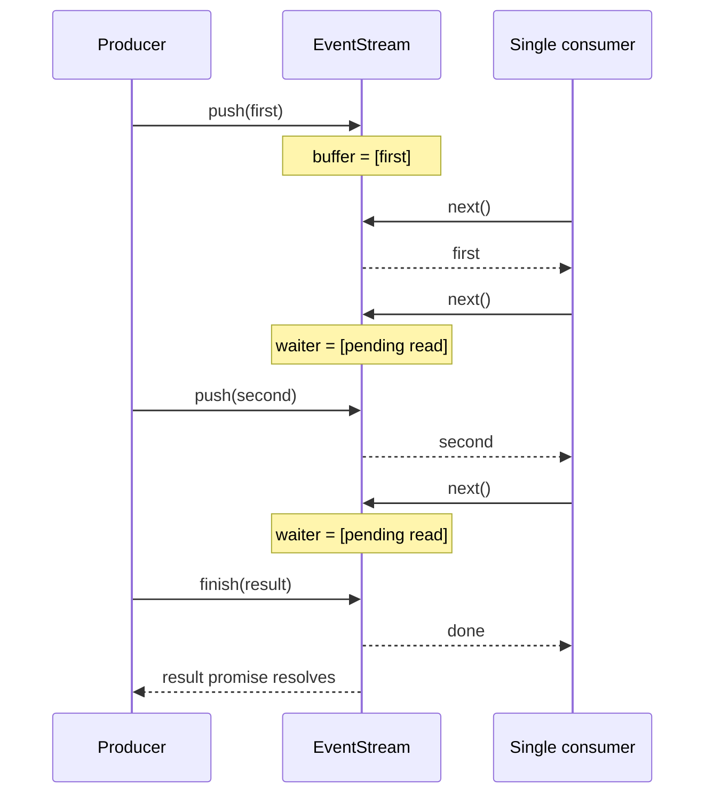

## Outcome

You will build `EventStream<Event, Result>`, a course-owned channel with two observation paths. Consumers iterate ordered progress events through `AsyncIterable<Event>`, while callers await one terminal value through the readonly `result` promise. The channel supports buffered events, consumers already waiting in `next()`, successful completion, failure, early consumer return, and a single active iterator at a time.

You will also locate the real flow-control boundary. `push()` is synchronous and the buffer has no capacity limit, so this implementation does not apply producer backpressure. The boundary it does enforce is delivery and ownership: one active consumer receives each queued event in FIFO order, and every pending read settles when the iterator or stream terminates.

:::note[Course implementation]

`EventStream` in `course/src/event-stream.ts` is a workshop API. Its constructor, `result` property, single-consumer rule, exceptions, and failure behavior are not a drop-in replacement for Pi's exported stream classes.

:::

## Prerequisites

Complete [checkpoint 01](01-typescript-protocols.md). You should understand `Promise`, `AsyncIterable`, `AsyncIterableIterator`, `IteratorResult`, `for await...of`, generic classes, and the difference between resolving and rejecting a promise.

Read these files together:

| Role | Exact path | What to inspect |
| --- | --- | --- |
| Cumulative source | `course/src/event-stream.ts` | State, buffer, iterator ownership, waiters, and terminal transitions |
| Focused evidence | `course/test/02-event-stream.test.ts` | Buffered and waiting delivery, finish/fail behavior, return, and late pushes |

All tests coordinate with promises rather than timers. This keeps the checkpoint deterministic and proves the order comes from the channel, not from a guessed delay.

## Mechanism

The stream has three states: `open`, `finished`, and `failed`. Only `open` accepts `push()`, `finish()`, or `fail()`. The first terminal transition wins. Any later terminal call or event push throws `EventStream is already terminal (...)`, which makes a producer lifecycle bug visible at its source.

While the stream is open, `push(event)` first checks the active iterator's waiter queue. A waiter represents an unresolved `next()` call. If one exists, `push()` removes the oldest waiter and resolves it directly with `{ done: false, value: event }`. Otherwise it appends the event to `buffer`. Both paths preserve FIFO order.

`next()` mirrors that decision. It returns the oldest buffered event first. With no buffered event, a finished stream returns `DONE`; a failed stream rejects with the stored error; an open stream registers a waiter. Calling `next()` more than once before a push creates multiple ordered waiters, which the tests use to verify that two events reach the first two reads and `finish()` closes the surplus read.

Successful completion and event delivery are separate. `finish(result)` resolves `stream.result` immediately, but buffered events remain available to the iterator. Iteration ends only after the buffer drains. Failure follows the same drain-first rule for buffered progress: `stream.result` rejects immediately, already-buffered events are yielded, then the next read rejects with the same error.

When there is no buffer, `finish()` closes the active iterator and resolves every pending read as done. `fail()` rejects every pending read. `closeIterator()` marks that iterator closed, releases the active-consumer slot, splices its waiter array, then settles every removed waiter. An explicit iterator `return()` uses the same cleanup path and allows a later sequential iterator to consume events not already taken.

Only one iterator can be active. This avoids two consumers racing for events from one queue and getting different subsets. The rule concerns active ownership, not lifetime ownership: after the first iterator calls `return()` or reaches terminal state, another iterator may be created.

There is no producer backpressure. `push()` returns `void`; it never waits for a consumer, and an idle consumer allows `buffer` to grow without a bound. A production design that must limit memory would need an explicit capacity and an asynchronous producer operation, dropping/coalescing policy, or upstream cancellation. Those mechanisms are outside this checkpoint.

## Trace or model



| Situation | Event path | Terminal path |
| --- | --- | --- |
| Push before `next()` | Event enters `buffer`; later `next()` shifts it | Still open |
| `next()` before push | Read enters `waiters`; next push resolves it | Still open |
| `finish(result)` with buffer | Iterator drains buffer, then returns done | `result` resolves immediately |
| `fail(error)` with buffer | Iterator drains buffer, then rejects | `result` rejects immediately |
| Iterator `return()` | Pending reads resolve done; active slot is released | Stream itself remains open |

The table separates the consumer's event timeline from the caller's result timeline. Code may await both, but they settle under different conditions.

## Build it

The cumulative module is `course/src/event-stream.ts`. Inspect `push()` and `finish()` there to see direct waiter delivery and buffered completion. The following contiguous excerpt is copied verbatim from the start of `course/test/02-event-stream.test.ts` through its first test. It compiles in that test file and exercises the public buffer/result contract:

```ts
import { expect, test } from "vitest";

import { EventStream } from "../src/index";

type Deferred<Value> = Readonly<{
  promise: Promise<Value>;
  resolve: (value: Value | PromiseLike<Value>) => void;
}>;

function deferred<Value>(): Deferred<Value> {
  let resolve!: (value: Value | PromiseLike<Value>) => void;
  const promise = new Promise<Value>((resolvePromise) => {
    resolve = resolvePromise;
  });

  return { promise, resolve };
}

async function collect<Value>(source: AsyncIterable<Value>): Promise<Value[]> {
  const values: Value[] = [];
  for await (const value of source) {
    values.push(value);
  }
  return values;
}

test("delivers buffered events in push order before the terminal result", async () => {
  const stream = new EventStream<string, number>();

  stream.push("first");
  stream.push("second");
  stream.finish(42);

  await expect(collect(stream)).resolves.toEqual(["first", "second"]);
  await expect(stream.result).resolves.toBe(42);
});
```

The class installs an internal rejection handler with `void this.result.catch(() => undefined)`. This prevents an ignored terminal result from creating an unhandled-rejection warning. It does not convert the public promise to success: a caller awaiting the original `result` still receives the rejection.

Do not add `await` around `push()`. Its synchronous signature documents the absence of flow control. If a later host needs producer throttling, that contract must change explicitly instead of pretending the current buffer pushes back.

## Run the focused test

The focused test is `course/test/02-event-stream.test.ts`. Run exactly:

```bash
npm run test:course:checkpoint -- course/test/02-event-stream.test.ts
```

The selected file covers push-before-read and read-before-push order, one successful terminal result, shared failure identity, buffered events before failure, multiple waiters, consumer return, rejection of concurrent iterators, sequential iterator replacement, and pushes after both terminal states.

## Failure experiment

In a disposable branch, add this case beside the terminal-state tests or run the same sequence in a scratch test:

```ts
const stream = new EventStream<string, string>();
stream.push("before-terminal");
stream.finish("done");
stream.push("after-terminal");
```

Run the focused command. The last line throws `EventStream is already terminal (finished)`. If you temporarily remove `this.assertOpen()` from `push()`, the experiment stops failing and a producer can append data after the result has settled. That produces an ambiguous history: the caller has a terminal value while the producer still claims progress. Restore the guard and keep the existing test `rejects pushes after either terminal state` green.

## Acceptance criteria

- The focused command selects only `course/test/02-event-stream.test.ts` and passes offline.
- Buffered events and events delivered to pending waiters preserve FIFO order.
- Exactly one iterator is active; `return()` settles its pending reads and permits a later iterator.
- `finish(result)` resolves the terminal promise once and ends iteration after buffered events drain.
- `fail(error)` rejects the result and pending reads with the same error, after any buffer drains.
- All waiters are removed and settled when an iterator closes.
- `push()`, `finish()`, and `fail()` reject any operation after terminal state.
- Documentation and code make no claim of producer backpressure; the buffer is explicitly unbounded.

## Compare with Pi SDK 0.84.3

:::info[Pi SDK 0.84.3]

`@earendil-works/pi-ai` exports a generic `EventStream<T, R>`, `AssistantMessageEventStream`, and `createAssistantMessageEventStream()`. `AssistantMessageEventStream` carries `AssistantMessageEvent` values and exposes the final `AssistantMessage` through its `result()` method.

:::

The released Pi stream detects `done` or `error` events as terminal and includes that terminal event in iteration. Its `result()` resolves to the final `AssistantMessage`; an `error` event carries an assistant message whose `stopReason` is `error` or `aborted`. The course stream instead has explicit `finish(result)` and `fail(error)`, a `result` property that may reject, and a single-active-consumer guard.

Pi's generic stream also uses a queue and waiting reads, and its producer `push()` is synchronous. That is not a backpressure guarantee. A UI or integration consuming Pi events should keep its callback light, batch expensive rendering, or insert its own bounded handoff where resource control is required. Use Pi's exported stream API for Pi provider code; use this checkpoint to study event/result separation and cleanup.

## Next checkpoint

[Checkpoint 03](03-message-ir.md) defines the normalized Message IR that will travel through the stream and later Agent Loop. You will snapshot assistant blocks, validate Tool-call/result linkage, return stable diagnostics, and prove valid messages survive a JSON round-trip.
