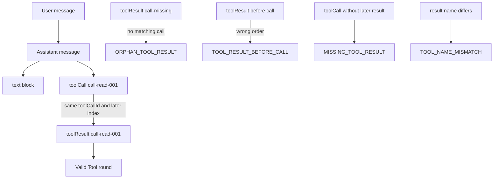

## Outcome

You will create the normalized Message intermediate representation (IR) used by the workshop. Three constructors produce user, assistant, and Tool-result messages. Assistant content is an ordered array of `text` and `toolCall` blocks. Tool arguments are copied into deeply frozen JSON values, so later mutation of caller-owned input cannot rewrite the message snapshot.

You will also validate a whole transcript without throwing. `validateTranscript(unknown)` reports frozen diagnostics for malformed message shapes and broken Tool linkage. A valid Tool round has a unique call ID, one later result with the same `toolCallId` and `toolName`, JSON-compatible arguments, and no unanswered call. Valid messages retain their roles, block discriminants, and IDs after `JSON.stringify()` and `JSON.parse()`.

:::note[Course implementation]

The constructors, error codes, and transcript rules in `course/src/messages.ts` are teaching contracts owned by Pify. They do not parse Pi provider payloads and are not API-compatible with Pi message types.

:::

## Prerequisites

Complete [checkpoint 02](02-event-stream.md). You should understand the `CourseMessage` and `CourseAssistantBlock` unions from checkpoint `01`, JSON-compatible values, immutable snapshots, `Map`, `Set`, and why data received as `unknown` must be inspected before narrowing.

Read these files together:

| Role | Exact path | What to inspect |
| --- | --- | --- |
| Cumulative source | `course/src/messages.ts` | Constructors, deep JSON snapshots, transcript inspection, and linkage checks |
| Focused evidence | `course/test/03-message-ir.test.ts` | Valid rounds, malformed input, hostile properties, error codes, and JSON round-trip |

This checkpoint validates a normalized transcript, not arbitrary provider wire formats. Provider adaptation arrives at checkpoint `05`; it must first convert transport records into this IR.

## Mechanism

Normalization gives the Agent one internal shape even when later inputs come from different boundaries. A user message contains an `id`, `role: "user"`, and string `content`. An assistant message contains an `id`, `role: "assistant"`, and ordered content blocks. A Tool-result message contains its own message ID plus `toolCallId`, `toolName`, string `content`, and boolean `isError`.

Assistant order is meaningful. Text before a Tool call, the call itself, and text after it remain in the same array positions. `textFromAssistant()` walks by trusted numeric indexes and concatenates only `text` blocks. It does not stringify Tool calls into user-facing prose.

Constructors establish a snapshot boundary. They read each caller property once, reject sparse content, copy supported blocks, and freeze the output. Tool-call arguments must be a non-null plain object rather than an array. Their descendants may contain strings, finite numbers, booleans, `null`, arrays, or plain objects. Functions, symbols, `undefined`, non-finite numbers, custom-prototype objects, sparse arrays, and circular references are rejected. Each nested object and array is copied and frozen.

`validateTranscript()` serves a different caller from the constructors. Constructors reject bad direct input with precise `TypeError` messages. The validator accepts `unknown`, catches hostile getters and revoked proxies, and returns diagnostics instead of throwing. Each diagnostic contains a stable `code`, `messageIndex`, and human-readable `message`; both the array and its entries are frozen.

Shape validation runs before linkage validation. The inspector records valid calls and results by `toolCallId`, while sets remember malformed records whose readable IDs should not trigger misleading follow-on errors. This prevents one invalid arguments object from cascading into a false orphan or missing-result report.

Linkage has five core rules. A Tool-call ID is unique. Each call receives at most one result. A result must refer to a known call and appear later in the transcript. Its `toolName` must equal the call's name. Every well-formed call needs a later result. The stable codes include `DUPLICATE_TOOL_CALL_ID`, `DUPLICATE_TOOL_RESULT`, `ORPHAN_TOOL_RESULT`, `TOOL_RESULT_BEFORE_CALL`, `TOOL_NAME_MISMATCH`, and `MISSING_TOOL_RESULT`, alongside shape errors.

JSON round-trip is a portability check, not a complete trust check. Parsed JSON no longer carries `Object.freeze()` state or TypeScript types. It does retain string discriminants, IDs, ordered arrays, and JSON argument values. The receiving boundary must call `validateTranscript(restored)` before treating that parsed data as a valid course transcript.

## Trace or model



| Boundary | Accepted shape | Representative rejection |
| --- | --- | --- |
| User message | Non-empty `id`, `role: "user"`, string `content` | `INVALID_MESSAGE` |
| Assistant text block | `type: "text"`, string `text` | `INVALID_MESSAGE` |
| Assistant Tool-call block | Non-empty `id` that is unique across a validated transcript, non-empty `name`, JSON object `arguments` | `EMPTY_TOOL_NAME` or `INVALID_TOOL_ARGUMENTS` |
| Tool-result message | Non-empty IDs/name, string `content`, boolean `isError` | `INVALID_MESSAGE` or `EMPTY_TOOL_NAME` |
| Transcript linkage | One later, name-matched result per unique call | Stable linkage code with `messageIndex` |

The graph distinguishes a structurally valid result from a relationally valid result. A result object can have every required field and still be invalid because its call does not exist or occurs later.

## Build it

The cumulative module is `course/src/messages.ts`. The public constructors let later modules create messages without duplicating shape checks. The following first `test(...)` block is copied verbatim from `course/test/03-message-ir.test.ts`. It compiles in that focused test context, where the surrounding file already imports the constructors, `validateTranscript`, `textFromAssistant`, `expect`, and `test`. The excerpt preserves the ordered text blocks and explicit `isError` value:

```ts
test("constructs a valid Tool round-trip and extracts only assistant text", () => {
  const transcript = [
    userMessage({ id: "message-user-001", content: "Read package.json." }),
    assistantMessage({
      id: "message-assistant-001",
      content: [
        { type: "text", text: "I will inspect it. " },
        {
          type: "toolCall",
          id: "call-read-001",
          name: "read",
          arguments: { path: "package.json" },
        },
        { type: "text", text: "Then I will summarize it." },
      ],
    }),
    toolResultMessage({
      id: "message-tool-001",
      toolCallId: "call-read-001",
      toolName: "read",
      content: '{"name":"pify-docs"}',
      isError: false,
    }),
  ] as const;

  expect(validateTranscript(transcript)).toEqual([]);
  expect(textFromAssistant(transcript[1])).toBe(
    "I will inspect it. Then I will summarize it.",
  );
  expect(transcript).toMatchObject([
    { id: "message-user-001", role: "user" },
    { id: "message-assistant-001", role: "assistant" },
    {
      id: "message-tool-001",
      role: "toolResult",
      toolCallId: "call-read-001",
      toolName: "read",
      isError: false,
    },
  ]);
});
```

The source uses indexed loops and snapshots array lengths before traversal. It does not call caller-controlled `.entries()`, `.map()`, or nested iterators. Each inspected property is read once where practical, which prevents a getter from changing a field between validation and recording.

The validator may return more than one useful diagnostic for independent problems. It deliberately suppresses ambiguous linkage diagnostics for duplicate call IDs and avoids cascading linkage errors from malformed records. Consumers should branch on `code` and use `messageIndex` to locate the record; prose in `message` is for humans.

## Run the focused test

The focused test is `course/test/03-message-ir.test.ts`. Run exactly:

```bash
npm run test:course:checkpoint -- course/test/03-message-ir.test.ts
```

The selected file proves valid construction, text extraction, deep argument snapshots, sparse-array rejection, one-read property handling, duplicate detection, orphan/order/missing/name diagnostics, non-throwing inspection of adversarial values, suppression of cascaded errors, precise constructor failures, and JSON round-trip.

## Failure experiment

Create a result with no preceding Tool call and inspect its diagnostics:

```ts
const orphanTranscript = [
  toolResultMessage({
    id: "message-tool-orphan",
    toolCallId: "call-missing",
    toolName: "read",
    content: "contents",
  }),
];

const errors = validateTranscript(orphanTranscript);
// errors[0].code === "ORPHAN_TOOL_RESULT"
```

Run the focused command. The validator must not throw; it returns `ORPHAN_TOOL_RESULT` at `messageIndex: 0`. Now prepend an assistant `toolCall` with ID `call-missing` and name `read`. The diagnostic disappears only when the call precedes exactly one matching result. This experiment shows that a syntactically complete result is not valid without transcript context.

## Acceptance criteria

- The focused command selects only `course/test/03-message-ir.test.ts` and passes offline.
- Constructors return normalized user, assistant, and Tool-result messages with stable roles and IDs.
- Assistant blocks preserve order; `textFromAssistant()` concatenates text without rendering Tool calls.
- Caller-owned assistant content and nested JSON arguments are copied and deeply frozen.
- `validateTranscript(unknown)` never exposes an input exception and returns frozen, indexed diagnostics.
- Unique Tool calls have exactly one later result with matching `toolCallId` and `toolName`.
- Malformed records do not create misleading cascaded linkage errors.
- A valid transcript retains discriminants and IDs after JSON serialization and validates again after parsing.
- An orphan Tool result produces `ORPHAN_TOOL_RESULT` until its matching earlier call is restored.

## Compare with Pi SDK 0.85.0

:::info[Pi SDK 0.85.0]

`@earendil-works/pi-ai` exports `Message = UserMessage | AssistantMessage | ToolResultMessage`. Its exported `ToolCall` has `type: "toolCall"`, `id`, `name`, and `arguments`; `ToolResultMessage` links back with `toolCallId` and `toolName`. Pi Agent core uses those public message types inside its Agent Loop.

:::

Pi's IR carries more production data. User content may include text and images. Assistant content may include text, thinking, and Tool calls plus provider, model, usage, stop reason, timestamps, and optional replay metadata. Tool results contain text/image blocks, timestamps, optional details and usage. Pi messages do not adopt this course's per-message `id` fields or string-only Tool result content.

The course's `validateTranscript()` and its diagnostic codes are not Pi APIs. Pi's provider adapters and Agent Loop own their release-specific conversion, ordering, Tool execution, and result construction paths. When integrating Pi, keep opaque provider metadata and use its exported shapes. The transferable lesson is narrower: normalize at a boundary, preserve `toolCallId`, keep content order, validate untrusted values, and do not infer a valid Tool round from the rendered text alone.

## Next checkpoint

[Checkpoint 04](04-deterministic-model.md) adds a model test double that emits scripted chunks into `EventStream`. You will control request IDs, response order, cancellation, and queue exhaustion without a provider account or network request.
