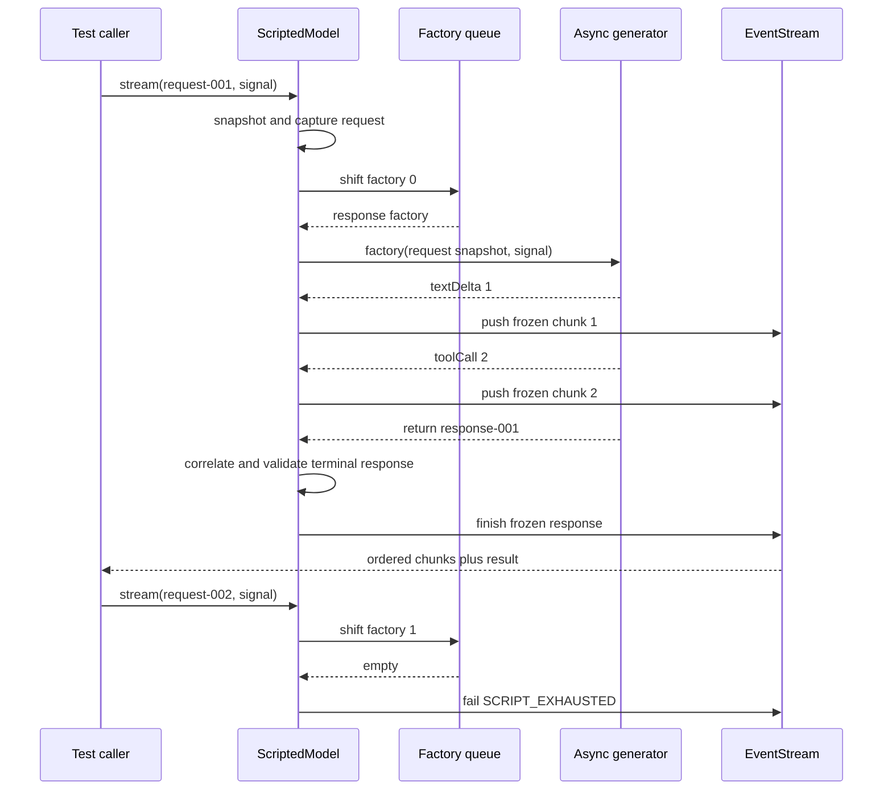

## Outcome

You will replace the fixed trace from checkpoint `00` with a deterministic model test double: a controlled substitute for the real model during tests. `ScriptedModel` owns a finite FIFO queue of `ScriptedResponseFactory` functions. Each call snapshots its request, consumes at most one factory, forwards the factory's chunks in order, and settles through the `EventStream` terminal result.

The model records every attempted request, including a call made after the queue is empty. This makes model demand observable without logs. An empty queue fails with `ScriptedModelError` and code `SCRIPT_EXHAUSTED`; the double never invents a fallback answer. Cancellation is checked before a queued factory is removed, between iterator steps, before each chunk is published, and before the terminal response is accepted.

:::note[Course implementation]

`ScriptedModel`, `ScriptedResponseFactory`, and the four `SCRIPT_*` codes are workshop contracts. They model the narrow boundary required by later checkpoints and are not aliases for Pi exports.

:::

## Prerequisites

Complete [checkpoint 03](03-message-ir.md). You should understand `EventStream`, async generators, `AbortController`, the normalized message constructors, request/response correlation, and the difference between streamed chunks and a terminal response.

Read the cumulative module and focused evidence together:

| Role | Exact path | What to inspect |
| --- | --- | --- |
| Cumulative source | `course/src/scripted-model.ts` | Factory queue, request capture, iterator ownership, snapshots, terminal checks, and abort races |
| Focused evidence | `course/test/04-deterministic-model.test.ts` | FIFO replacement/append behavior, ordered chunks, exhaustion, cancellation, correlation, and iterator reuse |

No clock, random value, provider credential, or network connection selects a response. The test decides the queue, IDs, chunks, usage, and stop reason before execution.

## Mechanism

A `ScriptedResponseFactory` receives the immutable `CourseModelRequest` snapshot and the caller's `AbortSignal`. It returns an async generator whose yielded values are `CourseModelChunk` records and whose return value is one `CourseModelResponse`. A factory can inspect the current request when it builds the response, so request correlation stays explicit rather than relying on a global fixture.

`stream()` performs synchronous boundary work first. It snapshots the request, appends that snapshot to `capturedRequests`, increments `callCount`, creates an `EventStream`, and starts the producer. The public `requests` getter returns a newly frozen array, while the captured messages and nested Tool arguments were already copied and frozen. Mutating the caller's request after `stream()` cannot change what the factory or assertions observe.

The producer checks cancellation before shifting the queue. This ordering is deliberate: a request cancelled before production still counts as an attempted call and remains visible in `requests`, but it does not spend a scripted response. A later retry can consume that same factory. Once a factory is shifted, failure or mid-stream cancellation does not put it back because execution already began.

Each factory owns one iterator. `claimIteratorOnce()` rejects concurrent or sequential reuse with `SCRIPT_ITERATOR_REUSED`, even across model instances. Without this rule, two requests could call `next()` on the same generator and receive alternating chunks from one response. A reusable iterable is fine only when it creates a fresh iterator for each response.

For every yielded value, the model snapshots the chunk and compares `requestId` with the active request. Text deltas retain their order. Tool calls pass through the Message IR snapshot boundary, which copies and freezes JSON arguments. When the generator returns, the response is copied, correlated, and checked against its `stopReason`: `toolCall` requires at least one Tool-call block, while `stop` forbids Tool-call blocks. Usage counts must be non-negative safe integers.

`waitForAbort()` races a pending `next()` against the signal without polling or sleeps. If cancellation wins, the producer rejects both event iteration and `stream.result`, then requests generator cleanup. Cleanup errors cannot replace the primary failure. A factory exception, correlation error, or invalid terminal response follows the same EventStream failure path, so consumers do not receive a successful result after a failed event channel.

## Trace or model



| Boundary | State before | State after | Observable contract |
| --- | --- | --- | --- |
| `stream()` | Caller owns a mutable request | Model owns a frozen snapshot | `requests` records the exact call input |
| Queue shift | `pendingResponseCount = n` | `n - 1` after production starts | Factories are consumed FIFO |
| Chunk yield | Generator owns a raw chunk | Stream receives a frozen correlated chunk | Consumer order equals generator order |
| Generator return | Raw response and usage | Frozen validated response | `stream.result` settles once |
| Empty queue | No remaining factory | Failed stream | Code is `SCRIPT_EXHAUSTED` |

The timeline distinguishes attempted calls from consumed factories. `callCount` increases before asynchronous production, while `pendingResponseCount` decreases only after the abort pre-check and queue shift.

## Build it

The cumulative module is `course/src/scripted-model.ts`. Start with a small factory helper, then add factories whose control flow exposes the behavior you need to test. This fragment is copied verbatim from `course/test/04-deterministic-model.test.ts`; it compiles in that file because `ScriptedResponseFactory` and `responseFor()` are defined in the surrounding test context:

```ts
function textFactory(text: string, id: string): ScriptedResponseFactory {
  return async function* (request) {
    yield { type: "textDelta", requestId: request.id, delta: text };
    return responseFor(request.id, text, id);
  };
}
```

The factory derives `requestId` from its argument in both the chunk and response. Hard-coding another request ID would exercise the correlation failure instead of a normal response. Returning an async generator also matters: an ordinary promise cannot provide the ordered chunk channel required by the course model boundary.

Use `setResponses()` when a test needs to replace all pending behavior and `appendResponse()` when it needs to extend the queue. Both validate factories before mutation. `setResponses()` snapshots the complete replacement first, so a sparse or invalid array cannot leave a partly replaced queue.

Do not assert only final text. Collect the async iterable and await `stream.result`; then check chunk order, correlation IDs, terminal fields, freeze boundaries, `callCount`, and remaining queue length. Those observations separate a correct model double from a stub that returns the expected sentence while violating the protocol.

## Run the focused test

The focused test is `course/test/04-deterministic-model.test.ts`. Run exactly:

```bash
npm run test:course:checkpoint -- course/test/04-deterministic-model.test.ts
```

The file proves immutable request capture, ordered text and Tool-call chunks, immutable terminal snapshots, queue replacement and append, typed exhaustion, pre-stream and mid-stream cancellation, factory-failure propagation, chunk/response correlation, stop-reason semantics, and single ownership of response iterators. It does not claim production retry policy, provider conversion, token accounting accuracy, or network behavior.

## Failure experiment

Request one more response than the finite queue contains. The focused test already contains this exact case:

```ts
test("fails closed with SCRIPT_EXHAUSTED instead of inventing a response", async () => {
  const model = new ScriptedModel();
  const stream = model.stream(
    {
      id: "request-exhausted",
      messages: [
        { id: "message-exhausted", role: "user", content: "One more." },
      ],
    },
    new AbortController().signal,
  );

  await expect(collect(stream)).rejects.toMatchObject({
    code: "SCRIPT_EXHAUSTED",
  });
  await expect(stream.result).rejects.toEqual(
    expect.objectContaining({
      name: "ScriptedModelError",
      code: "SCRIPT_EXHAUSTED",
    }),
  );
  expect(model.callCount).toBe(1);
  expect(model.requests).toHaveLength(1);
});
```

Run the focused command. Both consumption paths reject with the same typed code, while the attempted request remains captured. Then prepend one `textFactory(...)` and rerun: the first call passes and a second call fails. Do not add a default factory, because that would hide an unexpected extra model turn in later Agent Loop tests.

## Acceptance criteria

- The focused command selects only `course/test/04-deterministic-model.test.ts` and passes offline.
- `ScriptedModel` captures a deeply immutable request before caller mutation and exposes a frozen request list.
- Response factories are replaced or appended only after their input is validated, and they are consumed FIFO.
- Text and Tool-call chunks reach consumers in generator order with the active `requestId`.
- Final responses are immutable, correlated, and consistent with `stopReason` and non-negative usage counts.
- A request cancelled before production does not consume its queued response; mid-stream cancellation interrupts a pending iterator step.
- One response iterator cannot be shared across calls or model instances.
- Queue exhaustion rejects event iteration and `stream.result` with `SCRIPT_EXHAUSTED` while retaining call evidence.

## Compare with Pi SDK 0.99.2

:::info[Pi SDK 0.99.2]

`@earendil-works/pi-ai` exports the testing helpers `fauxProvider()`, `fauxAssistantMessage()`, `fauxToolCall()`, `FauxResponseFactory`, and `FauxProviderHandle`. The same package exports `EventStream` and `AssistantMessageEventStream` for its richer streaming protocol.

:::

Pi's faux provider has a production-shaped `Provider`, models collection integration, assistant events for text, thinking, Tool calls, completion, errors, aborts, and deferred responses. It can estimate usage and split content into chunks. Its default IDs, timestamps, and chunk sizes may use time or randomness, so it is not the same exact-sequence test double as `ScriptedModel`.

The course implementation is intentionally smaller. It accepts only `textDelta` and complete `toolCall` chunks, uses the course Message IR, has two stop reasons, and requires the test to choose every ID and usage value. It also uses a property named `result`; Pi's `EventStream` exposes `result()` as a method. Do not substitute one interface for the other.

Use Pi's exported faux helpers when testing a Pi integration against release-shaped `AssistantMessage` and provider behavior. Use `ScriptedModel` to study FIFO demand, correlation, cancellation boundaries, and deterministic Agent Loop traces within this workshop.

The Course implementation is an original, smaller teaching implementation and makes no Pi API-compatibility promise.

## Next checkpoint

[Checkpoint 05](05-provider-adapter.md) moves the trust boundary outward. You will parse unknown transport fixture records into the same model chunks and terminal response without adding credentials or a network client.
