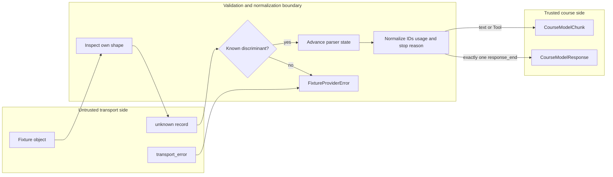

## Outcome

You will build an offline provider adapter whose input is untrusted transport data and whose output is the trusted course model protocol. `FixtureProviderAdapter` accepts a versioned fixture, owns a finite response queue, parses each record from `unknown`, and emits immutable `CourseModelChunk` values plus one terminal `CourseModelResponse`.

The boundary preserves text-delta order and provider Tool-call IDs. It normalizes the transport stop reason `tool_call` to `toolCall`, accepts either camel-case or snake-case usage fields without accepting duplicate aliases, and correlates `response_start` with `response_end`. A response must contain exactly one terminal record. Missing, duplicate, mismatched, malformed, unknown, and post-terminal records fail with stable `FixtureProviderError` codes.

:::note[Course implementation]

This adapter parses Pify's checked-in fixture schema. It is not a Pi provider implementation, does not implement authentication or HTTP, and does not claim compatibility with any vendor's wire format.

:::

## Prerequisites

Complete [checkpoint 04](04-deterministic-model.md). You should understand `unknown` narrowing, discriminated records, own properties, JSON-compatible values, async iterables, `EventStream`, cancellation, response correlation, and why transport input cannot be trusted through a TypeScript assertion.

Inspect these files as one boundary:

| Role | Exact path | What to inspect |
| --- | --- | --- |
| Cumulative source | `course/src/provider-adapter.ts` | Fixture snapshot, record cursor, parser state, normalization, typed failures, and cleanup |
| Checked-in data | `course/fixtures/provider-tool-roundtrip.json` | Two finite responses: a Tool call followed by final text |
| Focused evidence | `course/test/05-provider-adapter.test.ts` | No-network guards, unknown JSON cases, terminal rules, cancellation, queue exhaustion, and iterator ownership |

The adapter needs only a fixture object and an `AbortSignal`. It must keep working when `fetch` and `WebSocket` are replaced by functions that throw.

## Mechanism

The transport and model protocols are separate vocabularies. Transport records use `response_start`, `text_delta`, `tool_call`, `response_end`, and `transport_error`. The normalized side uses `textDelta`, `toolCall`, `CourseAssistantMessage`, `CourseModelUsage`, and the course stop reasons. Conversion is explicit; the parser never casts an unknown Tool call directly into a course type.

Construction validates `schemaVersion: 1` and snapshots the complete response list. Each response owns either a dense array of unknown records or an async record source. Array records are copied before a call starts, including nested plain JSON values, so later fixture mutation cannot rewrite the queued response. Sparse arrays, unsupported prototypes, accessor failures, cycles, and unsafe containers become `PROVIDER_INVALID_FIXTURE` rather than escaping as arbitrary errors.

`stream()` captures only the request ID because the fixture does not need the transcript to select its next response. The producer checks cancellation before shifting the finite queue. A pre-cancelled call increments `callCount` but preserves the pending response for retry. If the queue is empty, both iteration and `result` reject with `PROVIDER_EXHAUSTED`.

Parsing uses a small state object: optional `responseId`, ordered assistant `content`, a set of Tool-call IDs, and optional `terminal`. `response_start` must appear once and declare `role: "assistant"`. Text and Tool records cannot precede it. Every `text_delta` appends one text block and emits one text chunk. Every `tool_call` requires a non-empty unique ID and name plus a non-null JSON object for arguments. The adapter copies that object recursively, preserving dangerous strings such as `"__proto__"` as ordinary own keys without applying prototype mutation.

Usage normalization treats field presence separately from value. A payload may use `inputTokens`/`outputTokens` or `input_tokens`/`output_tokens`. If both aliases for one count are present, even when one value is `undefined`, the event is invalid. Accepted counts are non-negative safe integers and become a frozen `{ inputTokens, outputTokens }` object.

The terminal transition is strict. `response_end.responseId` must match the start ID. `tool_call` becomes `toolCall` and requires at least one Tool call; `stop` forbids Tool calls. The final assistant message receives ID `message-${responseId}` and preserves accumulated content order. End-of-source without `response_end` is `PROVIDER_MISSING_TERMINAL`; a second terminal is `PROVIDER_DUPLICATE_TERMINAL`; any other record after terminal is `PROVIDER_INVALID_TERMINAL`.

An async record source is still untrusted. The adapter claims its iterator once, inspects `next()` safely, races pending steps with cancellation, ignores the irrelevant value of a completed step, and requests cleanup when processing stops early. Unexpected source failures become course-owned `PROVIDER_INVALID_FIXTURE` errors. A forged `FixtureProviderError` thrown by the source is not trusted as an internal error.

## Trace or model



| Transport record | Required state and fields | Normalized effect | Representative failure |
| --- | --- | --- | --- |
| `response_start` | First start, matching assistant role, non-empty `responseId` | Stores response identity | `PROVIDER_DUPLICATE_START` or `PROVIDER_INVALID_EVENT` |
| `text_delta` | Start already seen, string `text` | Appends text block and emits `textDelta` | `PROVIDER_MISSING_START` |
| `tool_call` | Start seen, unique ID/name, JSON object arguments | Appends and emits frozen `toolCall` with the same ID | `PROVIDER_INVALID_EVENT` |
| `response_end` | Matching ID, valid stop reason and usage | Builds and settles one terminal response | `PROVIDER_RESPONSE_MISMATCH` |
| End of records | Terminal already stored | Finishes stream | `PROVIDER_MISSING_TERMINAL` |

The trust boundary does not improve a guessed value. It either proves enough shape and ordering to construct the normalized protocol or returns a typed failure.

## Build it

The cumulative module is `course/src/provider-adapter.ts`. Feed it the checked-in fixture rather than a copied object in prose. This fragment is copied verbatim from the first response in `course/fixtures/provider-tool-roundtrip.json`:

```json
{
  "records": [
    {
      "type": "response_start",
      "responseId": "response-tool-001",
      "role": "assistant"
    },
    {
      "type": "tool_call",
      "id": "call-add-001",
      "name": "add",
      "arguments": {
        "left": 20,
        "right": 22
      }
    },
    {
      "type": "response_end",
      "responseId": "response-tool-001",
      "stopReason": "tool_call",
      "usage": {
        "inputTokens": 12,
        "outputTokens": 8
      }
    }
  ]
}
```

The fragment is one entry inside the fixture's `responses` array. The full file contains a second response with `text_delta: "The sum is 42."`. Two calls consume those entries in order. The first normalized response ends with `stopReason: "toolCall"`; the second ends with `stopReason: "stop"`.

Keep wire names inside the parser. Downstream code should never branch on `response_end` or `input_tokens`; it receives course types only. Conversely, do not rewrite the provider's `call-add-001` into a locally generated ID. The same opaque identity must survive into the assistant Tool-call block and later Tool-result linkage.

## Run the focused test

The focused test is `course/test/05-provider-adapter.test.ts`. Run exactly:

```bash
npm run test:course:checkpoint -- course/test/05-provider-adapter.test.ts
```

The test uses guards to prove that the fixture round trip performs no `fetch` or `WebSocket` call. It checks output order, Tool IDs, usage aliases, immutable snapshots, dangerous JSON keys, inherited fields, unknown and malformed events, error normalization, terminal cardinality, ID/stop-reason rules, finite exhaustion, cancellation, async-source cleanup, and iterator ownership. It does not exercise a remote endpoint, credential flow, HTTP retry, vendor schema, or live token billing.

## Failure experiment

Copy the fixture to a temporary value and remove `response_end` from its first response, leaving the start and Tool call:

```json
{
  "schemaVersion": 1,
  "responses": [
    {
      "records": [
        {
          "type": "response_start",
          "responseId": "response-tool-001",
          "role": "assistant"
        },
        {
          "type": "tool_call",
          "id": "call-add-001",
          "name": "add",
          "arguments": {
            "left": 20,
            "right": 22
          }
        }
      ]
    }
  ]
}
```

Stream that response and await both the chunks and terminal result. The Tool-call chunk can be observed before the source ends, but neither path may report success. Both reject with `PROVIDER_MISSING_TERMINAL`. Restore `response_end` with the matching ID, `stopReason: "tool_call"`, and valid usage; the response then settles as `toolCall`. This experiment shows why receiving useful deltas is not proof of terminal completeness.

## Acceptance criteria

- The focused command selects only `course/test/05-provider-adapter.test.ts` and passes offline with no credentials.
- The adapter accepts only schema version `1` with a dense finite response queue and safe array or async record sources.
- Every transport record begins as `unknown` and is inspected before a course chunk or response is created.
- Text order and opaque Tool-call IDs survive normalization without synthesis or reordering.
- Camel-case or snake-case usage becomes one frozen course usage object; duplicate aliases are rejected.
- Exactly one correlated terminal record is required, and its stop reason agrees with accumulated Tool calls.
- Unknown events, malformed payloads, transport errors, hostile sources, and queue exhaustion produce stable course-owned codes.
- Removing `response_end` rejects iteration and result with `PROVIDER_MISSING_TERMINAL`, even after earlier chunks were emitted.

## Compare with Pi SDK 0.84.3

:::info[Pi SDK 0.84.3]

`@earendil-works/pi-ai` exports `Provider`, `createProvider()`, `AssistantMessageEventStream`, `AssistantMessageEvent`, `ToolCall`, `Usage`, and `StopReason`. `createProvider()` registers production-facing model and API stream functions rather than this course's fixture record grammar.

:::

Pi's assistant stream has lifecycle events for start, text, thinking, Tool-call assembly, done, and error. Its public `AssistantMessage` retains provider/model identity, richer usage and cost data, timestamps, diagnostics, response metadata, more stop reasons, image/thinking content, and deferred responses. A real Pi provider module also owns vendor request conversion, authentication inputs, response parsing, and release-specific error behavior.

The course adapter is a smaller parser exercise. It recognizes five transport record types, has no provider registry, emits complete Tool-call chunks rather than start/delta/end Tool-call events, and records only two token counts. Its `FixtureProviderError` codes and `schemaVersion: 1` fixture are not Pi APIs.

When implementing a Pi provider, use the released `Provider` and assistant event contracts and study the appropriate release-pinned provider module. Carry forward the boundary discipline from this checkpoint: parse unknown input, preserve opaque IDs, normalize once, reject contradictory terminal state, and keep transport details outside the Agent Loop.

## Next checkpoint

[Checkpoint 06](06-tool-contract.md) consumes normalized Tool calls. You will validate arguments before effects, register Tools atomically, propagate cancellation, and convert ordinary Tool failures into bounded linked results.
