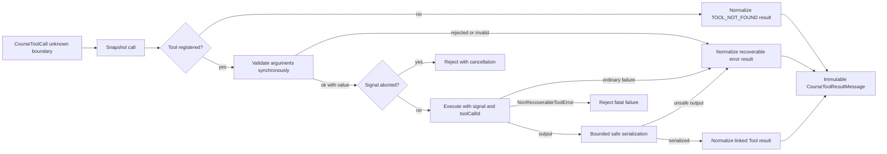

## Outcome

You will build the Tool boundary that turns an untrusted `CourseToolCall` into either one successful Tool-result message, one recoverable error result, or an exceptional cancellation/programmer failure. `defineTool()` snapshots a Tool definition. `ToolRegistry` owns immutable definitions and registers batches atomically. `executeToolCall()` validates arguments before effects, passes cancellation into execution, serializes output within fixed budgets, and preserves call/result linkage.

Invalid arguments never invoke the Tool. Unknown names, rejected arguments, ordinary validator failures, ordinary execution failures, and unsafe output become `isError: true` messages that the next model turn can inspect. Cancellation rejects instead of being encoded as a Tool result. `NonRecoverableToolError` is reserved for an authenticated invariant or programmer failure that must stop the Agent run.

:::note[Course implementation]

`CourseTool`, `ToolRegistry`, `defineTool()`, `executeToolCall()`, the serializer limits, and error codes belong to the workshop. Their validator shape and string-only result content are not Pi SDK interfaces.

:::

## Prerequisites

Complete [checkpoint 05](05-provider-adapter.md). You should understand normalized Tool calls, JSON snapshots, own-property inspection, synchronous validation, promises and thenables, `AbortSignal`, immutable messages, and the call/result rules from checkpoint `03`.

Read the Tool module beside its focused test:

| Role | Exact path | What to inspect |
| --- | --- | --- |
| Cumulative source | `course/src/tool.ts` | Definition snapshots, atomic registry, validation/effect boundary, cancellation, provenance, serialization, and result linkage |
| Focused evidence | `course/test/06-tool-contract.test.ts` | Hostile inputs, rollback, recoverable/fatal failures, abort races, output budgets, immutable results, and parallel calls |

The serializer is part of the security and resource contract. A Tool has already executed when serialization begins, so unsafe or unbounded output must not escape into the transcript.

## Mechanism

A course Tool definition has four own fields: non-empty `name`, non-empty `description`, synchronous `validate`, and `execute`. `defineTool()` reads each field once, wraps the two functions with stable calls, and freezes the resulting definition. Inherited fields are rejected without invoking inherited getters. Later mutation of the caller's object cannot rename the registered Tool or replace its functions.

`ToolRegistry.registerMany()` has two phases. It first snapshots every definition and checks duplicate names inside the pending batch and against existing membership. Only after the full batch passes does it mutate the internal `Map`. A hostile second definition, a sparse array, or any duplicate leaves the registry unchanged. `snapshot()` copies registry membership while reusing the already immutable Tool snapshots; checkpoint `07` uses this to freeze the Tool set for one Agent run.

Execution starts by checking cancellation and snapshotting the Tool call. Invalid call shape raises `ToolContractError` with `INVALID_TOOL_CALL`. An unknown but well-formed Tool does not alter the registry and does not throw. It returns a linked error message with code `TOOL_NOT_FOUND`.

For a known Tool, `validate(arguments)` runs before `execute`. The validator must synchronously return either `{ ok: true, value }` or `{ ok: false, error }`. A false decision creates `TOOL_ARGUMENTS_INVALID`; a thrown or malformed decision creates `TOOL_VALIDATION_FAILED`. Promises and thenables are rejected as asynchronous validators, and their rejection is observed so the test process does not receive an unhandled rejection. This keeps the no-effect decision complete before execution begins.

After successful validation, execution receives the validated value and a frozen `{ signal, toolCallId }` context. Cancellation is checked before validation, after validation, before execution, while awaiting execution, after resolution, and after output inspection. If cancellation wins, its reason propagates and no Tool-result message is appended. The Tool also receives the same signal so it can stop its own work.

Ordinary thrown values and rejected execution promises become `TOOL_EXECUTION_FAILED` results. A constructed `NonRecoverableToolError` is registered in a shared same-realm registry and crosses that recoverable boundary. An unregistered field-only or prototype-only look-alike stays recoverable, including an object with a forged `NonRecoverableToolError` prototype. The registry and `Symbol.for` brand support module reloads and subclasses, but they are discoverable by arbitrary code in the same realm and are not a security boundary. `ToolContractError` instead uses module-local `WeakSet` ownership, so an untrusted Tool's unregistered look-alike is normalized.

Successful output is serialized without calling `toJSON`, getters, or user collection methods. Plain and null-prototype objects are accepted, own enumerable string keys are sorted for deterministic output, accessors are omitted, cycles receive a marker, and unsupported Proxies or exotic prototypes produce `TOOL_OUTPUT_SERIALIZATION_FAILED`. Serializer work is bounded by depth `32`, nodes `128`, collection visits `256`, string/key characters `4096`, and BigInt magnitude `4096` bits.

The final `content` is capped at exactly `4096` Unicode code points, including the single marker `\n[Tool output truncated]`. A successful or recoverable result is frozen and links back with `toolCallId`, `toolName`, and generated message ID `tool-result-${toolCall.id}`. Error content is deterministic JSON containing a stable code and human-readable message.

## Trace or model



| Phase | May run Tool effects? | Success output | Failure behavior |
| --- | ---: | --- | --- |
| Definition snapshot | No | Frozen registered shape | `ToolContractError` before mutation |
| Batch validation | No | Entire batch committed | Atomic rollback on any invalid entry |
| Argument validation | No | Narrowed value | Linked recoverable error result |
| Execution | Yes | Unknown output | Recoverable result, cancellation, or fatal rejection |
| Serialization | Effects already finished | Bounded deterministic string | Linked serialization error result |
| Linkage | No new effect | Frozen `toolResult` | Original call ID/name preserved |

Validation prevents an effect; serialization limits what an effect may return to the transcript. These are separate boundaries and both must hold.

## Build it

The cumulative module is `course/src/tool.ts`. Define Tools with a pure synchronous validator and an asynchronous executor that accepts only the validated shape. Register definitions before the Agent Loop starts, then call `executeToolCall()` with the normalized call and run signal.

This focused fragment is copied verbatim from `course/test/06-tool-contract.test.ts`. It compiles in that file, where `vi`, `ToolRegistry`, `defineTool`, `executeToolCall`, `call`, `expect`, and `test` are already imported or declared:

```ts
test("argument validation runs before effects and preserves validation details", async () => {
  const execute = vi.fn(async () => ({ unreachable: true }));
  const registry = new ToolRegistry([
    defineTool({
      name: "add",
      description: "Add numbers.",
      validate: () => ({ ok: false, error: "left must be a number" }),
      execute,
    }),
  ]);

  await expect(
    executeToolCall(
      registry,
      call("add", { left: "twenty", right: 22 }, "call-invalid-add"),
      new AbortController().signal,
    ),
  ).resolves.toMatchObject({
    toolCallId: "call-invalid-add",
    toolName: "add",
    isError: true,
    content:
      '{"error":{"code":"TOOL_ARGUMENTS_INVALID","message":"left must be a number"}}',
  });
  expect(execute).not.toHaveBeenCalled();
});
```

The result remains part of the transcript even though it is an error. That lets a later model turn correct arguments or explain the failure. A cancelled call differs: it rejects the current operation and produces no result to append.

Do not weaken `validate` into a cast or move side effects into it. A validator that writes a file and then returns `{ ok: false }` satisfies the return shape but violates the checkpoint's effect boundary.

## Run the focused test

The focused test is `course/test/06-tool-contract.test.ts`. Run exactly:

```bash
npm run test:course:checkpoint -- course/test/06-tool-contract.test.ts
```

The file proves one-read immutable definitions, inherited-field rejection, atomic batch registration, duplicate handling, immutable registry ownership, argument validation before effects, deterministic linked results, recoverable and non-recoverable errors, async-validator rejection observation, cancellation at multiple boundaries, bounded safe serialization, output truncation, hostile call normalization, snapshot isolation, and independent parallel executions. It does not claim filesystem sandboxing, process isolation, schema generation, provider-side constrained decoding, or automatic rollback of effects that already ran.

## Failure experiment

Use the focused fragment above unchanged. The call sends `left: "twenty"`, while the spy executor would return an otherwise valid object. Run the focused command and confirm two independent observations: the result contains `TOOL_ARGUMENTS_INVALID` linked to `call-invalid-add`, and `execute` has zero calls.

Then change only the validator to return `{ ok: true, value: { left: 20, right: 22 } }`. The spy is invoked once and the result becomes successful. Restore the rejecting validator before continuing. Do not make the executor throw for this experiment; a throw would test error normalization after an effect started, not validation before effects.

## Acceptance criteria

- The focused command selects only `course/test/06-tool-contract.test.ts` and passes offline.
- A Tool definition is copied from four own fields, frozen, and insulated from later caller mutation.
- `registerMany()` validates the whole batch and all names before one registry mutation.
- Arguments are snapshotted and synchronously validated before `execute` can run.
- Unknown Tools and ordinary validation, execution, or serialization failures become immutable linked error results.
- Cancellation propagates before effects, while awaiting execution, after the Tool promise resolves, and after output inspection; it does not become a misleading Tool result.
- A registered `NonRecoverableToolError` escapes the recoverable Tool boundary; unregistered field-only and prototype-only look-alikes remain recoverable.
- Serialized content never exceeds `4096` Unicode code points including one truncation marker, and traversal obeys the explicit work budgets.
- Invalid arguments sent to the spy Tool produce `TOOL_ARGUMENTS_INVALID` and zero side effects.

## Compare with Pi SDK 0.99.2

:::info[Pi SDK 0.99.2]

`@earendil-works/pi-ai` exports `Tool`, `ToolCall`, `ToolResultMessage`, `Type`, `Static`, `TSchema`, and `validateToolArguments()`. `@earendil-works/pi-agent-core` exports the richer `AgentTool`, `AgentToolResult`, and Tool lifecycle members of `AgentEvent`.

:::

Pi's public `Tool` uses a TypeBox `parameters` schema. At the model boundary, `ToolCall.arguments` is a JSON-compatible `JsonObject`. `AgentTool` adds a UI `label`, optional `prepareArguments` and `outputSchema`, asynchronous `execute(toolCallId, params, signal, onUpdate)`, plus optional `replay` and `executionMode` policies. The `replay` policy says whether an effect with durable intent but an unknown outcome may run again during recovery. When an `AgentTool` declares `outputSchema`, a successful `AgentToolResult` should set `structuredContent` to data that matches that schema. `AgentToolResult` separates model-facing `content` from `details` and optional `structuredContent`/`usage`; it can report `isError` without throwing or set `terminate` to request early termination, which occurs only when every finalized result in the Tool batch requests it. Persisted `ToolResultMessage.details` must have a valid `JsonValue` representation, including readonly arrays; an incompatible generic details type makes `ToolResultMessage<TDetails>` resolve to `never`. The Pi Agent Loop validates arguments before execution, can run Tool calls sequentially or in parallel, emits start/update/end events, and turns ordinary Tool failures into Tool-result records.

The course contract is simpler and stricter in different places. Its validator returns an explicit synchronous decision, its executor receives a context object, results contain one string rather than Pi text/image blocks and details, and its custom serializer/output caps are workshop behavior. `ToolRegistry`, `ToolContractError`, `NonRecoverableToolError`, and `COURSE_TOOL_*` constants are not Pi exports.

Use Pi's released TypeBox schemas and `AgentTool` shape in a Pi application. Preserve the transferable invariants: validate before effects, carry `toolCallId` through every event/result, pass cancellation to execution, treat Tool failures as model-visible data when recovery is possible, and bound anything stored in a long-lived transcript.

The Course implementation is an original, smaller teaching implementation and makes no Pi API-compatibility promise.

## Next checkpoint

[Checkpoint 07](07-agent-loop.md) composes the model and Tool boundaries. You will own the transcript, execute complete Tool rounds, enforce a step budget, and emit one globally ordered event sequence.
