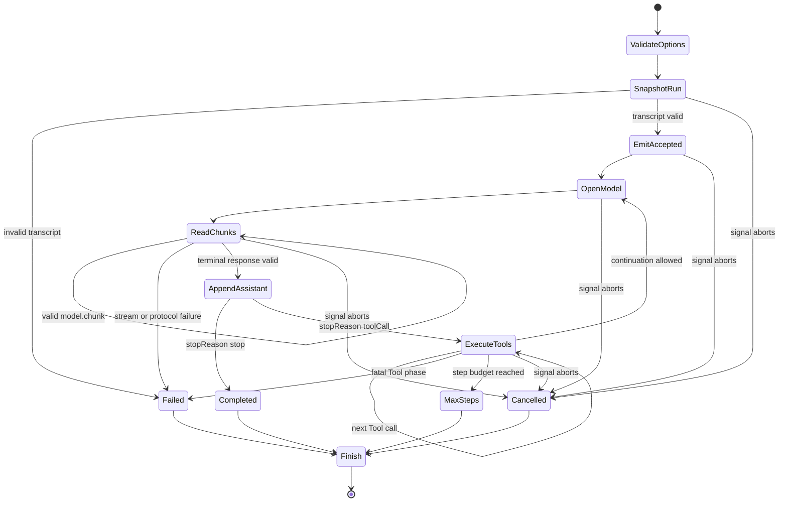

## Outcome

You will compose `CourseModel`, `ToolRegistry`, Message IR, and `EventStream` into an iterative Agent Loop. `runAgentLoop()` owns a transcript snapshot, opens one model request per step, appends a complete assistant response, executes every requested Tool in assistant order, appends linked Tool results, and continues until the model stops or the run reaches another terminal condition.

The returned stream has one total event order across accepted messages, model chunks, Tool starts, Tool finishes, and the final run event. Its `RunResult` is always one of `completed`, `cancelled`, `maxSteps`, or `failed`. A one-step budget may complete a Tool-heavy turn, but it cannot open the continuation model request that would exceed the budget.

:::note[Course implementation]

`runAgentLoop()`, its event strings, result statuses, request IDs, limits, and sequential Tool execution are course contracts. They teach the control flow but are not compatible with Pi's public Agent Loop interfaces.

:::

## Prerequisites

Complete [checkpoint 06](06-tool-contract.md). You should understand normalized transcript linkage, model chunks versus terminal responses, immutable snapshots, recoverable Tool-result messages, cancellation propagation, and why an Agent must validate model output before performing effects.

Read the loop and its focused evidence together:

| Role | Exact path | What to inspect |
| --- | --- | --- |
| Cumulative source | `course/src/agent-loop.ts` | Option validation, transcript ownership, model invocation, Tool rounds, limits, cancellation, event emission, and terminal mapping |
| Focused evidence | `course/test/07-agent-loop.test.ts` | Direct answers, continuation requests, multiple calls, recoverable errors, abort paths, `maxSteps`, protocol failures, event order, and resource ceilings |

The loop uses the model and Tool boundaries already tested in checkpoints `04` through `06`. It does not reopen their transport or serialization internals.

## Mechanism

`runAgentLoop()` validates construction options synchronously. `maxSteps` must be a positive safe integer no greater than `MAX_AGENT_STEPS`, which is `64`. Optional `requestSequenceStart` must keep the requested range within the same ceiling. `model.stream`, `ToolRegistry`, and `AbortSignal` must have the expected boundary shapes. Invalid construction throws before an `EventStream` is returned.

Before asynchronous work, the loop snapshots the Tool registry and starting transcript. The caller can later mutate its input array or register another Tool without changing the active run. Initial messages are capped at `4096`, copied through Message IR constructors, frozen, and validated as a complete transcript. An invalid starting transcript produces one `run.finished` event with a failed `INVALID_TRANSCRIPT` result and never invokes the model.

The loop owns a private mutable transcript derived from that frozen start. It first emits one `message.accepted` event for every starting message. Each event receives the next integer `sequence`; no component owns a separate counter. Model and Tool phases share the same counter, so ordering remains total even when observers receive events through async iteration.

For each step, `requestSnapshot()` freezes the current transcript and creates `request-001`, `request-002`, and so on, offset by `requestSequenceStart` when an owning lifecycle already consumed request numbers. The loop calls `model.stream()` and drains its event channel before awaiting the terminal response. Each valid chunk becomes `model.chunk`. The loop caps one step at `1024` chunks, `65,536` Unicode code points of text, and `1024` assistant blocks.

Before comparison, the loop coalesces adjacent streamed text deltas and adjacent terminal text blocks, using Tool calls as boundaries. The resulting normalized block sequences must agree in content and order; raw text-chunk segmentation may differ. Request IDs must match the active request. Tool arguments must be plain bounded JSON with depth `32`, at most `257` values including the root, `256` object fields plus array slots, and `4096` Unicode code points across keys/string values. These checks occur before a Tool effect. Contradiction or excess becomes a failed `MODEL_PROTOCOL_ERROR` result.

When `stopReason` is `stop`, the assistant message is appended and `textFromAssistant()` becomes `finalText`. The loop emits `run.finished` with a `completed` result. Tool calls are forbidden in a stop response.

When `stopReason` is `toolCall`, the assistant message is appended first. The loop then walks all Tool-call blocks in assistant order. For each call, it emits `tool.started`, awaits `executeToolCall()`, appends the linked Tool-result message, then emits `tool.finished`. Multiple calls execute sequentially in this workshop. A recoverable Tool error is still appended and sent to the next model request; it does not end the run by itself.

After the complete Tool batch, `validateTranscript()` proves that every call has one later matching result. If the current step equals `maxSteps`, the loop emits `run.finished` with status `maxSteps` and does not open another model request. This placement means the budget counts model turns, not individual Tool calls. All calls from the accepted assistant response finish before the step terminal is reported.

Cancellation can arrive during initial emission, model streaming, terminal response waiting, Tool execution, or between phases. The result retains only complete messages. A partial model chunk may already have an event but its unfinished assistant message is not appended. Cancellation during Tool execution retains the complete assistant Tool-call message, emits `tool.started`, and appends no fabricated result. The last observable event is still `run.finished` with a `cancelled` result when terminal bookkeeping remains available.

## Trace or model



| Phase | Transcript ownership | Event effect | Possible terminal |
| --- | --- | --- | --- |
| Start | Frozen copy of caller messages | `message.accepted` per complete input | `failed` or `cancelled` |
| Model stream | No assistant append yet | One `model.chunk` per accepted chunk | `failed` or `cancelled` |
| Model terminal | Append one complete assistant message | No separate assistant event | `completed` for `stop` |
| Tool batch | Append each complete linked result | `tool.started`, then `tool.finished` | `cancelled` or `failed` |
| Step boundary | Frozen transcript available | `run.finished` only when terminal | `maxSteps` or continue |

An event can describe partial progress while the transcript contains only complete protocol messages. Keeping partial events outside the transcript prevents a cancelled delta from becoming durable assistant history.

## Build it

The cumulative module is `course/src/agent-loop.ts`. Compose it with a scripted model and registered Tools; do not duplicate model parsing or Tool validation inside the loop. This complete focused fragment is copied verbatim from `course/test/07-agent-loop.test.ts` and shows the first continuation boundary:

```ts
test("appends one Tool call and its matching result before the second model request", async () => {
  const addCall = call("add", "call-add-001", { left: 20, right: 22 });
  const model = new ScriptedModel([
    scriptedResponse("response-tool-001", [addCall], "toolCall"),
    scriptedResponse(
      "response-tool-002",
      [{ type: "text", text: "The sum is 42." }],
      "stop",
    ),
  ]);

  const { events, result } = await settleRun(
    runAgentLoop({
      messages: [user()],
      model,
      tools: new ToolRegistry([addTool()]),
      maxSteps: 2,
      signal: new AbortController().signal,
    }),
  );

  expect(model.callCount).toBe(2);
  expect(model.requests.map(({ id }) => id)).toEqual([
    "request-001",
    "request-002",
  ]);
  expect(model.requests[1].messages).toEqual([
    user(),
    {
      id: "message-response-tool-001",
      role: "assistant",
      content: [addCall],
    },
    {
      id: "tool-result-call-add-001",
      role: "toolResult",
      toolCallId: "call-add-001",
      toolName: "add",
      content: '{"sum":42}',
      isError: false,
    },
  ]);
  expect(events.map(({ type }) => type)).toEqual([
    "message.accepted",
    "model.chunk",
    "tool.started",
    "tool.finished",
    "model.chunk",
    "run.finished",
  ]);
  expect(events.map(({ sequence }) => sequence)).toEqual([0, 1, 2, 3, 4, 5]);
  expect(result).toMatchObject({
    status: "completed",
    finalText: "The sum is 42.",
  });
});
```

The second request contains the assistant Tool call before its result, and both share `call-add-001`. That transcript ordering is the model's continuation input, not a test-only display.

## Run the focused test

The focused test is `course/test/07-agent-loop.test.ts`. Run exactly:

```bash
npm run test:course:checkpoint -- course/test/07-agent-loop.test.ts
```

The file proves option validation, request numbering, immutable snapshots, direct completion, one and multiple Tool rounds, recoverable Tool continuation, cancellation during model and Tool work, one-step termination, invalid transcript handling, model correlation and normalized chunk/response agreement, typed failures, registry snapshots, exact event sequences, `maxSteps = 64`, and explicit input/chunk/text/block/argument limits. It does not claim concurrent Tool execution, steering/follow-up queues, context transformation, provider retries, persistent session state, or a production scheduling policy.

## Failure experiment

Give the model a first response containing Tool calls plus a second continuation response, then set `maxSteps: 1`. The focused test uses three `echo` calls to prove that the accepted Tool batch finishes while the second response stays unused:

```ts
const model = new ScriptedModel([
  scriptedResponse("response-budget-001", calls, "toolCall"),
  scriptedResponse(
    "response-budget-002",
    [{ type: "text", text: "must not run" }],
    "stop",
  ),
]);

const { events, result } = await settleRun(
  runAgentLoop({
    messages: [user("Echo three values.")],
    model,
    tools: new ToolRegistry([echo]),
    maxSteps: 1,
    signal: new AbortController().signal,
  }),
);

expect(executed).toEqual(["call-echo-001", "call-echo-002", "call-echo-003"]);
expect(model.callCount).toBe(1);
expect(result).toMatchObject({ status: "maxSteps", maxSteps: 1 });
expect(events.at(-1)).toMatchObject({
  type: "run.finished",
  sequence: events.length - 1,
  payload: { result: { status: "maxSteps", maxSteps: 1 } },
});
```

This fragment is verbatim from the body of `course/test/07-agent-loop.test.ts`; its surrounding test declares `calls`, `echo`, `executed`, `expect`, and helpers. Run the focused command. All three calls execute in order, `model.callCount` remains `1`, and the result is `maxSteps`. Change only `maxSteps` to `2`; the queued continuation may run and complete. Restore the one-step value after observing the boundary.

## Acceptance criteria

- The focused command selects only `course/test/07-agent-loop.test.ts` and passes offline.
- Construction rejects invalid options, including `maxSteps` above `64`, before starting model work.
- The run owns snapshots of starting messages and Tool registry membership.
- Each model step receives the complete frozen transcript and a correlated stable request ID.
- Assistant messages precede their Tool results; multiple Tool calls execute and append results in assistant order.
- Recoverable Tool errors remain linked transcript messages and can reach a continuation model turn.
- Event `sequence` values increase by one across message, model, Tool, and terminal events; `run.finished` is last.
- Cancellation retains only complete messages and never fabricates a Tool result for interrupted execution.
- With `maxSteps: 1`, the current Tool batch completes, no continuation request opens, and the terminal result is `maxSteps`.

## Compare with Pi SDK 0.87.1

:::info[Pi SDK 0.87.1]

`@earendil-works/pi-agent-core` exports `Agent`, `agentLoop()`, `agentLoopContinue()`, `runAgentLoop()`, `runAgentLoopContinue()`, `AgentContext`, `AgentLoopConfig`, `AgentTool`, and `AgentEvent`.

:::

Pi's Agent Loop uses `AgentMessage` throughout and converts to LLM-compatible messages through `convertToLlm` at the request boundary. It emits `agent_start`/`agent_end`, `turn_start`/`turn_end`, message lifecycle events, and Tool execution start/update/end events. Its configuration can transform context, intercept Tool calls before and after execution, receive steering and follow-up messages, and choose sequential or parallel Tool execution with per-Tool constraints. The current post-turn control is `finishTurn`: return `{ action: "end" }` to stop after a normal response. Error and aborted responses keep the default hard-exit behavior; do not convert them into a normal stop decision.

The course loop has one transcript vocabulary, five event types, sequential Tool execution, no message queue, no context hook, and a workshop-specific hard ceiling of `64` model steps. Its `request-001` IDs, `RunResult` statuses, `maxSteps` behavior, and resource constants are not Pi public contracts.

Use Pi's exports directly for production integration. The workshop supplies a smaller control-flow model for reasoning about transcript ownership, complete Tool round trips, terminal settlement, cancellation, and total observer order. When behavior differs, Pi SDK `0.87.1` is authoritative.

## Next checkpoint

[Checkpoint 08](08-coding-tools.md) gives the loop bounded coding capabilities. You will add filesystem and process Tools that stay inside a temporary workspace and expose explicit output, argument, timeout, and cancellation limits.
