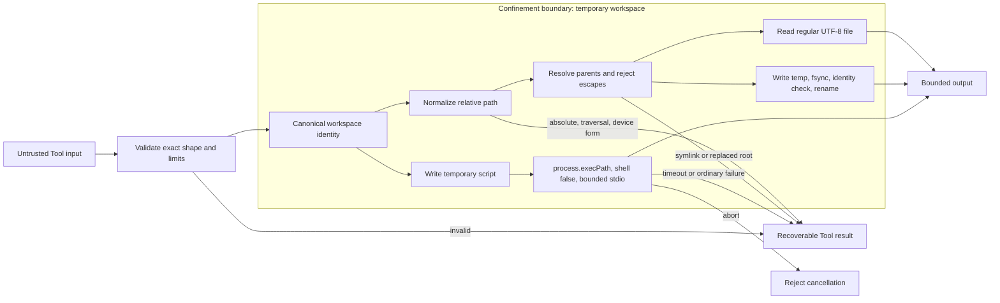

## Outcome

You will give the Agent three bounded coding Tools: `read_file`, `write_file`, and `node_process`. File paths must resolve inside a canonical workspace. Reads accept regular UTF-8 files only. Writes replace one target atomically through an identity-checked temporary file. Process execution uses the current Node.js executable, an argument array, a fixed working directory, independent output limits, a timeout, cancellation, and cleanup.

These controls narrow accidental and adversarial effects enough for a deterministic workshop. They do not isolate JavaScript from the operating system. Code passed to `node_process` runs with the permissions of the current process and can still use Node.js APIs.

:::note[Course implementation]

`createReadTool()`, `createWriteTool()`, `createNodeProcessTool()`, their names, error strings, and fixed limits are Course implementation contracts. The workshop deliberately exposes JavaScript source rather than a general shell command.

:::

## Prerequisites

Complete [checkpoint 07](07-agent-loop.md). You should understand `ToolRegistry`, validation before effects, linked Tool results, `AbortSignal`, sequential Tool execution, and the difference between a recoverable Tool error and cancellation.

Read the cumulative module beside its focused evidence:

| Role | Exact path | What to inspect |
| --- | --- | --- |
| Cumulative source | `course/src/coding-tools.ts` | Workspace capture, path normalization, symlink checks, atomic replacement, process launch, limits, cancellation, and cleanup |
| Focused evidence | `course/test/08-coding-tools.test.ts` | Traversal families, workspace replacement, symlink races, exact byte caps, concurrent writes, process output, timeout, abort, and temporary-file cleanup |

The focused test creates a fresh temporary workspace. It performs no provider call, reads no credential, and uses `process.execPath` instead of assuming that `node` is available through `PATH`.

## Mechanism

Each factory canonicalizes `root` once with `realpathSync.native()`, verifies that it is a directory, and records its device/inode identity. Every later operation rechecks that the original entry still resolves to the same canonical directory and identity. Deleting and recreating the path, or repointing a workspace symlink, fails with `WORKSPACE_ROOT_CHANGED`; the Tool does not silently adopt the replacement.

Path validation rejects empty paths, NUL, absolute POSIX and Windows paths, drive-relative forms, UNC/device prefixes, `..`, colon-bearing segments, Windows device names, and trailing dots or spaces. It removes empty and `.` segments, then joins only accepted portable segments. Lexical normalization is not the final boundary: reads resolve both parent and target canonically, while writes walk and re-resolve every parent directory. A symlink or junction that escapes the root therefore fails even if the original string looked relative.

`read_file` opens a regular file and compares the opened handle's identity with the current canonical target before returning content. It reads at most `65,536 + 1` bytes so that an oversized file is detected, decodes with fatal UTF-8 validation, and returns `{ path, content, bytes }`. Cancellation is checked before and during the read.

`write_file` validates UTF-8 size before touching the filesystem. For each canonical target, an in-process lock serializes concurrent writes. The Tool creates a sibling with exclusive `wx` mode and permissions `0600`, writes and `fsync`s it, checks that the pathname still names the opened file, rechecks the workspace, parent, target, and cancellation, then renames the temporary over the destination. If rename itself fails, the old destination remains intact and cleanup removes only the temporary identity owned by this operation. After a successful rename, an unexpected installed identity is detected and removed when it is still the inspected identity; the course does not promise restoration of the previous destination at that point. These checks reduce races within the course threat model, but they do not turn the workspace into a hardened multi-tenant sandbox.

`node_process` accepts JavaScript `source` and a string `arguments` array. It writes a temporary CommonJS file inside the workspace, launches `process.execPath` with `shell: false`, sets `cwd` to the canonical root, hides the Windows console, and passes arguments after `--`. The source is capped at `32,768` UTF-8 bytes. There may be at most `32` arguments, each at most `2,048` bytes and together at most `8,192` bytes; Windows command-line quoting is also checked against a conservative `30,000` UTF-16-unit ceiling.

The child gets `500 ms`. `stdout` and `stderr` retain at most `32,768` bytes each and report independent truncation flags without breaking a UTF-8 character. Cancellation or timeout kills the child/process group where supported, destroys its output streams, and rejects. Normal nonzero exit is data: the result carries `exitCode`, `signal`, both outputs, and truncation flags. A timeout becomes the recoverable Tool-layer error `NODE_PROCESS_TIMEOUT`. The temporary script is removed in `finally`.

| Boundary | Exact course limit | Settlement when exceeded |
| --- | --- | --- |
| File read/write | `65,536` UTF-8 bytes | `FILE_TOO_LARGE` |
| JavaScript source | `32,768` UTF-8 bytes | `NODE_SOURCE_TOO_LARGE` |
| Process arguments | `32`; `2,048` bytes each; `8,192` bytes total | Stable validation error |
| `stdout` / `stderr` | `32,768` bytes independently | Truncated text plus boolean flag |
| Process wall time | `500 ms` | Child terminated; `NODE_PROCESS_TIMEOUT` |

## Trace or model



The string check blocks known portable escape syntax; canonical resolution and identity checks cover filesystem indirection and replacement. Atomic rename protects the destination from a partial write. It does not grant confidentiality against another process with permission to inspect the workspace.

## Build it

The cumulative module is `course/src/coding-tools.ts`. Register its factories through the Tool layer from checkpoint `06`. This excerpt is verbatim from the focused process test and proves the execution context rather than assuming it:

```ts
const tool = createNodeProcessTool(workspace);
const source = [
  "process.stdout.write(JSON.stringify({",
  "  execPath: process.execPath,",
  "  args: process.argv.slice(1),",
  "  cwd: process.cwd(),",
  "}));",
  "process.stderr.write('diagnostic');",
].join("\n");
const output = await tool.execute(
  validatedInput(tool, { source, arguments: ["alpha", "two words"] }),
  executionContext(),
);

expect(output.exitCode).toBe(0);
expect(output.signal).toBeNull();
expect(output.stderr).toBe("diagnostic");
expect(output.timedOut).toBe(false);
expect(output.stdoutTruncated).toBe(false);
expect(output.stderrTruncated).toBe(false);
expect(JSON.parse(output.stdout)).toEqual({
  execPath: process.execPath,
  args: ["alpha", "two words"],
  cwd: await realpath(workspace),
});
```

`validatedInput()` and `executionContext()` are focused-test helpers. The production path still calls the Tool through `executeToolCall()`, which validates input, propagates cancellation, and serializes the returned record.

## Run the focused test

The focused test is `course/test/08-coding-tools.test.ts`. Run exactly:

```bash
npm run test:course:checkpoint -- course/test/08-coding-tools.test.ts
```

The file covers accepted UTF-8 reads/writes, path normalization, POSIX/Windows traversal forms, ADS/device names, symlink and junction escapes, root replacement, file and source limits, atomic rename failure and destination preservation, target write serialization, temporary-path substitution, exact argument boundaries, UTF-8-safe output caps, nonzero exit, timeout, cancellation, process cleanup, and hostile input shapes. It is an offline filesystem/process contract, not a penetration test of an OS sandbox.

## Failure experiment

Create a managed temporary parent and its `workspace` child, then attempt to write `../outside.txt`. The resolved outside target remains inside that managed parent, and the `finally` block removes only the exact directory created by this experiment:

```ts
import { access, mkdir, mkdtemp, rm } from "node:fs/promises";
import { tmpdir } from "node:os";
import { join } from "node:path";

import { expect, test } from "vitest";

import {
  ToolRegistry,
  createWriteTool,
  executeToolCall,
  type CourseToolCall,
} from "../src/index";

function call(
  name: string,
  argumentsValue: CourseToolCall["arguments"],
): CourseToolCall {
  return {
    type: "toolCall",
    id: `call-${name}-failure`,
    name,
    arguments: argumentsValue,
  };
}

function parseToolContent(content: string): unknown {
  return JSON.parse(content) as unknown;
}

test("rejects traversal before creating an outside file", async () => {
  const parent = await mkdtemp(join(tmpdir(), "pify-course-08-failure-"));
  const workspace = join(parent, "workspace");
  const outsidePath = join(parent, "outside.txt");

  try {
    await mkdir(workspace);
    const registry = new ToolRegistry([createWriteTool(workspace)]);
    const result = await executeToolCall(
      registry,
      call("write_file", {
        path: "../outside.txt",
        content: "must stay inside",
      }),
      new AbortController().signal,
    );

    expect(result.isError).toBe(true);
    expect(parseToolContent(result.content)).toMatchObject({
      error: {
        code: "TOOL_ARGUMENTS_INVALID",
        message: "INVALID_RELATIVE_PATH",
      },
    });
    await expect(access(outsidePath)).rejects.toMatchObject({ code: "ENOENT" });
  } finally {
    await rm(parent, { recursive: true, force: true });
  }
});
```

Save this runnable Vitest file beside `course/test/08-coding-tools.test.ts`, so `../src/index` resolves to the cumulative module. It never targets a shared `%TEMP%/outside.txt` or `/tmp/outside.txt`. If the managed `outsidePath` exists before cleanup, path rejection occurred too late and the checkpoint fails even if the Tool returned an error.

## Acceptance criteria

- The focused command selects only `course/test/08-coding-tools.test.ts` and passes offline.
- Every Tool captures a canonical directory identity and rejects a replaced or repointed workspace.
- Relative-path validation rejects traversal, absolute, drive, UNC, device, ADS, reserved-name, and ambiguous trailing-character forms before effects.
- Read/write resolution rejects symlink and junction escapes; reads require regular, valid UTF-8 files.
- Writes serialize one target, `fsync` an owned temporary, verify its identity, rename atomically, and preserve the old destination when rename itself fails; they do not claim post-rename rollback.
- File, source, argument, output, and time limits equal the documented constants.
- Process launch uses `process.execPath`, `shell: false`, canonical `cwd`, bounded independent outputs, and a temporary script that is always cleaned.
- Cancellation and timeout terminate active process work and settle without leaving `.pify-node-*` or `.pify-tmp-*` artifacts.
- The traversal failure experiment leaves no `outside.txt` beyond the temporary root.

## Compare with Pi SDK 0.85.0

:::info[Pi SDK 0.85.0]

`@earendil-works/pi-coding-agent` publicly exports `createCodingTools()`, `createReadOnlyTools()`, `createReadTool()`, `createWriteTool()`, `createBashTool()`, `createPowerShellTool()`, `createEditTool()`, `createGrepTool()`, `createFindTool()`, and `createLsTool()` for a caller-supplied `cwd`.

:::

At the pinned release, Pi's `createCodingTools(cwd)` composes read, Bash, edit, and write Tools; `createReadOnlyTools(cwd)` composes read, grep, find, and list Tools. The public tool package also has option and operation types, truncation helpers, mutation queuing, and platform-specific process Tools.

The course exposes only three Tools and intentionally replaces a shell with bounded JavaScript through `process.execPath`. Its fixed byte values, `read_file`/`write_file`/`node_process` names, portable-path grammar, error codes, and temporary-file algorithm are not Pi API promises. Use Pi's public factories and options for Pi integration, and apply the host's trust and isolation controls appropriate to the code being executed.

## Next checkpoint

[Checkpoint 09](09-stateful-agent.md) wraps the stateless loop in a stateful owner. You will serialize prompts, expose immutable history, manage subscribers, and schedule steering and follow-up messages at explicit safe points.
