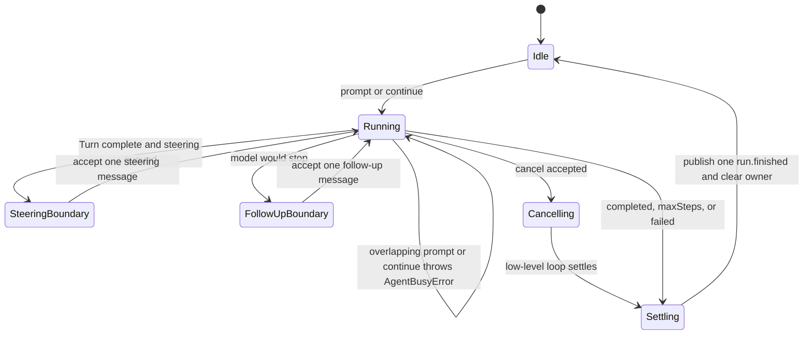

## Outcome

You will add `Agent`, a stateful owner around `runAgentLoop()`. It owns the transcript across calls, rejects overlapping prompt ownership, exposes copied deeply immutable message snapshots, publishes events to subscribers, and returns to idle after completion, cancellation, or failure. Steering enters at a completed Turn boundary; follow-up runs only after the model would otherwise stop.

One logical run may invoke several one-step low-level loops. The wrapper renumbers their events into one total sequence and emits exactly one `run.finished`. Its queues retain explicit work after a failed or cancelled run, so the caller can decide whether to resume with `continue()`.

:::note[Course implementation]

The course `Agent`, `AgentBusyError`, message IDs, queue limits, subscriber diagnostics, and `EventStream` return values are Course implementation APIs. They are smaller and have different settlement semantics from Pi's public `Agent`.

:::

## Prerequisites

Complete [checkpoint 08](08-coding-tools.md). You should understand the stateless Agent Loop, one complete Tool round, terminal `RunResult` variants, `AbortSignal`, Tool registry snapshots, and why cancellation must not fabricate transcript messages.

Read both files before changing lifecycle behavior:

| Role | Exact path | What to inspect |
| --- | --- | --- |
| Cumulative source | `course/src/agent.ts` | Busy guard, owned transcript, queue reservation, safe points, event forwarding, cancellation races, subscribers, and recovery |
| Focused evidence | `course/test/09-stateful-agent.test.ts` | Prompt ownership, concurrent rejection, immutable getters, queues, cancellation, listener isolation, recovery, and capacity ceilings |

The model and Tool registry are snapshotted during Agent construction. Registering a Tool later or replacing a model method cannot alter that Agent's configuration.

## Mechanism

`prompt()` first applies the busy guard. It reserves enough transcript capacity, creates one immutable user message, appends it to Agent-owned state, and starts a logical run. `continue()` uses the existing tail: queued steering has priority; an assistant tail otherwise needs follow-up work. While a run owns the transcript, another `prompt()` or `continue()` throws `AgentBusyError` synchronously. Callers use `steer()` or `followUp()` instead of racing a second owner.

The public `messages` getter returns a new frozen array each time. Every nested message and assistant block was already reconstructed and frozen. A caller can retain, compare, or share a snapshot, but cannot push into it or mutate a Tool call. The Agent also freezes its model method and a `ToolRegistry.snapshot()` at construction.

Internally, the wrapper calls `runAgentLoop()` with `maxSteps: 1`. A steering item queued while idle may join a new prompt at the initial safe boundary. During a run, steering waits until a complete Turn settles and the wrapper has adopted only the validated returned transcript. If the low-level result is `maxSteps`, the current assistant Tool calls and results are already complete; this boundary is safe for exactly one steering item. Steering also runs before final completion when queued. Follow-up is considered later, only after a `completed` response would otherwise end the logical run. Each queued item remains a separate user message.

The wrapper preserves one logical request counter and one event counter across subloops. It suppresses inner `message.accepted` and `run.finished`, publishes its own accepted queue messages, forwards model/Tool events with rewritten `sequence`, then publishes one terminal event. `maxSteps` caps all subloops together, not each subloop independently.

`subscribe()` stores listeners in insertion order and returns an idempotent unsubscribe function. Publishing snapshots the current listener list for that event. Synchronous failures and rejected listener Promises become immutable `subscriberErrors`; they do not block later listeners or change Agent settlement. Listener Promises are observed but not awaited, so a subscriber that awaits the active run cannot deadlock it. Unsubscribing prevents future event delivery and releases the stored listener reference.

`cancel(reason)` returns `false` when idle, already aborted, or after the terminal outcome has been selected. An accepted cancellation aborts the active low-level loop. It wins a near-simultaneous completed-result adoption race and produces one `cancelled` result. Queued steering/follow-up remains explicit and can be resumed later. In `finally`, the owner clears `#activeRun`; ordinary internal failures are normalized to `AGENT_STATE_FAILED`, capacity failures to `AGENT_MESSAGE_LIMIT`, and the Agent becomes usable again.

Queue work is bounded at `256` messages and the owned transcript at `4096`. Reservation accounts for queued user/assistant pairs and, during an unknown active Tool Turn, the worst-case output allowed by the low-level chunk ceiling. Impossible work is rejected when enqueued rather than accepted and stranded at the cap.

## Trace or model



| Action while running | Accepted? | When it affects the transcript |
| --- | --- | --- |
| `prompt()` / `continue()` | No; throws `AgentBusyError` | Never |
| `steer()` | Yes if capacity remains | Next completed Turn boundary |
| `followUp()` | Yes if capacity remains | After a response would otherwise complete |
| `cancel(reason)` | Once | Selects cancellation before final adoption |
| `subscribe()` / unsubscribe | Yes | Listener set for subsequent publications |

## Build it

The cumulative module is `course/src/agent.ts`. This verbatim focused-test fragment shows the normal ownership transition and single terminal event:

```ts
const model = new ScriptedModel([
  scriptedResponse("response-001", [{ type: "text", text: "Hello." }]),
]);
const agent = new Agent({ model });

const stream = agent.prompt("Hi");
expect(agent.isRunning).toBe(true);

const { events, result } = await settle(stream);
expect(result).toMatchObject({ status: "completed", finalText: "Hello." });
expect(agent.isRunning).toBe(false);
expect(agent.messages.map((message) => message.role)).toEqual([
  "user",
  "assistant",
]);
expect(events.map((event) => event.type)).toEqual([
  "message.accepted",
  "model.chunk",
  "run.finished",
]);
expect(events.map((event) => event.sequence)).toEqual([0, 1, 2]);
expect(events.filter((event) => event.type === "run.finished")).toHaveLength(
  1,
);
```

`settle()` drains the event iterator and awaits the same stream's result. Production code should also consume or deliberately observe both channels so that event handling and terminal state remain explicit.

## Run the focused test

The focused test is `course/test/09-stateful-agent.test.ts`. Run exactly:

```bash
npm run test:course:checkpoint -- course/test/09-stateful-agent.test.ts
```

The file proves lifecycle ownership, the busy guard, deep snapshot immutability, cancellation settlement, steering and follow-up ordering, subscriber isolation/unsubscribe, nonblocking Promise listeners, cancellation races, reentrant steering, failure recovery, construction snapshots, total `maxSteps`, and queue/transcript reservation limits. It exercises the wrapper through its public methods rather than mutating private state.

## Failure experiment

Hold the first model request open, then issue two concurrent prompts. The second call must fail synchronously while the first retains ownership. This fragment is verbatim from the focused test:

```ts
const entered = deferred<void>();
const release = deferred<void>();
const model = new ScriptedModel([
  async function* (request) {
    entered.resolve();
    await release.promise;
    yield { type: "textDelta", requestId: request.id, delta: "done" };
    return responseFor(
      request,
      "response-busy",
      [{ type: "text", text: "done" }],
      "stop",
    );
  },
]);
const agent = new Agent({ model });
const active = agent.prompt("first");
await entered.promise;

expect(() => agent.prompt("second")).toThrow(AgentBusyError);
expect(() => agent.continue()).toThrowError("Agent is already running");

release.resolve();
await settle(active);
expect(model.callCount).toBe(1);
```

If the model receives two requests, two callers owned one transcript concurrently. Do not “fix” the experiment by queuing the second `prompt()` automatically; the course requires callers to choose `steer()` or `followUp()` and therefore make timing intent visible.

## Acceptance criteria

- The focused command selects only `course/test/09-stateful-agent.test.ts` and passes offline.
- `prompt()` and `continue()` reject a second active owner with stable `AgentBusyError` behavior.
- `messages` returns a fresh frozen array whose nested transcript values are immutable.
- Steering enters only after a complete Turn; follow-up enters only after an otherwise terminal response; neither merges user messages.
- The Agent emits one total event sequence and exactly one `run.finished` per logical run.
- Subscribers run in registration order, unsubscribe cleanly, and cannot block settlement or corrupt Agent state when they fail.
- Accepted cancellation wins terminal adoption, settles once, and retains explicitly queued work.
- Completion, cancellation, capacity failure, and internal failure all clear the active owner so a valid later `continue()` can recover.
- Queue and transcript reservations reject impossible work before exceeding `256` queued or `4096` owned messages.

## Compare with Pi SDK 0.99.2

:::info[Pi SDK 0.99.2]

`@earendil-works/pi-agent-core` exports `Agent`, `AgentOptions`, `AgentState`, `AgentEvent`, and queue-related types. Its `Agent` exposes `prompt()`, `continue()`, `steer()`, `followUp()`, `subscribe()`, `abort()`, `waitForIdle()`, queue controls, and `reset()`.

:::

Pi's public Agent also rejects overlapping processing and gives callers steering/follow-up queues. At the pinned release, queue drain modes are configurable, `prompt()` resolves a `Promise<void>`, `abort()` has no course result string, and subscriber Promises are awaited in registration order as part of run settlement. Post-turn policy uses `finishTurn`: `{ action: "end" }` ends a normal response, while `undefined` preserves scheduling and leaves error or aborted responses on the default hard-exit path. Pi also exposes state, Tool execution policy, retry configuration, and its richer event lifecycle.

The course returns `EventStream<AgentEvent, RunResult>`, observes but does not await subscriber Promises, accepts text-only queue helpers, fixes one-at-a-time scheduling, and applies workshop-specific capacity rules. Treat those differences as deliberate teaching constraints, not compatibility shims. For Pi code, import and follow the Pi SDK `0.99.2` contracts directly.

The Course implementation is an original, smaller teaching implementation and makes no Pi API-compatibility promise.

## Next checkpoint

[Checkpoint 10](10-session-tree.md) persists Agent messages as a parent-linked JSONL tree. You will move the active leaf to branch without rewriting logical history and reload safely after a truly incomplete final record.
