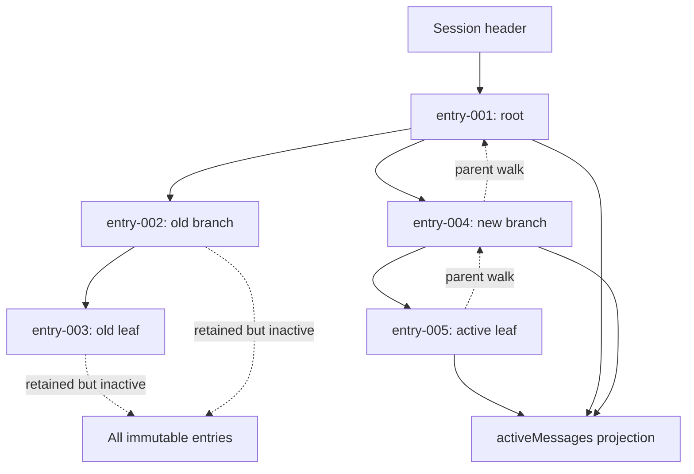

## Outcome

You will persist course messages as a versioned Session Tree. One JSONL header identifies the session. Every later record is an immutable entry with its own `id`, `parentId`, timestamp, and Message IR value. `SessionTree` tracks an active leaf and projects only the root-to-leaf path into `activeMessages`; changing branches never deletes the inactive descendants.

The logical history is append-only: a new action creates a new entry and no API edits or removes an old entry. For stronger deterministic recovery in this workshop, `SessionStore` persists each prospective record set as an atomically replaced file generation rather than issuing an unguarded append syscall. Loading tolerates only a syntactically incomplete final JSON object. Complete or middle corruption fails closed: the loader rejects the session instead of guessing or skipping data.

:::note[Course implementation]

`SessionStore`, `SessionTree`, format version `1`, error codes, file algorithm, exact limits, and the rule that the newest stored entry becomes the initial active leaf are Course implementation contracts. They are not Pi session-file compatibility.

:::

## Prerequisites

Complete [checkpoint 09](09-stateful-agent.md). You should understand immutable Message IR values, Tool call/result linkage, Agent-owned transcript snapshots, serialized state changes, and failure recovery without silently discarding queued work.

Inspect the storage code and its failure evidence together:

| Role | Exact path | What to inspect |
| --- | --- | --- |
| Cumulative source | `course/src/session.ts` | Versioned records, parsing, parent/link validation, path identity, atomic generations, rollback, tree projection, and operation queues |
| Focused evidence | `course/test/10-session-tree.test.ts` | Branching, reload, incomplete tails, corruption, hostile data, concurrent stores, rollback, replacement detection, and bounds |

The tests create one session file inside a fresh temporary directory. Deterministic clocks and ID factories make record order and parent selection directly assertable.

## Mechanism

`SessionStore.create()` writes exactly one frozen header with `type: "session"`, `version: 1`, a non-empty session ID, and creation timestamp. It uses exclusive creation, writes all bytes, `fsync`s the file, verifies the opened file identity, and syncs the parent directory. `load()` rejects non-regular, replaced, oversized, or invalid UTF-8 files before exposing a store.

One entry has `type: "entry"`, `version: 1`, a unique non-empty `id`, a `parentId` that is `null` or names an earlier entry, a timestamp, and a deeply snapshotted `CourseMessage`. Reload reconstructs each record without invoking accessors. It rejects extra/missing fields, duplicate IDs, forward/missing parents, unsupported versions, invalid Message IR, and Tool results whose matching call is absent from that branch's ancestor chain.

JSONL gives one bounded JSON object per line. A line may contain at most `65,536` bytes; the file at most `4,194,304` bytes; and a session at most `4,096` entries. CRLF and a valid final line without `\n` are accepted. Invalid UTF-8 is always fatal. A final unterminated string/object prefix such as `{"type":"entry","id":"cut` is recognized as incomplete and ignored during that load. Arbitrary text, an impossible JSON prefix, valid JSON with trailing garbage, or malformed JSON on a newline is corruption rather than a crash tail.

Recovery initially changes only the parsed view: the incomplete bytes remain on disk. The next `append()` serializes the accepted header/entries plus the new entry into a canonical newline-terminated generation, removing the abandoned tail. A corrupt middle line cannot be skipped because every later `parentId`, ID, and Tool linkage would otherwise be interpreted against a fabricated history.

`append(parentId, message)` snapshots its input before entering the queue. Under both the store-local queue and a canonical-path lock, it rechecks root/file identity, validates capacity and the parent, generates the record, validates branch-local Tool linkage, and prepares the full prospective entry array. Only after durable commit succeeds does it update the in-memory array and ID map. A failed append therefore leaves both views on the old generation and later queued work may retry.

Atomic commit writes an exclusive sibling temporary and `fsync`s it. It verifies the temporary identity, hard-links the current generation to a recovery marker, rechecks storage identity, renames the temporary into place, verifies the installed generation, syncs the directory, and removes the marker. Cleanup targets only identities owned by the operation. If installation or finalization fails, rollback restores the prior generation; if rollback itself cannot be proved, the typed `SESSION_ROLLBACK_FAILED` state retains a recovery marker and poisons further use instead of guessing.

`SessionTree` starts at the last stored entry. `moveTo(id)` changes only the in-memory active leaf after validating membership; `moveTo(null)` selects a new root position. `append(message)` waits behind earlier tree operations and uses the current leaf as `parentId`, then advances the leaf only after store commit. `activeEntries` follows parents from leaf to root, reverses the collected path, and returns a frozen projection. Inactive descendants remain in `entries` and on disk.

## Trace or model



| Stored fact | Changes on `moveTo()`? | Included in active projection? |
| --- | --- | --- |
| Header and entry lines | No | Header is metadata, not a message |
| Inactive descendants | No | No |
| Selected entry and its ancestors | No | Yes, root to leaf |
| Active leaf pointer | Yes, in memory | Selects the projection |
| Next appended entry | New durable child | Yes after successful commit |

## Build it

The cumulative module is `course/src/session.ts`. This verbatim focused-test fragment creates a branch while proving that the abandoned leaf is retained:

```ts
const store = await SessionStore.create(sessionPath, deterministicOptions());
const tree = new SessionTree(store);
const root = await tree.append(user("message-001", "root"));
const oldLeaf = await tree.append(user("message-002", "old branch"));

await tree.moveTo(root.id);
const newLeaf = await tree.append(user("message-003", "new branch"));

expect(newLeaf.parentId).toBe(root.id);
expect(tree.activeLeafId).toBe(newLeaf.id);
expect(tree.activeMessages.map((message) => message.content)).toEqual([
  "root",
  "new branch",
]);
expect(tree.entries.map((entry) => entry.id)).toEqual([
  root.id,
  oldLeaf.id,
  newLeaf.id,
]);
expect(tree.entries.find((entry) => entry.id === oldLeaf.id)).toBe(oldLeaf);
```

The branch is represented entirely by parent links and one active pointer. There is no copying of the common prefix and no deletion of `oldLeaf`.

## Run the focused test

The focused test is `course/test/10-session-tree.test.ts`. Run exactly:

```bash
npm run test:course:checkpoint -- course/test/10-session-tree.test.ts
```

The file covers header creation, deterministic parent order, branches, in-memory leaf movement, CRLF/no-final-newline input, exact truncated-tail recovery, middle/final corruption, invalid UTF-8, record and message validation, Tool linkage, hostile options, serialization across stores, atomic flush, rollback stages, recovery markers, concurrent tree operations, root/file replacement, typed errors, and all line/file/record ceilings.

## Failure experiment

Compare two damaged files. First, truncate the final record inside an unfinished JSON string. Loading may keep prior records, and the next append canonicalizes the file. Then place corruption on a complete middle line; loading must reject the whole session:

```ts
await writeFile(
  sessionPath,
  `${headerLine()}\n${entryLine()}\n{"type":"entry","id":"cut`,
  "utf8",
);
const recovered = await SessionStore.load(sessionPath, deterministicOptions());
expect(recovered.entries.map((entry) => entry.id)).toEqual(["entry-001"]);

await writeFile(
  sessionPath,
  `${headerLine()}\nnot-json\n${entryLine()}\n`,
  "utf8",
);
await expectSessionError(
  SessionStore.load(sessionPath, deterministicOptions()),
  "SESSION_INVALID_JSON",
);
```

Both fragments use the exact helpers and payloads from `course/test/10-session-tree.test.ts`. Do not broaden recovery to every unterminated tail: `not-json`, syntactically impossible prefixes, invalid UTF-8, and complete garbage remain fatal even in the last physical line.

## Acceptance criteria

- The focused command selects only `course/test/10-session-tree.test.ts` and passes offline.
- A versioned header precedes one bounded JSON object per accepted entry.
- Entry IDs are unique; each non-null parent names an earlier record; messages and branch-local Tool linkage validate before adoption.
- `moveTo()` changes no file bytes, while the next successful append becomes a child of the selected leaf.
- `activeEntries` and `activeMessages` are frozen root-to-leaf projections; inactive branches remain stored.
- Only a syntactically incomplete final JSON object is recoverable; middle corruption, complete garbage, invalid prefixes, and invalid UTF-8 fail closed.
- The next append after a recoverable tail writes a canonical newline-terminated generation.
- Append/flush commit with identity-checked temporary, recovery marker, rename, directory sync, cleanup, and rollback; memory changes only after commit.
- Limits remain `65,536` bytes per line, `4,194,304` bytes per file, and `4,096` entries.

## Compare with Pi SDK 0.99.2

:::info[Pi SDK 0.99.2]

`@earendil-works/pi-coding-agent` exports `SessionManager`, `SessionEntry`, `SessionHeader`, `SessionTreeNode`, `buildContextEntries()`, `buildSessionContext()`, and `CURRENT_SESSION_VERSION`.

:::

Pi's pinned `SessionManager` is the canonical source for future provider context. It documents append-only JSONL trees with `id`/`parentId`, a current leaf, `getBranch()`, `getTree()`, `branch()`, and compaction-aware `buildSessionProjection()`. Its release format is version `3` and supports more entry kinds, including model/thinking changes, compaction, branch summaries, custom entries, labels, session information, and `context_edit`.

Changing `session.agent.state.messages` does not replace that canonical projection. Use session APIs for navigation, append through `session.sessionManager`, then call `session.refreshContext()` when an external append must refresh the public finalized transcript. `appendContextEdit(targetId, null)` appends an omission without rewriting the target; a non-null replacement has the shape `{ content }`. Raw transcript and UI history remain append-only.

Pi 0.99.2 also publishes the separate, experimental `@earendil-works/pi-durable` harness. Its commit-before-observe storage model and restartable task runtime are not `SessionManager` semantics, and this Course tree implements neither API.

The course format version is `1`, stores only the header plus Message IR entries, uses a workshop-specific atomic whole-generation commit and recovery-marker protocol, and chooses the newest record as the loaded active leaf. Its JSONL file is not accepted as a Pi session, and Pi session files are not accepted by this loader. Use Pi's `SessionManager` and migration functions for real Pi sessions.

The Course implementation is an original, smaller teaching implementation and makes no Pi API-compatibility promise.

## Next checkpoint

[Checkpoint 11](11-context-compaction.md) derives a bounded active context from complete message groups. You will summarize an old prefix without splitting an assistant Tool call from any of its results.
