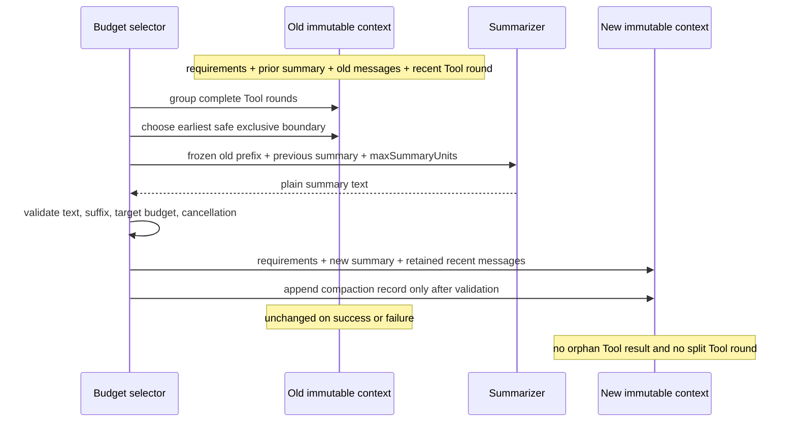

## Outcome

You will turn a valid transcript into an immutable `ActiveContext` with separate requirements, an optional prior summary, recent messages, and an append-only compaction record list. When its deterministic unit budget exceeds `maxUnits`, `compactContext()` selects a complete old prefix, asks a supplied summarizer for plain text, validates the prospective context, and returns a new state.

No compaction boundary may split an assistant Tool call from any matching Tool result. A failed summary, missing safe boundary, cancellation, malformed transcript, or over-budget result does not mutate the input or prior context and appends no compaction record.

:::note[Course implementation]

`ActiveContext`, the deterministic unit formula, `groupToolRounds()`, `selectCompactionBoundary()`, `compactContext()`, limits, and error codes are Course implementation contracts. Their units are not provider tokens and their summary shape is not Pi's compaction format.

:::

## Prerequisites

Complete [checkpoint 10](10-session-tree.md). You should understand validated Message IR, parent-linked history, root-to-leaf projection, complete Tool call/result linkage, immutable snapshots, cancellation, and commit-after-validation state transitions.

Read the mechanism and tests side by side:

| Role | Exact path | What to inspect |
| --- | --- | --- |
| Cumulative source | `course/src/context.ts` | Context snapshots, Tool-round grouping, exact unit estimator, boundary selection, summary observation, validation, cancellation, and immutable commit |
| Focused evidence | `course/test/11-context-compaction.test.ts` | Overlapping rounds, exact budgets, retention, summary attacks, linkage failures, cancellation races, thenables, depth bounds, and repeated compaction |

The course summarizer is injected. Focused tests return scripted text and make no network call. A later runtime may supply a model-backed implementation, but this checkpoint verifies the boundary independently.

## Mechanism

`buildActiveContext()` snapshots four explicit channels: up to `128` requirements, one nullable summary, up to `4,096` messages, and up to `256` compaction records. It uses plain own data, rejects sparse/hostile/deep structures, validates the transcript, copies nested JSON, and freezes every exposed layer. Validation work is bounded by depth `32`, `16,384` collection items, `65,536` Unicode code points per bounded string, and `1,000,000` aggregate deterministic units.

`groupToolRounds()` first indexes each Tool result by `toolCallId`. For every assistant message with Tool calls, it creates an interval from the assistant through the last matching result. Overlapping intervals are merged, so nested/interleaved calls cannot expose a cut between related work. Ordinary adjacent messages remain individual groups. Missing, duplicate, mismatched, or orphaned results fail transcript validation rather than producing a best-effort group.

Budgeting counts Unicode code points and fixed structural weights. Requirements, summary IDs/content, message IDs/roles, text blocks, Tool names/IDs/arguments, result linkage, and scalar JSON values all contribute deterministically; object keys are sorted. This produces the same number on every supported platform, but it is an educational estimator rather than a model tokenizer.

`selectCompactionBoundary()` reserves the full `summaryMaxUnits`, retains at least `retainRecentMessages`, and scans complete groups from oldest to newest. It subtracts a whole group at once and returns the first exclusive transcript index whose fixed requirements, reserved summary, and retained messages fit `targetUnits`. If a group crosses the latest allowed boundary, or no whole-group cut is sufficient, it returns `null`.

`compactContext()` returns the same context with status `unchanged` when current units are at or below `maxUnits`; it never invokes the summarizer in that path. Otherwise it checks cancellation and unique `recordId`, selects a positive safe boundary, and gives the summarizer a frozen request containing requirements, previous summary, the exact compacted prefix, boundary, and summary limit.

The returned value must resolve to a string, contain non-whitespace text, fit the ordinary string ceiling, and fit `summaryMaxUnits` after its ID and structural cost are counted. Objects cannot inject assistant or Tool blocks. The retained suffix must itself validate as a transcript, and the new requirements + summary + retained messages must fit `targetUnits`. Only then does the function append a frozen record with compacted message IDs and before/after units, rebuild and revalidate the final context, check cancellation once more, and expose the new state.

Cancellation is checked before summarization, while awaiting it, after it resolves, and before final exposure. The boundary observes ordinary Promises and thenable adoption chains up to `64` levels without allowing a foreign object to forge a `ContextCompactionError` code. Late rejections are observed to avoid process-level noise. Thrown/rejected/malformed or deeper async values become `CONTEXT_SUMMARIZER_FAILED`; an accepted abort becomes `CONTEXT_CANCELLED`. Neither path mutates the old summary, messages, or records.

## Trace or model



| Before compaction | Boundary rule | After compaction |
| --- | --- | --- |
| Requirements | Never compacted | Same frozen requirements |
| Prior summary | Supplied to summarizer | Replaced by validated summary |
| Old complete prefix | Whole message/Tool groups only | IDs recorded in one compaction record |
| Recent suffix | At least configured count | Retained verbatim and transcript-valid |
| Existing records | Never rewritten | One new immutable record appended |

## Build it

The cumulative module is `course/src/context.ts`. This verbatim fragment from the focused success test shows the commit point and retained suffix:

```ts
const result = await compactContext(
  context,
  compactionOptions(context, summarizer, summaryMaxUnits),
);

expect(result.status).toBe("compacted");
if (result.status !== "compacted") throw new Error("compaction expected");
expect(result.context.requirements).toEqual(context.requirements);
expect(result.context.summary).toEqual(summary);
expect(result.context.messages.map((message) => message.id)).toEqual([
  "recent-user",
]);
expect(result.context.compactions).toHaveLength(1);
expect(result.record).toMatchObject({
  id: "compaction-001",
  summaryId: "summary-001",
  boundary: 4,
  compactedMessageIds: ["old-user", "tool-round", "result-a", "result-b"],
  unitsBefore: estimateContextUnits(context),
  unitsAfter: estimateContextUnits(result.context),
});
```

The exclusive boundary is `4`, after the assistant Tool-call message and both results. Only `recent-user` remains as live transcript; requirements and the validated summary remain separate context channels.

## Run the focused test

The focused test is `course/test/11-context-compaction.test.ts`. Run exactly:

```bash
npm run test:course:checkpoint -- course/test/11-context-compaction.test.ts
```

The file proves grouping and overlapping Tool intervals, exact Unicode budgeting, earliest safe boundary selection, recent retention, unchanged fast paths, summary validation, no mutation on failure, hostile/deep/aggregate-limit rejection, cancellation timing, Promise/thenable observation, bounded async adoption, unavailable boundaries, and propagation of a prior summary into the next immutable record.

## Failure experiment

Use the transcript whose indices are `0 = old user`, `1 = assistant with two Tool calls`, `2..3 = matching results`, and `4 = recent user`. Set a budget that a naïve slicer could reach at index `2`. The safe selector must advance only by whole groups and return `4`, never `2` or `3`:

```ts
const context = buildActiveContext({
  requirements: [{ id: "system", content: "Never invent file contents." }],
  messages: toolTranscript(),
});
const summaryMaxUnits = estimateContextUnits(
  buildActiveContext({ summary: { id: "summary-001", content: "summary" } }),
);
const targetUnits =
  estimateContextUnits(
    buildActiveContext({
      requirements: context.requirements,
      messages: [context.messages[4]],
    }),
  ) + summaryMaxUnits;

expect(
  selectCompactionBoundary(context, {
    targetUnits,
    summaryMaxUnits,
    retainRecentMessages: 1,
  }),
).toBe(4);
```

This is the exact boundary assertion from `course/test/11-context-compaction.test.ts`. Force `retainRecentMessages` to the entire transcript and the selector returns `null`; `compactContext()` then rejects with `CONTEXT_BOUNDARY_UNAVAILABLE` without calling the summarizer. Accepting index `2` or `3` would separate a Tool call from one or both results and is a checkpoint failure.

## Acceptance criteria

- The focused command selects only `course/test/11-context-compaction.test.ts` and passes offline.
- Active context snapshots are deeply immutable and respect all message, requirement, record, depth, collection, string, and aggregate ceilings.
- Every Tool call and all matching results form one group; overlapping intervals merge and invalid linkage fails closed.
- Unit estimates are deterministic Unicode-code-point calculations with documented structural costs.
- Boundary selection reserves summary capacity, retains recent messages, and removes only whole groups.
- A below-threshold context returns unchanged without invoking the summarizer.
- Summary output must be plain non-empty text, fit both summary and target budgets, and leave a valid transcript suffix.
- Cancellation before, during, or after summary selection returns a stable error and appends no record.
- Any failure leaves the prior context unchanged; success appends exactly one frozen record after complete prospective validation.

## Compare with Pi SDK 0.84.3

:::info[Pi SDK 0.84.3]

`@earendil-works/pi-coding-agent` exports `compact()`, `shouldCompact()`, `findCutPoint()`, `findTurnStartIndex()`, `estimateTokens()`, `calculateContextTokens()`, `DEFAULT_COMPACTION_SETTINGS`, and related result/settings types.

:::

Pi's pinned compaction implementation estimates model context usage, finds turn-aware cut points, preserves recent tokens, incorporates a previous compaction, generates or updates an LLM summary, and can include file-operation details. Pi's `SessionManager` stores compaction entries and rebuilds the active branch context around them.

The course uses provider-independent deterministic units, an injected offline summarizer, explicit requirement/summary channels, and Tool-call/result grouping over its smaller Message IR. Its `summaryMaxUnits`, IDs, records, thenable defenses, and boundaries are workshop-specific. Use Pi's public compaction and session APIs for Pi applications; do not convert course units into model token claims.

## Next checkpoint

[Checkpoint 12](12-resources-extensions.md) discovers trusted resources without activating them, then registers Extension contributions as one rollback-capable transaction with reverse-order disposal.
