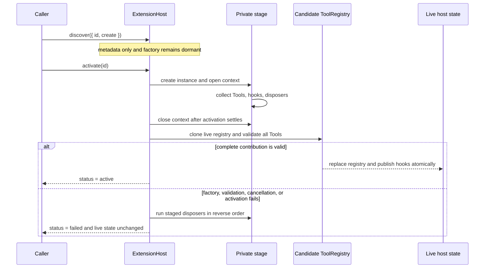

## Outcome

You will load UTF-8 text Resources from an ordered set of trusted roots, then add an [Extension](../glossary.md#extension) host that separates discovery from activation. Discovery records immutable IDs and factories without executing user code. Activation runs only when requested, stages every Tool, event hook, and disposer, validates the complete contribution, and publishes it in one commit.

If a factory, activation callback, Tool definition, cancellation check, or rollback step fails, no staged Tool or hook becomes live. The host attempts every disposer acquired before the failure in reverse registration order and aggregates cleanup failures after all attempts. Host shutdown applies the same all-attempted rule while reversing Extension activation order, so ownership unwinds from the newest dependency to the oldest even when one cleanup fails.

:::note[Course implementation]

`ResourceLoader`, `ExtensionHost`, `ExtensionDefinition`, `ExtensionContext`, the `1,048,576`-byte text limit, status values, and error codes are Course implementation contracts. They are educational APIs and are not API-compatible with Pi's resource or Extension runtime.

:::

## Prerequisites

Complete [checkpoint 11](11-context-compaction.md). You should understand canonical workspace paths, immutable snapshots, `ToolRegistry`, validation before effects, `AbortSignal`, serialized state transitions, and reverse-order cleanup.

Inspect the boundary and its evidence together:

| Role | Exact path | What to inspect |
| --- | --- | --- |
| Cumulative source | `course/src/resources.ts` | Trusted-root capture, bounded text reads, discovery, staged activation, hook ordering, rollback, cancellation, and disposal |
| Focused evidence | `course/test/12-resources-extensions.test.ts` | Root precedence, path attacks, byte and UTF-8 limits, dormant factories, atomic Tool commits, hook isolation, partial activation, and reverse cleanup |

The focused test uses only temporary directories created with `mkdtemp()`. It does not read user configuration, contact a provider, or activate an Extension outside the fixture.

## Mechanism

`ResourceLoader.create()` requires at least one root with a unique stable ID. It resolves each configured directory, records the canonical directory and filesystem identity, and preserves input order. `loadText()` searches earlier roots first, so a workspace Resource can deliberately shadow a bundled fallback. A missing path falls through to the next root and eventually returns `undefined`.

Each read checks both lexical and canonical confinement. Absolute paths, traversal outside the root, symlink or junction escapes, Windows device names, alternate data-stream forms, and a root replaced after initial capture fail closed. The loader opens a regular file read-only, checks its identity around the read, accepts at most `MAX_RESOURCE_TEXT_BYTES` (`1,048,576` encoded bytes), and uses fatal UTF-8 decoding. This narrows the file boundary; it does not turn arbitrary Extension code into a process sandbox.

`ExtensionHost.discover()` snapshots a dense definition array and validates all IDs and factories before adding any definition. It does not call `create()`. A duplicate in the new batch rejects the whole discovery call, leaving the prior metadata unchanged. Every discovered Extension begins in `discovered`; explicit `activate(id)` moves it through `activating` to `active` or `failed`.

Activation and event work share a serialized queue: each new operation starts only after work already pending on that queue settles. The host creates a private staging area and gives `activate()` a frozen `ExtensionContext` with five fields: the trusted `resources`, an activation `signal`, `registerTool()`, `onAgentEvent()`, and `onDispose()`. Those registration functions remain open only during the selected activation settlement. Late registrations and reentrant host operations reject instead of modifying live state.

Tools, hooks, and disposers stay staged while the factory and `activate()` settle. The host clones the live `ToolRegistry`, registers the complete staged Tool set into that candidate, and snapshots the new registrations. Only after every Tool validates does it replace the live registry, publish hooks, append the activation order, and mark the Extension `active`. A duplicate Tool name therefore cannot expose an earlier Tool from the same failed batch.

`emit()` snapshots one `AgentEvent`, then calls hooks in Extension activation order and hook registration order. One hook failure becomes an immutable diagnostic and later hooks still run. `dispose()` aborts pending activation, waits behind the same serialized queue, and cleans active Extensions in reverse activation order. Inside one Extension, `onDispose()` callbacks run in reverse registration order, followed by the instance-level `dispose`. All cleanup is attempted; multiple failures are retained in a frozen aggregate.

## Trace or model



| Phase | May execute Extension code? | Public state after success | Public state after failure |
| --- | --- | --- | --- |
| Discovery | No | Immutable `discovered` metadata | Entire invalid batch rejected |
| Factory and activation | Yes, serialized | Nothing yet | Staged ownership rolls back |
| Candidate validation | No new callback | Nothing yet | Live Tools and hooks stay unchanged |
| Commit | No | Tools, hooks, order, and `active` status appear together | No partial contribution appears |
| Disposal | Yes, serialized | All owned resources attempted in reverse order | Failures aggregate after cleanup attempts |

## Build it

The cumulative module is `course/src/resources.ts`. This verbatim fragment from `course/test/12-resources-extensions.test.ts` shows that discovery keeps the factory dormant and that activation publishes the new Tool before hooks run:

```ts
host.discover([definition]);
expect(host.tools.names).toEqual(["base"]);
await host.activate("logger");
expect(host.tools.names).toEqual(["base", "extension"]);
expect(host.extensions).toEqual([{ id: "logger", status: "active" }]);

const failures = await host.emit(finishedEvent(7));

expect(observations).toEqual(["first:7", "second", "third"]);
expect(failures).toMatchObject([
  { extensionId: "logger", hookIndex: 1, message: "isolated hook failure" },
]);
```

The second hook fails, yet the third hook still observes the same immutable event. `host.tools` returns a detached registry snapshot, so callers cannot mutate host membership between activation and emission.

For Resource loading, keep root selection and content retrieval in one operation:

```ts
const loader = await ResourceLoader.create([
  { id: "project", directory: project },
  { id: "bundled", directory: bundled },
]);

await expect(loader.loadText("instructions.md")).resolves.toMatchObject({
  rootId: "project",
  path: "instructions.md",
  content: "project",
});
```

This excerpt is also verbatim from the focused test. The returned `rootId` records which trusted precedence layer supplied the text.

## Run the focused test

The focused test is `course/test/12-resources-extensions.test.ts`. Run exactly:

```bash
npm run test:course:checkpoint -- course/test/12-resources-extensions.test.ts
```

The file proves root identity capture, precedence, confinement, portable path grammar, regular-file and UTF-8 requirements, the exact `1 MiB` boundary, metadata-only discovery, lazy factories, activation serialization, atomic contributions, hook order and isolation, cancellation, reentrancy rejection, rollback recovery, aggregate cleanup errors, and reverse disposal.

## Failure experiment

Activate an Extension that allocates one disposable resource and then throws. Add this complete `test()` beside the existing rollback test. It creates and disposes its own host; the focused file's `emptyResources()` helper registers its temporary root for `afterEach` cleanup:

```ts
test("rolls back one disposable after activation fails", async () => {
  const cleanup: string[] = [];
  const host = new ExtensionHost({
    resources: await emptyResources(),
    tools: [echoTool("base")],
  });

  try {
    host.discover([
      {
        id: "fails-after-allocation",
        create: () => ({
          activate(context) {
            context.onDispose(() => cleanup.push("allocated-resource"));
            context.registerTool(echoTool("never-live"));
            throw new Error("activation failed after allocation");
          },
        }),
      },
    ]);

    await expect(host.activate("fails-after-allocation")).rejects.toMatchObject({
      code: "EXTENSION_ACTIVATION_FAILED",
    });
    expect(cleanup).toEqual(["allocated-resource"]);
    expect(host.tools.names).toEqual(["base"]);
    expect(host.extensions).toContainEqual({
      id: "fails-after-allocation",
      status: "failed",
    });
  } finally {
    await host.dispose();
  }
});
```

Run the focused command again. The experiment passes only when the disposer runs once, the staged Tool never becomes visible, and the host remains usable. If the disposer also throws, the public error changes to `EXTENSION_ACTIVATION_ROLLBACK_FAILED` and retains both the activation and cleanup failures.

## Acceptance criteria

- The focused command selects only `course/test/12-resources-extensions.test.ts` and passes offline.
- Ordered trusted roots are canonicalized and identity-checked; traversal, symlink, device-path, root-replacement, non-file, oversized, and invalid UTF-8 inputs fail closed.
- Text content is capped at exactly `1,048,576` encoded bytes before fatal UTF-8 decoding.
- Discovery validates and commits metadata as one batch without calling any Extension factory.
- Activation is lazy and serialized; its context closes when the selected async result settles.
- Tool, hook, and disposer contributions remain private until every staged Tool validates.
- Hooks run in activation then registration order; failures are reported without skipping later hooks.
- Failed activation attempts every acquired disposer in reverse order, aggregates rollback failures, and publishes no partial contribution.
- Host disposal reverses Extension activation and per-Extension resource registration, attempts every cleanup, and aggregates failures.

## Compare with Pi SDK 0.87.1

:::info[Pi SDK 0.87.1]

`@earendil-works/pi-coding-agent` publicly exports `DefaultResourceLoader`, the `ResourceLoader` type, `loadProjectContextFiles()`, `discoverAndLoadExtensions()`, `createExtensionRuntime()`, `ExtensionRunner`, `defineTool()`, and the documented Extension types from its package entry point.

:::

Pi's `DefaultResourceLoader` coordinates project and agent resources such as Extensions, Skills, prompts, themes, context files, package resolution, diagnostics, project trust, and reload. Pi Extensions receive the richer `ExtensionAPI` and `ExtensionContext`, can register Tools and commands, subscribe to lifecycle events, and contribute more resource paths through `resources_discover`. `ExtensionRunner` connects loaded handlers to a live `AgentSession`.

The current boundary lifecycle makes `TurnEndEvent` and `AgentBeforeSettleEvent` actionable: handlers can return append-only entry drafts and request one continuation. Hosts dispatch these boundaries through `emitBoundary(baseEvent, buildContext)`, which rebuilds the projected preview after each handler. For request transforms, `context` receives conversation messages without system messages and Pi restores prompt/Tool state; `context_with_system` receives the full transcript and its returned list is used verbatim.

The course splits a much smaller problem into two visible boundaries: a text-only trusted-root loader and an explicit `discover()`/`activate()` transaction. Its `ResourceLoader`, `ExtensionHost`, status model, fixed byte cap, hook diagnostics, and rollback codes do not exist as Pi public APIs. Use Pi's exported loader and Extension contracts when building on Pi, including Pi's project-trust policy; use the course types only to study ownership and atomic publication.

## Next checkpoint

[Checkpoint 13](13-runtime-composition.md) builds one composition root around the Agent, Session, Resources, Extensions, and Tools, then replaces every workspace-bound owner without exposing a half-built runtime.
