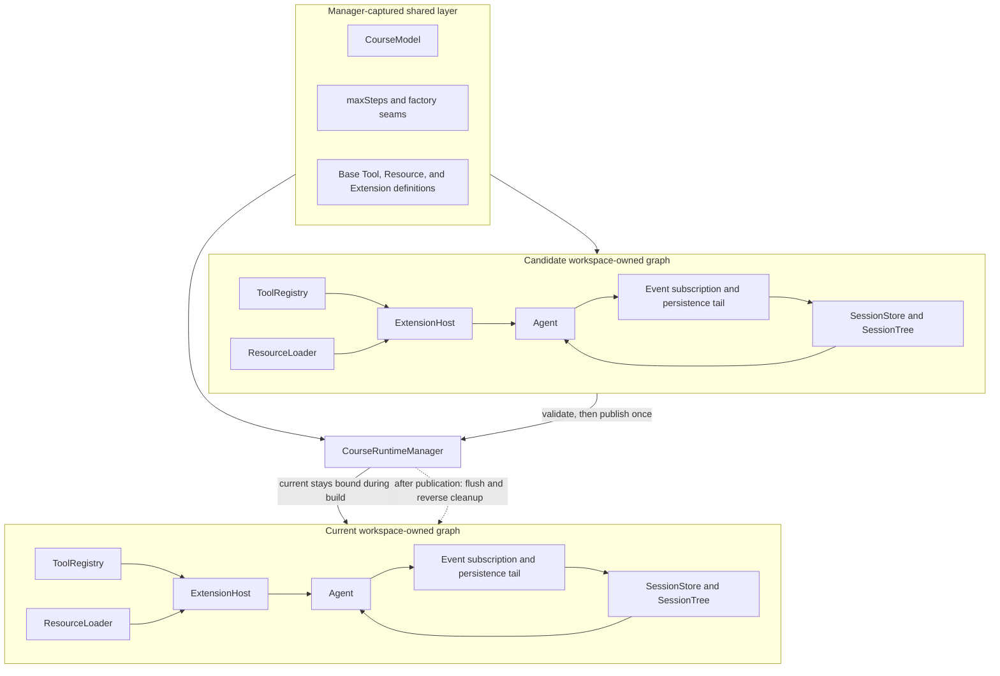

## Outcome

You will add a [composition root](../glossary.md#composition-root) that creates the Tool registry, Resource loader, Session owner, Extension host, and Agent in dependency order for one canonical workspace. The returned `CourseRuntime` owns the subscription that persists accepted Agent messages and forwards ordered events to Extensions. Its `flush()` proves that the Agent transcript, active Session branch, durable store, and workspace identity still agree.

You will also add `CourseRuntimeManager`, the single owner of the public runtime reference. Replacement requests are serialized. A candidate is fully constructed and validated while the previous runtime stays live; only then does the manager swap the reference, rebind workspace-scoped persistence, and dispose the previous graph. A construction failure is [fail-closed](../glossary.md#fail-closed): the candidate is rolled back and the old runtime remains usable.

:::note[Course implementation]

`CourseRuntime`, `CourseRuntimeManager`, `createCourseRuntime()`, `createCourseRuntimeManager()`, factory overrides, ownership ledger, swap order, and error codes are Course implementation APIs. They model host ownership and are not Pi runtime types.

:::

## Prerequisites

Complete [checkpoint 12](12-resources-extensions.md). You should understand the stateful Agent, Session Tree durability, workspace confinement, lazy Extension activation, atomic Tool publication, event hook ordering, cancellation, and reverse disposal.

Use these two files as one contract:

| Role | Exact path | What to inspect |
| --- | --- | --- |
| Cumulative source | `course/src/runtime.ts` | Workspace capture, construction order, ownership ledger, event persistence, flush, replacement queue, publication, rollback, and disposal |
| Focused evidence | `course/test/13-runtime-composition.test.ts` | Dependency identity, Session resume, event order, failed swaps, rebind behavior, cleanup order, concurrent replacement, cancellation, and path races |

The runtime uses the workshop's `ScriptedModel`; all focused tests are offline. Every test workspace and Session file lives below a unique temporary root.

## Mechanism

`createCourseRuntime()` first captures options as own data and pins relative paths against the call-time working directory. The shared layer contains the model, `maxSteps`, base Tool definitions, additional Resource roots, Extension definitions, and factory overrides. `CourseRuntimeManager` captures that layer once. Each initial runtime and replacement rebuilds the workspace layer: canonical root and Session path, coding Tools, `ResourceLoader`, `SessionStore` plus `SessionTree`, `ExtensionHost`, the final Tool snapshot, `Agent`, event subscription, and persistence queue.

Construction follows one dependency order: Tools, Resources, Session, Extensions, Agent. The workspace root is canonicalized and its filesystem identity is checked around each asynchronous factory. A relative Session path must stay under that root; absolute, device-like, colon-bearing, traversal, and escaping symlink forms reject. Create-mode parent directories and the new Session file enter an ownership ledger before later factories can fail.

Each factory override receives a frozen input and a memoized `fallback()`. The ledger registers fallback products and selected products as soon as they appear. Unselected owned values are cleaned exactly once. If any later step throws, the ledger walks its remaining ownership records in reverse. It disposes the Extension host, removes only an unchanged create-mode Session file, and removes only unchanged empty parent directories. External replacement or modification makes rollback refuse deletion and report `RUNTIME_SESSION_ROLLBACK_FAILED`.

`OwnedCourseRuntime` subscribes to its Agent during construction. `message.accepted` and `run.finished` snapshots enter one event tail. Before each Extension emission, the runtime reconciles every new transcript message onto the active Session branch in order. It then runs Extension hooks. Persistence or hook failure poisons that runtime with a stable `RUNTIME_EVENT_FAILED`; later `flush()` exposes the same failure instead of pretending the store is current. External Session movement or a transcript mismatch becomes `RUNTIME_SESSION_DIVERGED`.

`flush()` waits behind accepted events, rechecks the canonical workspace identity and transcript coherence, flushes `SessionStore`, and checks both again. Disposal is idempotent. It cancels an active Agent run, waits for the terminal event to enter persistence, drains event work, removes the subscription, checks coherence, flushes the Session, and finally asks `ExtensionHost` to clean its graph in reverse. All failures are collected before the runtime becomes `disposed`.

`CourseRuntimeManager.replace()` puts every replacement on one queue. While the candidate is being built, `manager.current` still returns the previous runtime. A failed candidate is rolled back without changing that reference. A valid candidate already owns its Session binding and Agent subscription; the manager publishes it in one assignment, then disposes the previous runtime. If old cleanup fails, the call reports `RUNTIME_REPLACEMENT_CLEANUP_FAILED`, but the new runtime remains the live current owner. Concurrent replacements repeat the full workspace build in request order.

## Trace or model



| Owner | Lifetime | Replacement rule | Cleanup rule |
| --- | --- | --- | --- |
| Shared model and definitions | Manager | Captured once, supplied to every build | Released with the host that owns the manager |
| Workspace identity and Session path | One runtime | Re-canonicalized for each candidate | Identity-checked rollback and durable flush |
| Tools, Resources, Session, Extensions, Agent | One runtime | Rebuilt; no workspace object is reused | Ownership ledger on construction failure |
| Agent subscription and persistence tail | One runtime | Candidate binds before publication | Drain, unsubscribe, flush, then dispose Extensions |
| Public `current` reference | Manager | One assignment after candidate validation | Manager disposal closes the selected runtime |

## Build it

The cumulative module is `course/src/runtime.ts`. This verbatim fragment from `course/test/13-runtime-composition.test.ts` makes the composition order executable evidence:

```ts
const runtime = await createCourseRuntime(
  runtimeOptions(cwd, new ScriptedModel([]), { factories }),
);

expect(order).toEqual([
  "tools",
  "resources",
  "session",
  "extensions",
  "agent",
]);
expect(Object.isFrozen(runtime)).toBe(true);
expect(Object.isFrozen(runtime.workspace)).toBe(true);
```

The order follows dependencies rather than convenience: the Extension host needs Resources and base Tools; the Agent needs the active Session messages and the Tool snapshot after Extension activation.

The swap boundary is visible in another exact test fragment:

```ts
const replacement = manager.replace({
  cwd: second,
  session: { path: "course-session.jsonl", mode: "create" },
});
await candidateEntered.promise;
expect(manager.current).toBe(old);
expect(manager.current.workspace.root).toBe(resolve(first));

releaseCandidate.resolve();
const next = await replacement;
expect(manager.current).toBe(next);
```

Code that needs the active runtime reads `manager.current` at the operation boundary. It should not retain workspace-owned objects across a completed replacement.

## Run the focused test

The focused test is `course/test/13-runtime-composition.test.ts`. Run exactly:

```bash
npm run test:course:checkpoint -- course/test/13-runtime-composition.test.ts
```

The file proves construction order, immutable ownership, Session resume, ordered Tool-call/result persistence, hook sequencing, poisoned-event propagation, Session divergence checks, candidate-first replacement, atomic rebind, construction rollback, fallback ownership, Session rollback refusal, flush-before-dispose, serialized swaps, call-time path pinning, reentrancy rejection, active-run cancellation, and workspace identity defense.

## Failure experiment

Make only the replacement Session factory throw. Add this complete focused case to `course/test/13-runtime-composition.test.ts`; the file's `workspace()` helper registers both temporary roots for `afterEach` cleanup, while `finally` always disposes the manager-owned runtime:

```ts
test("keeps the old runtime live when replacement construction fails", async () => {
  const first = await workspace("closed-first-experiment");
  const second = await workspace("closed-second-experiment");
  const factories: CourseRuntimeFactoryOverrides = {
    createSession: async (input, fallback) => {
      if (input.workspace.root === resolve(second)) {
        throw new Error("candidate session failed");
      }
      return fallback(input);
    },
  };
  const model = new ScriptedModel([
    scriptedResponse("old-live", "Still live"),
  ]);
  const manager = await createCourseRuntimeManager(
    runtimeOptions(first, model, { factories }),
  );
  const old = manager.current;

  try {
    await expect(
      manager.replace({
        cwd: second,
        session: { path: "course-session.jsonl", mode: "create" },
      }),
    ).rejects.toMatchObject({
      name: "CourseRuntimeError",
      code: "RUNTIME_CONSTRUCTION_FAILED",
    });
    expect(manager.current).toBe(old);

    await drain(old.agent.prompt("Are you there?"));
    await old.flush();
    expect(old.session.activeMessages).toEqual(old.agent.messages);
  } finally {
    await manager.dispose();
  }
});
```

Run the focused command again. The replacement must reject, candidate-owned values must roll back, and the old Agent must still persist a new prompt. Publishing the candidate before its Session factory settles, disposing the old graph first, or leaving a partial Session file all fail this checkpoint.

## Acceptance criteria

- The focused command selects only `course/test/13-runtime-composition.test.ts` and passes offline.
- The composition root builds Tools, Resources, Session, Extensions, and Agent in dependency order for one canonical workspace.
- Shared model, definitions, limits, and factory seams are captured once; all workspace-bound owners and subscriptions are rebuilt.
- Agent events persist transcript messages before Extension hooks, and `flush()` proves Session, Agent, store, and workspace coherence.
- Runtime disposal cancels active work, waits for terminal persistence, unsubscribes, flushes, then performs reverse Extension cleanup.
- Construction failure rolls back every owned product in reverse and refuses to delete externally changed Session state.
- Replacements are serialized; the old runtime remains public until a coherent candidate is complete.
- Publication rebinds Session persistence and Extension hooks to the candidate before old cleanup begins.
- Failed replacement leaves the old runtime live; failure to dispose an old runtime leaves the already-published candidate live and reports cleanup failure.

## Compare with Pi SDK 0.87.1

:::info[Pi SDK 0.87.1]

`@earendil-works/pi-coding-agent` publicly exports `createAgentSession()`, `createAgentSessionRuntime()`, `AgentSessionRuntime`, `createAgentSessionServices()`, `createAgentSessionFromServices()`, their options and result types, and `SessionManager`.

:::

Pi's `createAgentSession()` is the usual programmatic composition entry point. `AgentSessionRuntime` owns an `AgentSession` plus cwd-bound services, supports new, resume, fork, switch, and import flows, exposes `setRebindSession()`, and settles an active response before invalidating the outgoing session. At the pinned release, replacement methods tear down the current session before awaiting construction of the next runtime. That lifecycle does not promise the course manager's candidate-first guarantee that a failed replacement leaves the old runtime live.

Within a live session, `SessionManager` remains canonical for the next provider request. Directly assigning `session.agent.state.messages` changes only the exposed Agent state and does not replace future request history. Runtime composition that restores or edits history must navigate or append through the session manager and call `session.refreshContext()` after an external append so the finalized public view matches the current projection.

The course rebuilds a smaller offline graph and records ownership in a defensive construction ledger. Its manager queue, `current` swap, `flush()`, event-persistence algorithm, factory fallback, and error codes are workshop-specific. For a Pi host, use the public session factories and `AgentSessionRuntime`, rebind host subscriptions through its supported callback, and follow Pi's replacement lifecycle rather than copying the course manager API.

## Next checkpoint

[Checkpoint 14](14-agent-evaluation.md) creates a fresh runtime for every held-out repetition, converts public evidence into deterministic verdicts, and compares baseline with candidate without storing prompts or transcript content in the report.
