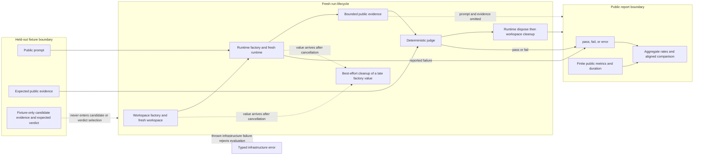

## Outcome

You will build an offline [harness](../glossary.md#harness) for [held-out evaluation](../glossary.md#held-out-evaluation). It loads unknown fixture data defensively and creates a fresh workspace and runtime for every task repetition. The runtime factory receives run identifiers, repetition, workspace path, and cancellation signal; the only task content passed to `runtime.run()` is the public prompt, never the fixture-only oracles. A deterministic [judge](../glossary.md#judge) turns bounded public evidence into a `pass` or `fail` [verdict](../glossary.md#verdict).

The harness records a separate `error` verdict when a candidate runtime reports that it could not produce a valid observation. A factory, runtime, judge, or clock exception, cancellation, or registered ownership-cleanup failure rejects the evaluation as infrastructure failure. Baseline and candidate reports are compared only when they contain the same task and run identities. Stable aggregate rates and a strict report allowlist make repeated offline runs reviewable without serializing prompts, expected evidence, candidate evidence, transcripts, or file content.

:::note[Course implementation]

`EvaluationCandidate`, `runEvaluation()`, `deterministicEvaluationJudge`, `compareEvaluations()`, `serializeEvaluationReport()`, the fixture schema, limits, verdict ranking, and error codes are Course implementation contracts. The harness uses no Pi package, provider, API key, or network request.

:::

## Prerequisites

Complete [checkpoint 13](13-runtime-composition.md). You should understand runtime ownership, fresh temporary workspaces, deterministic test doubles, cancellation, cleanup in `finally`-style boundaries, immutable unknown-data snapshots, and the difference between observable task behavior and a broken test environment.

Read the implementation, fixture, and evidence together:

| Role | Exact path | What to inspect |
| --- | --- | --- |
| Cumulative source | `course/src/eval.ts` | Fixture capture, work scheduling, runtime ownership, judging, report projection, aggregates, comparison, cancellation, and cleanup timeout |
| Focused evidence | `course/test/14-agent-evaluation.test.ts` | Fresh runtimes, hidden fields, verdict classes, repeatability, baseline pairing, caps, cancellation races, safe serialization, and cleanup aggregation |
| Held-out fixture | `course/fixtures/eval-tasks.json` | Two offline arithmetic cases with public prompts, required public evidence, and fixture-only test oracles |

The fixture is fixed test data, not training data. Do not inspect expected fields while tuning a candidate you intend to measure; add a separate visible development set for that work.

## Mechanism

`loadEvaluationTasks()` treats JSON as `unknown`. It requires `schemaVersion: 1`, a dense array of `1` to `256` unique tasks, stable bounded IDs, `split: "held-out"`, a bounded prompt, items that are unique within `expectedPublicEvidence.includes`, and fixture-only `candidatePublicEvidence` plus `expectedVerdict`. It snapshots and freezes every accepted layer. At run time, `EvaluationJudgeInput.candidatePublicEvidence` is the candidate's bounded output: it may overlap the required list and is compared with that list. By contrast, the task fixture fields `candidatePublicEvidence` and `expectedVerdict` are test oracles only. Neither enters candidate or judge input, and `expectedVerdict` never selects a production verdict.

`runEvaluation()` expands tasks in fixture order and repetitions from `1` to `64`, assigning `run-000001`, `run-000002`, and so on. Tasks multiplied by repetitions may not exceed `4,096` runs. Execution is serialized by default; optional concurrency is capped at `8`. Each work item gets a new workspace, then a new `EvaluationRuntime` with candidate ID, task ID, run ID, repetition, workspace path, and cancellation signal. The runtime's `run()` receives only `{ prompt, signal }`.

A completed runtime returns `publicEvidence` plus optional public metrics. The judge receives the prompt, required public evidence, candidate public evidence, IDs, and the signal. The default judge uses bounded set membership and counts required and matched evidence; it performs no model call. A valid judge result is only `pass` or `fail`. A runtime may instead return `{ status: "failed", errorCode }`; that creates a run with `verdict: "error"`, skips the judge, and preserves the sanitized code.

An uncaught exception means the harness did not obtain a valid observation. Runtime construction, execution, and judge exceptions become `EVALUATION_RUNTIME_FACTORY_FAILED`, `EVALUATION_RUNTIME_FAILED`, or `EVALUATION_JUDGE_FAILED` and reject the full evaluation. Cancellation uses one shared internal signal: the first infrastructure failure stops new work and cancels concurrent workers.

Once runtime or workspace ownership has been registered, `runOne()` awaits the runtime disposer and then workspace cleanup through `settleOwnedCleanup()`. Each registered cleanup ignores run cancellation and receives its own configured `cleanupTimeoutMs`, capped at `1,000` ms. Cleanup failures produce `EVALUATION_CLEANUP_FAILED`; when a primary infrastructure failure already exists, the aggregate retains it before the cleanup failures.

A separate path handles a workspace or runtime factory promise that returns an owned value after cancellation has already won the race. `invokeFactoryAbortable()` passes that late value to `observeLateCleanup()`, which invokes its cleanup on a best-effort basis and observes any returned promise without awaiting it. This path has no `1,000` ms cleanup cap, and synchronous throws or asynchronous rejections are swallowed rather than added to the evaluation's failure aggregate. It prevents an unhandled rejection without delaying cancellation.

Evidence and metrics have explicit work budgets. Required and candidate evidence each allow at most `32` items; each item allows `4,096` Unicode code points; their combined per-task evidence budget is `65,536` code points. Runtime metrics and judge metrics each allow `64` finite entries, and a merged run report allows `128`. Prompt validation is capped at `100,000` UTF-16 code units. These ceilings bound local work and report size; they do not make arbitrary evidence safe to disclose.

`EvaluationReport` contains candidate ID, ordered runs, and aggregate counts and rates for `pass`, `fail`, and `error`. `compareEvaluations()` validates both reports, aligns exact `taskId` plus `runId` sets, ranks `error < fail < pass`, and reports improved, regressed, or unchanged rows plus rate deltas. It ignores duration when selecting outcomes. Use identical held-out tasks, repetition counts, judge definitions, candidate settings, and code revision for a meaningful baseline/candidate comparison.

`serializeEvaluationReport()` manually emits a stable allowlist: task, run, and candidate IDs; verdict; sorted finite public metrics; duration; error code; and aggregate rates. It ignores `toJSON`, rejects Proxy-backed records, and omits prompts and evidence. IDs and metrics can still reveal sensitive labels or measurements, so choose neutral identifiers and inspect the serialized artifact before sharing it.

## Trace or model



| Boundary result | Judge called? | Run/report outcome | Interpretation |
| --- | --- | --- | --- |
| Runtime returns `completed` | Yes | `pass` or `fail` | Valid task observation scored against the declared contract |
| Runtime returns `failed` | No | `error` with sanitized code | Candidate could not produce a scorable observation |
| Factory, runtime, or judge throws | Maybe, depending on phase | Evaluation rejects with typed infrastructure error | Repair harness, environment, or adapter before comparing quality |
| Cancellation or registered cleanup fails | No further work | Evaluation rejects; registered cleanup errors aggregate | No complete reproducible report exists |
| Factory returns an owned value after cancellation | No further work | Selected cancellation is not delayed or replaced | Cleanup is best effort, observed, unawaited, and absent from the aggregate |

## Build it

The cumulative module is `course/src/eval.ts`. This verbatim excerpt from `course/test/14-agent-evaluation.test.ts` runs the same held-out fixture twice and checks deterministic verdicts and aggregates:

```ts
const first = await runEvaluation({
  candidate,
  tasks: await fixture(),
  repetitions: 2,
});
const second = await runEvaluation({
  candidate,
  tasks: await fixture(),
  repetitions: 2,
});

expect(first.runs.map((run) => run.verdict)).toEqual([
  "pass",
  "pass",
  "fail",
  "fail",
]);
expect(second.runs.map((run) => run.verdict)).toEqual(
  first.runs.map((run) => run.verdict),
);
expect(first.publicMetrics).toEqual(second.publicMetrics);
```

The same focused test also proves eight distinct runtime objects and eight distinct temporary paths across the two four-run reports, disposes all eight runtimes, and verifies every workspace path has been removed.

Use `compareEvaluations(baseline, candidate)` only after both reports were produced from the same task/repetition layout. The comparison validates identities instead of pairing rows by array position alone.

## Run the focused test

The focused test is `course/test/14-agent-evaluation.test.ts`. Run exactly:

```bash
npm run test:course:checkpoint -- course/test/14-agent-evaluation.test.ts
```

The file proves held-out fixture isolation, fresh runtime and workspace ownership, deterministic pass/fail evaluation, `error` classification, custom judge adoption, exact baseline alignment, duration isolation, bounded concurrency, cancellation, cleanup of workspace/runtime values returned by factories after cancellation, registered-cleanup aggregation and timeout, report allowlisting, duplicate identity rejection, evidence and metric caps, and hostile-object defenses.

## Failure experiment

Make one operation inside the candidate runtime throw, catch it at the candidate adapter boundary, and report a failed runtime. The harness must record `error`; it must not turn the missing observation into a `fail` verdict:

```ts
const report = await runEvaluation({
  candidate: {
    id: "caught-harness-failure",
    createRuntime: () => ({
      run: () => {
        try {
          throw new Error("model timed out");
        } catch {
          return {
            status: "failed" as const,
            errorCode: "MODEL_TIMEOUT",
            publicMetrics: { attempts: 1 },
          };
        }
      },
      dispose: () => undefined,
    }),
  },
  tasks: singleTask("held-out-timeout"),
});

expect(report.runs[0]).toMatchObject({
  verdict: "error",
  errorCode: "MODEL_TIMEOUT",
  publicMetrics: { attempts: 1 },
});
expect(report.publicMetrics).toMatchObject({
  failedRuns: 0,
  errorRuns: 1,
});
```

Then remove the `try`/`catch` and let `run()` throw. `runEvaluation()` must reject with `EVALUATION_RUNTIME_FAILED`, because the harness itself lost the observation. Both cases remain distinct from a completed output whose judge returns `fail`. Run the focused command after each change, then restore the caught version or the original test fixture.

## Acceptance criteria

- The focused command selects only `course/test/14-agent-evaluation.test.ts` and passes offline with no credential or network access.
- Fixtures accept only `1` to `256` unique held-out tasks and keep expected evidence and fixture oracles out of candidate inputs.
- Every task repetition receives a fresh workspace and runtime; repetitions are capped at `64` and total runs at `4,096`.
- The deterministic judge returns only `pass` or `fail`; a reported runtime failure becomes `error` and skips judging.
- Factory, runtime, judge, or clock exceptions, cancellation, and registered ownership-cleanup faults remain typed infrastructure failures rather than fabricated task verdicts.
- Shared cancellation stops later work; `settleOwnedCleanup()` awaits registered runtime disposal and workspace cleanup once in ownership order, with a configured maximum of `1,000` ms for each registered cleanup, and aggregates their failures with any primary failure.
- `observeLateCleanup()` handles workspace/runtime values returned by factories after cancellation on a best-effort, unawaited path with no configured cleanup cap; its cleanup failures are observed and swallowed, not aggregated.
- Evidence is capped at `32` items per side, `4,096` code points per item, and `65,536` combined code points per task.
- Source metrics are capped at `64` per runtime or judge and merged reports at `128`; only finite values with valid names are accepted.
- Baseline and candidate comparison requires identical task/run identities and reports reproducible rates separately for `pass`, `fail`, and `error`.
- Stable serialization emits only the public allowlist and omits prompt, expected evidence, candidate evidence, transcript, and file content.

## Compare with Pi SDK 0.99.2

:::info[Pi SDK 0.99.2]

Pi's pinned `packages/evals` workspace is `private: true`. It is release source for Pi's own evaluation system, not a public export of `@earendil-works/pi-coding-agent` and not an npm dependency for applications.

:::

The private Pi workspace adapts a real `AgentSession` to `vitest-evals`, creates isolated temporary project and agent directories, runs model-backed Coding Agent behavior, records usage and timing, and attaches native Session artifacts. Host evals use `createPiCodingAgentHarness()`. Documentation evals run isolated Docker arms named `without_docs` and `with_docs`; `createTaskPlan()` alternates their order across repetitions, and `report.ts` pairs exact arms before publishing pass-rate lift or telemetry deltas. Provider calls can cost money, and retained Session artifacts can contain prompts, responses, source code, Tool input, and Tool output.

The Course implementation is a deterministic local harness over synthetic evidence. It has no Pi `AgentSession`, provider telemetry, native Session artifact, or `vitest-evals` API, and none of its types should be imported into a Pi application. To run the release-pinned private Pi suite, follow [Run Pi evals](../how-to/run-pi-evals.md); that guide covers the exact checkout, host smoke eval, containerized documentation comparison, artifact review, redaction, and cleanup.

The Course implementation is an original, smaller teaching implementation and makes no Pi API-compatibility promise.

## Next checkpoint

You have completed the runnable workshop. Return to the [course overview](index.mdx) to audit every checkpoint against its focused test, then use [Chapter 11](../ch11-testing-evaluation.md) to place these offline contracts inside a broader Pi testing and evaluation strategy.
