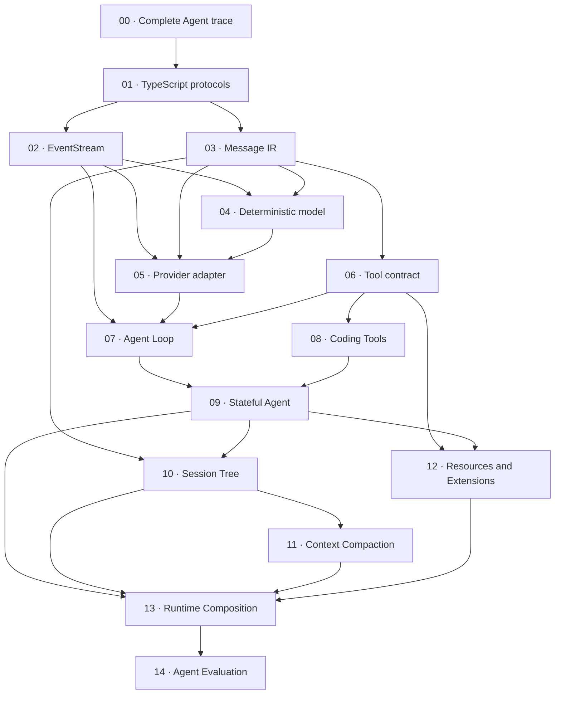

This course is for TypeScript developers who want to understand an Agent by constructing its boundaries, not by wrapping a model call in a large framework. You will follow one cumulative implementation from a complete trace to typed protocols, streaming, Tools, durable sessions, Context Compaction, Extension loading, Runtime Composition, and deterministic evaluation.

:::caution[Educational and unofficial]

The code under `course/src/` is the **Course implementation**. It is an original, simplified teaching system maintained by Pify. It is not an official Pi package, does not import unpublished Pi internals, and makes no promise of API compatibility with Pi. Only text labeled **Pi SDK 0.87.1** describes the separately published SDK release or names one of its verified public exports.

:::

## What you will build

The finished workshop is a small but complete Agent stack. A user message enters an iterative Agent Loop. A deterministic model emits text or requests a Tool. The loop validates and executes the Tool, links its result to the original call, and continues until it reaches a typed terminal result. Later checkpoints add a stateful Agent that owns prompt lifecycles, an append-only Session Tree, bounded context selection, Resources and Extensions, replaceable runtimes, and an evaluation harness.

The course is useful if you build Agent infrastructure, integrate the Pi SDK, review an Agent framework, or need tests that expose protocol and lifecycle failures. It assumes you want to inspect mechanisms such as iterator ownership, cancellation, transcript validation, atomic registration, cleanup, and bounded output. It does not teach prompt writing, provider account setup, or how to deploy a production sandbox.

Every checkpoint leaves the previous contracts intact. The workshop therefore has two views at once:

- the numbered pages isolate one new mechanism and one controlled failure;
- the full `course/` directory shows how those mechanisms compose into one runtime.

## Prerequisites

Use Node.js 22 and the dependencies from the repository root. You should be able to read TypeScript discriminated unions, `Readonly` types, generic interfaces, and `async` functions. The streaming checkpoints expect basic familiarity with `Promise`, `AsyncIterable`, `for await...of`, and `AbortSignal`. The test workflow uses Vitest, temporary filesystem fixtures, assertions, and test doubles.

You do not need a provider account, API key, paid model, database, or container runtime. The workshop model and provider records are deterministic local fixtures. Once the root dependencies are installed, every checkpoint test and the full workshop suite run without a provider network request. On a fresh machine, `npm ci` may still contact the npm registry to download those dependencies.

The repository contains the completed reference implementation. To make the failure experiments without disturbing it, work on a branch or copy `course/` to a temporary practice directory. This release has no checkpoint generator and no separate hidden solution branch.

## Set up and verify the workshop

Run the commands from the repository root. Install once, then choose either one explicit checkpoint test or the full cumulative suite:

```bash
npm ci
npm run test:course:checkpoint -- course/test/00-complete-agent-trace.test.ts
npm run test:course
```

`test:course:checkpoint` delegates to Vitest and must receive one explicit `course/test/*.test.ts` path. The command above selects only checkpoint `00`; it does not run the other fourteen files. `test:course` runs all fifteen checkpoint files and proves that a later layer has not broken an earlier contract.

The root lockfile is the only lockfile for the workshop. Do not create `course/package.json` or `course/package-lock.json`. Keeping the workshop inside the documentation repository makes its prose, source, focused tests, TypeScript configuration, and dependency versions reviewable as one change.

## Cumulative architecture

The arrows below show the primary construction dependencies. They are not an import graph: several later modules reuse more than one earlier contract. Follow the checkpoints in numeric order even where the diagram branches.



The first seven implementation checkpoints establish the data and execution plane: protocols define legal values, `EventStream` transports ordered progress, Message IR normalizes the transcript, `ScriptedModel` supplies deterministic scripted responses without an external provider or network request, the adapter validates untrusted transport data, Tools contain effects, and the Agent Loop coordinates the round-trip.

Checkpoints `08` through `13` add hosting concerns. Coding Tools confine filesystem and process effects to a declared workspace. The stateful Agent owns the prompt lifecycle, rejects overlapping runs through a busy guard, and reserves its queues for steering and follow-up messages; it also owns subscriptions. The Session Tree persists parent-linked history without flattening branches. Context Compaction keeps complete Tool rounds together. Resources and Extensions contribute capabilities atomically. Runtime Composition gives those resources one owner and a defined replacement and disposal order. Checkpoint `14` adds a separate evaluation layer: it validates held-out task fixtures, accepts supplied `EvaluationCandidate` objects, creates an independent `EvaluationRuntime` for each task and repetition, and passes fixture `expectedPublicEvidence` plus runtime `publicEvidence` to a judge. Its bounded serialized report retains IDs, verdicts, `publicMetrics`, `durationMs`, and `errorCode` rather than prompts or evidence. It does not instantiate or automatically evaluate the `CourseRuntime` from checkpoint `13`; connecting that runtime requires an adapter that implements the candidate contract.

## Checkpoint map

The prerequisite column names the previous checkpoint in the cumulative reading path. The source and focused test columns are literal repository paths; use them instead of searching for a similarly named production API.

| Checkpoint | Outcome | Course source | Focused test | Prerequisite |
| --- | --- | --- | --- | --- |
| [00 · Complete Agent trace](00-complete-agent-trace.md) | Reconstruct one immutable user → model → Tool → model → final-response trace and verify event order and stable call/result linkage. | `course/src/demo/prologue.ts` | `course/test/00-complete-agent-trace.test.ts` | Repository setup |
| [01 · TypeScript protocols](01-typescript-protocols.md) | Express messages, chunks, Tools, events, and terminal results as readonly discriminated unions with exhaustive handling. | `course/src/protocol.ts` | `course/test/01-typescript-protocols.test.ts` | Checkpoint 00 |
| [02 · EventStream](02-event-stream.md) | Build an `AsyncIterable` event channel with single-consumer iterator ownership, ordered buffered/waiting delivery, separate terminal-result settlement, and waiter cleanup. | `course/src/event-stream.ts` | `course/test/02-event-stream.test.ts` | Checkpoint 01 |
| [03 · Message IR](03-message-ir.md) | Normalize user, assistant, and Tool-result messages; reject invalid Tool linkage; preserve valid JSON round-trips. | `course/src/messages.ts` | `course/test/03-message-ir.test.ts` | Checkpoint 02 |
| [04 · Deterministic model](04-deterministic-model.md) | Script response factories, capture requests, preserve chunk order, and make exhaustion and cancellation observable in tests. | `course/src/scripted-model.ts` | `course/test/04-deterministic-model.test.ts` | Checkpoint 03 |
| [05 · Provider adapter](05-provider-adapter.md) | Validate unknown fixture records, normalize provider data, and require exactly one terminal event without networking. | `course/src/provider-adapter.ts` | `course/test/05-provider-adapter.test.ts` | Checkpoint 04 |
| [06 · Tool contract](06-tool-contract.md) | Validate before effects, register Tools atomically, bound serialized output, propagate cancellation, and represent recoverable errors. | `course/src/tool.ts` | `course/test/06-tool-contract.test.ts` | Checkpoint 05 |
| [07 · Agent Loop](07-agent-loop.md) | Coordinate model turns and multiple Tool calls with transcript ownership, ordered events, step budgets, cancellation, and typed stop reasons. | `course/src/agent-loop.ts` | `course/test/07-agent-loop.test.ts` | Checkpoint 06 |
| [08 · Coding Tools](08-coding-tools.md) | Constrain file and Node process Tools with canonical paths, atomic writes, bounded output, timeouts, and platform-neutral execution. | `course/src/coding-tools.ts` | `course/test/08-coding-tools.test.ts` | Checkpoint 07 |
| [09 · Stateful Agent](09-stateful-agent.md) | Own the prompt lifecycle and mutable state behind immutable snapshots; reject overlapping runs through a busy guard; queue only steering/follow-up messages; manage subscriptions and recovery. | `course/src/agent.ts` | `course/test/09-stateful-agent.test.ts` | Checkpoint 08 |
| [10 · Session Tree](10-session-tree.md) | Persist parent-linked JSONL entries, select an active leaf, project branches, recover a truncated tail, and reject middle corruption. | `course/src/session.ts` | `course/test/10-session-tree.test.ts` | Checkpoint 09 |
| [11 · Context Compaction](11-context-compaction.md) | Budget active context deterministically, keep Tool rounds whole, validate summaries, retain recent messages, and avoid mutation on failure. | `course/src/context.ts` | `course/test/11-context-compaction.test.ts` | Checkpoint 10 |
| [12 · Resources and Extensions](12-resources-extensions.md) | Discover metadata under trusted roots, activate lazily, commit contributions atomically, roll back failures, and dispose in reverse order. | `course/src/resources.ts` | `course/test/12-resources-extensions.test.ts` | Checkpoint 11 |
| [13 · Runtime Composition](13-runtime-composition.md) | Assemble workspace, Tools, Resources, Extensions, session, and Agent under one replaceable owner with deterministic teardown. | `course/src/runtime.ts` | `course/test/13-runtime-composition.test.ts` | Checkpoint 12 |
| [14 · Agent Evaluation](14-agent-evaluation.md) | Run bounded offline tasks using runtimes supplied by each `EvaluationCandidate`, separate task verdicts from infrastructure errors, compare candidates, and serialize privacy-safe reports. | `course/src/eval.ts` | `course/test/14-agent-evaluation.test.ts` | Checkpoint 13 |

The paths in this table are part of the course contract. Each checkpoint page repeats its exact module, test file, focused command, failure experiment, and acceptance criteria. If the prose and code disagree, the checked-in focused test defines what the current workshop proves; the page should be corrected in the same change.

## How to study each checkpoint

Use a short red/green loop rather than reading all the prose first:

1. Read the outcome, prerequisites, and mechanism until you can predict the event or state transition the test will observe.
2. Run the focused test once against the unmodified reference and confirm that only its named file passes.
3. Apply the checkpoint's controlled failure in a branch or practice copy. Run the same command and inspect the failing assertion; that red result identifies the contract rather than an arbitrary syntax error.
4. Restore the line, then inspect or reimplement the corresponding `course/src/` module. Keep the protocol names and limits used by its focused test.
5. Run the focused test again for green, then run `npm run test:course` to catch a regression in an earlier layer.
6. Read the Pi comparison last. Map the mechanism to the release-pinned SDK without replacing workshop identifiers with Pi identifiers.

For example, the loop for checkpoint `04` uses these exact commands:

```bash
npm run test:course:checkpoint -- course/test/04-deterministic-model.test.ts
npm run test:course
```

A red result from queue exhaustion is useful only when the experiment asks for one response beyond the finite script. A TypeScript compile error, wrong file selector, dependency-install failure, or unrelated failing checkpoint does not prove that behavior. Keep the experiment narrow enough that the failure message points back to the mechanism described on the page.

## Course implementation and Pi SDK 0.87.1

**Course implementation** callouts describe types and functions exported from this repository's `course/src/`. Names such as `EventStream`, `ScriptedModel`, `ToolRegistry`, `SessionTree`, and `CourseRuntimeManager` exist so the workshop can expose one concern at a time. Their signatures, limits, error classes, persistence format, and lifecycle rules belong to the workshop.

**Pi SDK 0.87.1** callouts compare that concern with the published Pi packages at version `0.87.1`. A comparison may name a verified public export, or it may explain that Pi has a richer provider, Tool, event, session, or runtime contract. It is a reading aid, not an instruction to pass a Course object into a Pi function. Do not infer API compatibility from similar terms such as Agent, Tool, message, session, or compaction.

This separation also sets the authority for discrepancies. The focused course test is authoritative for the Course implementation. The published `0.87.1` package and its matching release source are authoritative for a Pi SDK comparison. Unreleased upstream behavior is outside this course unless a page labels it explicitly as unreleased.

## Completion criteria

You have completed the course when you can demonstrate the contracts, not merely when you have read fifteen pages:

- Node.js reports a `22.x` version and the repository uses the root lockfile;
- every exact focused command selects one checkpoint file and passes without an API key or provider request;
- `npm run test:course` passes all fifteen checkpoint files after each cumulative change;
- you can trace a Tool call ID from assistant request through Tool result and continuation, and identify the terminal run status;
- you can explain who owns iteration, cancellation, transcript mutation, session persistence, runtime replacement, and cleanup at each boundary;
- your failure experiments fail for the intended invariant and return to green after restoration;
- you can distinguish a task failure from an infrastructure failure and identify what evidence is safe to retain;
- you can point to the **Course implementation** for workshop behavior and to **Pi SDK 0.87.1** for production SDK behavior without mixing their APIs.

Start with [checkpoint 00](00-complete-agent-trace.md). It gives you a complete trace before checkpoint `01` separates that trace into protocols.
