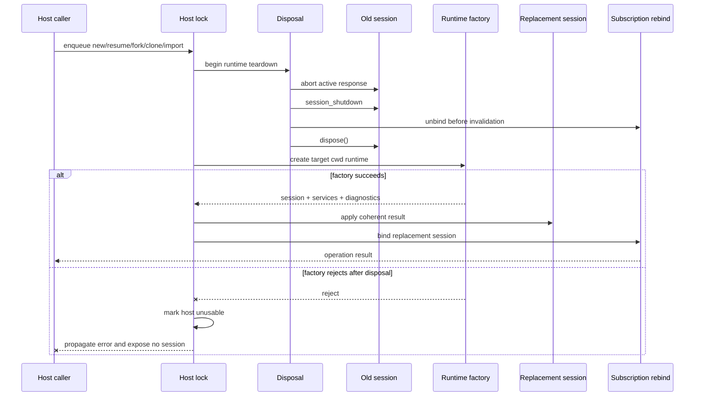

A long-running server, desktop shell, or RPC process cannot treat an `AgentSession` as permanent when users can start a new session, resume another project, fork history, clone a branch, or import JSONL. Pi `0.84.3` provides `AgentSessionRuntime` as the replacement boundary: it owns the current session and its cwd-bound services, while the host remains responsible for serialization, subscriptions, diagnostics, and failure policy.

This guide builds that host boundary with only public exports from `@earendil-works/pi-coding-agent@0.84.3`. The complete TypeScript shape is compile-checked in this documentation repository. It accepts dependencies instead of constructing real resources during the check.

## Outcome

By the end, you will be able to:

- choose between a one-session factory and a replaceable runtime;
- keep process-global intent separate from services that must be rebuilt for a target cwd;
- serialize every replacement operation through one host lock;
- detach listeners before the old session becomes invalid and bind them to the replacement;
- stop exposing the runtime if creation fails after teardown;
- verify cwd, diagnostics, persistence, and disposal behavior at the host boundary.

## 1. Choose `createAgentSession()` or `createAgentSessionRuntime()`

Use the smallest lifecycle owner that matches the application.

| Requirement | `createAgentSession()` | `createAgentSessionRuntime()` |
| --- | --- | --- |
| One fixed cwd and one session lifetime | Preferred | Unnecessary indirection |
| Host restarts to open a different session | Sufficient | Optional |
| In-process new, resume, fork, clone, or import | Host must rebuild and swap everything itself | Preferred replacement boundary |
| Recreate settings, resources, Extensions, model scope, and Tools for a changed cwd | Manual | Factory is invoked with the effective cwd |
| Rebind UI, RPC, telemetry, or persistence listeners | Manual | Use `setBeforeSessionInvalidate()` and `setRebindSession()` |

`createAgentSession()` returns a session plus extension and model-fallback data. The caller still owns that session and must dispose it. `createAgentSessionRuntime()` first invokes a typed factory, then returns an `AgentSessionRuntime` that reuses the same factory for subsequent replacements.

The runtime is a lifecycle coordinator, not a concurrency lock or a transactional database. Add a host wrapper when commands can arrive concurrently or when a failed replacement must make the process fail-closed.

## 2. Separate process-global inputs from cwd-bound inputs

Resolve process-global intent once in the composition root. Keep explicit resource paths absolute so a later cwd switch does not reinterpret them.

| Lifetime | Examples | Rule |
| --- | --- | --- |
| Process-global | `agentDir`, shutdown `AbortSignal`, CLI Tool allowlist, absolute extra resource paths, telemetry sink, host persistence adapter, project-trust policy | Close over or inject these into the runtime factory |
| Cwd-bound | `SettingsManager`, `ResourceLoader`, project Extensions and provider registrations, effective model/Tool resolution, `SessionManager`, `AgentSession` | Recreate or resolve these inside the factory for every effective cwd |

`createAgentSessionServices()` creates coherent cwd-bound services. `createAgentSessionFromServices()` then creates the session against those services and the selected `SessionManager`. This two-stage API prevents settings or Extensions from the startup directory leaking into a resumed session from another project.

Project trust is also evaluated for the target cwd. The example injects `authorizeProject(...)`; a production host can use the factory's `projectTrustContext` to ask through its own UI or policy layer before loading project-controlled resources.

## 3. Implement a typed `CreateAgentSessionRuntimeFactory`

The function below is the complete compile-only host shape. `CreateAgentSessionRuntimeFactory` forces the factory to return the new session, its matching services, and diagnostics as one coherent result. `createSerializedSessionRuntimeHost()` is not invoked by the fixture, so compilation does not read credentials, scan a project, or open a session file.

```typescript title="replaceable-session-runtime.ts"
import {
  type AgentSession,
  type AgentSessionRuntime,
  type AgentSessionRuntimeDiagnostic,
  type CreateAgentSessionRuntimeFactory,
  type CreateAgentSessionServicesOptions,
  createAgentSessionFromServices,
  createAgentSessionRuntime,
  createAgentSessionServices,
} from "@earendil-works/pi-coding-agent";

export async function createSerializedSessionRuntimeHost(
  processInputs: Pick<
    CreateAgentSessionServicesOptions,
    | "modelRuntimeSignal"
    | "extensionFlagValues"
    | "resourceLoaderOptions"
    | "resourceLoaderReloadOptions"
  > & {
    tools?: string[];
    authorizeProject?: (options: {
      cwd: string;
      projectTrustContext: Parameters<CreateAgentSessionRuntimeFactory>[0]["projectTrustContext"];
    }) => Promise<void>;
  },
  initial: Parameters<typeof createAgentSessionRuntime>[1],
  bindings: {
    subscribe(session: AgentSession): () => void;
    reportDiagnostics(
      diagnostics: readonly AgentSessionRuntimeDiagnostic[],
    ): void;
    flushPersistence(): Promise<void>;
  },
): Promise<{
  readonly cwd: string;
  readonly diagnostics: readonly AgentSessionRuntimeDiagnostic[];
  newSession(): ReturnType<AgentSessionRuntime["newSession"]>;
  resume(
    sessionPath: string,
    cwdOverride?: string,
  ): ReturnType<AgentSessionRuntime["switchSession"]>;
  fork(entryId: string): ReturnType<AgentSessionRuntime["fork"]>;
  clone(entryId: string): ReturnType<AgentSessionRuntime["fork"]>;
  importJsonl(
    inputPath: string,
    cwdOverride?: string,
  ): ReturnType<AgentSessionRuntime["importFromJsonl"]>;
  dispose(): Promise<void>;
}> {
  const { tools, authorizeProject, ...serviceInputs } = processInputs;
  const createRuntime: CreateAgentSessionRuntimeFactory = async ({
    cwd,
    agentDir,
    sessionManager,
    sessionStartEvent,
    projectTrustContext,
  }) => {
    await authorizeProject?.({ cwd, projectTrustContext });
    const services = await createAgentSessionServices({
      ...serviceInputs,
      cwd,
      agentDir,
    });
    const created = await createAgentSessionFromServices({
      services,
      sessionManager,
      sessionStartEvent,
      tools,
    });
    return {
      ...created,
      services,
      diagnostics: [...services.diagnostics],
    };
  };

  const runtime: AgentSessionRuntime = await createAgentSessionRuntime(
    createRuntime,
    initial,
  );
  let tail: Promise<void> = Promise.resolve();
  let unsubscribe: (() => void) | undefined;
  let replacementInFlight = false;
  let unusable = false;
  let disposed = false;

  const clearSubscription = () => {
    const release = unsubscribe;
    unsubscribe = undefined;
    release?.();
  };
  const assertAvailable = () => {
    if (disposed) throw new Error("session runtime host is disposed");
    if (unusable || replacementInFlight) {
      throw new Error("session runtime host has no usable current session");
    }
  };
  const serialize = <T>(operation: () => Promise<T>): Promise<T> => {
    const pending = tail.then(async () => {
      assertAvailable();
      try {
        return await operation();
      } catch (error) {
        if (replacementInFlight) unusable = true;
        throw error;
      }
    });
    tail = pending.then(
      () => undefined,
      () => undefined,
    );
    return pending;
  };
  const replace = <T>(operation: () => Promise<T>): Promise<T> =>
    serialize(async () => {
      const result = await operation();
      await bindings.flushPersistence();
      return result;
    });

  runtime.setBeforeSessionInvalidate(() => {
    replacementInFlight = true;
    clearSubscription();
  });
  runtime.setRebindSession(async (session) => {
    clearSubscription();
    unsubscribe = bindings.subscribe(session);
    bindings.reportDiagnostics(runtime.diagnostics);
    replacementInFlight = false;
  });

  try {
    unsubscribe = bindings.subscribe(runtime.session);
    bindings.reportDiagnostics(runtime.diagnostics);
  } catch (error) {
    await runtime.dispose();
    throw error;
  }

  return {
    get cwd() {
      assertAvailable();
      return runtime.cwd;
    },
    get diagnostics() {
      assertAvailable();
      return runtime.diagnostics;
    },
    newSession: () => replace(() => runtime.newSession()),
    resume: (sessionPath, cwdOverride) =>
      replace(() => runtime.switchSession(sessionPath, { cwdOverride })),
    fork: (entryId) => replace(() => runtime.fork(entryId)),
    clone: (entryId) =>
      replace(() => runtime.fork(entryId, { position: "at" })),
    importJsonl: (inputPath, cwdOverride) =>
      replace(() => runtime.importFromJsonl(inputPath, cwdOverride)),
    dispose: () =>
      serialize(async () => {
        await runtime.session.abort();
        await bindings.flushPersistence();
        await runtime.dispose();
        clearSubscription();
        replacementInFlight = false;
        disposed = true;
      }),
  };
}
```

The factory deliberately returns a copy of `services.diagnostics`. Add host-specific diagnostics, model selection, custom Tools, and trust results before returning, but keep them associated with that exact `services` and `session` pair.

## 4. Create the initial runtime

The caller supplies an initial `cwd`, `agentDir`, and `SessionManager` through the `initial` argument. In a real composition root, create the manager only after deciding whether startup means a fresh session, an in-memory session, a recent session, or a specific file. The manager's effective cwd must exist; `createAgentSessionRuntime()` validates that boundary before invoking the factory.

Initial creation is atomic from the caller's perspective: the helper returns only after the factory has produced a complete `AgentSessionRuntime` and the first subscription has been bound. If authorization, service loading, or session creation rejects, no wrapper is returned.

Do not resolve project settings or relative Extension paths before the effective session cwd is known. A resume or import can select a session whose cwd differs from `process.cwd()`.

## 5. Bind host subscriptions to the current `AgentSession`

`bindings.subscribe(session)` is the single ownership boundary for UI rendering, RPC notifications, telemetry, or transcript projection. It must return one idempotent unsubscribe function that removes every listener installed for that session.

The wrapper binds the initial `runtime.session` exactly once. It also reports `runtime.diagnostics` at the same boundary, so a warning from the old cwd cannot be presented as a warning from the replacement. Avoid caching `runtime.session` in another service; pass session-derived events through the binding adapter instead.

If initial binding fails, the example disposes the just-created runtime and rejects startup. This is fail-closed: a host without its required observation and persistence boundary never begins serving requests.

## 6. Serialize new, resume, fork, clone, and import

`AgentSessionRuntime` does not serialize callers. The `tail` promise in the wrapper is the host lock: every operation starts after the previous operation has fulfilled or rejected. The rejection branch resets the queue without hiding that operation's error from its caller.

| Host intent | Release API | Important result |
| --- | --- | --- |
| New | `runtime.newSession()` | May return `{ cancelled: true }` from `session_before_switch` |
| Resume | `runtime.switchSession(path, { cwdOverride })` | Recreates services for the saved session's effective cwd |
| Fork | `runtime.fork(entryId)` | Defaults to `position: "before"` and can return `selectedText` |
| Clone | `runtime.fork(entryId, { position: "at" })` | Clone is a host intent, not a separate `AgentSessionRuntime` method |
| Import | `runtime.importFromJsonl(path, cwdOverride)` | Copies/open the JSONL in the session directory and switches with resume semantics |

Call only the wrapper methods from request handlers. Bypassing them and invoking the underlying runtime concurrently can interleave teardown and creation, rebind listeners to the wrong session, or make one operation act on state replaced by another.

A cancelled before-event returns without invalidating the old session. It is a normal result, not a factory failure. Missing files, invalid entries, or missing cwd errors can also occur before teardown; the wrapper propagates them while retaining the current binding.

## 7. Unbind the old session and bind the replacement

The release lifecycle exposes two different callbacks for two different moments:

- `setBeforeSessionInvalidate()` runs synchronously after `session_shutdown` handlers finish but before the old session is disposed. The wrapper marks replacement as in flight and removes old listeners here.
- `setRebindSession()` is awaited after the factory result has been applied. The wrapper binds the new `AgentSession`, reports its diagnostics, and only then marks the host available again.

The runtime updates `session`, `services`, `diagnostics`, and `modelFallbackMessage` together before the rebind callback. The wrapper exposes cwd and diagnostics but deliberately does not expose its raw `AgentSessionRuntime`; this prevents request code from reading a disposed old session or a replacement that has not completed binding.



## 8. Dispose old resources and flush persistence

For a replacement, Pi's internal teardown first awaits `oldSession.abort()`. This settles an active response so its aborted turn and Tool results can be written to the outgoing session. It then awaits `session_shutdown`, runs the synchronous invalidation callback, and calls `oldSession.dispose()` before invoking the factory. The old Extension runner and other session-owned resources must not be reused after that point.

`SessionManager` appends Pi's JSONL records through its own session operations; there is no public asynchronous `flush()` method on `AgentSessionRuntime`. The example's `flushPersistence()` is explicitly for host-owned persistence, event projection, or durable queues. It runs after each successful replacement and, during final disposal, after `runtime.session.abort()` but before `runtime.dispose()`.

Final shutdown is also serialized. Stop accepting new commands, await `host.dispose()`, and then close process-global resources such as database pools or telemetry exporters. Calling a wrapper method after disposal rejects instead of reaching an invalid session.

## 9. Handle factory failure without a half-replaced session

Replacement in Pi `0.84.3` is not rollback-transactional. `AgentSessionRuntime` disposes the old session before awaiting the new factory. If that factory rejects, it propagates the error and does not call its internal apply or rebind steps; the old object is already invalid and there is no usable replacement.

The wrapper detects this exact boundary because `setBeforeSessionInvalidate()` set `replacementInFlight`, while a successful `setRebindSession()` would have cleared it. A rejection while that flag remains set marks the wrapper unusable. Old subscriptions have already been detached, no raw session is public, and later operations or state getters reject. This is the required no-half-replacement, fail-closed policy.

Do not catch that error and continue serving through a cached session. Record the operation, target path or cwd, and error without logging transcript content or secrets. Then terminate the owning worker, or build a new host from an explicit safe startup target. Automatic retry is acceptable only if the host remains unavailable and each attempt builds a complete new runtime.

Errors raised before invalidation are different. For example, an Extension can cancel a switch or fork, and file/cwd validation can fail before teardown. In those cases the old session remains current; the wrapper propagates the result or error but does not poison itself.

## 10. Verify cwd, diagnostics, and acceptance criteria

Test the wrapper with a harness that injects fake bindings and a controlled runtime factory. The production compile contract proves public type compatibility; behavioral tests should additionally observe sequencing and failure state without using a live provider.

Verify these invariants:

- [ ] `host.cwd` equals the effective cwd of the current `runtime.services`, not necessarily startup `process.cwd()`.
- [ ] Absolute process-global resource paths keep the same meaning after resume or import.
- [ ] Each successful replacement creates a matching session/services/diagnostics set and reports the new diagnostics once.
- [ ] New, resume, fork, clone, and import calls never overlap, including after an earlier command rejects.
- [ ] Clone calls `fork(entryId, { position: "at" })`; fork keeps the default `"before"` semantics.
- [ ] Old subscriptions are removed before disposal, and replacement subscriptions are installed before the host becomes available.
- [ ] A cancelled or pre-validation failure keeps the old binding usable.
- [ ] A factory rejection after invalidation exposes no session and permanently rejects later operations on that wrapper.
- [ ] Final disposal aborts the active response, flushes host persistence, emits shutdown through the runtime, unbinds, and rejects later access.
- [ ] Diagnostic output redacts secrets and identifies the operation plus target cwd or session path.

For a real acceptance run, create sessions in two temporary cwd directories, switch between them, and assert that project-local settings and resources come from the selected cwd. Use an in-memory or faux provider so lifecycle evidence does not depend on network access or credentials.

## Source map for Pi 0.84.3

All claims above are pinned to release commit `4e58f324fae8ebfa98a3d45181fb248072a2afac`:

| Source | Contract verified |
| --- | --- |
| [`agent-session-runtime.ts`](https://github.com/earendil-works/pi/blob/4e58f324fae8ebfa98a3d45181fb248072a2afac/packages/coding-agent/src/core/agent-session-runtime.ts) | Factory/result types, getters, new/resume/fork/import methods, callback order, teardown-before-create, apply, diagnostics replacement, and disposal |
| [`agent-session-services.ts`](https://github.com/earendil-works/pi/blob/4e58f324fae8ebfa98a3d45181fb248072a2afac/packages/coding-agent/src/core/agent-session-services.ts) | Cwd-bound service creation, diagnostics, and session creation from coherent services |
| [`sdk.ts`](https://github.com/earendil-works/pi/blob/4e58f324fae8ebfa98a3d45181fb248072a2afac/packages/coding-agent/src/core/sdk.ts) | Direct `createAgentSession()` contract and public re-exports used by the guide |

## Next steps

- [Persist sessions](persist-sessions.md) explains the session JSONL tree and direct `SessionManager` operations.
- [Test an Agent deterministically](test-agent-deterministically.md) supplies a network-free provider fixture for lifecycle tests.
- [Chapter 11: Testing and Agent evaluation](../ch11-testing-evaluation.md) places runtime acceptance tests in the wider evidence strategy.
