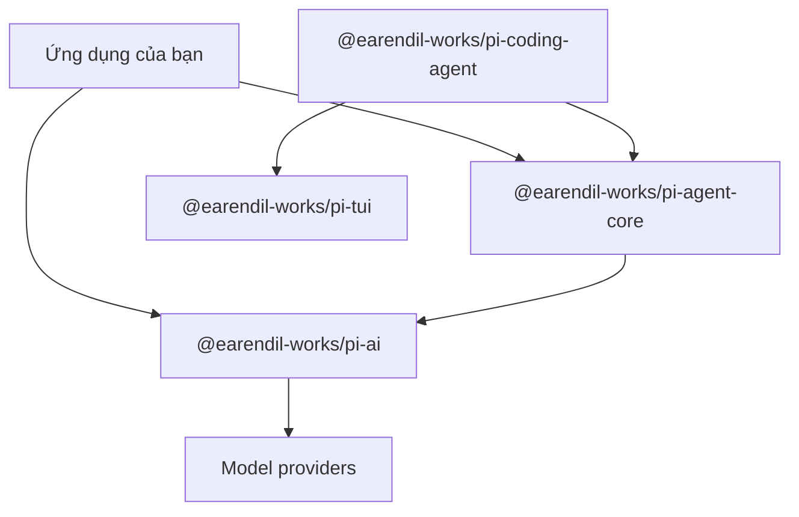

Pi có ba cách sử dụng: một coding agent có thể chạy ngay, một codebase gọn để nghiên cứu, và một nhóm package để xây ứng dụng agent riêng. Chương này nối ba nhu cầu đó với cấu trúc repository.

:::info[Phạm vi phiên bản]

Các ví dụ trong lần review này đã được đối chiếu với upstream commit [`a470b121`](https://github.com/badlogic/pi-mono/commit/a470b121bf683b4c2b9fc0b3a7c807de7e0cfe9c). Tên package và API có thể thay đổi ở revision sau.

:::

## 1. Ba lý do để đọc Pi

### 1.1 Dùng một coding agent tập trung

CLI `pi` cung cấp giao diện terminal, chọn model, ngữ cảnh dự án, Tool quản lý file và shell, phiên làm việc, extension và skill. Bề mặt mặc định được giữ nhỏ; mỗi dự án chỉ bổ sung workflow thật sự cần thiết.

### 1.2 Hiểu cách agent vận hành

Repository tách model transport, agent runtime, ứng dụng coding agent và terminal renderer. Bạn có thể lần theo một user prompt từ CLI tới model stream, qua bước chạy Tool, rồi quay về session state được lưu bền vững mà không phải học một framework lớn trước.

### 1.3 Xây agent chuyên biệt

Các npm package có thể dùng độc lập. Một service có thể chỉ dùng model layer, một ứng dụng khác có thể nhúng agent runtime, hoặc một sản phẩm terminal có thể tái sử dụng các component TUI.

## 2. Bề mặt dự án



Các mũi tên biểu diễn hướng dependency. Model package không biết về vòng lặp Agent hay terminal. Agent runtime cũng không phụ thuộc vào coding-agent CLI.

### 2.1 `@earendil-works/pi-ai`

Package này định nghĩa model metadata, message, Tool, provider registration, helper xác thực và streaming API. Nó chuẩn hóa response của các provider về cùng một event model.

### 2.2 `@earendil-works/pi-agent-core`

Package này quản lý agent state, vòng lặp model/Tool, biến đổi ngữ cảnh, chuyển đổi message, hàng chờ và runtime event. Nó nhận stream function từ bên ngoài thay vì import trực tiếp một provider.

### 2.3 `@earendil-works/pi-coding-agent`

Đây là ứng dụng `pi`. Package này ghép system prompt, tìm file chỉ dẫn dự án, đăng ký Tool tích hợp, nạp extension và skill, đồng thời lưu session.

### 2.4 `@earendil-works/pi-tui`

TUI package render component tương tác trong terminal. Vì được tách khỏi agent runtime, web service hoặc background worker có thể dùng cùng agent mà không kéo theo terminal dependency.

## 3. Chạy coding agent

Cài CLI ở global scope:

```bash
npm install -g --ignore-scripts @earendil-works/pi-coding-agent
```

Khởi chạy trong thư mục dự án:

```bash
cd /path/to/project
pi
```

Xác thực bằng `/login` hoặc cấu hình API key cho provider. Pi hoạt động trong working directory hiện tại và Tool có thể sửa file, vì vậy hãy dùng version control hoặc cơ chế checkpoint khác.

## 4. Nhúng runtime

Ví dụ dưới tạo một `Agent` với provider Anthropic. Dependency boundary được thể hiện rõ: ứng dụng tạo model collection rồi inject `models.streamSimple` vào agent.

```typescript
import { Agent } from "@earendil-works/pi-agent-core";
import { createModels } from "@earendil-works/pi-ai";
import { anthropicProvider } from "@earendil-works/pi-ai/providers/anthropic";

const models = createModels();
models.setProvider(anthropicProvider());

const model = models.getModel("anthropic", "claude-sonnet-4-6");
if (!model) throw new Error("Model not found");

const agent = new Agent({
  initialState: {
    systemPrompt: "You are a concise coding assistant.",
    model,
  },
  streamFn: models.streamSimple.bind(models),
});

agent.subscribe((event) => {
  if (
    event.type === "message_update" &&
    event.assistantMessageEvent.type === "text_delta"
  ) {
    process.stdout.write(event.assistantMessageEvent.delta);
  }
});

await agent.prompt("Explain this repository in three bullets.");
```

Đoạn code này không chứa terminal UI hoặc session manager. Đó là lựa chọn của application layer, không phải dependency bắt buộc của core runtime.

## 5. Đặt phần tùy chỉnh ở đâu

Hãy dùng layer hẹp nhất có thể giải quyết yêu cầu:

| Yêu cầu | Extension point |
| --- | --- |
| Thêm hoặc cấu hình model provider | Provider registration của Pi AI |
| Thay đổi message trước model call | `transformContext` hoặc `convertToLlm` |
| Cung cấp capability mới cho model | `AgentTool` hoặc coding-agent extension |
| Thêm slash command hoặc lifecycle hook | Coding-agent extension |
| Tái sử dụng chỉ dẫn giữa các dự án | Skill hoặc prompt template |
| Thay đổi giao diện terminal | Theme, extension hoặc Pi TUI |

Cách tách này giữ provider code ngoài vòng lặp Agent và giữ application policy ngoài model layer.

## 6. Đánh đổi

Core nhỏ giúp bạn kiểm soát hệ thống, nhưng cũng khiến bạn chịu trách nhiệm về policy. Agent production có thể cần approval rule, sandbox, observability, retry limit, durable storage và domain-specific evaluation. Pi cung cấp extension point để xây các phần đó nhưng không quyết định thay bạn.

## 7. Lộ trình đọc

Đọc tiếp [Chương 2](ch02-three-layer-arch.md) để hiểu package boundary, sau đó đến [Chương 3](ch03-agent-loop.md) để phân tích runtime loop. Chương 4 đến 10 lần lượt trình bày model call, Tool, message, event, ngữ cảnh, nén ngữ cảnh và session.
