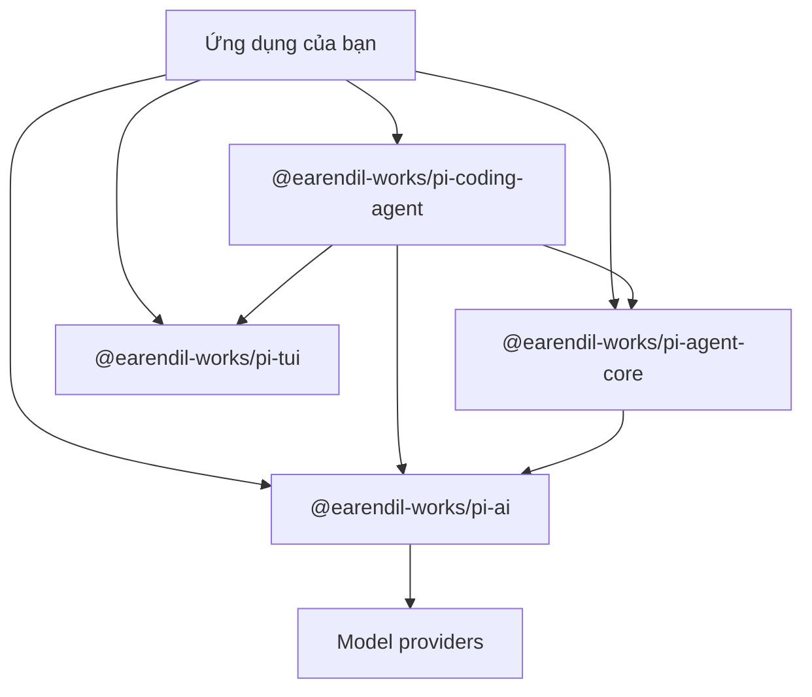

> Đây là chương mở đầu của _Pi Agent chuyên sâu_. Chương này chưa đi ngay vào chi tiết source code mà trả lời câu hỏi cần được đặt ra trước: Pi là gì, và vì sao đáng để nghiên cứu? Câu trả lời có ba phần: Pi là một công cụ coding, một implementation dễ đọc và một SDK phát triển.

:::info[Phạm vi phiên bản]

Các thông tin và ví dụ trong chương đã được đối chiếu với upstream commit [`f07218c`](https://github.com/earendil-works/pi/commit/f07218c4d4bbc12bef056a7058c3dd49dfe41abe), package version `0.87.1`. Cả bốn package nền tảng đều yêu cầu Node.js `>=22.19.0`. Catalog package và API có thể thay đổi ở các release sau.

:::

## 1. Mở đầu: ba câu hỏi, một đáp án

Người đọc thường đến với một trong ba câu hỏi:

1. **“Tôi có thể dùng một Coding Agent tập trung ngay hôm nay không?”** Bạn muốn một công cụ terminal có thể đọc repository, sửa file, chạy command và giữ session mà không áp đặt một workflow cố định quá lớn.
2. **“Tôi có thể học cách một Agent thực tế vận hành không?”** Demo gói trong một file thường giấu các phần khó, còn framework lớn có thể chôn model call, bước thực thi Tool, event và persistence dưới quá nhiều layer.
3. **“Tôi có thể xây Agent cho sản phẩm của mình không?”** Bạn cần một model layer, một Agent Loop hoặc một coding-agent session hoàn chỉnh mà không phải nhận cả một ứng dụng nguyên khối.

Pi trả lời cả ba trong cùng một repository. CLI `pi` là công cụ dùng hằng ngày. Cách tách model transport, Agent state, bước thực thi Tool, quản lý session và terminal rendering giúp implementation trở thành tài liệu học tập hữu ích. Các package đã publish cho phép ứng dụng khác chỉ tái sử dụng đúng layer mà nó cần.

Câu trả lời ba phần đó quyết định thứ tự chương này. Ta lập bản đồ repository trước, rồi nhìn Pi lần lượt như một công cụ, một tài liệu học tập và một SDK. Nhờ vậy, các chương sau có thể tập trung vào từng cơ chế mà không phải dựng lại toàn cảnh sản phẩm mỗi lần.

## 2. Pi là gì: một sơ đồ là đủ

### Định nghĩa trong một câu

**Pi là một terminal Coding Agent shell tối giản, có thể mở rộng, được viết bằng TypeScript và phát hành theo giấy phép MIT.**

Mỗi từ trong định nghĩa đều thu hẹp phạm vi thiết kế:

- **Coding Agent shell:** Pi nối Model, system prompt, context của dự án, Tool và session state thành một ứng dụng có thể đọc rồi thay đổi codebase. Từ “shell” mô tả bộ khung và các điểm kết nối, còn Model và policy vẫn có thể thay thế.
- **Terminal:** giao diện tương tác mặc định chạy ngay nơi developer đã dùng shell, version control và công cụ quản lý process. TUI mode thông thường giữ terminal-owned scrollback. Version `0.87.1` còn có fullscreen TUI mode thử nghiệm với application-owned scrolling, vì vậy “terminal” không còn đồng nghĩa với một chiến lược render duy nhất.
- **Mặc định tối giản:** Model nhận bốn Tool theo mặc định: `read`, `write`, `edit` và `bash`. Ba helper tích hợp chỉ đọc tùy chọn, `grep`, `find` và `ls`, có sẵn qua Tool options. Tool `powershell` tùy chọn được chọn riêng khi cần PowerShell native. Các tính năng như plan mode và sub-agent nằm ngoài bề mặt sản phẩm mặc định.
- **Có thể mở rộng:** Extension có thể đăng ký Tool, command, shortcut, event hook, Provider và UI. Skill, Prompt Template, Theme và Pi Package lần lượt phụ trách instruction tái sử dụng, prompt, presentation và distribution.

Pi chạy được ngay sau khi cài, nhưng defaults của nó là một tổ hợp đã biết là hoạt động, không phải định nghĩa sản phẩm đóng kín. Bạn có thể thay từng bộ phận mà không phải duy trì một fork của Pi internals.

### Những con số chính và ảnh chụp ổn định

Số star hay số lượng Provider thay đổi nhanh, nên ảnh chụp này chỉ ghi các dữ kiện có thể kiểm tra trực tiếp ở revision đã pin:

| Chỉ số                   | Giá trị đã pin | Điều có thể rút ra                                                                                   |
| ------------------------ | -------------- | ---------------------------------------------------------------------------------------------------- |
| Package version          | `0.87.1`       | Chương mô tả một release cụ thể, không dựa trên nhánh `main` không xác định.                         |
| Node.js runtime          | `>=22.19.0`    | Cùng yêu cầu engine xuất hiện trong manifest của các package nền tảng.                               |
| Tool mặc định            | 4              | `read`, `write`, `edit` và `bash` tạo thành bề mặt mặc định mà Model nhìn thấy.                      |
| Helper tích hợp tùy chọn | 3              | Có thể chọn `grep`, `find` và `ls` qua Tool options.                                                 |
| Shell Tool tùy chọn      | 1              | `powershell` được chọn riêng và không bật theo mặc định.                                             |
| Package nền tảng         | 4              | Pi AI, Agent Core, Coding Agent và TUI tách model, runtime, product và terminal concern.             |
| Đường chạy               | 4              | Interactive; print hoặc JSON; RPC; và SDK phục vụ người dùng, script, process và ứng dụng nhúng.     |
| Hình dạng session        | Cây JSONL      | `id` và `parentId` cho phép rẽ nhánh tại chỗ nhưng vẫn giữ các đường cũ trong cùng một session file. |

:::note[Vì sao ảnh chụp không dùng số liệu phổ biến]

Số star, kích thước catalog và số dòng source thay đổi mà không làm đổi kiến trúc. Invariant hữu ích nằm ở boundary: Provider sở hữu Model và auth, Agent Core sở hữu loop, Coding Agent lắp ráp product policy, còn TUI sở hữu phần trình bày trên terminal.

:::

### Bốn package nền tảng, mỗi package một nhiệm vụ

Có thể đọc package layout ở dạng text trước khi xem các dependency arrow:

```text
┌───────────────────────────────────────────────────────────────┐
│ @earendil-works/pi-coding-agent                              │
│ CLI + SDK · system prompt · Tools · sessions · Extensions    │
├───────────────────────────────────────────────────────────────┤
│ @earendil-works/pi-agent-core │ @earendil-works/pi-tui       │
│ Agent state · loop · events   │ terminal renderers/components │
├───────────────────────────────┴───────────────────────────────┤
│ @earendil-works/pi-ai                                        │
│ providers · models · auth · streaming · token/cost tracking  │
└───────────────────────────────────────────────────────────────┘
```



`@earendil-works/pi-ai` định nghĩa các abstraction chung cho Model, message, Tool, stream, Provider, catalog và credential. Một collection `Models` giữ các Provider đã đăng ký rồi route request đến Provider sở hữu Model được chọn. Provider factory chỉ mang vào catalog của một Provider cùng API wrapper được load trễ; `builtinModels()` là entry point nặng hơn và có chủ đích khi ứng dụng cần mọi Provider tích hợp.

`@earendil-works/pi-agent-core` bổ sung state và behavior quanh model layer. Package này sở hữu Agent Loop, bước thực thi Tool, chuyển đổi message, hàng đợi steering và follow-up, cùng runtime event. Agent nhận `streamFn`, vì vậy loop không hard-code một Provider implementation.

`@earendil-works/pi-coding-agent` lắp ráp sản phẩm. Nó tìm context file và resource, tạo managed Tool, chọn Model, quản lý session dạng cây, thực hiện compaction, nạp Extension và expose cùng bộ máy session qua SDK.

`@earendil-works/pi-tui` nằm trực giao với Agent stack ba layer. Package này không có runtime dependency vào những Pi package còn lại, và source cũng không import chúng. Coding Agent phụ thuộc TUI cho phần trình bày tương tác; server hoặc background worker vẫn có thể dùng Pi AI và Agent Core mà không cần terminal.

Workspace hiện tại còn có `@earendil-works/chord`, `@earendil-works/pi-client`, `@earendil-works/pi-protocol`, `@earendil-works/pi-server`, `@earendil-works/pi-telemetry`, `@earendil-works/pi-durable` và một SQLite session backend riêng. Bộ ba client/protocol/server là một boundary sibling thử nghiệm, tùy chọn dành cho Chord service có route; nó không phải layer SDK bắt buộc thứ tư. Telemetry, durable execution và persistence cũng bổ sung capability tập trung mà không thay thế bốn package nền tảng phía trên. `pi-orchestrator` thử nghiệm trong chương baseline cũ không còn ở commit đã pin.

## 3. Góc nhìn 1: với tư cách Coding Agent: công cụ hằng ngày hữu dụng

### 3.1 Pi là gì: building blocks, không phải chiếc xe hoàn chỉnh

Phép so sánh với chiếc xe trong chương gốc vẫn phù hợp. Một công cụ coding tích hợp hoàn chỉnh trao cho bạn cả chiếc xe: bộ điều khiển, safety policy, navigation và cabin layout đi cùng nhau. Pi trao engine, chassis, hệ thống lái và một bản lắp ráp mặc định đã chạy được. Bạn có thể lái ngay rồi thay các phần đang hạn chế workflow.

Vị trí đó giải thích nhiều lựa chọn sản phẩm:

- Bốn Tool mặc định giữ bề mặt capability thường trực ở mức có thể hiểu được.
- System prompt, instruction dự án và các Skill đã nạp vẫn nhìn thấy được thay vì ẩn sau một hosted product.
- Plan mode, sub-agent, permission gate, MCP integration và custom editor có thể là Extension hoặc package thay vì policy bắt buộc.
- Session, Model và giao diện đều có public customization point, nên quyền sở hữu không đòi hỏi một fork sống lâu.

Bài học có thể chuyển sang hệ thống khác nằm ở quyền sở hữu:

> Default được hoàn thiện tốt giúp người dùng đạt kết quả hữu ích đầu tiên. Building blocks được expose cho phép chính người dùng đó quyết định kết quả thứ một trăm sẽ được tạo ra như thế nào.

Default vẫn rất quan trọng. Chạy `pi` sẽ khởi động một Coding Agent có Tool cho file và shell, chọn Model, tìm context, lưu session và nạp resource. “Building blocks” mô tả nơi quyền quyết định nằm, không có nghĩa installation còn dang dở.

Đánh đổi này hợp với developer quen terminal, dùng version control và muốn kiểm tra hoặc thay policy. Team cần một workflow thống nhất do trung tâm quy định có thể hợp với công cụ tích hợp hơn. Câu hỏi thực tế là ai nên sở hữu prompt, capability, security boundary và behavior của giao diện?

### 3.2 Năm cơ chế tùy chỉnh: tự xây tính năng còn thiếu

Pi expose năm cơ chế. Bốn cơ chế đầu thay đổi workflow cục bộ; cơ chế thứ năm dùng để phân phối kết quả.

**Extension: runtime behavior**

Extension là module TypeScript được Coding Agent nạp. Nó có thể đăng ký Tool mà Model gọi được, slash command, keyboard shortcut, flag, event handler, Model Provider, message renderer hoặc terminal component. Nó cũng có thể thay Tool tích hợp. Extension được tự động tìm trong `~/.pi/agent/extensions/` hoặc `.pi/extensions/` có thể reload bằng `/reload`; chỉ sửa file Extension sẽ chưa tự thay instance đang chạy.

Boundary reload rõ ràng vẫn hỗ trợ self-modification. Agent có thể sửa Extension rồi sắp xếp reload qua command hoặc follow-up message. Ví dụ upstream `reload-runtime.ts` minh họa lifecycle này. Sau khi reload hoàn tất, các command, event và Tool call tiếp theo dùng Extension instance mới.

**Skill: instruction được nạp theo nhu cầu**

Skill đóng gói instruction, script, reference và asset cho một nhóm task. Khi khởi động, Pi đưa tên cùng description của Skill vào system prompt. Model chỉ đọc toàn bộ `SKILL.md` khi task phù hợp hoặc người dùng gọi `/skill:name`. Progressive disclosure này giữ một thư viện instruction lớn luôn sẵn sàng mà không nhét mọi instruction vào mọi model call.

**Prompt Template: prompt có thể lặp lại**

Prompt Template bằng Markdown biến prompt dùng thường xuyên thành slash command và nhận argument. Team có thể mã hóa hình dạng của một lượt review, release check hoặc investigation mà không thêm executable code. Cơ chế này phù hợp khi workflow cần text lặp lại nhưng không cần runtime capability mới.

**Theme: presentation**

Theme định nghĩa hệ màu của TUI. Custom Theme đang active có hỗ trợ tự động hot reload; behavior này hẹp hơn reload của Extension. Presentation được giữ tách khỏi Agent state và Tool policy.

**Pi Package: distribution**

Pi Package gom Extension, Skill, Prompt Template và Theme. Package có thể dùng các thư mục theo convention hoặc khai báo resource dưới key `pi` trong `package.json`, rồi được cài từ npm, git, URL hoặc local path.

```bash
pi install npm:@foo/pi-tools@1.0.0
pi install git:github.com/user/repo@v1
pi install ./relative/path/to/package
pi config
```

:::caution[Độ tin cậy của package]

Pi Package là đầu vào executable trong supply chain. Extension chạy code tùy ý, còn Skill có thể chỉ dẫn Model chạy chương trình. Hãy review package bên thứ ba trước khi cài. Project trust kiểm soát việc nạp project-local settings và executable resource; nó không phải sandbox cho các Tool call về sau.

:::

Năm cơ chế kết hợp thành một con đường tuần tự: dùng Pi, điều chỉnh Pi, rồi chia sẻ workflow đã được duy trì. Các chương sau có thể xem implementation chi tiết; tại đây chỉ cần giữ kết luận kiến trúc: product policy còn thiếu luôn có một nơi xác định để tồn tại.

### 3.3 Lợi ích hằng ngày: cấu hình mặc định hữu dụng

Tối giản sẽ không có nhiều giá trị nếu Agent mặc định không làm được việc thật. Default của Pi bao phủ cả daily loop nhưng vẫn giữ từng input ở trạng thái có thể quan sát.

**Bề mặt Tool nhỏ.** `read`, `write`, `edit` và `bash` bao phủ inspection, modification và command execution. Khi task cần thao tác chỉ đọc hẹp hơn, hãy bật `grep`, `find` và `ls`. Bạn cũng có thể dùng `--tools`, `--exclude-tools`, `--no-builtin-tools` hoặc `--no-tools` để định hình active set.

**Context và resource nhìn thấy được.** Startup header báo các context file, Prompt Template, Skill và Extension đã nạp. `AGENTS.md`, `CLAUDE.md` và `AGENTS.override.md` tạo một instruction layer minh bạch cho dự án. `/reload` refresh context và resource sau khi sửa.

**Tự do chọn Provider và Model.** Provider tích hợp sở hữu catalog và cơ chế resolve credential. `/model` hoặc `Ctrl+L` chọn Model khả dụng, còn scoped model cycling giữ một working set nhỏ hơn. Pi AI duy trì một message representation chung và xử lý streaming riêng của Provider; nhờ đó có thể hand-off giữa Provider dù định dạng reasoning của chúng không giống hệt nhau.

**Session dạng cây.** Session là file JSONL với các entry mang `id` và `parentId`. `/tree` quay về điểm cũ rồi tiếp tục trong cùng file, tạo branch khác thay vì xóa đường đã bỏ. `/fork` và `/clone` tạo session file mới khi việc tách riêng hữu ích hơn. Lịch sử đầy đủ vẫn còn ngay cả khi compaction có mất mát đã thay đổi active model context.

**Mặc định không có popup phê duyệt từng command.** Tool mà Model nhìn thấy có thể sửa file và chạy command mà không hỏi trước mỗi call. Pi có project trust để nạp project-local settings và executable resource, nhưng đó là quyết định tin cậy lúc khởi động chứ không phải Tool sandbox. Dùng git để phục hồi, đồng thời dùng container hoặc VM khi cần security boundary mạnh hơn. Extension có thể thêm policy phê duyệt hoặc bảo vệ path cho workflow cần chúng.

**Output có thể kiểm tra.** Transcript tương tác gồm message, Tool call, result, notification và error. Có thể export session sang HTML hoặc JSONL. Chi phí cùng token usage xuất hiện trên giao diện. Nhờ các dữ kiện đó, một quyết định lạ của Agent trở thành vấn đề có thể điều tra từ input và event đã ghi.

### 3.4 Chạy sau một phút

Kiểm tra Node.js version, cài CLI rồi khởi động Pi trong repository mà nó được phép sửa:

```bash
node --version # must satisfy >=22.19.0
npm install -g --ignore-scripts @earendil-works/pi-coding-agent
cd /path/to/project
pi
```

`--ignore-scripts` tắt dependency lifecycle script trong lúc cài; Pi không cần install script cho một lượt cài npm thông thường. Người dùng Linux và macOS cũng có thể chạy installer chính thức `curl -fsSL https://pi.dev/install.sh | sh`.

Xác thực trong TUI bằng `/login`, hoặc cung cấp biến môi trường API key cho Provider tích hợp, chẳng hạn `ANTHROPIC_API_KEY`. `/login` cũng có thể lưu API key vào `~/.pi/agent/auth.json`. Khi Pi đã chạy, hãy yêu cầu nó tóm tắt repository và nêu các command dùng để test. Request đầu tiên đó đi qua context discovery, model streaming và đường Tool đọc/shell mặc định mà chưa cần tùy chỉnh.

Pi làm việc trong thư mục hiện tại và có thể thay đổi file ở đó. Hãy bắt đầu trong một checkout sạch có version control nếu bạn muốn diff và rollback dễ dàng.

### 3.5 Định nghĩa Model và credential: cấu hình `models.json`

`~/.pi/agent/models.json` thêm custom Provider và Model sử dụng API được hỗ trợ: OpenAI Chat Completions, OpenAI Responses, Anthropic Messages hoặc Google Generative AI. File này cung cấp **định nghĩa Model** như protocol, endpoint, Model ID, input type, context window, output limit, cost và compatibility flag.

Credential vẫn là concern riêng. Pi có thể resolve credential từ `/login` và `auth.json`, CLI `--api-key`, trường `apiKey` của Provider hoặc biến môi trường được trường đó tham chiếu. Provider factory tích hợp còn biết các biến môi trường chuẩn của chính nó. Định nghĩa Model cho biết có thể gọi gì; credential resolution quyết định Model có khả dụng không và request được xác thực thế nào.

Ví dụ custom gateway dưới đây giữ key ngoài file JSON bằng cách nội suy một biến môi trường:

```json
{
  "providers": {
    "company-gateway": {
      "baseUrl": "https://llm.example.com/v1",
      "api": "openai-completions",
      "apiKey": "$COMPANY_LLM_API_KEY",
      "models": [
        {
          "id": "team-coder",
          "name": "Team Coder",
          "reasoning": true,
          "input": ["text", "image"],
          "contextWindow": 128000,
          "maxTokens": 16384,
          "compat": {
            "supportsDeveloperRole": false
          }
        }
      ]
    }
  }
}
```

Các trường chính có nhiệm vụ khác nhau:

- `providers` ánh xạ Provider ID. Key `company-gateway` trở thành giá trị `provider` của Model.
- `baseUrl` chọn endpoint, còn `api` chọn wire protocol Pi sẽ dùng.
- `apiKey` là trường tùy chọn. Nó nhận literal, phép nội suy `$ENV_VAR` hoặc `${ENV_VAR}`, hay một `!command` có stdout được resolve tại request time. Bỏ trường này nếu `/login`, `auth.json` hoặc `--api-key` cung cấp auth.
- `models` chứa các định nghĩa Model. `id` được gửi tới endpoint; `name` là metadata dùng cho matching và phần hiển thị phụ. `contextWindow` cùng `maxTokens` cung cấp giới hạn cho request và compaction.
- `compat` mô tả sai khác so với protocol đã chọn. Chỉ nên giữ override hẹp và có behavior thực của gateway làm căn cứ.

Mở `/model` để reload `models.json` trong session; không cần restart process. Dùng `/model` hoặc `Ctrl+L` để chọn entry, `--list-models [search]` để xem các Model đã nạp từ CLI, và đặt `defaultProvider` cùng `defaultModel` trong `settings.json` để chọn default lúc khởi động.

Hai đường nâng cao vẫn giữ cùng cách tách concern. `modelOverrides` vá metadata cho Model tích hợp đã biết hoặc Model do Extension đăng ký phù hợp mà không thay toàn bộ Provider catalog. `compat` ở cấp Provider hoặc Model ghi lại protocol quirk. Với wire protocol mới hoặc custom OAuth flow, hãy viết Extension Provider thay vì ép nó vào `models.json`.

## 4. Góc nhìn 2: với tư cách tài liệu học tập: giáo trình thiết kế Agent

### 4.1 Tại sao là Pi? Vì code path đủ dễ đọc

Pi là tài liệu học tập hữu ích vì package boundary khớp với những câu hỏi người đọc đặt ra. Prompt đi vào Coding Agent, trở thành Agent state, đến Provider qua collection `Models`, quay lại dưới dạng stream event, có thể yêu cầu Tool, rồi cuối cùng được append vào cây session. Mỗi boundary đều có package và public vocabulary tương ứng.

Layout đó tạo ra nhiều lộ trình đọc thực tế:

- Theo một model call trong `packages/ai` để học Provider factory, auth resolution, message type và streaming mà không phải xử lý session hoặc TUI policy.
- Theo `Agent.prompt()` trong `packages/agent` để học state transition, Tool execution, queue và event mà không cần hiểu resource discovery của Coding Agent.
- Theo `createAgentSession()` trong `packages/coding-agent` để xem Model, managed Tool, resource, compaction và session persistence ghép thành ứng dụng thế nào.
- Đọc riêng `packages/tui` để học differential terminal rendering, component, focus, overlay và behavior của main-screen so với alternate-screen.

Repository đủ lớn để chứa những concern production không tiện bỏ qua: cancellation, authentication, retry, compaction, branching, dynamic resource và nhiều integration mode. Cách tách layer cho phép bạn học một concern mà không giả vờ các concern còn lại không tồn tại.

Một kỷ luật đọc hữu ích là lần theo một request từ đầu đến cuối trước khi lập danh mục mọi type. Bắt đầu từ user prompt, đánh dấu từng state hoặc event boundary, rồi ghi lại package nào có quyền quyết định tại điểm đó. Các chương tiếp theo dùng chính đường đi này.

### 4.2 Tutorial này trình bày gì

Chuỗi tài liệu đã publish gồm mười một chương. Sáu chương đầu dựng execution path; năm chương cuối tách các runtime concern dễ hiểu hơn khi message và Tool đã quen thuộc.

| Chương    | Chủ đề                | Câu hỏi được trả lời                                              | Vai trò đọc |
| --------- | --------------------- | ----------------------------------------------------------------- | ----------- |
| Chương 1  | Tổng quan             | Pi là gì, và identity nào trong ba identity phù hợp với tôi?      | Định hướng  |
| Chương 2  | Kiến trúc phân lớp    | Các package nền tảng chia trách nhiệm thế nào?                    | Nền tảng    |
| Chương 3  | Agent Loop            | Prompt trở thành các lượt Model và Tool lặp lại ra sao?           | Cốt lõi     |
| Chương 4  | Gọi Model             | Pi route một API tới các Provider và Model khác nhau thế nào?     | Cốt lõi     |
| Chương 5  | Tool System           | Tool được định nghĩa, validate, chọn và thực thi ra sao?          | Cốt lõi     |
| Chương 6  | Message System        | Conversation state đi qua boundary của Agent và Provider thế nào? | Cốt lõi     |
| Chương 7  | Kiến trúc hướng event | Event nào expose tiến độ và thay đổi lifecycle?                   | Nâng cao    |
| Chương 8  | Context Engineering   | Những gì đi vào model context hữu hạn, và có thể biến đổi ở đâu?  | Nâng cao    |
| Chương 9  | Context Compaction    | Pi tiếp tục thế nào khi active context gần chạm giới hạn?         | Nâng cao    |
| Chương 10 | Quản lý Session       | Session được append, khôi phục, điều hướng và rẽ nhánh thế nào?   | Nâng cao    |
| Chương 11 | Testing và evaluation | Có thể test và evaluate hành vi Agent một cách deterministic ra sao? | Nâng cao |

:::tip[Lộ trình đọc]

Đọc chương 1–6 theo thứ tự khi bạn muốn nắm toàn bộ runtime model. Sau đó có thể dùng chương 7–11 như reference theo chủ đề. Extension internals, remote protocol package và TUI chuyên sâu vẫn là các chủ đề nối tiếp hữu ích trong upstream source và docs, nhưng nằm ngoài chuỗi mười một chương này.

:::

Mỗi chương kỹ thuật cần trả lời ba câu hỏi: cơ chế là gì, source đã pin implement nó thế nào, và implementation đó tạo ra đánh đổi nào? Một code tour bỏ câu hỏi thứ ba chỉ dạy tên gọi chứ chưa dạy thiết kế.

### 4.3 Triết lý trừ của Pi: học từ các đánh đổi

README upstream nêu trực tiếp những phần Pi bỏ khỏi default. Đây là product boundary, không phải tuyên bố capability đó không bao giờ có thể tồn tại:

| Default không có | Lý do từ upstream                                                                  | Cách thay thế được hỗ trợ                                                            |
| ---------------- | ---------------------------------------------------------------------------------- | ------------------------------------------------------------------------------------ |
| MCP integration  | Ưu tiên CLI theo task cùng instruction thay vì một protocol surface bắt buộc.      | Dùng CLI kèm Skill, hoặc cài/xây MCP Extension.                                      |
| Sub-agent        | Workflow khác nhau cần orchestration và observability khác nhau.                   | Chạy nhiều Pi instance qua `tmux`, dùng ví dụ chính thức hoặc xây Extension/package. |
| Permission popup | Confirmation flow chung không thể mã hóa security boundary của mọi môi trường.     | Dùng container, hoặc thêm approval và path policy qua Extension.                     |
| Plan mode        | File bền vững dễ kiểm tra và tái sử dụng, còn mỗi team có plan semantic khác nhau. | Viết `plan.md`, dùng ví dụ chính thức hoặc cài package.                              |
| Todo tích hợp    | Cơ chế todo cố định có thể cạnh tranh với task state của Model.                    | Dùng `TODO.md` hoặc Extension.                                                       |
| Background bash  | Process manager sẵn có của terminal đã expose và điều khiển background work.       | Dùng `tmux` hoặc implement Extension theo workflow.                                  |

Phép trừ buộc ta đặt câu hỏi kiến trúc: behavior nào thuộc shared runtime, và behavior nào thuộc application hoặc project boundary? Pi giữ streaming, state, Tool execution, session và resource loading trong implementation dùng chung. Nó để orchestration style, approval policy, capability chuyên biệt và phần lớn presentation policy ở trạng thái có thể thay thế.

Thiết kế này có chi phí. Team tùy chỉnh Pi phải review Extension code, phân phối package, viết lại local convention thành tài liệu, test upgrade và chọn sandbox boundary. Lợi ích là các quyết định đó vẫn nhìn thấy và thay đổi được. Chi phí là Pi không quyết định mọi thứ thay team.

Cách thiết kế này cho bốn bài học có thể áp dụng ngoài Pi:

1. Default nên bao phủ common path mà không biến thành con đường duy nhất.
2. Extension system chỉ đáng tồn tại khi hook của nó chạm được các policy người dùng cần thay.
3. Công cụ sẵn có của operating system có thể là boundary tốt hơn hidden reimplementation nếu nó giữ được observability.
4. Safety cần threat boundary rõ ràng. Project-trust prompt, confirmation từng command, version control và container giải quyết các vấn đề khác nhau.

## 5. Góc nhìn 3: với tư cách SDK: xây Agent của riêng bạn

### 5.1 SDK stack: ba layer cộng một thư viện UI trực giao

Agent stack có thể tái sử dụng là `@earendil-works/pi-ai` → `@earendil-works/pi-agent-core` → `@earendil-works/pi-coding-agent`. Ứng dụng có thể dừng ở bất kỳ layer nào. `@earendil-works/pi-tui` nằm bên cạnh stack vì terminal presentation là một concern khác.

**Layer 1: Pi AI cho model call**

API hiện tại dùng collection `Models` và Provider factory. Ví dụ này đăng ký một Provider, resolve Model của nó rồi stream text. Provider sở hữu credential resolution; với Anthropic trên Node.js, credential có thể đến từ `ANTHROPIC_API_KEY`, stored credential hoặc request option tường minh.

```typescript
import { createModels, type Context } from "@earendil-works/pi-ai";
import { anthropicProvider } from "@earendil-works/pi-ai/providers/anthropic";

const models = createModels();
models.setProvider(anthropicProvider());

const model = models.getModel("anthropic", "claude-sonnet-4-6");
if (!model) throw new Error("Model not found");

const context: Context = {
  systemPrompt: "You are a concise code reviewer.",
  messages: [
    {
      role: "user",
      content: "Name two risks in this diff.",
      timestamp: Date.now(),
    },
  ],
};

const stream = models.stream(model, context);
for await (const event of stream) {
  if (event.type === "text_delta") process.stdout.write(event.delta);
}
context.messages.push(await stream.result());
```

Pi AI không có Agent Loop hay terminal dependency. Nó phù hợp với chat, review, extraction, evaluation hoặc bất kỳ ứng dụng nào cần typed message, Tool, Provider routing, streaming, auth và usage accounting. Chỉ đăng ký các Provider factory cần thiết để bundle nhỏ hơn, hoặc gọi `builtinModels()` khi toàn bộ built-in catalog là lựa chọn phù hợp.

**Layer 2: Agent Core cho loop**

Agent Core sở hữu state cùng các lượt Model/Tool lặp lại. Inject `models.streamSimple` giúp model layer vẫn có thể thay thế:

```typescript
import { Agent } from "@earendil-works/pi-agent-core";

const agent = new Agent({
  initialState: {
    systemPrompt: "You are a concise coding assistant.",
    model,
  },
  streamFn: models.streamSimple.bind(models),
});

agent.subscribe((event) => {
  if (
    event.type === "message_update" &&
    event.assistantMessageEvent.type === "text_delta"
  ) {
    process.stdout.write(event.assistantMessageEvent.delta);
  }
});

await agent.prompt("Explain the repository in three bullets.");
```

Thêm object `AgentTool` vào `agent.state.tools` khi Model cần hành động. Runtime validate và thực thi Tool call, append result rồi tiếp tục cho đến khi Model ngừng yêu cầu Tool. `transformContext` và `convertToLlm` cho phép ứng dụng thay hoặc lọc message trước Provider call. Hàng đợi steering và follow-up cho phép caller điều chỉnh công việc trong hoặc sau một lượt chạy.

**Layer 3: Coding Agent cho session hoàn chỉnh**

Coding Agent SDK lắp ráp managed Tool, resource, model runtime, session state và compaction. `SessionManager.inMemory()` hữu ích khi host application tự sở hữu persistence:

```typescript
import {
  createAgentSession,
  ModelRuntime,
  SessionManager,
} from "@earendil-works/pi-coding-agent";

const modelRuntime = await ModelRuntime.create();
const { session } = await createAgentSession({
  sessionManager: SessionManager.inMemory(),
  modelRuntime,
});

session.subscribe((event) => {
  if (
    event.type === "message_update" &&
    event.assistantMessageEvent.type === "text_delta"
  ) {
    process.stdout.write(event.assistantMessageEvent.delta);
  }
});

await session.prompt("Read this codebase and explain its architecture.");
```

Dùng `createAgentSessionRuntime()` và `AgentSessionRuntime` khi host phải thay active session qua flow new, resume, fork, clone hoặc import. Subscription gắn với một `AgentSession` cụ thể, nên host phải subscribe lại sau khi runtime được thay.

**Thư viện bên: Pi TUI cho ứng dụng terminal**

Pi TUI cung cấp main-screen và alternate-screen renderer, differential update, synchronized output, focus, overlay, layout, Markdown, editor, list, image và autocomplete. Nó có thể chạy một CLI dashboard hoặc REPL không liên quan đến Agent vì không import Agent package. Đây là ví dụ rõ về cách tách một nhu cầu của sản phẩm thành thư viện thật sự độc lập.

### 5.2 Hệ thống Extension: để Agent sửa capability của chính nó

Extension system biến customization thành runtime behavior thay vì source fork. Extension factory nhận `ExtensionAPI`, đăng ký phần nó đóng góp và có thể subscribe vào session, Agent, Tool, input cùng resource lifecycle event.

Extension có thể cung cấp:

- **Custom Tool hoặc Tool thay thế:** đăng ký schema và executor mới, hoặc override behavior mặc định của `read`, `write`, `edit` và `bash`.
- **Command và shortcut:** thêm slash command, CLI flag và keybinding cho workflow dự án.
- **Policy hook:** kiểm tra hoặc chặn Tool call, bảo vệ path, tạo checkpoint hay tùy chỉnh compaction.
- **Provider và dynamic Model:** đăng ký Provider tương thích chuẩn hoặc custom streaming, gồm cả OAuth behavior.
- **Terminal UI:** thay editor, header, footer hoặc Tool renderer; thêm status line, widget, dialog và overlay.
- **Resource discovery:** đóng góp path của Skill, Prompt Template và Theme khi startup hoặc reload.

Self-modification loop có boundary chính xác. Agent có thể sửa Extension được tự động tìm, nhưng module đang chạy giữ code cũ cho đến khi `/reload` hoặc `ctx.reload()` hoàn tất. Reload phát lifecycle event shutdown và startup, rồi các call sau đó dùng instance mới. Code sau `await ctx.reload()` vẫn chạy trong call frame cũ, vì vậy reload command nên return ngay. Chi tiết này biến câu “Agent có thể tự sửa mình” thành lifecycle có thể kiểm thử.

Dynamic registration có boundary hẹp hơn. Tool hoặc Provider được đăng ký sau startup có thể khả dụng ngay mà không cần full reload. File custom Theme đang active cũng tự động reload. Biết boundary nào đang áp dụng sẽ tránh stale in-memory state và demo khó hiểu.

Cùng một thiết kế hỗ trợ cả thử nghiệm cá nhân lẫn team policy được duy trì. Extension cục bộ có thể bắt đầu từ vài dòng, bổ sung test cùng dependency, rồi chuyển thành Pi Package khi nhiều dự án cần nó.

### 5.3 Bốn chế độ chạy

Pi trình bày cùng capability về session và Agent qua bốn product path:

| Chế độ          | Trường hợp sử dụng                                                                    | Entry point                                    |
| --------------- | ------------------------------------------------------------------------------------- | ---------------------------------------------- |
| Interactive     | Người dùng làm việc trong TUI với session, command và Model selection.                | `pi`                                           |
| Print hoặc JSON | Script gửi one-shot prompt rồi nhận final text hoặc JSONL event.                      | `pi -p "Summarize this"` hoặc `pi --mode json` |
| RPC             | Process khác điều khiển Pi qua JSONL phân tách nghiêm ngặt bằng LF trên stdin/stdout. | `pi --mode rpc`                                |
| SDK             | Host Node.js/TypeScript nhúng `AgentSession` hoặc session runtime có thể thay thế.    | `createAgentSession()`                         |

Print mode còn gộp stdin được pipe vào initial prompt. JSON mode phát event stream cho consumer cần nhiều hơn final text. RPC expose command và event cho host không dùng Node mà không bắt chúng implement lại session của Pi. SDK trao object cùng callback trực tiếp cho TypeScript host.

Các mode chia sẻ implementation thay vì định nghĩa bốn sản phẩm không liên quan. Workflow có thể bắt đầu bằng thử nghiệm tương tác, chuyển sang script, rồi thành embedded service mà vẫn giữ cùng khái niệm về Model, Tool, message và session.

### 5.4 Ví dụ hệ sinh thái trong upstream tree

Repository đã pin minh họa hệ sinh thái mà không dựa vào project count khó kiểm chứng. Ví dụ Extension gồm `plan-mode`, `subagent`, `permission-gate.ts`, `protected-paths.ts`, `ssh.ts`, `sandbox` và `gondolin`. Ví dụ UI trải từ custom footer và modal editor tới Doom overlay. Chúng làm bảng phép trừ trở nên cụ thể: default bỏ một tính năng nhưng hook đã publish vẫn đủ để implement nó.

Các ví dụ SDK tạo thành một progression khác. Chúng bắt đầu với `01-minimal.ts`, rồi thêm custom Model, prompt, Skill, Tool, Extension, context file, Prompt Template, credential, settings và session. Các ví dụ cuối minh họa full control cùng `AgentSessionRuntime`. Đây là companion có thể chạy cho Agent stack ba layer ở mức khái niệm.

Pi Package đưa những resource đó qua nhiều dự án. Package npm có thể dùng keyword `pi-package` và xuất hiện trong package gallery; git ref có thể pin; project-local package settings có thể được chia sẻ sau khi dự án được trust. `pi config` cho phép bật hoặc tắt từng resource thay vì coi installation là lựa chọn tất cả hoặc không gì cả.

Pattern thực tế của hệ sinh thái nhỏ và lặp lại được: bắt đầu bằng instruction hoặc Extension gần với vấn đề, đưa nó thành package khi interface đã ổn định, và đặt security review cạnh distribution vì Extension đã cài chạy với quyền của người dùng.

## 6. Mặt đối lập của Pi: hai triết lý sản phẩm

Vị trí của Pi rõ hơn khi so với một coding-agent product tích hợp.

Triết lý tích hợp chọn một built-in workflow rộng. Planning, orchestration, approval, task tracking, model policy và interface behavior có thể đi cùng một trải nghiệm được duy trì thống nhất. Team có common path và ít việc lắp ráp cục bộ hơn. Đổi lại, người dùng làm việc bên trong các quyết định của product owner ngay cả khi dự án cần boundary khác.

Pi chọn built-in workflow nhỏ cộng với public mutation point. Extension, Skill, Prompt Template, Theme và package chuyển nhiều trách nhiệm hơn sang người dùng hoặc team. Lượt customization cục bộ đầu tiên cần công sức, nhưng policy tạo ra có thể khớp repository, môi trường bảo mật và terminal workflow ưa thích.

Không triết lý nào thắng mọi use case:

- Chọn sản phẩm tích hợp khi consistency, behavior do vendor duy trì và setup path ngắn quan trọng hơn khả năng thay internals.
- Chọn Pi khi bạn cần kiểm tra model input, sở hữu session và Tool policy, nhúng runtime hoặc xây workflow mà default product cố ý bỏ.
- Kết hợp hai ý tưởng khi phù hợp. Team có thể chạy Pi với một bộ package đã tuyển chọn cùng project settings, tạo trải nghiệm nội bộ tích hợp trên nền các phần vẫn thay thế được.

Phép so sánh là công cụ thiết kế cho cuốn sách này. Khi Pi bỏ một tính năng, hãy hỏi trách nhiệm đã chuyển sang Extension, Skill, primitive của operating system, host application hay security boundary. Khi Pi giữ một tính năng, hãy hỏi layer thấp hơn nào cần nó tiếp tục là phần dùng chung.

## 7. Tổng kết

Pi hỗ trợ ba cách dùng nghiêm túc:

1. **Với tư cách công cụ coding,** Pi cung cấp terminal default hữu dụng: bốn Tool mà Model nhìn thấy, chọn Provider và Model, project context tường minh, session dạng cây cùng resource system có thể thay workflow.
2. **Với tư cách tài liệu học tập,** package boundary expose đường đi từ prompt tới Provider stream, Tool execution, event, compaction và persistence mà không coi cả repository là một framework layer duy nhất.
3. **Với tư cách SDK,** Agent stack ba layer cùng TUI trực giao cho phép ứng dụng tái sử dụng model collection, Agent Loop, coding session hoàn chỉnh hoặc chỉ terminal component.

Phép trừ của Pi có chi phí: team sở hữu nhiều policy, package review và lựa chọn vận hành hơn. Đổi lại, các lựa chọn đó luôn nhìn thấy. Đọc tiếp [Chương 2](ch02-three-layer-arch.md) để xem package boundary, rồi [Chương 3](ch03-agent-loop.md) để theo một prompt qua runtime loop.

:::note[Source đã review]

Chương này mô tả Pi `0.87.1` tại commit [`f07218c`](https://github.com/earendil-works/pi/tree/f07218c4d4bbc12bef056a7058c3dd49dfe41abe). Các link trong `official_refs` được pin vào đúng revision đó để dữ kiện vẫn kiểm tra được sau khi upstream `main` thay đổi.

:::
