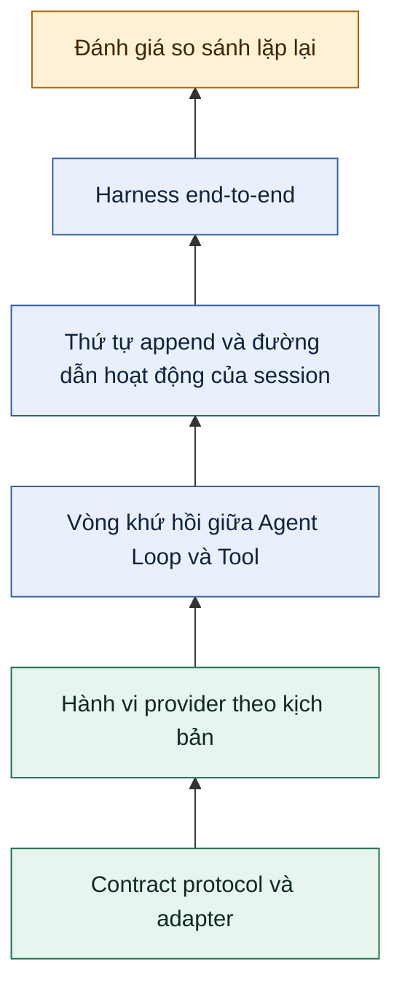

Chương 10 kết thúc ở Session Tree bền vững. Cơ chế lưu bền vững giúp kiểm tra lại một lần chạy Agent, nhưng việc transcript tồn tại trên đĩa không chứng minh Agent đã hoạt động đúng. Một chiến lược kiểm thử hữu ích phải xác lập nhiều sự thật khác nhau: provider adapter tuân thủ streaming protocol, Agent Loop ghép đúng từng lệnh gọi Tool với kết quả, đường dẫn session đang hoạt động vẫn nhất quán, ứng dụng hoàn thành một tác vụ thực tế, và một thay đổi đề xuất hoạt động tốt hơn baseline đủ thường xuyên để đáng phát hành.

Không thể gộp các sự thật đó thành một con số “chất lượng Agent”. Chương này xây dựng mô hình bằng chứng theo tầng quanh Pi `0.99.2`, giải thích loại lỗi thuộc về từng tầng và kết thúc bằng một ma trận sẵn sàng cho release. Ví dụ deterministic biên dịch bằng các export công khai của `@earendil-works/pi-ai@0.99.2` và `@earendil-works/pi-agent-core@0.99.2`. Phần đánh giá cũng trỏ vào monorepo của Pi tại release đã pin vì `packages/evals` là công cụ workspace private, không phải package SDK đã phát hành.

## 1. Xem kiểm thử là bằng chứng theo tầng, không phải một điểm end-to-end

Một lần chạy end-to-end thành công giúp tăng độ tin cậy nhưng vẫn mơ hồ. Nó có thể che một lỗi protocol mà provider được chọn vẫn dung nạp, một kết quả Tool liên kết nhầm call, một nhánh session không hoạt động bị rò vào context, hoặc một judge không ổn định. Theo chiều ngược lại, một lần chạy model thất bại không cho biết hành vi candidate sai hay network không khả dụng.

Hãy xây dựng độ tin cậy từ các contract hẹp và deterministic trước, rồi mới thêm những quan sát rộng hơn và biến động hơn. Mỗi tầng phía trên giả định các tầng bên dưới đã đúng:



Hình trên là một kim tự tháp bằng chứng, không phải khuyến nghị tăng tối đa số lần gọi model. Các tầng thấp nên có nhiều case nhanh vì chúng khoanh vùng defect. Các tầng cao nên có ít kịch bản đại diện hơn vì chạy chậm hơn, tốn kém hơn và khó tái lập hơn.

| Tầng bằng chứng | Test double hoặc fixture | Assertion chính | Tín hiệu lỗi đặc trưng |
| --- | --- | --- | --- |
| Stream protocol | Event đã ghi lại và transport tổng hợp | Thứ tự event hợp lệ và đúng một kết quả terminal | Thiếu event terminal, delta sai định dạng hoặc sai stop reason |
| Provider adapter | Fixture response HTTP/SDK hoặc fake transport cục bộ | Các field trên wire được chuẩn hóa thành kiểu `Message` và usage của Pi | Field đặc thù provider bị rò ra ngoài hoặc content bị mất |
| Provider theo kịch bản | `fauxProvider()` với hàng đợi response | Request chính xác, cách tiêu thụ response và hành vi lỗi | Số request không đúng hoặc hàng đợi response cạn |
| Agent và Tool | `AgentTool` deterministic cùng faux response | Liên kết `ToolCall`/`ToolResultMessage` và transcript cuối | Result mồ côi, thực thi arguments không hợp lệ hoặc sai thứ tự |
| Session | Session storage trong bộ nhớ hoặc tạm thời | Thứ tự append, cô lập branch và phép chiếu active path | Nhánh sibling không hoạt động đi tới model hoặc recovery làm đổi lịch sử |
| Harness end-to-end | Workspace cô lập, cấu hình Agent và ranh giới cleanup | Kết quả người dùng thấy cùng các bất biến của trace | Thiết lập sản phẩm, policy Tool hoặc nạp resource làm hỏng tác vụ |
| Evaluation | Tác vụ held-out, judge, baseline, candidate và các lần lặp | Phân phối verdict theo cặp và telemetry | Regression, mức cải thiện không ổn định, thiếu score hoặc observation không hợp lệ |

Không hàng nào thay thế hàng khác. Một đánh giá dùng model-backed judge không giỏi chẩn đoán event stream bị hỏng, còn kiểm thử protocol không thể cho biết Agent có giải được tác vụ trong repository hay không. Quyết định release nên viện dẫn đúng tầng bằng chứng hỗ trợ cho từng claim.

## 2. Khóa protocol trước khi kiểm thử năng lực provider

Ranh giới provider của Pi là một `AssistantMessageEventStream`. Stream thành công sẽ bắt đầu, phát ra không hoặc nhiều bản cập nhật content có kiểu, rồi kết thúc bằng `done`; stream thất bại hoặc bị abort kết thúc bằng `error`. Kết quả của stream là một `AssistantMessage` cuối, vì vậy test phải xác thực cả chuỗi event lẫn message cuối đó. Nếu chỉ thu thập text đã render, bạn sẽ bỏ sót stop reason, usage, Tool call và lỗi.

### Kiểm thử trực tiếp các bất biến của protocol

Với một stream fixture, hãy assert ít nhất các thuộc tính sau:

1. `start` xuất hiện trước các content delta.
2. Mỗi `contentIndex` trỏ đến đúng block đang được dựng.
3. Block text, thinking hoặc Tool-call có các event bắt đầu và kết thúc tương ứng.
4. Có đúng một event terminal.
5. `done.reason` khớp với `stopReason` của message thành công cuối.
6. `error.reason` là `"error"` hoặc `"aborted"`, và message cuối mang `errorMessage` hữu ích cho host.
7. Thao tác hủy phải settle stream; nó không để promise hoặc iterator treo.

Assertion nên so sánh semantic content sau khi dựng lại. Ranh giới chunk là hành vi transport và có thể thay đổi. Provider có thể phát `"hel"` rồi `"lo"`, hoặc một delta `"hello"`, miễn là block sau khi dựng lại và lifecycle vẫn đúng.

### Giữ fixture của provider adapter ở dưới tầng Agent

Test provider adapter bắt đầu từ một fixture có hình dạng của provider, chẳng hạn HTTP response, SDK event hoặc fake transport cục bộ, rồi quan sát event stream đã chuẩn hóa của Pi. Test nên bao phủ các field do adapter sở hữu: role, block text và thinking, arguments của Tool, usage, stop reason, request header và lỗi provider. Test không cần `Agent`, file session hay coding Tool.

Ranh giới này đặc biệt quan trọng với Tool call. Adapter chỉ chuẩn hóa biểu diễn của provider thành một `ToolCall`; nó không cấp quyền hay thực thi operation. Việc thực thi thuộc về Agent core. Nếu adapter fixture thất bại, diagnostic nên nêu rõ phép ánh xạ provider, thay vì báo rằng một tác vụ coding end-to-end “bị chấm 0 điểm”.

Dùng contract fixture cho các biến thể protocol được hỗ trợ và một integration test nhỏ cho transport thật. Không replay secret hay toàn bộ production payload. Hãy xóa credential và nội dung prompt private trước khi commit fixture vào source control, đồng thời giữ lại các nhãn provider/API/version cần thiết để tái lập phép ánh xạ.

## 3. Lập kịch bản turn deterministic bằng faux provider công khai

`fauxProvider()` là test double công khai của Pi AI cho một collection `Models` tường minh. Nó sở hữu một hoặc nhiều faux model và tiêu thụ assistant response theo kịch bản, theo thứ tự request bắt đầu. Một response có thể là `AssistantMessage` đã dựng sẵn hoặc một factory nhận `TranscriptContext`, stream options, provider state và model được chọn trong thực tế. Factory đó là seam để đặt assertion cho request.

Handle cung cấp `setResponses()`, `appendResponses()`, `getPendingResponseCount()`, `getModel()` và các counter trong `state`. Khác với cơ chế đăng ký compatibility cũ, handle tường minh này không có method `unregister()`. Khi cleanup, hãy xóa provider của nó khỏi collection cô lập bằng `models.deleteProvider(faux.provider.id)`.

Function dưới đây được đồng bộ với `tests/fixtures/pi-sdk-0992.contract.ts` và biên dịch bằng đúng các public dependency `@earendil-works/pi-ai@0.99.2` cùng `@earendil-works/pi-agent-core@0.99.2`. Fixture đã compile-check này chạy offline và không cần network. Function bao phủ trọn một vòng khứ hồi qua Tool mà không dùng API key, environment secret hay filesystem; timer duy nhất là failure-only watchdog dùng để abort, rồi chờ Agent bị treo kết thúc hoàn toàn trước khi tiếp tục. Scripted response đầu chứa text giải thích và một `ToolCall`; response thứ hai là assistant response cuối. Các assertion kiểm tra cả provider request lẫn transcript của Agent.

```typescript
import assert from "node:assert/strict";

import {
  createModels,
  fauxAssistantMessage,
  fauxProvider,
  fauxText,
  fauxToolCall,
  getCurrentSystemPrompt,
  getCurrentTools,
  Type,
  type TranscriptContext,
} from "@earendil-works/pi-ai";
import { Agent, type AgentTool } from "@earendil-works/pi-agent-core";

async function verifyDeterministicAgentRoundTrip(): Promise<void> {
  type ProviderRequestSummary = {
    roles: Array<TranscriptContext["messages"][number]["role"]>;
    systemPrompt: string;
    toolNames: string[];
    messages: TranscriptContext["messages"];
  };
  const requests: ProviderRequestSummary[] = [];
  const models = createModels();
  const faux = fauxProvider({
    provider: "chapter-11-faux",
    models: [{ id: "chapter-11-model", reasoning: false }],
  });
  models.setProvider(faux.provider);

  const addParameters = Type.Object({
    left: Type.Number(),
    right: Type.Number(),
  });
  const addTool: AgentTool<typeof addParameters, { total: number }> = {
    name: "add",
    label: "Add two numbers",
    description: "Return the sum of two numbers",
    parameters: addParameters,
    async execute(toolCallId, { left, right }) {
      assert.equal(toolCallId, "add-1");
      const total = left + right;
      return { content: [fauxText(String(total))], details: { total } };
    },
  };

  function captureTranscriptRequest(
    requests: ProviderRequestSummary[],
    context: TranscriptContext,
  ): void {
    requests.push({
      roles: context.messages.map((message) => message.role),
      systemPrompt: getCurrentSystemPrompt(context.messages),
      toolNames: getCurrentTools(context.messages).map((tool) => tool.name),
      messages: structuredClone(context.messages),
    });
  }

  faux.setResponses([
    (context) => {
      captureTranscriptRequest(requests, context);
      return fauxAssistantMessage(
        [
          fauxText("I will use the add Tool."),
          fauxToolCall("add", { left: 20, right: 22 }, { id: "add-1" }),
        ],
        { stopReason: "toolUse" },
      );
    },
    (context) => {
      captureTranscriptRequest(requests, context);
      return fauxAssistantMessage(fauxText("The total is 42."));
    },
  ]);

  const WATCHDOG_MS = 2_000;
  const awaitWithFailureWatchdog = async <T>(
    operation: Promise<T>,
    label: string,
    onTimeout: () => void,
  ): Promise<T> => {
    let watchdog: ReturnType<typeof setTimeout> | undefined;
    const timeoutFailure = new Promise<never>((_, reject) => {
      watchdog = setTimeout(() => {
        const message = `${label} did not settle within ${WATCHDOG_MS} ms`;
        try {
          onTimeout();
        } catch (cause) {
          reject(new Error(`${message}; timeout cleanup failed`, { cause }));
          return;
        }
        reject(new Error(message));
      }, WATCHDOG_MS);
    });

    try {
      return await Promise.race([operation, timeoutFailure]);
    } finally {
      if (watchdog !== undefined) clearTimeout(watchdog);
    }
  };

  let agent: Agent | undefined;
  try {
    const model = models.getModel("chapter-11-faux", "chapter-11-model");
    assert.ok(
      model,
      "the isolated Models collection must expose the faux model",
    );

    agent = new Agent({
      streamFn: models.streamSimple.bind(models),
      initialState: {
        systemPrompt: "Use the add Tool for arithmetic.",
        model,
        thinkingLevel: "off",
        tools: [addTool],
      },
    });

    await awaitWithFailureWatchdog(
      agent.prompt("What is 20 + 22?"),
      "Chapter 11 Agent run",
      () => agent?.abort(),
    );

    assert.equal(faux.state.callCount, 2);
    assert.equal(faux.getPendingResponseCount(), 0);
    assert.deepEqual(requests[0]?.roles, ["system", "user"]);
    assert.equal(requests[0]?.systemPrompt, "Use the add Tool for arithmetic.");
    assert.deepEqual(requests[0]?.toolNames, ["add"]);
    assert.deepEqual(requests[1]?.toolNames, ["add"]);
    assert.deepEqual(requests[1]?.roles, [
      "system",
      "user",
      "assistant",
      "toolResult",
    ]);

    const requestToolResult = requests[1]?.messages[3];
    assert.equal(requestToolResult?.role, "toolResult");
    if (requestToolResult?.role !== "toolResult") {
      throw new Error("second provider request must contain a Tool result");
    }
    assert.equal(requestToolResult.toolCallId, "add-1");
    assert.equal(requestToolResult.toolName, "add");
    assert.equal(requestToolResult.isError, false);
    assert.deepEqual(requestToolResult.content, [fauxText("42")]);

    assert.deepEqual(
      agent.state.messages.map((message) => message.role),
      ["system", "user", "assistant", "toolResult", "assistant"],
    );
    const finalMessage = agent.state.messages.at(-1);
    assert.equal(finalMessage?.role, "assistant");
    if (finalMessage?.role !== "assistant") {
      throw new Error("transcript must end with an assistant response");
    }
    assert.equal(finalMessage.stopReason, "stop");
    assert.deepEqual(finalMessage.content, [fauxText("The total is 42.")]);
  } finally {
    try {
      agent?.abort();
      if (agent) {
        await awaitWithFailureWatchdog(
          agent.waitForIdle(),
          "Chapter 11 Agent cleanup",
          () => agent?.abort(),
        );
      }
    } finally {
      models.deleteProvider(faux.provider.id);
      assert.equal(models.getProvider(faux.provider.id), undefined);
    }
  }
}
```

Các response factory chỉ clone `TranscriptContext.messages`, vốn chỉ chứa data. Chúng lấy system prompt và Tool declaration hiện hành bằng `getCurrentSystemPrompt()` cùng `getCurrentTools()`; `AgentTool` có thể thực thi vẫn do Agent sở hữu và không nằm trong provider context này. Các assertion chủ động không kiểm tra số chunk của stream. `fauxProvider()` tạo semantic response theo kịch bản một cách deterministic, nhưng kích thước chunk mặc định có thể thay đổi; chỉ đặt `tokenSize.min` bằng `tokenSize.max` khi test thực sự sở hữu delta granularity.

Khi hàng đợi faux cạn, kết quả là một assistant error response cuối với message giải thích rằng không còn response. Trường hợp này hữu ích cho negative test: prompt thêm một lần, rồi assert `stopReason === "error"`, một `errorMessage` hữu ích và Agent đã settle. Đừng vô tình xem việc cạn hàng đợi là verdict tác vụ thất bại; nó cho biết test fixture chưa đầy đủ.

## 4. Assert các bất biến của Agent Loop và vòng khứ hồi Tool

Ví dụ deterministic chứng minh nhiều hơn chuỗi `42`. Nó chứng minh hình dạng nhân quả của một lần chạy Agent. Provider request đầu bắt đầu bằng `SystemMessage` chứa prompt và Tool declaration, sau đó mới đến user message. Tiếp theo, assistant yêu cầu `add` với ID `add-1`. Agent core xác thực arguments, gọi `execute()`, append một `ToolResultMessage` có cùng ID và tên Tool, rồi gửi context đã mở rộng cho provider. Chỉ assistant response thứ hai mới kết thúc lần chạy.

Một test suite tập trung cho Agent Loop nên assert riêng các bất biến sau, độc lập với câu chữ của answer:

- mỗi `ToolCall.id` được phát ra có đúng một `ToolResultMessage.toolCallId` tương ứng;
- `ToolResultMessage.toolName` khớp với tên Tool được yêu cầu;
- assistant message chứa Tool-call đứng trước result của nó, và tất cả result đứng trước provider request kế tiếp;
- arguments không hợp lệ, Tool không xác định, thao tác chặn của pre-hook hoặc lỗi do Tool throw trở thành error result thay vì một call không được ghép;
- response dừng do giới hạn output không thực thi arguments của Tool có thể đã bị cắt;
- `pendingToolCalls` rỗng và `isStreaming` là `false` sau khi settle;
- assistant message cuối và stop reason xuất hiện trong state;
- abort làm lần chạy settle và tạo aborted response theo tài liệu, thay vì để Tool hoặc listener treo.

Assertion trên event bổ sung bằng chứng về timing. Một lần chạy bình thường bắt đầu bằng `agent_start`, phát `turn_start` trước mỗi assistant turn, bao quanh từng message bằng event start/end, phát event thực thi Tool quanh effect và kết thúc bằng `agent_end`. Hãy assert thứ tự ở nơi consumer phụ thuộc vào thứ tự đó. Tránh snapshot mọi delta nếu UI chỉ cần message đã dựng lại; snapshot quá rộng sẽ biến thay đổi streaming vô hại thành regression giả.

Side effect của Tool cần fixture riêng. Cấp cho mỗi test một thư mục tạm hoặc dependency trong bộ nhớ, giới hạn kích thước output, truyền `AbortSignal` đang hoạt động, rồi assert cleanup trong `finally` hoặc teardown của test framework. Faux provider làm cho model deterministic; nó không tự động khiến Tool an toàn, cô lập hoặc có thể lặp lại.

## 5. Xác minh thứ tự append và active path của session

`Agent.state.messages` là transcript trong bộ nhớ. Một session bền vững bổ sung một contract khác: thứ tự append entry, liên kết parent, chọn branch, projection và recovery. Không được suy ra session đúng chỉ vì ví dụ `Agent` trực tiếp đã pass.

Với cùng lần chạy Tool, active conversation path nên chiếu ra thứ tự message sau:

```text
user
assistant(ToolCall id=add-1)
toolResult(toolCallId=add-1, isError=false)
assistant(stopReason=stop)
```

Ở tầng storage, hãy assert ID của entry và parent ID bên cạnh role. Mỗi entry mới nên trỏ đến leaf hiện tại. Branch về một entry trước đó sẽ chọn leaf khác; lần append kế tiếp tạo một sibling path thay vì xóa phần tương lai đã bỏ. `buildSessionContext()` chỉ nên chứa đường từ root tới active leaf, với compaction được áp dụng theo session contract.

Một branch fixture gọn là đủ bắt phần lớn lỗi projection:

1. append một user request, một assistant response và một Tool result;
2. lưu entry ID của user đầu;
3. append một assistant response cuối trên branch A;
4. chuyển leaf trở lại entry user đã lưu;
5. append một user instruction khác và response trên branch B;
6. assert context của branch B loại response cuối của branch A;
7. điều hướng trở lại branch A và assert có thể khôi phục đường dẫn ban đầu.

Hãy kiểm thử cả reopen hoặc reload với một vị trí session tạm thời. `SessionManager` hiện tại của Coding Agent dùng định dạng JSONL v3 liên kết bằng parent và tạo file theo cơ chế lazy, trong khi generic Agent harness có các contract session bất đồng bộ riêng. Chọn tường minh một tầng; schema và bảo đảm durability của chúng không thể dùng thay cho nhau. Test có tên “session persists” phải nêu rõ nó chứng minh manager, version và quy tắc recovery nào.

Assertion trên active path mạnh hơn snapshot các dòng vật lý. Theo thiết kế, file JSONL có thể giữ cả hai sibling. Model phải nhìn thấy projection đã chọn, không phải mọi record theo thứ tự trong file. Khi có compaction, hãy assert cả hai sự thật: raw entry cũ vẫn khôi phục được ở nơi storage contract cam kết, và active model context bắt đầu ở đúng ranh giới summary.

## 6. Xác định ranh giới của harness end-to-end

Harness end-to-end điều phối nhiều component hơn, nên phải xác định tường minh ranh giới của nó. Một harness hữu ích sở hữu năm phần:

- **Input:** một tác vụ hoặc một chuỗi đã mô tả, chẳng hạn prompt, reload, prompt.
- **Runtime:** lựa chọn model, system prompt, Tool, extension, setting và working directory.
- **Isolation:** vị trí tạm cho project, Agent, session, credential và artifact.
- **Observation:** output người dùng nhìn thấy, trace đã chuẩn hóa, usage, timing và bằng chứng session được chọn.
- **Teardown:** abort, dispose subscription, flush hoặc snapshot session và cleanup đệ quy workspace tạm.

Pi có hai ví dụ liên quan tại release đã pin. `packages/agent/test/e2e.test.ts` điều khiển `Agent` công khai bằng faux provider và Tool deterministic. Nó phù hợp cho assertion chính xác về lifecycle và transcript. `packages/evals/src/harness.ts` tạo một Coding Agent session thật trong các thư mục project và Agent tạm, chọn model đã cấu hình, chuẩn hóa event transcript, ghi usage, snapshot JSONL session native, dispose session và xóa workspace. Harness thứ hai là hạ tầng đánh giá model-backed, không phải SDK `@earendil-works/pi-evals` công khai.

Đặt các assertion cứng về setup bên ngoài quality judge. “Model được yêu cầu tồn tại”, “workspace tạm đã được tạo”, “kết quả Tool liên kết với một call” và “cleanup đã hoàn tất” là các contract hạ tầng. Chúng phải làm harness hoặc test thất bại ngay. “Patch sửa lỗi held-out mà không có chỉnh sửa không liên quan” là hành vi tác vụ; nó thuộc về assertion hoặc judge được chọn cho evaluation.

Một suite end-to-end vẫn nên giảm thiểu hidden state. Pin release Pi, ghi lại identifier của model/provider, khởi đầu không có extension ngoài dự kiến, cô lập các thư mục resource và làm các fixture độc lập. Nếu kịch bản chủ đích kiểm thử reload hoặc resource discovery, hãy biểu diễn reload thành một bước input tường minh để trace cho biết cấu hình thay đổi lúc nào.

## 7. Tách deterministic judge khỏi model-backed judge

Judge chuyển bằng chứng của run thành score hoặc verdict. Contract của judge phải nêu artifact đầu vào, quy tắc quyết định, thang output và yêu cầu giải thích. Thiếu contract đó, kết luận “judge cho pass” không thể tái lập hoặc review.

### Ưu tiên deterministic judge cho sự thật có thể quan sát

Deterministic judge là code thông thường. Nó có thể parse JSON, chạy test command, so sánh file, xác thực schema, tìm thay đổi bị cấm hoặc kiểm tra event Tool đã chuẩn hóa. Đây là lựa chọn chắc chắn nhất khi tính đúng đắn có một định nghĩa thực thi được.

Ví dụ:

- kết quả calculator bằng `42` và liên kết với call `add-1`;
- configuration được tạo parse thành công và chứa các key bắt buộc;
- tất cả test tập trung của project thoát với mã zero;
- một patch chỉ sửa các file được phép;
- output cuối khớp một giá trị chính xác đã chuẩn hóa.

Trả về bằng chứng có cấu trúc cùng verdict: giá trị quan sát, giá trị kỳ vọng và quy tắc tạo ra quyết định. Một boolean trần khiến triage khó hơn mà không đem lại lợi ích.

### Dùng model-backed judge cho tiêu chí ngữ nghĩa

Model-backed judge hữu ích khi tính đúng đắn phụ thuộc vào ý nghĩa không thể rút gọn thành một phép kiểm tra thực thi ổn định: một phần giải thích có xác định đúng nguyên nhân thật hay không, migration plan có tôn trọng nhiều constraint tinh tế hay không, hoặc response có bám vào bằng chứng được cung cấp hay không. Hãy đưa cho judge một rubric gồm các tiêu chí độc lập và yêu cầu kết quả có cấu trúc. Giữ một deterministic precheck cho syntax, test, phạm vi file và những sự thật khác mà model không nên đoán.

:::caution[Model-backed judge tốn chi phí và nhận artifact nhạy cảm]

Mỗi lần lặp được judge chấm có thể phát sinh thêm một provider request. Prompt, response, output của Tool, diff, source code và snapshot session có thể chứa dữ liệu private. Chỉ bật model-backed judging khi cần; ước tính số request trước khi chạy; redact hoặc giảm thiểu artifact; giới hạn thời gian lưu và quyền truy cập; và không bao giờ gửi một file session native chưa được review tới judge của bên thứ ba.

:::

Hiệu chỉnh semantic judge trên các ví dụ đã review trước khi tin dùng. Hãy bao gồm các trường hợp pass rõ ràng, fail rõ ràng và boundary case khó. Đo mức đồng thuận với verdict của con người và điều tra bất đồng có hệ thống. Judge luôn ưu ái câu trả lời dài, nhận biết nhãn candidate hoặc đọc reference answer không có tại runtime sẽ tạo ra các con số thuyết phục nhưng không hợp lệ.

Dùng các tác vụ held-out evaluation. Case development định hướng implementation; case held-out ước lượng hành vi không bị tối ưu trực tiếp trong lúc thay đổi. Giữ bí mật chúng ở nơi có rủi ro gaming, nhưng lưu đủ metadata có version để tái lập đúng tập đã chạy.

## 8. So sánh baseline và candidate qua các lần chạy lặp theo cặp

Một lần baseline thành công và một lần candidate thành công gần như không cho biết gì về một model có đầu ra stochastic. Hãy ghép cùng tác vụ, chỉ số lần lặp, contract judge và execution policy thành một cặp. Lặp trên một tập held-out đại diện, rồi báo cáo riêng eligible pair, observation bị thiếu, pass rate, paired delta, latency, token và chi phí ước tính.

Pseudocode sau cho thấy hình dạng điều phối. Nó chủ đích không được trình bày như code SDK công khai của Pi:

```typescript
// Pseudocode: evaluation orchestration, not a Pi SDK API.
const experiment = {
  release: "0.99.2",
  sourceCommit: "005af57d88ee23b33778f343a9595b32e67ff788",
  baseline,
  candidate,
  tasks: heldOutTasks,
  repetitions: 6,
};

for (const task of experiment.tasks) {
  for (let repetition = 1; repetition <= experiment.repetitions; repetition++) {
    for (const harness of [experiment.baseline, experiment.candidate]) {
      const run = await runHarness({ harness, task, repetition });

      if (run.infrastructureError) {
        recordInvalidObservation({ task, repetition, harness, error: run.error });
        continue;
      }

      const verdict = await judge({
        input: task.input,
        output: run.output,
        trace: run.redactedTrace,
        rubric: task.rubric,
      });

      recordScoredObservation({
        task,
        repetition,
        harness,
        verdict,
        tokens: run.tokens,
        latencyMs: run.latencyMs,
        estimatedCostUsd: run.estimatedCostUsd,
      });
    }
  }
}

reportPairedDelta({
  pairBy: ["task.id", "repetition"],
  metrics: ["passRate", "tokens", "latencyMs", "estimatedCostUsd"],
});
```

Việc ghép cặp làm giảm noise do độ khó tác vụ: observation baseline và candidate của cùng tác vụ và lần lặp được so với nhau. Trong Pi `0.99.2`, `without_docs` là control còn `with_docs` là treatment. Hai arm dùng cùng cohort identity—cùng task/case, model và run number—cùng runtime và scoring; chỉ mức tiếp cận tài liệu là khác nhau. `plan.ts` tạo cả hai variant cho mỗi identity đã lập kế hoạch, còn `report.ts` block thay vì chấm điểm một arm bị thiếu, trùng hoặc không đủ điều kiện.

Chọn số lần lặp trước khi đọc kết quả. Nhiều lần chạy hơn giúp thấy rõ variance, nhưng nhân thời gian chạy, chi phí provider và chi phí judging. Báo cáo cả số lần chạy và mẫu số eligible-pair, không chỉ phần trăm thắng. Nếu năm trong ba mươi cặp biến mất do một harness lỗi, mức cải thiện tính trên hai mươi lăm cặp còn lại phải đi kèm diagnostic đó.

Không gộp correctness, latency, token usage và cost thành một composite score không được giải thích. Candidate có thể cải thiện pass rate nhưng chậm hơn và đắt hơn. Đó là các quyết định sản phẩm riêng. Hãy giữ observation theo từng tác vụ để mức tăng aggregate không che một regression nghiêm trọng trong một nhóm safety-critical.

## 9. Giữ task failure tách biệt với infrastructure failure

Task failure là một observation hợp lệ đã hoàn tất nhưng không thỏa rubric. Infrastructure failure nghĩa là không tồn tại verdict tác vụ đáng tin cậy. Chuyển cả hai thành score zero sẽ làm lệch phép so sánh về phía harness ít gặp lỗi hơn, đồng thời giấu defect vận hành bên trong “quality”.

| Kết quả | Ví dụ | Dữ liệu ghi lại | Cách xử lý trong evaluation |
| --- | --- | --- | --- |
| Task pass | Patch đúng và các test tập trung pass | Score/verdict cùng bằng chứng | Đưa vào metric correctness theo cặp |
| Task fail | Run hoàn tất nhưng output vi phạm rubric | Score/verdict cùng các tiêu chí fail | Đưa vào như một observation có score |
| Unscored | Run hoàn tất nhưng thiếu output bắt buộc từ judge | Diagnostic và metadata run được giữ lại | Loại khỏi cặp correctness; điều tra judge |
| Harness error | Thiếu model, auth fail, setup throw hoặc không chuẩn hóa được output | Error class, stage và một phần telemetry an toàn | Đánh dấu invalid; không tạo score tác vụ giả |
| Cancelled hoặc timed out | Budget, user hoặc scheduler dừng run | Nguồn hủy và elapsed budget | Đánh dấu invalid hoặc phân tích riêng theo policy đã công bố |
| Cleanup/artifact error | Snapshot session hoặc teardown thất bại | Kết quả chính cùng diagnostic cleanup | Đánh dấu là hạ tầng không đạt theo policy; không âm thầm loại bỏ |

Sự phân tách này quyết định assertion nằm ở đâu. Harness nên throw hoặc trả về infrastructure error tường minh khi không thể tạo runtime, settle Agent, chuẩn hóa output hoặc cleanup resource bắt buộc. Judge chỉ chạy trên observation hợp lệ. Score thấp từ judge vẫn là dữ liệu evaluation; trong suite so sánh, nó không nhất thiết làm cả test process fail. Có thể áp dụng ngưỡng release sau đó trên báo cáo đầy đủ, với mẫu số và diagnostic hiển thị rõ.

Retry policy phải giữ nguyên sự phân biệt. Retry rate limit hoặc lỗi transport tạm thời có thể khôi phục hạ tầng. Retry một answer sai cho đến khi pass làm thay đổi câu hỏi evaluation và thổi phồng kết quả đánh giá. Nếu retry ở tầng tác vụ là một phần của sản phẩm, hãy mô hình hóa nó trong cả baseline và candidate harness, đồng thời tính token, latency và cost của retry.

## 10. Kiểm soát quyền riêng tư, chi phí và khả năng tái lập của artifact

Artifact evaluation có thể nhạy cảm hơn score cuối. Session native có thể chứa user prompt, reasoning hoặc text của assistant, arguments của Tool, kết quả Tool, đường dẫn repository, source code, context bắt nguồn từ environment và metadata provider. Harness Pi đã pin snapshot JSONL session trước khi xóa workspace tạm, nhằm phục vụ chẩn đoán run. Hãy xem snapshot đó là dữ liệu ứng dụng nhạy cảm.

Xác định artifact policy trước khi thực thi:

1. chỉ thu thập các field cần cho judging hoặc debugging;
2. redact credential, dữ liệu cá nhân, source code độc quyền và absolute path không cần thiết;
3. tách một báo cáo chuẩn hóa nhỏ khỏi raw trace bị hạn chế quyền truy cập;
4. mã hóa storage và giới hạn người đọc khi artifact rời máy test;
5. đặt thời hạn lưu giữ và kiểm thử việc xóa;
6. ghi lại model-backed judge đã nhận từng loại artifact hay chưa;
7. để log fail-closed khi không thể bảo đảm redaction.

Ước tính chi phí dưới dạng request graph. Một tác vụ có thể cần nhiều Agent turn, các continuation turn do Tool kích hoạt và một hoặc nhiều judge call. Nhân số đó với số tác vụ, biến thể harness, số lần lặp và retry. Ghi lại token input/output thực tế và chi phí provider ước tính ở nơi có thông tin pricing, nhưng giữ chi phí bị thiếu là unavailable, không phải zero.

Khả năng tái lập là một manifest, không phải lời hứa. Ghi lại ít nhất:

- version package Pi và source commit;
- provider, model ID và model option liên quan;
- configuration hash của baseline và candidate;
- version của task set và ID tác vụ ổn định;
- implementation của judge, version rubric và model nếu có;
- số lần lặp và execution-order policy;
- cấu hình Tool và extension;
- version Node.js và platform;
- policy timeout, cancellation và retry;
- schema artifact và redaction policy.

Ngay cả khi có metadata đó, hosted model vẫn có thể thay đổi phía sau một ID ổn định. Vì vậy, khả năng tái lập có nghĩa là reviewer khác có thể dựng lại experiment và giải thích variance còn lại, không phải mọi token đều giống hệt. Các test deterministic ở tầng thấp vẫn là mốc neo khi hành vi model thay đổi.

## 11. Dùng ma trận thực tế và source map được pin theo release

Release gate nhỏ nhất có độ tin cậy phải bao phủ mọi tầng mà không bắt mỗi pull request chạy suite đắt nhất.

| Phép kiểm tra | Nhịp chạy thông thường | Tín hiệu chấp nhận |
| --- | --- | --- |
| Fixture protocol và adapter | Mỗi thay đổi vào code provider | Tất cả event chuẩn hóa và contract terminal đều pass |
| Test Agent bằng faux provider | Mỗi thay đổi vào Agent, Tool hoặc prompt | Các bất biến request/transcript chính xác đều pass offline |
| Test branch và recovery của session | Mỗi thay đổi vào session hoặc compaction | Thứ tự append, active path, reopen và isolation đều pass |
| Smoke end-to-end deterministic | Pull request và release | Tác vụ cô lập thành công; không rò resource hay còn run pending |
| Smoke model-backed | Theo lịch hoặc trước release, được bật tường minh | Các observation hợp lệ hoàn tất trong budget đã công bố |
| Held-out evaluation baseline/candidate | Trước release làm thay đổi hành vi | Đạt ngưỡng với số eligible pair và diagnostic được báo cáo |
| Audit artifact và cleanup | Trước khi bật trace hoặc judge mới | Kiểm tra redaction, access, retention và deletion đều pass |

Với ví dụ code deterministic trong chương này, tiêu chí chấp nhận là release contract biên dịch và gọi cùng function từ `tests/fixtures/pi-sdk-0992.contract.ts` bằng đúng các dependency `@earendil-works/pi-ai@0.99.2` và `@earendil-works/pi-agent-core@0.99.2`. Lần chạy offline phải settle và cleanup provider xong trong giới hạn watchdog.

Trước khi phát hành thay đổi hành vi Agent, hãy trả lời các câu hỏi sau bằng bằng chứng:

- Test hẹp nào sẽ fail nếu protocol, liên kết Tool hoặc đường dẫn session sai?
- Có thể phân biệt mọi scored run với lỗi setup, provider, timeout và cleanup hay không?
- Baseline và candidate có được ghép trên cùng tác vụ held-out và lần lặp hay không?
- Quy tắc judge, mẫu số, telemetry và observation bị thiếu có hiển thị rõ hay không?
- Reviewer có thể tái lập cấu hình mà không nhận artifact private chưa redact hay không?
- Candidate có đạt correctness policy mà không tạo regression không thể chấp nhận về latency, token hoặc cost hay không?

Source map sau được pin tới tag Pi `v0.99.2`, commit `005af57d88ee23b33778f343a9595b32e67ff788`:

- [`packages/ai/src/providers/faux.ts`](https://github.com/earendil-works/pi/blob/005af57d88ee23b33778f343a9595b32e67ff788/packages/ai/src/providers/faux.ts) định nghĩa `fauxProvider()`, response helper, hành vi hàng đợi và request factory.
- [`packages/agent/test/e2e.test.ts`](https://github.com/earendil-works/pi/blob/005af57d88ee23b33778f343a9595b32e67ff788/packages/agent/test/e2e.test.ts) minh họa test deterministic cho Agent, Tool, abort, lifecycle và multi-turn.
- [`packages/agent/src/agent-loop.ts`](https://github.com/earendil-works/pi/blob/005af57d88ee23b33778f343a9595b32e67ff788/packages/agent/src/agent-loop.ts) sở hữu bước chuẩn bị và thực thi Tool, dựng result, thứ tự append và tiếp tục turn.
- [`packages/coding-agent/src/core/session-manager.ts`](https://github.com/earendil-works/pi/blob/005af57d88ee23b33778f343a9595b32e67ff788/packages/coding-agent/src/core/session-manager.ts) triển khai session storage v3 liên kết bằng parent và phép chiếu active path của Coding Agent.
- [`packages/agent/test/harness/context.test.ts`](https://github.com/earendil-works/pi/blob/005af57d88ee23b33778f343a9595b32e67ff788/packages/agent/test/harness/context.test.ts) và [`jsonl-storage.test.ts`](https://github.com/earendil-works/pi/blob/005af57d88ee23b33778f343a9595b32e67ff788/packages/agent/test/harness/jsonl-storage.test.ts) kiểm thử các contract session riêng của generic harness.
- [`packages/evals/README.md`](https://github.com/earendil-works/pi/blob/005af57d88ee23b33778f343a9595b32e67ff788/packages/evals/README.md), [`evals/smoke.eval.ts`](https://github.com/earendil-works/pi/blob/005af57d88ee23b33778f343a9595b32e67ff788/packages/evals/evals/smoke.eval.ts) và [`src/harness.ts`](https://github.com/earendil-works/pi/blob/005af57d88ee23b33778f343a9595b32e67ff788/packages/evals/src/harness.ts) định nghĩa entry eval model-backed private và Coding Agent harness.
- [`src/plan.ts`](https://github.com/earendil-works/pi/blob/005af57d88ee23b33778f343a9595b32e67ff788/packages/evals/src/plan.ts) cùng [`src/report.ts`](https://github.com/earendil-works/pi/blob/005af57d88ee23b33778f343a9595b32e67ff788/packages/evals/src/report.ts) triển khai repetition planning, ghép cặp chính xác theo arm, lưu session artifact, diagnostic và comparative summary.

Ranh giới này chuẩn bị cho ba hướng dẫn tập trung tiếp theo: kiểm thử Agent theo cách deterministic, chạy eval suite của Pi được pin theo release và host một session runtime có thể thay thế. Giữ test deterministic làm nền tảng chẩn đoán; dùng evaluation để trả lời câu hỏi sản phẩm rộng hơn sau khi các contract đó đã green.
