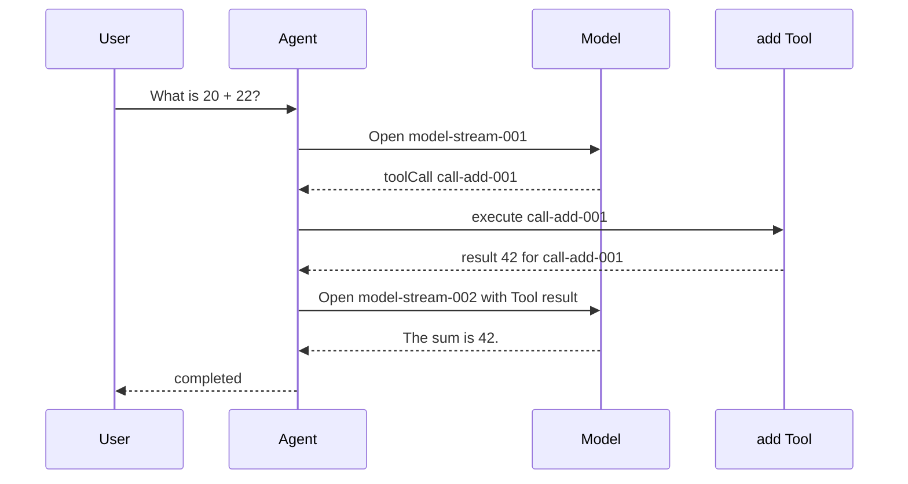

## Kết quả

Bạn sẽ đọc một lượt chạy Agent hoàn chỉnh trước khi tách nó thành type, stream và class. Dấu vết nhận request của user, mở model stream, nhận Tool call `add`, thực thi Tool, append result tương ứng, mở continuation stream, hoàn tất final text rồi kết thúc với `status: "completed"`.

Dấu vết này nhỏ nhưng contract của nó thuộc về kiến trúc. Thứ tự sự kiện phải ổn định. Tool call và Tool result phải mang cùng `toolCallId`. Danh sách sự kiện trả về và arguments lồng bên trong không được thay đổi sau lượt chạy. Trong source, một hằng `finalText` được dùng cho cả sự kiện final-text lẫn terminal result. Focused test chỉ assert một số quan hệ cụ thể được mô tả bên dưới.

:::note[Course implementation]

`runPrologue()` là dấu vết giảng dạy cố định, chạy offline. Hàm chưa gọi model hay thực thi Tool thật. Các checkpoint sau thay từng bước cố định bằng một cơ chế có type rõ ràng nhưng vẫn giữ thứ tự quan sát được đã đặt ra tại đây.

:::

## Điều kiện tiên quyết

Dùng Node.js 22 và cài dependency của repository từ thư mục root. Bạn cần đọc được object literal TypeScript, `as const`, `Object.freeze()`, array indexing và assertion của Vitest. Hãy bắt đầu từ [tổng quan khóa học](index.mdx) nếu chưa chạy phần thiết lập workshop.

Đọc hai file sau cùng nhau:

| Vai trò | Đường dẫn chính xác | Nội dung cần kiểm tra |
| --- | --- | --- |
| Source tích lũy | `course/src/demo/prologue.ts` | Tám sự kiện bất biến và terminal result |
| Bằng chứng tập trung | `course/test/00-complete-agent-trace.test.ts` | Thứ tự loại sự kiện, Tool ID dùng chung, terminal result chính xác và kiểm tra deep-freeze |

Không dùng API key hay kết nối mạng. Input, Tool arguments, Tool output và final response đều là fixture cố định, vì vậy assertion fail biểu thị protocol regression chứ không phải sai khác ngẫu nhiên của model.

## Cơ chế

Một lượt chạy Agent là một protocol có thứ tự; câu trả lời cuối chỉ là terminal output. Các record trung gian giải thích cách output đó được tạo ra. Khi đọc source, bạn sẽ thấy prologue gán `sequence` từ `0` đến `7`. Focused test kiểm tra array loại sự kiện theo thứ tự đó nhưng không assert các field `sequence` dạng số. Renderer có thể chỉ hiển thị một số sự kiện, còn trace bên dưới vẫn phải giữ quan hệ nhân quả.

Model stream đầu tiên kết thúc bằng `tool_call_completed`, chưa phải câu trả lời cho user. `tool_execution_started` cho thấy execution chỉ bắt đầu sau khi có Tool call hoàn chỉnh. Trong trace cố định này, `tool_result_appended` đánh dấu thời điểm runtime sẽ thêm result và giữ nguyên `toolCallId`; checkpoint `00` chưa dựng transcript. Chỉ sau đó model stream thứ hai mới được dùng result và tạo `final_text_completed`.

Stable ID giữ nguyên identity qua thời gian. Tên `add` mô tả operation nhưng không thể phân biệt từng invocation khi model yêu cầu `add` hai lần. `call-add-001` định danh invocation này. Một Tool result có cùng tên nhưng ID khác không thuộc call đó và khiến trace không hợp lệ.

Trace cũng tách sự kiện khỏi terminal result. Sự kiện là record tiến độ dành cho observer; `result` là giá trị đã settle dành cho caller. Trong source fixture, sự kiện cuối ghi `status: "completed"`, còn một hằng `finalText` cung cấp giá trị cho cả `final_text_completed.text` và `result.finalText`. Focused test assert chính xác result object nhưng không assert riêng status của sự kiện cuối hoặc so sánh hai text field. Bản triển khai về sau có thể stream nhiều sự kiện nhưng vẫn cung cấp đúng một giá trị để caller chờ.

Tính bất biến giúp fixture đáng tin cậy. Run ở cấp cao nhất, array sự kiện, từng sự kiện, Tool arguments lồng bên trong và terminal result đều được freeze. Subscriber không thể viết lại một sự kiện trước đó rồi khiến assertion về sau quan sát một lịch sử khác.

## Dấu vết hoặc mô hình



| Sequence | Sự kiện | Bất biến |
| ---: | --- | --- |
| 0 | `user_message_accepted` | User input đi vào run đúng một lần |
| 1 | `model_stream_opened` | Model turn đầu bắt đầu sau khi nhận input |
| 2 | `tool_call_completed` | `call-add-001` và arguments của nó đã hoàn chỉnh |
| 3 | `tool_execution_started` | Execution tham chiếu `call-add-001` |
| 4 | `tool_result_appended` | Result `42` liên kết ngược về `call-add-001` |
| 5 | `model_stream_opened` | Continuation bắt đầu sau khi result sẵn sàng |
| 6 | `final_text_completed` | Text cuối dành cho user đã hoàn chỉnh |
| 7 | `agent_ended` | Run đạt terminal status `completed` |

Model turn thứ hai không phải chi tiết rendering có thể bỏ. Nếu thiếu turn này, model không nhận được Tool result để dùng giá trị `42` khi tạo final answer.

## Xây dựng

Module tích lũy là `course/src/demo/prologue.ts`. Đoạn dưới đây được chép nguyên văn từ `course/test/00-complete-agent-trace.test.ts`. Đoạn code compile ngay trong test file đó và cho thấy chính xác bằng chứng tự động cho thứ tự loại sự kiện, Tool linkage và terminal result:

```ts
import { expect, test } from "vitest";

import { runPrologue } from "../src/index";

const expectedEventTypes = [
  "user_message_accepted",
  "model_stream_opened",
  "tool_call_completed",
  "tool_execution_started",
  "tool_result_appended",
  "model_stream_opened",
  "final_text_completed",
  "agent_ended",
] as const;

test("follows one complete Agent trace in exact event order", () => {
  const run = runPrologue();

  expect(run.events.map(({ type }) => type)).toEqual(expectedEventTypes);

  const toolCall = run.events[2];
  const toolResult = run.events[4];

  expect(toolCall).toMatchObject({
    type: "tool_call_completed",
    toolCallId: "call-add-001",
  });
  expect(toolResult).toMatchObject({
    type: "tool_result_appended",
    toolCallId: "call-add-001",
  });
  expect(toolResult.toolCallId).toBe(toolCall.toolCallId);

  expect(run.result).toEqual({
    status: "completed",
    finalText: "The sum is 42.",
  });
});
```

Source module hoàn chỉnh trả về cùng một snapshot đã dựng sẵn trong mọi lần gọi. Cách này phù hợp ở checkpoint `00` vì mục tiêu là thiết lập contract, chưa phải mô hình hóa runtime work. Chỉ freeze array sẽ tạo bảo vệ shallow, nên source freeze riêng từng sự kiện, `arguments`, terminal result và object chứa chúng. Test thứ hai kiểm tra các freeze boundary này cùng những lần mutation phải fail.

Khi đọc test, hãy theo index `2` và `4`: đó là Tool call và Tool result. Assertion so sánh trực tiếp ID của chúng thay vì chỉ lặp lại expected string. Phép so sánh ấy biểu diễn đúng quan hệ Agent phải bảo toàn.

## Chạy focused test

Focused test là `course/test/00-complete-agent-trace.test.ts`. Chạy đúng command sau từ repository root:

```bash
npm run test:course:checkpoint -- course/test/00-complete-agent-trace.test.ts
```

Vitest phải chỉ chọn một file. Một test kiểm tra đủ tám loại sự kiện theo thứ tự array, Tool ID dùng chung và terminal result chính xác. Test còn lại kiểm tra các ranh giới deep-freeze, thử mutate dữ liệu rồi xác nhận trace vẫn giữ nguyên length, arguments và result text ban đầu.

## Thử nghiệm lỗi

Làm việc trong bản copy tạm hoặc disposable branch. Trong `course/src/demo/prologue.ts`, chỉ đổi `toolCallId` của `tool_result_appended` từ biến dùng chung sang một giá trị khác:

```ts
Object.freeze({
  type: "tool_result_appended",
  sequence: 4,
  toolCallId: "call-add-999",
  result: 42,
});
```

Chạy lại focused command. Các loại sự kiện vẫn đúng thứ tự và kết quả phép cộng vẫn là `42`, nhưng linkage assertion fail vì `run.events[4].toolCallId` không còn bằng `run.events[2].toolCallId`. Thử nghiệm này cô lập lỗi identity mà test chỉ nhìn final text sẽ bỏ sót. Khôi phục biến `toolCallId` dùng chung trước khi tiếp tục.

## Tiêu chí chấp nhận

- Focused command chỉ chọn `course/test/00-complete-agent-trace.test.ts` và pass offline.
- Focused test assert tám loại sự kiện theo thứ tự array; việc đọc source xác nhận các giá trị `sequence` từ `0` đến `7`.
- Tool call và Tool result đều dùng `call-add-001`.
- Việc đọc source cho thấy continuation model stream nằm sau Tool result.
- Focused test assert chính xác result `{ status: "completed", finalText: "The sum is 42." }`; việc đọc source xác nhận status của sự kiện cuối và hằng `finalText` dùng chung.
- Run object, array sự kiện, từng sự kiện, Tool arguments và terminal result đều từ chối mutation.
- Thay đổi ID không khớp có kiểm soát làm linkage assertion fail và test pass trở lại sau khi khôi phục.

## So sánh với Pi SDK 0.99.2

:::info[Pi SDK 0.99.2]

Package `@earendil-works/pi-agent-core` đã phát hành export một `AgentEvent` union phong phú hơn. Lifecycle của nó gồm `agent_start`/`agent_end`, `turn_start`/`turn_end`, các sự kiện trong vòng đời message và `tool_execution_start`/`tool_execution_update`/`tool_execution_end`. Sự kiện Tool mang `toolCallId`, nhờ đó consumer có thể liên kết đúng một execution ngay cả khi tên Tool lặp lại.

:::

Tên sự kiện và payload của Pi khác với tên sự kiện trong prologue. Pi còn biểu diễn model completion bằng `AssistantMessage` có `stopReason`; SDK không expose result `{ status, finalText }` của checkpoint này như một public type tương thích. Hãy dùng prologue để suy luận về thứ tự nhân quả và identity, rồi dùng các type Pi export khi tích hợp SDK.

Hai hệ thống có cùng yêu cầu kỹ thuật nền tảng: Tool result phải tiếp tục gắn với call đã tạo ra nó, và Agent lifecycle chỉ settle sau khi công việc liên quan hoàn tất. Không import `runPrologue()` vào ứng dụng Pi hoặc biến các chuỗi sự kiện của nó thành mô tả về SDK.

Course implementation là bản triển khai giảng dạy nguyên bản do Pify tự xây dựng, có phạm vi nhỏ hơn và không cam kết tương thích API với Pi.

## Checkpoint tiếp theo

[Checkpoint 01](01-typescript-protocols.md) biến trace quan sát được thành các TypeScript protocol đóng. Bạn sẽ định nghĩa shape của message, model, Tool, sự kiện và terminal result trước khi thêm bất kỳ stateful implementation nào.
