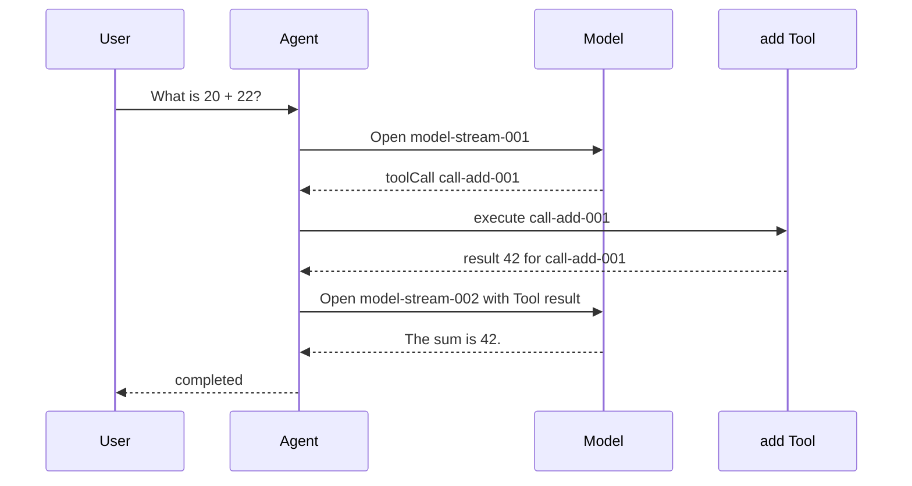

## Kết quả

Bạn sẽ đọc một lượt chạy Agent hoàn chỉnh trước khi tách nó thành type, stream và class. Dấu vết nhận request của user, mở model stream, nhận Tool call `add`, thực thi Tool, nối result tương ứng, mở continuation stream, hoàn tất final text rồi kết thúc với `status: "completed"`.

Dấu vết này nhỏ nhưng các phép kiểm tra của nó thuộc về kiến trúc. Thứ tự event phải ổn định. Tool call và Tool result phải mang cùng `toolCallId`. Danh sách event trả về và arguments lồng bên trong không được thay đổi sau lượt chạy. Event chứa final text và terminal result phải thống nhất về nội dung user đã nhận.

:::note[Course implementation]

`runPrologue()` là dấu vết giảng dạy cố định, chạy offline. Hàm chưa gọi model hay thực thi Tool thật. Các checkpoint sau thay từng bước cố định bằng một cơ chế có type rõ ràng nhưng vẫn giữ thứ tự quan sát được đã đặt ra tại đây.

:::

## Điều kiện tiên quyết

Dùng Node.js 22 và cài dependency của repository từ thư mục root. Bạn cần đọc được object literal TypeScript, `as const`, `Object.freeze()`, array indexing và assertion của Vitest. Hãy bắt đầu từ [tổng quan khóa học](index.mdx) nếu chưa chạy phần thiết lập workshop.

Đọc hai file sau cùng nhau:

| Vai trò | Đường dẫn chính xác | Nội dung cần kiểm tra |
| --- | --- | --- |
| Source tích lũy | `course/src/demo/prologue.ts` | Tám event bất biến và terminal result |
| Bằng chứng tập trung | `course/test/00-complete-agent-trace.test.ts` | Thứ tự, liên kết ID, kiểm tra deep-freeze và final text |

Không dùng API key hay kết nối mạng. Input, Tool arguments, Tool output và final response đều là fixture cố định, vì vậy một assertion thay đổi biểu thị protocol regression chứ không phải sai khác ngẫu nhiên của model.

## Cơ chế

Một lượt chạy Agent không chỉ là câu cuối cùng. Nó là protocol có thứ tự; các record trung gian giải thích vì sao câu trả lời đó tồn tại. Prologue gán `sequence` từ `0` đến `7`; test cũng kiểm tra các event type theo đúng thứ tự này. Renderer có thể chỉ hiển thị một phần event, nhưng trace bên dưới vẫn phải giữ quan hệ nhân quả.

Model stream đầu tiên kết thúc bằng `tool_call_completed`, chưa phải câu trả lời cho user. `tool_execution_started` cho thấy execution chỉ bắt đầu sau khi có Tool call hoàn chỉnh. `tool_result_appended` đặt result vào transcript dưới `toolCallId` ban đầu. Chỉ sau đó model stream thứ hai mới được dùng result và tạo `final_text_completed`.

Stable ID duy trì identity qua thời gian. Tên `add` mô tả operation nhưng không thể phân biệt từng invocation khi model yêu cầu `add` hai lần. `call-add-001` định danh invocation này. Một Tool result có cùng tên nhưng ID khác không thuộc call đó và khiến trace không hợp lệ.

Trace cũng tách event khỏi terminal result. Event là record tiến độ cho observer. `result` là giá trị đã settle dành cho caller. Event cuối ghi `status: "completed"`, còn result ghi cả status đó lẫn `finalText: "The sum is 42."`. Bản triển khai về sau có thể stream nhiều event nhưng vẫn cung cấp đúng một giá trị để caller chờ.

Tính bất biến giúp fixture đáng tin cậy. Run ở cấp cao nhất, event array, từng event, Tool arguments lồng bên trong và terminal result đều được freeze. Subscriber không thể viết lại một event trước đó rồi làm assertion về sau quan sát một lịch sử khác.

## Dấu vết hoặc mô hình



| Sequence | Event | Bất biến |
| ---: | --- | --- |
| 0 | `user_message_accepted` | User input đi vào run đúng một lần |
| 1 | `model_stream_opened` | Model turn đầu bắt đầu sau khi nhận input |
| 2 | `tool_call_completed` | `call-add-001` và arguments của nó đã hoàn chỉnh |
| 3 | `tool_execution_started` | Execution tham chiếu `call-add-001` |
| 4 | `tool_result_appended` | Result `42` liên kết ngược về `call-add-001` |
| 5 | `model_stream_opened` | Continuation bắt đầu sau khi result sẵn sàng |
| 6 | `final_text_completed` | Text cuối dành cho user đã hoàn chỉnh |
| 7 | `agent_ended` | Run đạt terminal status `completed` |

Model turn thứ hai không phải chi tiết rendering có thể bỏ. Nếu thiếu nó, model không bao giờ thấy Tool result và không thể đặt final answer trên dữ kiện `42`.

## Xây dựng

Module tích lũy là `course/src/demo/prologue.ts`. Fragment tập trung sau cho thấy một stable ID được capture một lần rồi tái sử dụng ở cả hai phía của Tool round:

```ts
const toolCallId = "call-add-001";

const linkedEvents = Object.freeze([
  Object.freeze({
    type: "tool_call_completed",
    sequence: 2,
    toolCallId,
    toolName: "add",
    arguments: Object.freeze({ left: 20, right: 22 }),
  }),
  Object.freeze({
    type: "tool_result_appended",
    sequence: 4,
    toolCallId,
    result: 42,
  }),
] as const);
```

Module hoàn chỉnh trả về cùng một snapshot đã dựng sẵn trong mọi lần gọi. Cách này phù hợp ở checkpoint `00` vì mục tiêu là thiết lập contract, chưa phải mô hình hóa runtime work. Chỉ freeze array sẽ tạo bảo vệ shallow. Vì vậy từng event, `arguments`, terminal result và object chứa chúng đều được freeze riêng.

Khi đọc test, hãy theo index `2` và `4`: đó là Tool call và Tool result. Assertion so sánh trực tiếp ID của chúng thay vì chỉ lặp lại expected string. Phép so sánh ấy biểu diễn đúng quan hệ Agent phải bảo toàn.

## Chạy focused test

Focused test là `course/test/00-complete-agent-trace.test.ts`. Chạy đúng command sau từ repository root:

```bash
npm run test:course:checkpoint -- course/test/00-complete-agent-trace.test.ts
```

Vitest phải chỉ chọn một file. Một test kiểm tra đủ tám event type, Tool linkage và terminal result. Test còn lại thử mutate snapshot trả về, rồi xác nhận các thao tác ghi ném lỗi mà không thay đổi trace.

## Thử nghiệm lỗi

Làm việc trong bản copy tạm hoặc disposable branch. Trong `course/src/demo/prologue.ts`, chỉ đổi `toolCallId` của `tool_result_appended` từ biến dùng chung sang một giá trị khác:

```ts
Object.freeze({
  type: "tool_result_appended",
  sequence: 4,
  toolCallId: "call-add-999",
  result: 42,
});
```

Chạy lại focused command. Các event type vẫn đúng thứ tự và kết quả phép cộng vẫn là `42`, nhưng linkage assertion fail vì `run.events[4].toolCallId` không còn bằng `run.events[2].toolCallId`. Thử nghiệm này cô lập lỗi identity mà test chỉ nhìn final text sẽ bỏ sót. Khôi phục biến `toolCallId` dùng chung trước khi tiếp tục.

## Tiêu chí chấp nhận

- Focused command chỉ chọn `course/test/00-complete-agent-trace.test.ts` và pass offline.
- Tám event type cùng các giá trị `sequence` giữ đúng thứ tự nhân quả.
- Tool call và Tool result đều dùng `call-add-001`.
- Continuation model stream bắt đầu sau khi Tool result được append.
- Event cuối có terminal status `completed`, còn result chứa `finalText: "The sum is 42."`.
- Run object, event array, từng event, Tool arguments và terminal result đều từ chối mutation.
- Thay đổi ID không khớp có kiểm soát làm linkage assertion fail và test pass trở lại sau khi khôi phục.

## So sánh với Pi SDK 0.84.3

:::info[Pi SDK 0.84.3]

Package `@earendil-works/pi-agent-core` đã phát hành export một `AgentEvent` union phong phú hơn. Lifecycle của nó gồm `agent_start`/`agent_end`, `turn_start`/`turn_end`, các message lifecycle event và `tool_execution_start`/`tool_execution_update`/`tool_execution_end`. Tool event mang `toolCallId`, nhờ đó consumer có thể liên kết đúng một execution ngay cả khi tên Tool lặp lại.

:::

Event name và payload của Pi không phải event name trong prologue. Pi còn biểu diễn model completion bằng `AssistantMessage` có `stopReason`; SDK không expose result `{ status, finalText }` của checkpoint này như một public type tương thích. Hãy dùng prologue để suy luận về causal order và identity, rồi dùng các type Pi export khi tích hợp SDK.

Hai hệ thống có cùng yêu cầu kỹ thuật nền tảng: Tool result phải tiếp tục gắn với call đã tạo ra nó, và Agent lifecycle chỉ settle sau khi công việc liên quan hoàn tất. Không import `runPrologue()` vào ứng dụng Pi hoặc biến các event string của nó thành mô tả về SDK.

## Checkpoint tiếp theo

[Checkpoint 01](01-typescript-protocols.md) biến trace quan sát được thành các TypeScript protocol đóng. Bạn sẽ định nghĩa shape của message, model, Tool, event và terminal result trước khi thêm bất kỳ stateful implementation nào.
