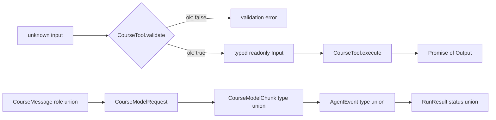

## Kết quả

Bạn sẽ biến trace từ checkpoint `00` thành bộ từ vựng TypeScript mà các module về sau có thể dùng chung. Protocol bao quát normalized message, assistant content block, model request và chunk, Tool validation và execution, Agent event cùng bốn terminal run result.

Sau checkpoint này, message role, content-block type, event type hoặc run status đều có thể được narrow bằng discriminant. Array và các giá trị JSON argument lồng nhau là readonly tại compile time. Request, response, message và Tool-call ID có alias riêng, nhờ đó code cho biết identity nào đi qua từng boundary. Một exhaustive `switch` sẽ làm typecheck fail khi union mở rộng nhưng chưa có branch tương ứng.

:::note[Course implementation]

Các type trong `course/src/protocol.ts` thuộc về workshop. Tên, field và terminal status của chúng không phải compatibility layer cho Pi. Chúng thiết lập một hệ thống đóng, nhỏ gọn để những checkpoint còn lại kiểm thử mà không cần network.

:::

## Điều kiện tiên quyết

Hoàn thành [checkpoint 00](00-complete-agent-trace.md). Bạn cần hiểu union type, literal type, generic, `Readonly<T>`, `readonly` array, `unknown`, type-only import và control-flow narrowing. Không cần biết sâu về conditional type; focused test chỉ dùng chúng để chứng minh các union discriminant vẫn chính xác.

Đọc protocol và test của nó song song:

| Vai trò | Đường dẫn chính xác | Nội dung cần kiểm tra |
| --- | --- | --- |
| Source tích lũy | `course/src/protocol.ts` | Mọi value contract dùng chung và `assertNever()` |
| Bằng chứng tập trung | `course/test/01-typescript-protocols.test.ts` | Kiểm tra readonly ở compile time và narrowing tại runtime |

Source chủ ý chưa chứa class, queue, provider adapter hay filesystem operation. Thay đổi protocol cần review được mà không phải đồng thời suy luận về mutable implementation state.

## Cơ chế

Discriminated union cung cấp cho mỗi variant một literal field ổn định. `CourseMessage` narrow theo `role`; `CourseAssistantBlock` và `CourseModelChunk` narrow theo `type`; `RunResult` narrow theo `status`. Khi TypeScript thấy branch như `message.role === "toolResult"`, nó expose các field chỉ member đó sở hữu.

Union đóng làm thay đổi trở nên hữu hình. Consumer xử lý mọi member hiện tại rồi truyền phần còn lại vốn không thể xảy ra vào `assertNever()`. Khi thêm member mới, phần còn lại đổi từ `never` thành type mới và tạo compile error tại mọi exhaustive switch cần quyết định policy.

Readonly boundary biểu diễn ownership. Model request nhận `readonly CourseMessage[]`; event payload không thể thay message; failed result không thể viết lại error code lồng bên trong. `CourseJsonObject` và `CourseJsonArray` là readonly đệ quy, vì vậy Tool argument không thể bị mutate qua tham chiếu đến object hoặc array lồng nhau tại compile time.

Readonly type không freeze runtime input không đáng tin cậy. Caller có thể bỏ qua TypeScript hoặc cung cấp JSON đã parse, còn một object mang readonly type vẫn có thể tham chiếu dữ liệu mutable. Comment trong `course/src/protocol.ts` giao runtime validation, cloning và snapshot cho các layer về sau. Checkpoint `03` sẽ cài đặt boundary đó.

Các ID alias vẫn là string thay vì branded type. Giá trị của chúng nằm ở sự phân tách trong tài liệu: `CourseModelRequestId`, `CourseModelResponseId`, `CourseMessageId` và `CourseToolCallId` cho biết một field định danh gì. Test vẫn phải chứng minh relational invariant như response khớp request và Tool result khớp call.

Terminal result là dữ liệu, không phải exception bị ẩn sau một return type duy nhất. `completed` chứa final text; `cancelled` chứa reason; `maxSteps` báo budget đã dừng loop; `failed` mang error code cùng message ổn định. Mọi variant đều giữ message snapshot để caller kiểm tra trạng thái transcript hợp lệ cuối cùng.

Cuối cùng, `CourseTool<Input, Output>` bắt buộc boundary hai giai đoạn. `validate()` nhận `unknown` và trả về typed value hoặc error. Chỉ `Input` đã được validate mới đi vào hàm `execute()` bất đồng bộ cùng context chứa `AbortSignal` và `toolCallId`.

## Dấu vết hoặc mô hình



| Discriminant | Các member đóng | Quyết định của consumer |
| --- | --- | --- |
| `CourseMessage.role` | `user`, `assistant`, `toolResult` | Chọn content shape và transcript rule |
| `CourseAssistantBlock.type` | `text`, `toolCall` | Render text hoặc theo dõi một Tool invocation |
| `CourseModelChunk.type` | `textDelta`, `toolCall` | Tích lũy text hoặc ghi nhận call hoàn chỉnh |
| `AgentEvent.type` | `message.accepted`, `model.chunk`, `tool.started`, `tool.finished`, `run.finished` | Cập nhật observer mà không đoán payload field |
| `RunResult.status` | `completed`, `cancelled`, `maxSteps`, `failed` | Xử lý tường minh mọi terminal outcome |

Protocol type được viết trước class vì class đưa vào các lựa chọn về ownership và timing. Thống nhất value trước cho phép checkpoint `02` cài đặt delivery, checkpoint `04` cài đặt model và checkpoint `07` cài đặt loop dựa trên cùng một contract.

## Xây dựng

Module tích lũy là `course/src/protocol.ts`. Đoạn sau là toàn bộ terminal-result union trong file đó:

```ts
export type CompletedRunResult = Readonly<{
  status: "completed";
  messages: readonly CourseMessage[];
  finalText: string;
}>;

export type CancelledRunResult = Readonly<{
  status: "cancelled";
  messages: readonly CourseMessage[];
  reason: string;
}>;

export type MaxStepsRunResult = Readonly<{
  status: "maxSteps";
  messages: readonly CourseMessage[];
  maxSteps: number;
}>;

export type FailedRunResult = Readonly<{
  status: "failed";
  messages: readonly CourseMessage[];
  error: Readonly<{ code: string; message: string }>;
}>;

export type RunResult =
  | CompletedRunResult
  | CancelledRunResult
  | MaxStepsRunResult
  | FailedRunResult;
```

Focused test consume các union đó bằng cùng exhaustive shape mà application code nên dùng:

```ts
function describeRun(result: RunResult): string {
  switch (result.status) {
    case "completed":
      return result.finalText;
    case "cancelled":
      return result.reason;
    case "maxSteps":
      return String(result.maxSteps);
    case "failed":
      return result.error.code;
    default:
      return assertNever(result);
  }
}
```

Test file còn chứa các assertion `@ts-expect-error`. Chúng chứng minh compiler từ chối gán lại message ID, mutate assistant content, ghi vào JSON lồng nhau, validator nhận type hẹp hơn `unknown`, Tool execution đồng bộ và result `"running"` chưa terminal.

## Chạy focused test

Focused test là `course/test/01-typescript-protocols.test.ts`. Chạy chính xác:

```bash
npm run test:course:checkpoint -- course/test/01-typescript-protocols.test.ts
```

Vitest compile test trước khi thực thi, vì vậy contract `@ts-expect-error` không còn đúng sẽ làm run fail. Runtime assertion sau đó kiểm tra chính xác các tập discriminant, event sequence, Tool validation flow cùng cả bốn result branch. Hãy chạy thêm `npm run typecheck` trên toàn repository sau khi sửa một union dùng chung.

## Thử nghiệm lỗi

Trong disposable branch, thêm member result thứ năm vào `course/src/protocol.ts` rồi đưa nó vào `RunResult`:

```ts
export type DeferredRunResult = Readonly<{
  status: "deferred";
  messages: readonly CourseMessage[];
  resumeToken: string;
}>;
```

Không thêm branch `case "deferred"` vào `describeRun()` trong focused test. Chạy:

```bash
npm run typecheck
```

TypeScript báo rằng `DeferredRunResult` không thể truyền vào parameter `never` của `assertNever()`. Kết quả red này là bằng chứng cần tìm: terminal state mới không thể đi vào protocol mà không buộc từng exhaustive consumer chọn behavior. Xóa member thử nghiệm hoặc cài đặt và test branch đó trước khi tiếp tục.

## Tiêu chí chấp nhận

- Focused command chỉ chọn `course/test/01-typescript-protocols.test.ts` và pass offline.
- Các union message, assistant-block, model-chunk, event và run-result giữ nguyên discriminant chính xác.
- Protocol array, JSON value lồng nhau, event payload, ID và terminal error data từ chối mutation tại compile time.
- `CourseTool.validate()` nhận `unknown`; `execute()` nhận input đã narrow và trả về `Promise`.
- Stable alias phân biệt message, request, response và Tool-call identity mà không tuyên bố runtime validation.
- Mỗi `RunResult` status đi vào một branch tường minh và default branch nhận `never`.
- Thêm union member chưa được xử lý làm `npm run typecheck` fail tại exhaustive switch.

## So sánh với Pi SDK 0.84.3

:::info[Pi SDK 0.84.3]

`@earendil-works/pi-ai` export `Message`, `UserMessage`, `AssistantMessage`, `ToolResultMessage`, `ToolCall`, `AssistantMessageEvent` cùng các model type liên quan. `@earendil-works/pi-agent-core` export `AgentMessage`, `AgentEvent`, `AgentState` và `AgentTool`. Đây là các public release type cần dùng khi tích hợp Pi.

:::

Các union của Pi rộng hơn và có cấu trúc khác. `AgentMessage` gồm Pi AI message cộng với custom message do application định nghĩa qua TypeScript declaration merging. Pi assistant content có thể chứa text, thinking và Tool call. `AgentEvent` của Pi mô tả Agent lifecycle thật, không phải union năm event trong workshop.

Course dùng union đóng và compile-time readonly field rộng rãi để omission dễ được dạy và kiểm thử. Public interface của Pi có mutable array và provider metadata phong phú hơn vì production runtime tích lũy message, content, usage và streaming state. Không thể thay thế một shape bằng shape còn lại. Hãy mang theo các thực hành gồm discriminant tường minh, Tool-call identity ổn định, validation trước execution và quyết định policy exhaustive, đồng thời import đúng type do SDK export.

## Checkpoint tiếp theo

[Checkpoint 02](02-event-stream.md) cung cấp delivery mechanism cho các giá trị `AgentEvent`. Bạn sẽ xây một channel `AsyncIterable` dành cho single consumer, có terminal result promise riêng, buffering đúng thứ tự, lan truyền failure và dọn waiter theo cách deterministic.
