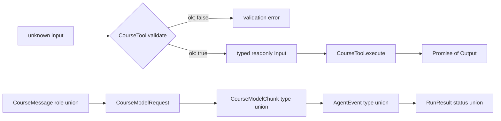

## Kết quả

Bạn sẽ biến trace từ checkpoint `00` thành bộ từ vựng TypeScript mà các module về sau có thể dùng chung. Protocol bao quát normalized message, assistant content block, model request và chunk, Tool validation và execution, sự kiện Agent cùng bốn terminal run result.

Sau checkpoint này, message role, content-block type, loại sự kiện hoặc run status đều có thể được narrow bằng discriminant. Array và các giá trị JSON argument lồng nhau là readonly tại compile time. Request, response, message và Tool-call ID có alias riêng, nhờ đó code cho biết identity nào đi qua từng ranh giới. Một exhaustive `switch` sẽ làm typecheck fail khi union mở rộng nhưng chưa có branch tương ứng.

:::note[Course implementation]

Các type trong `course/src/protocol.ts` thuộc về workshop. Tên, field và terminal status của chúng không phải compatibility layer cho Pi. Chúng thiết lập một hệ thống đóng, nhỏ gọn để những checkpoint còn lại kiểm thử mà không cần network.

:::

## Điều kiện tiên quyết

Hoàn thành [checkpoint 00](00-complete-agent-trace.md). Bạn cần hiểu union type, literal type, generic, `Readonly<T>`, `readonly` array, `unknown`, type-only import và control-flow narrowing. Không cần biết sâu về conditional type; `npm run typecheck` dùng các assertion trong focused test để kiểm tra các union discriminant vẫn chính xác.

Đọc protocol và test của nó song song:

| Vai trò | Đường dẫn chính xác | Nội dung cần kiểm tra |
| --- | --- | --- |
| Source tích lũy | `course/src/protocol.ts` | Mọi value contract dùng chung và `assertNever()` |
| Bằng chứng tập trung | `course/test/01-typescript-protocols.test.ts` | Assertion runtime cùng các contract được `npm run typecheck` kiểm tra |

Source chủ ý chưa chứa class, queue, provider adapter hay filesystem operation. Thay đổi protocol cần review được mà không phải đồng thời suy luận về mutable implementation state.

## Cơ chế

Discriminated union cung cấp cho mỗi variant một literal field ổn định. `CourseMessage` narrow theo `role`; `CourseAssistantBlock` và `CourseModelChunk` narrow theo `type`; `RunResult` narrow theo `status`. Khi TypeScript thấy branch như `message.role === "toolResult"`, nó cho phép truy cập các field chỉ member đó có.

Union đóng làm thay đổi trở nên hữu hình. Consumer xử lý mọi member hiện tại rồi truyền phần còn lại vốn không thể xảy ra vào `assertNever()`. Khi thêm member mới, phần còn lại đổi từ `never` thành type mới và tạo compile error tại mọi exhaustive switch chưa quyết định cách xử lý member đó.

Ranh giới readonly cho biết layer nào sở hữu dữ liệu. Model request nhận `readonly CourseMessage[]`; payload của sự kiện không thể thay message; failed result không thể viết lại error code lồng bên trong. `CourseJsonObject` và `CourseJsonArray` là readonly đệ quy, vì vậy Tool argument không thể bị mutate qua tham chiếu đến object hoặc array lồng nhau tại compile time.

Readonly type không freeze runtime input không đáng tin cậy. Caller có thể bỏ qua TypeScript hoặc cung cấp JSON đã parse, còn một object mang readonly type vẫn có thể tham chiếu dữ liệu mutable. Comment trong `course/src/protocol.ts` giao runtime validation, cloning và snapshot cho các layer về sau. Checkpoint `03` sẽ cài đặt ranh giới đó.

Các ID alias vẫn là string thay vì branded type. Chúng làm rõ mục đích của từng field: `CourseModelRequestId`, `CourseModelResponseId`, `CourseMessageId` và `CourseToolCallId` cho biết field đó định danh gì. Test vẫn phải kiểm tra relational invariant như response khớp request và Tool result khớp call.

Terminal result là dữ liệu, không phải exception bị ẩn sau một return type duy nhất. `completed` chứa final text; `cancelled` chứa reason; `maxSteps` báo budget đã dừng vòng lặp Agent (Agent Loop); `failed` mang error code cùng message ổn định. Mọi variant đều giữ message snapshot để caller kiểm tra trạng thái transcript hợp lệ cuối cùng.

Cuối cùng, `CourseTool<Input, Output>` thiết lập ranh giới hai giai đoạn. `validate()` nhận `unknown` và trả về typed value hoặc error. Chỉ `Input` đã được validate mới đi vào hàm `execute()` bất đồng bộ cùng context chứa `AbortSignal` và `toolCallId`.

## Dấu vết hoặc mô hình



| Discriminant | Các member đóng | Quyết định của consumer |
| --- | --- | --- |
| `CourseMessage.role` | `user`, `assistant`, `toolResult` | Chọn content shape và transcript rule |
| `CourseAssistantBlock.type` | `text`, `toolCall` | Render text hoặc theo dõi một Tool invocation |
| `CourseModelChunk.type` | `textDelta`, `toolCall` | Tích lũy text hoặc ghi nhận call hoàn chỉnh |
| `AgentEvent.type` | `message.accepted`, `model.chunk`, `tool.started`, `tool.finished`, `run.finished` | Cập nhật observer mà không đoán các field trong payload |
| `RunResult.status` | `completed`, `cancelled`, `maxSteps`, `failed` | Xử lý tường minh mọi terminal outcome |

Protocol type được viết trước class vì class đưa vào các lựa chọn về ownership và timing. Thống nhất value trước cho phép checkpoint `02` cài đặt delivery, checkpoint `04` cài đặt model và checkpoint `07` cài đặt Agent Loop theo cùng một contract.

## Xây dựng

Module tích lũy là `course/src/protocol.ts`. Đoạn sau là toàn bộ terminal-result union trong file đó:

```ts
export type CompletedRunResult = Readonly<{
  status: "completed";
  messages: readonly CourseMessage[];
  finalText: string;
}>;

export type CancelledRunResult = Readonly<{
  status: "cancelled";
  messages: readonly CourseMessage[];
  reason: string;
}>;

export type MaxStepsRunResult = Readonly<{
  status: "maxSteps";
  messages: readonly CourseMessage[];
  maxSteps: number;
}>;

export type FailedRunResult = Readonly<{
  status: "failed";
  messages: readonly CourseMessage[];
  error: Readonly<{
    code: string;
    message: string;
  }>;
}>;

export type RunResult =
  CompletedRunResult | CancelledRunResult | MaxStepsRunResult | FailedRunResult;
```

Focused test xử lý các union đó bằng cùng một exhaustive switch mà application code nên dùng:

```ts
function describeRun(result: RunResult): string {
  switch (result.status) {
    case "completed":
      return result.finalText;
    case "cancelled":
      return result.reason;
    case "maxSteps":
      return String(result.maxSteps);
    case "failed":
      return result.error.code;
    default:
      return assertNever(result);
  }
}
```

Test file còn chứa các assertion `@ts-expect-error` cho trường hợp gán lại message ID, mutate assistant content, ghi vào JSON lồng nhau, validator nhận type hẹp hơn `unknown`, Tool execution đồng bộ và result `"running"` chưa terminal. Các comment này chỉ trở thành bằng chứng compile-time khi `tsc` kiểm tra file qua `npm run typecheck`.

## Chạy focused test

Focused test là `course/test/01-typescript-protocols.test.ts`. Chạy chính xác:

```bash
npm run test:course:checkpoint -- course/test/01-typescript-protocols.test.ts
```

Vitest transpile rồi thực thi file này nhưng không type-check. Focused command kiểm tra giá trị discriminant tại runtime, thứ tự sự kiện, Tool validation flow, runtime fallback của `assertNever()` cùng cả bốn result branch. Bắt buộc chạy `npm run typecheck` để kiểm tra các contract `@ts-expect-error`, readonly, variance, asynchronous execution và exhaustive switch.

## Thử nghiệm lỗi

Trong disposable branch, thêm member result thứ năm vào `course/src/protocol.ts` rồi đưa nó vào `RunResult`:

```ts
export type DeferredRunResult = Readonly<{
  status: "deferred";
  messages: readonly CourseMessage[];
  resumeToken: string;
}>;
```

Trong focused test, cập nhật assertion equality của `RunStatuses` để expected union có thêm `"deferred"`; bước này ghi nhận thay đổi protocol có chủ ý và giữ phép kiểm tra regression riêng đó chính xác. Không thêm branch `case "deferred"` vào `describeRun()`. Chạy:

```bash
npm run typecheck
```

`npm run typecheck` gọi `tsc --noEmit`, rồi TypeScript báo rằng `DeferredRunResult` không thể truyền vào parameter `never` của `assertNever()`. Chỉ chạy Vitest sẽ không phát hiện nhánh bị thiếu vì Vitest transpile mà không type-check. Hãy xóa member thử nghiệm, hoặc cài đặt và test branch mới, rồi yêu cầu cả typecheck lẫn focused runtime test đều pass.

## Tiêu chí chấp nhận

- Focused command chỉ chọn `course/test/01-typescript-protocols.test.ts` và pass offline.
- `npm run typecheck` pass và kiểm tra các compile-time assertion trong focused test.
- Các union message, assistant-block, model-chunk, sự kiện và run-result giữ nguyên discriminant chính xác.
- Protocol array, JSON value lồng nhau, payload của sự kiện, ID và terminal error data từ chối mutation tại compile time.
- `CourseTool.validate()` nhận `unknown`; `execute()` nhận input đã narrow và trả về `Promise`.
- Stable alias phân biệt message, request, response và Tool-call identity mà không tuyên bố runtime validation.
- Mỗi `RunResult` status đi vào một branch tường minh và default branch nhận `never`.
- Thêm union member chưa được xử lý làm `npm run typecheck` fail tại exhaustive switch.

## So sánh với Pi SDK 0.87.1

:::info[Pi SDK 0.87.1]

`@earendil-works/pi-ai` export `Message`, `UserMessage`, `AssistantMessage`, `ToolResultMessage`, `ToolCall`, `AssistantMessageEvent` cùng các model type liên quan. `@earendil-works/pi-agent-core` export `AgentMessage`, `AgentEvent`, `AgentState` và `AgentTool`. Đây là các public release type cần dùng khi tích hợp Pi.

:::

Các union của Pi rộng hơn và có cấu trúc khác. `AgentMessage` gồm Pi AI message cộng với custom message do application định nghĩa qua TypeScript declaration merging. Pi assistant content có thể chứa text, thinking và Tool call. `AgentEvent` của Pi mô tả Agent lifecycle thật, không phải union năm sự kiện trong workshop.

Course dùng union đóng cùng compile-time readonly field rộng rãi để nhánh bị thiếu tạo ra type error rõ ràng. Public interface của Pi có mutable array và provider metadata phong phú hơn vì production runtime tích lũy message, content, usage và streaming state. Không thể thay thế một shape bằng shape còn lại. Hãy giữ discriminant tường minh, Tool-call identity ổn định, validation trước execution và một quyết định cụ thể cho từng union member, đồng thời import đúng type do SDK export.

## Checkpoint tiếp theo

[Checkpoint 02](02-event-stream.md) cung cấp cơ chế delivery cho các giá trị `AgentEvent`. Bạn sẽ xây một channel `AsyncIterable` dành cho single consumer, có terminal result promise riêng, buffering đúng thứ tự, lan truyền failure và dọn waiter theo cách deterministic.
