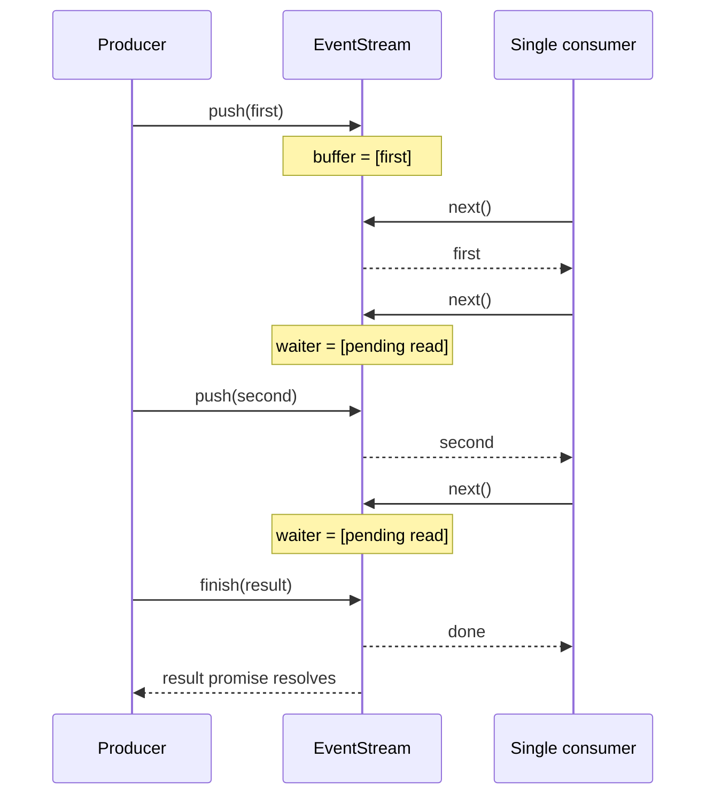

## Kết quả

Bạn sẽ xây `EventStream<Event, Result>`, một channel do course sở hữu với hai đường quan sát. Consumer iterate các progress event có thứ tự qua `AsyncIterable<Event>`, còn caller chờ một terminal value qua readonly promise `result`. Channel hỗ trợ buffered event, consumer đã chờ trong `next()`, completion thành công, failure, consumer return sớm và chỉ một active iterator tại một thời điểm.

Bạn cũng sẽ xác định flow-control boundary thật. `push()` là synchronous và buffer không có capacity limit, vì vậy implementation này không áp dụng producer backpressure. Boundary nó thực sự thực thi là delivery và ownership: một active consumer nhận từng queued event theo FIFO, còn mọi pending read đều settle khi iterator hoặc stream kết thúc.

:::note[Course implementation]

`EventStream` trong `course/src/event-stream.ts` là workshop API. Constructor, property `result`, single-consumer rule, exception và failure behavior của nó không phải drop-in replacement cho các stream class Pi export.

:::

## Điều kiện tiên quyết

Hoàn thành [checkpoint 01](01-typescript-protocols.md). Bạn cần hiểu `Promise`, `AsyncIterable`, `AsyncIterableIterator`, `IteratorResult`, `for await...of`, generic class cùng khác biệt giữa resolve và reject một promise.

Đọc hai file sau cùng nhau:

| Vai trò | Đường dẫn chính xác | Nội dung cần kiểm tra |
| --- | --- | --- |
| Source tích lũy | `course/src/event-stream.ts` | State, buffer, iterator ownership, waiter và terminal transition |
| Bằng chứng tập trung | `course/test/02-event-stream.test.ts` | Buffered/waiting delivery, finish/fail behavior, return và late push |

Mọi test phối hợp bằng promise thay vì timer. Cách này giữ checkpoint deterministic và chứng minh thứ tự đến từ channel chứ không phải một khoảng delay được phỏng đoán.

## Cơ chế

Stream có ba state: `open`, `finished` và `failed`. Chỉ `open` chấp nhận `push()`, `finish()` hoặc `fail()`. Terminal transition đầu tiên thắng. Mọi terminal call hoặc event push về sau đều ném `EventStream is already terminal (...)`, khiến producer lifecycle bug lộ ra ngay tại nguồn.

Khi stream còn open, `push(event)` kiểm tra waiter queue của active iterator trước. Một waiter biểu diễn lời gọi `next()` chưa resolve. Nếu có waiter, `push()` lấy waiter cũ nhất ra rồi resolve trực tiếp bằng `{ done: false, value: event }`. Nếu không, nó append event vào `buffer`. Cả hai đường đều giữ FIFO.

`next()` phản chiếu quyết định đó. Nó trả buffered event cũ nhất trước. Khi không có buffered event, finished stream trả `DONE`; failed stream reject bằng error đã lưu; open stream đăng ký waiter. Gọi `next()` nhiều lần trước một lần push tạo nhiều waiter có thứ tự. Test dùng hành vi này để chứng minh hai event đến đúng hai read đầu và `finish()` đóng read dư.

Completion thành công và event delivery là hai việc riêng. `finish(result)` resolve `stream.result` ngay lập tức, nhưng buffered event vẫn còn cho iterator. Iteration chỉ kết thúc sau khi buffer cạn. Failure dùng cùng quy tắc drain trước cho progress đã buffer: `stream.result` reject ngay, buffered event đã có vẫn được yield, rồi read tiếp theo reject bằng cùng error.

Khi không có buffer, `finish()` đóng active iterator và resolve mọi pending read thành done. `fail()` reject mọi pending read. `closeIterator()` đánh dấu iterator đã đóng, giải phóng active-consumer slot, splice waiter array rồi settle từng waiter đã lấy ra. Một lời gọi iterator `return()` tường minh dùng cùng cleanup path và cho phép sequential iterator về sau consume các event chưa bị lấy.

Chỉ một iterator được active. Ràng buộc này ngăn hai consumer tranh event từ cùng queue rồi mỗi bên nhận một tập con khác nhau. Quy tắc áp dụng cho active ownership, không phải lifetime ownership: sau khi iterator đầu gọi `return()` hoặc đạt terminal state, iterator khác có thể được tạo.

Không có producer backpressure. `push()` trả `void`; nó không bao giờ chờ consumer, và consumer đứng yên cho phép `buffer` tăng không giới hạn. Production design cần giới hạn memory phải bổ sung capacity tường minh cùng asynchronous producer operation, dropping/coalescing policy hoặc upstream cancellation. Các cơ chế đó nằm ngoài checkpoint này.

## Dấu vết hoặc mô hình



| Tình huống | Event path | Terminal path |
| --- | --- | --- |
| Push trước `next()` | Event vào `buffer`; `next()` về sau shift nó ra | Vẫn open |
| `next()` trước push | Read vào `waiters`; push kế tiếp resolve nó | Vẫn open |
| `finish(result)` khi có buffer | Iterator drain buffer rồi trả done | `result` resolve ngay |
| `fail(error)` khi có buffer | Iterator drain buffer rồi reject | `result` reject ngay |
| Iterator `return()` | Pending read resolve done; active slot được giải phóng | Bản thân stream vẫn open |

Bảng tách event timeline của consumer khỏi result timeline của caller. Code có thể chờ cả hai nhưng chúng settle theo các điều kiện khác nhau.

## Xây dựng

Module tích lũy là `course/src/event-stream.ts`. Hai producer path trung tâm đủ nhỏ để kiểm tra trực tiếp:

```ts
public push(event: Event): void {
  this.assertOpen();

  const waiter = this.activeIterator?.waiters.shift();
  if (waiter !== undefined) {
    waiter.resolve({ done: false, value: event });
    return;
  }

  this.buffer.push(event);
}

public finish(result: Result): void {
  this.assertOpen();
  this.state = { status: "finished" };
  this.resolveResult(result);

  if (this.buffer.length === 0 && this.activeIterator !== undefined) {
    this.closeIterator(this.activeIterator, { type: "done" });
  }
}
```

Class cài internal rejection handler bằng `void this.result.catch(() => undefined)`. Cách này ngăn terminal result bị bỏ qua tạo unhandled-rejection warning. Nó không biến public promise thành success: caller await `result` ban đầu vẫn nhận rejection.

Không thêm `await` quanh `push()`. Synchronous signature của nó ghi rõ việc không có flow control. Nếu host về sau cần producer throttling, contract phải thay đổi tường minh thay vì giả vờ buffer hiện tại có thể đẩy ngược producer.

## Chạy focused test

Focused test là `course/test/02-event-stream.test.ts`. Chạy chính xác:

```bash
npm run test:course:checkpoint -- course/test/02-event-stream.test.ts
```

File được chọn bao quát thứ tự push-before-read và read-before-push, một terminal result thành công, failure identity dùng chung, buffered event trước failure, nhiều waiter, consumer return, từ chối concurrent iterator, thay thế bằng sequential iterator và push sau cả hai terminal state.

## Thử nghiệm lỗi

Trong disposable branch, thêm case sau cạnh các terminal-state test hoặc chạy cùng sequence trong scratch test:

```ts
const stream = new EventStream<string, string>();
stream.push("before-terminal");
stream.finish("done");
stream.push("after-terminal");
```

Chạy focused command. Dòng cuối ném `EventStream is already terminal (finished)`. Nếu tạm xóa `this.assertOpen()` khỏi `push()`, thử nghiệm ngừng fail và producer có thể append dữ liệu sau khi result đã settle. Điều đó tạo lịch sử mơ hồ: caller đã có terminal value trong khi producer vẫn tuyên bố có tiến độ. Khôi phục guard và giữ test hiện có `rejects pushes after either terminal state` ở trạng thái green.

## Tiêu chí chấp nhận

- Focused command chỉ chọn `course/test/02-event-stream.test.ts` và pass offline.
- Buffered event và event truyền đến pending waiter giữ thứ tự FIFO.
- Chỉ đúng một iterator active; `return()` settle pending read của nó và cho phép iterator về sau.
- `finish(result)` resolve terminal promise một lần và kết thúc iteration sau khi buffered event đã drain.
- `fail(error)` reject result và pending read bằng cùng error, sau khi buffer hiện có đã drain.
- Mọi waiter được lấy ra và settle khi iterator đóng.
- `push()`, `finish()` và `fail()` từ chối mọi operation sau terminal state.
- Tài liệu và code không tuyên bố có producer backpressure; buffer được mô tả rõ là unbounded.

## So sánh với Pi SDK 0.84.3

:::info[Pi SDK 0.84.3]

`@earendil-works/pi-ai` export generic `EventStream<T, R>`, `AssistantMessageEventStream` và `createAssistantMessageEventStream()`. `AssistantMessageEventStream` mang các giá trị `AssistantMessageEvent` và expose `AssistantMessage` cuối qua method `result()`.

:::

Stream Pi đã phát hành nhận diện event `done` hoặc `error` là terminal và vẫn đưa terminal event đó vào iteration. `result()` resolve thành `AssistantMessage` cuối; event `error` mang assistant message có `stopReason` là `error` hoặc `aborted`. Course stream thay vào đó có `finish(result)` và `fail(error)` tường minh, property `result` có thể reject cùng single-active-consumer guard.

Generic stream của Pi cũng dùng queue và waiting read, còn producer `push()` là synchronous. Điều đó không bảo đảm backpressure. UI hoặc integration consume Pi event nên giữ callback nhẹ, batch phần rendering tốn kém hoặc chèn bounded handoff riêng tại nơi cần kiểm soát tài nguyên. Hãy dùng stream API do Pi export cho provider code của Pi; dùng checkpoint này để nghiên cứu sự tách biệt event/result và cleanup.

## Checkpoint tiếp theo

[Checkpoint 03](03-message-ir.md) định nghĩa normalized Message IR sẽ đi qua stream và Agent Loop về sau. Bạn sẽ snapshot assistant block, validate Tool-call/result linkage, trả diagnostic ổn định và chứng minh message hợp lệ sống sót qua JSON round-trip.
