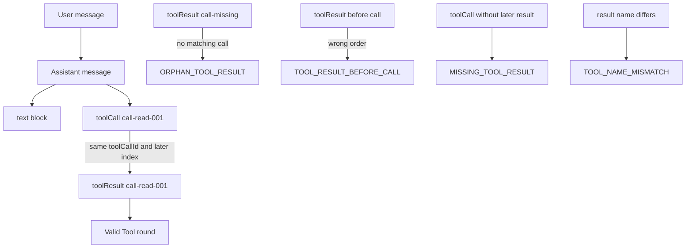

## Kết quả

Bạn sẽ tạo biểu diễn trung gian (Intermediate Representation, IR) cho normalized Message mà workshop sử dụng. Ba constructor tạo user message, assistant message và Tool-result message. Assistant content là array có thứ tự gồm block `text` và `toolCall`. Tool arguments được copy thành giá trị JSON deep-frozen, vì vậy mutation về sau trên input do caller sở hữu không thể viết lại message snapshot.

Bạn cũng sẽ validate toàn bộ transcript mà không ném lỗi. `validateTranscript(unknown)` trả frozen diagnostic cho message shape sai và Tool linkage bị hỏng. Một Tool round hợp lệ có call ID duy nhất, đúng một result xuất hiện sau với cùng `toolCallId` và `toolName`, arguments tương thích JSON và không có call chưa được trả lời. Message hợp lệ giữ role, block discriminant và ID sau `JSON.stringify()` rồi `JSON.parse()`.

:::note[Course implementation]

Các constructor, error code và transcript rule trong `course/src/messages.ts` là contract giảng dạy do Pify sở hữu. Chúng không parse Pi provider payload và không tương thích API với Pi message type.

:::

## Điều kiện tiên quyết

Hoàn thành [checkpoint 02](02-event-stream.md). Bạn cần hiểu các union `CourseMessage` và `CourseAssistantBlock` từ checkpoint `01`, giá trị tương thích JSON, immutable snapshot, `Map`, `Set` cùng lý do dữ liệu nhận dưới dạng `unknown` phải được kiểm tra trước khi narrow.

Đọc hai file sau cùng nhau:

| Vai trò | Đường dẫn chính xác | Nội dung cần kiểm tra |
| --- | --- | --- |
| Source tích lũy | `course/src/messages.ts` | Constructor, deep JSON snapshot, transcript inspection và linkage check |
| Bằng chứng tập trung | `course/test/03-message-ir.test.ts` | Valid round, malformed input, hostile property, error code và JSON round-trip |

Checkpoint này validate normalized transcript, không nhận trực tiếp provider wire format. Provider adaptation xuất hiện ở checkpoint `05`; trước tiên nó phải chuyển transport record thành IR này.

## Cơ chế

Normalization cung cấp cho Agent một internal shape thống nhất dù input về sau đến từ nhiều ranh giới khác nhau. User message chứa `id`, `role: "user"` và string `content`. Assistant message chứa `id`, `role: "assistant"` cùng content block có thứ tự. Tool-result message chứa message ID riêng cùng `toolCallId`, `toolName`, string `content` và boolean `isError`.

Thứ tự các assistant block có ý nghĩa. Text trước Tool call, bản thân call và text sau nó vẫn ở đúng vị trí trong array. `textFromAssistant()` duyệt bằng trusted numeric index và chỉ nối các block `text`. Hàm không stringify Tool call thành prose dành cho user.

Các constructor thiết lập ranh giới snapshot. Chúng đọc mỗi property do caller cung cấp một lần, từ chối sparse content, copy các block được hỗ trợ rồi freeze output. Tool-call arguments phải là non-null plain object thay vì array. Thành phần con có thể chứa string, finite number, boolean, `null`, array hoặc plain object. Function, symbol, `undefined`, non-finite number, object có custom prototype, sparse array và circular reference đều bị từ chối. Mỗi object và array lồng bên trong được copy rồi freeze.

`validateTranscript()` phục vụ caller khác với constructor. Constructor từ chối direct input không hợp lệ bằng `TypeError` chính xác. Validator nhận `unknown`, bắt hostile getter và revoked proxy, rồi trả diagnostic thay vì ném lỗi. Mỗi diagnostic chứa `code` ổn định, `messageIndex` và `message` dễ đọc; cả array lẫn từng entry đều được freeze.

Shape validation chạy trước linkage validation. Inspector ghi valid call và result theo `toolCallId`, trong khi các set ghi nhớ malformed record có ID đọc được để không tạo lỗi kéo theo gây hiểu nhầm. Cách này ngăn một arguments object không hợp lệ lan thành báo cáo orphan hoặc missing-result giả.

Linkage có năm quy tắc cốt lõi. Tool-call ID phải duy nhất. Mỗi call nhận tối đa một result. Result phải tham chiếu call đã biết và xuất hiện sau call trong transcript. `toolName` của result phải bằng tên call. Mọi well-formed call cần một result ở phía sau. Các mã ổn định gồm `DUPLICATE_TOOL_CALL_ID`, `DUPLICATE_TOOL_RESULT`, `ORPHAN_TOOL_RESULT`, `TOOL_RESULT_BEFORE_CALL`, `TOOL_NAME_MISMATCH` và `MISSING_TOOL_RESULT`, bên cạnh các shape error.

JSON round-trip là portability check, không phải trust check hoàn chỉnh. JSON đã parse không còn trạng thái `Object.freeze()` hay TypeScript type. Dữ liệu vẫn giữ string discriminant, ID, ordered array và JSON argument value. Ranh giới nhận vào phải gọi `validateTranscript(restored)` trước khi coi dữ liệu đã parse là course transcript hợp lệ.

## Dấu vết hoặc mô hình



| Ranh giới | Shape được chấp nhận | Trường hợp từ chối tiêu biểu |
| --- | --- | --- |
| User message | `id` không rỗng, `role: "user"`, string `content` | `INVALID_MESSAGE` |
| Assistant text block | `type: "text"`, string `text` | `INVALID_MESSAGE` |
| Assistant Tool-call block | `id` duy nhất và không rỗng, `name` không rỗng, JSON object `arguments` | `EMPTY_TOOL_NAME` hoặc `INVALID_TOOL_ARGUMENTS` |
| Tool-result message | ID/name không rỗng, string `content`, boolean `isError` | `INVALID_MESSAGE` hoặc `EMPTY_TOOL_NAME` |
| Transcript linkage | Một result xuất hiện sau và khớp tên cho mỗi call duy nhất | Stable linkage code có `messageIndex` |

Sơ đồ phân biệt result hợp lệ về cấu trúc với result hợp lệ về quan hệ. Result object có thể đủ mọi required field nhưng vẫn không hợp lệ vì call của nó không tồn tại hoặc xuất hiện ở phía sau.

## Xây dựng

Module tích lũy là `course/src/messages.ts`. Các public constructor cho phép module về sau tạo message mà không lặp lại shape check. Block `test(...)` đầu tiên dưới đây được chép nguyên văn từ `course/test/03-message-ir.test.ts`. Đoạn code compile trong context của focused test đó, nơi file bao quanh đã import các constructor, `validateTranscript`, `textFromAssistant`, `expect` và `test`. Đoạn trích giữ nguyên các text block có thứ tự cùng giá trị `isError` tường minh:

```ts
test("constructs a valid Tool round-trip and extracts only assistant text", () => {
  const transcript = [
    userMessage({ id: "message-user-001", content: "Read package.json." }),
    assistantMessage({
      id: "message-assistant-001",
      content: [
        { type: "text", text: "I will inspect it. " },
        {
          type: "toolCall",
          id: "call-read-001",
          name: "read",
          arguments: { path: "package.json" },
        },
        { type: "text", text: "Then I will summarize it." },
      ],
    }),
    toolResultMessage({
      id: "message-tool-001",
      toolCallId: "call-read-001",
      toolName: "read",
      content: '{"name":"pify-docs"}',
      isError: false,
    }),
  ] as const;

  expect(validateTranscript(transcript)).toEqual([]);
  expect(textFromAssistant(transcript[1])).toBe(
    "I will inspect it. Then I will summarize it.",
  );
  expect(transcript).toMatchObject([
    { id: "message-user-001", role: "user" },
    { id: "message-assistant-001", role: "assistant" },
    {
      id: "message-tool-001",
      role: "toolResult",
      toolCallId: "call-read-001",
      toolName: "read",
      isError: false,
    },
  ]);
});
```

Source dùng indexed loop và snapshot array length trước khi duyệt. Nó không gọi `.entries()`, `.map()` hoặc nested iterator do caller kiểm soát. Khi có thể, mỗi property chỉ được đọc một lần, ngăn getter đổi field giữa bước validation và recording.

Validator có thể trả nhiều diagnostic hữu ích cho các vấn đề độc lập. Khi call ID bị duplicate, nó chủ ý không phát diagnostic liên kết mơ hồ; nó cũng tránh cascading linkage error từ malformed record. Consumer nên branch theo `code` và dùng `messageIndex` để định vị record; prose trong `message` dành cho người đọc.

## Chạy focused test

Focused test là `course/test/03-message-ir.test.ts`. Chạy chính xác:

```bash
npm run test:course:checkpoint -- course/test/03-message-ir.test.ts
```

File được chọn kiểm tra valid construction, text extraction, deep argument snapshot, sparse-array rejection, xử lý property chỉ đọc một lần, duplicate detection, diagnostic cho orphan/order/missing/name, non-throwing inspection với adversarial value, ngăn cascaded error, constructor failure chính xác và JSON round-trip.

## Thử nghiệm lỗi

Tạo một result không có Tool call đứng trước rồi inspect diagnostic:

```ts
const orphanTranscript = [
  toolResultMessage({
    id: "message-tool-orphan",
    toolCallId: "call-missing",
    toolName: "read",
    content: "contents",
  }),
];

const errors = validateTranscript(orphanTranscript);
// errors[0].code === "ORPHAN_TOOL_RESULT"
```

Chạy focused command. Validator không được ném lỗi; nó trả `ORPHAN_TOOL_RESULT` tại `messageIndex: 0`. Sau đó prepend một assistant `toolCall` có ID `call-missing` và tên `read`. Diagnostic chỉ biến mất khi call đứng trước đúng một matching result. Thử nghiệm này cho thấy result đầy đủ về syntax vẫn không hợp lệ nếu thiếu transcript context.

## Tiêu chí chấp nhận

- Focused command chỉ chọn `course/test/03-message-ir.test.ts` và pass offline.
- Constructor trả normalized user, assistant và Tool-result message với role cùng ID ổn định.
- Assistant block giữ thứ tự; `textFromAssistant()` nối text mà không render Tool call.
- Assistant content do caller sở hữu và JSON argument lồng nhau được copy rồi deep-freeze.
- `validateTranscript(unknown)` không để exception từ input thoát ra và trả frozen diagnostic có index.
- Tool call duy nhất có đúng một result xuất hiện sau với `toolCallId` và `toolName` khớp nhau.
- Malformed record không tạo cascaded linkage error gây hiểu nhầm.
- Valid transcript giữ discriminant và ID sau JSON serialization rồi validate lại sau parsing.
- Orphan Tool result tạo `ORPHAN_TOOL_RESULT` cho đến khi matching call đứng trước được khôi phục.

## So sánh với Pi SDK 0.84.3

:::info[Pi SDK 0.84.3]

`@earendil-works/pi-ai` export `Message = UserMessage | AssistantMessage | ToolResultMessage`. `ToolCall` được export có `type: "toolCall"`, `id`, `name` và `arguments`; `ToolResultMessage` liên kết ngược bằng `toolCallId` và `toolName`. Pi Agent core dùng các public message type đó trong vòng lặp Agent (Agent Loop).

:::

IR của Pi mang nhiều production data hơn. User content có thể chứa text và image. Assistant content có thể chứa text, thinking và Tool call cùng provider, model, usage, stop reason, timestamp và optional replay metadata. Tool result chứa text/image block, timestamp, optional detail và usage. Pi message không dùng các per-message `id` field của course; Tool result content cũng không bị giới hạn ở string.

`validateTranscript()` và diagnostic code của course không phải Pi API. Provider adapter và Agent Loop của Pi sở hữu các path conversion, ordering, Tool execution và result construction dành riêng cho release. Khi tích hợp Pi, hãy giữ opaque provider metadata và dùng đúng shape được export. Phần có thể áp dụng sang hệ thống khác gồm: normalize tại ranh giới, giữ `toolCallId`, bảo toàn content order, validate giá trị không đáng tin cậy và không suy ra một Tool round hợp lệ chỉ từ rendered text.

## Checkpoint tiếp theo

[Checkpoint 04](04-deterministic-model.md) thêm model test double phát scripted chunk vào `EventStream`. Bạn sẽ kiểm soát request ID, response order, cancellation và queue exhaustion mà không cần provider account hoặc network request.
