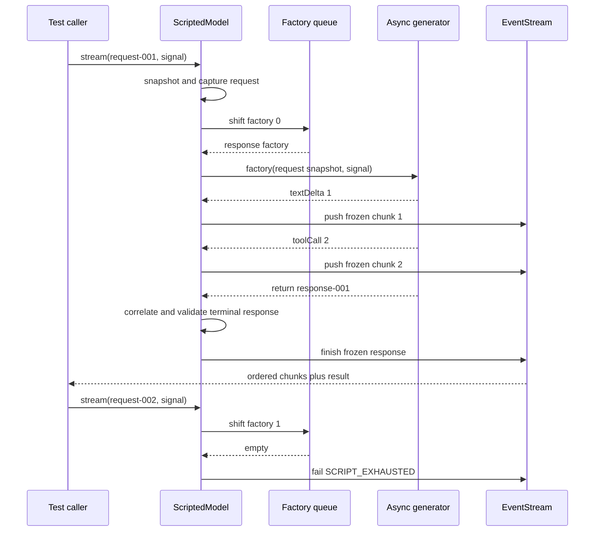

## Kết quả

Bạn sẽ thay dấu vết cố định từ checkpoint `00` bằng một test double deterministic cho model, tức thành phần thay thế có kiểm soát cho model thật trong khi kiểm thử. `ScriptedModel` sở hữu hàng đợi FIFO hữu hạn gồm các hàm `ScriptedResponseFactory`. Mỗi lượt gọi chụp lại yêu cầu, lấy tối đa một factory khỏi hàng đợi, chuyển tiếp các chunk theo đúng thứ tự rồi hoàn tất bằng kết quả cuối của `EventStream`.

Model ghi lại mọi yêu cầu đã được gửi, kể cả lượt gọi diễn ra sau khi hàng đợi đã hết. Nhờ vậy, bài kiểm thử có thể phát hiện một lượt gọi model dư mà không cần đọc log. Khi hàng đợi trống, `ScriptedModelError` mang mã `SCRIPT_EXHAUSTED`; test double không tự bịa câu trả lời dự phòng. Tín hiệu hủy được kiểm tra trước khi lấy factory khỏi hàng đợi, giữa các bước của iterator, trước khi phát từng chunk và trước khi chấp nhận phản hồi cuối.

:::note[Course implementation]

`ScriptedModel`, `ScriptedResponseFactory` và bốn mã `SCRIPT_*` là quy ước của workshop. Chúng mô hình hóa ranh giới hẹp mà các checkpoint sau cần dùng, không phải bí danh của bất kỳ export nào từ Pi.

:::

## Điều kiện tiên quyết

Hoàn thành [checkpoint 03](03-message-ir.md). Bạn cần hiểu `EventStream`, generator bất đồng bộ, `AbortController`, các constructor tạo message đã chuẩn hóa, cách liên kết yêu cầu với phản hồi và khác biệt giữa chunk được phát trong luồng với phản hồi cuối.

Đọc module tích lũy và bằng chứng tập trung cùng nhau:

| Vai trò | Đường dẫn chính xác | Nội dung cần kiểm tra |
| --- | --- | --- |
| Mã nguồn tích lũy | `course/src/scripted-model.ts` | Hàng đợi factory, việc ghi yêu cầu, quyền sở hữu iterator, bản chụp, kiểm tra trạng thái kết thúc và race khi hủy |
| Bằng chứng tập trung | `course/test/04-deterministic-model.test.ts` | Thay thế/nối thêm theo FIFO, thứ tự chunk, trạng thái hết kịch bản, việc hủy, liên kết ID và tái sử dụng iterator |

Không có đồng hồ, giá trị ngẫu nhiên, thông tin xác thực của provider hay kết nối mạng nào tham gia chọn phản hồi. Bài kiểm thử quyết định trước hàng đợi, ID, chunk, usage và lý do dừng.

## Cơ chế

Một `ScriptedResponseFactory` nhận bản chụp bất biến của `CourseModelRequest` cùng `AbortSignal` từ bên gọi. Factory trả về một generator bất đồng bộ: mỗi giá trị được sinh ra là một record `CourseModelChunk`, còn giá trị trả về là một `CourseModelResponse`. Factory có thể đọc yêu cầu hiện tại khi dựng phản hồi, vì vậy việc liên kết yêu cầu luôn tường minh thay vì phụ thuộc vào fixture toàn cục.

`stream()` xử lý đồng bộ phần việc tại ranh giới trước. Hàm chụp lại yêu cầu, thêm bản chụp đó vào `capturedRequests`, tăng `callCount`, tạo `EventStream` rồi khởi động bộ phát. Thuộc tính đọc công khai `requests` trả về một mảng mới đã được đóng băng; các message và arguments của Tool lồng bên trong cũng đã được sao chép và đóng băng. Vì thế, việc bên gọi sửa yêu cầu sau `stream()` không thể thay đổi dữ liệu mà factory hoặc phép kiểm chứng nhìn thấy.

Bộ phát kiểm tra tín hiệu hủy trước khi lấy phần tử đầu hàng đợi. Thứ tự này có chủ đích: yêu cầu bị hủy trước khi bộ phát chạy vẫn được tính là một lượt gọi đã thử và xuất hiện trong `requests`, nhưng chưa tiêu tốn phản hồi theo kịch bản. Lần thử lại sau vẫn có thể dùng factory đó. Khi factory đã được lấy ra, lỗi hoặc việc hủy giữa luồng không đưa nó trở lại vì quá trình xử lý đã bắt đầu.

Mỗi factory sở hữu đúng một iterator. `claimIteratorOnce()` dùng `SCRIPT_ITERATOR_REUSED` để từ chối việc tái sử dụng đồng thời hoặc tuần tự, kể cả giữa nhiều instance của model. Nếu thiếu quy tắc này, hai yêu cầu có thể cùng gọi `next()` trên một generator rồi nhận các chunk xen kẽ từ cùng một phản hồi. Một iterable có thể tái sử dụng chỉ hợp lệ khi nó tạo iterator mới cho từng phản hồi.

Với từng giá trị generator sinh ra, model chụp lại chunk rồi so sánh `requestId` với yêu cầu đang xử lý. Các text delta giữ nguyên thứ tự. Tool call đi qua ranh giới bản chụp của Message IR, nơi arguments JSON được sao chép và đóng băng. Khi generator trả về, phản hồi được sao chép, liên kết với yêu cầu rồi kiểm tra theo `stopReason`: `toolCall` cần ít nhất một Tool-call block, còn `stop` không được chứa Tool-call block. Mỗi giá trị đếm usage phải là số nguyên an toàn không âm.

`waitForAbort()` cho một lệnh `next()` đang chờ chạy đua với tín hiệu mà không cần thăm dò định kỳ hay tạm dừng. Nếu tín hiệu hủy đến trước, bộ phát làm cả phép lặp sự kiện và `stream.result` bị từ chối, sau đó yêu cầu generator dọn dẹp. Lỗi dọn dẹp không thể thay thế lỗi chính. Exception từ factory, lỗi liên kết hoặc phản hồi cuối không hợp lệ đều đi qua cùng luồng lỗi của `EventStream`, nên bên tiêu thụ không thể nhận kết quả thành công sau khi kênh sự kiện đã lỗi.

## Dấu vết hoặc mô hình



| Ranh giới | Trạng thái trước | Trạng thái sau | Quy ước quan sát được |
| --- | --- | --- | --- |
| `stream()` | Bên gọi sở hữu yêu cầu có thể sửa | Model sở hữu bản chụp đã đóng băng | `requests` ghi lại chính xác đầu vào của lượt gọi |
| Lấy phần tử khỏi hàng đợi | `pendingResponseCount = n` | `n - 1` sau khi bộ phát bắt đầu | Factory được lấy theo FIFO |
| Generator sinh chunk | Generator sở hữu chunk thô | Luồng nhận chunk đã đóng băng và liên kết | Thứ tự bên nhận bằng thứ tự từ generator |
| Generator trả về | Phản hồi và usage thô | Phản hồi đã được kiểm tra và đóng băng | `stream.result` hoàn tất đúng một lần |
| Hàng đợi trống | Không còn factory | Luồng báo lỗi | Mã lỗi là `SCRIPT_EXHAUSTED` |

Dòng thời gian phân biệt lượt gọi đã thử với factory đã lấy khỏi hàng đợi. `callCount` tăng trước khi bộ phát chạy bất đồng bộ, còn `pendingResponseCount` chỉ giảm sau bước kiểm tra tín hiệu hủy và thao tác lấy factory.

## Xây dựng

Module tích lũy là `course/src/scripted-model.ts`. Hãy bắt đầu bằng một helper nhỏ để tạo factory, rồi thêm các factory có luồng điều khiển thể hiện đúng hành vi cần kiểm thử. Đoạn sau được chép nguyên văn từ `course/test/04-deterministic-model.test.ts`; nó biên dịch trong file đó vì `ScriptedResponseFactory` và `responseFor()` đã được định nghĩa trong ngữ cảnh xung quanh:

```ts
function textFactory(text: string, id: string): ScriptedResponseFactory {
  return async function* (request) {
    yield { type: "textDelta", requestId: request.id, delta: text };
    return responseFor(request.id, text, id);
  };
}
```

Factory lấy `requestId` từ argument cho cả chunk lẫn phản hồi. Nếu ghi cứng một ID yêu cầu khác, bài kiểm thử sẽ đi vào nhánh lỗi liên kết thay vì tạo phản hồi bình thường. Việc trả về generator bất đồng bộ cũng có ý nghĩa: một promise thông thường không thể cung cấp kênh chunk có thứ tự mà ranh giới model của khóa học yêu cầu.

Dùng `setResponses()` khi bài kiểm thử cần thay toàn bộ hành vi đang chờ và dùng `appendResponse()` khi cần nối dài hàng đợi. Cả hai đều kiểm tra factory trước khi thay đổi trạng thái. `setResponses()` tạo bản chụp đầy đủ của danh sách thay thế trước, vì vậy một mảng thưa hoặc không hợp lệ không thể làm hàng đợi bị thay dở dang.

Đừng chỉ kiểm tra text cuối. Hãy thu thập iterable bất đồng bộ và chờ `stream.result`, sau đó kiểm tra thứ tự chunk, ID liên kết, các field cuối, ranh giới đóng băng, `callCount` và độ dài hàng đợi còn lại. Những quan sát này phân biệt model double đúng quy ước với một stub chỉ trả đúng câu mong đợi nhưng vi phạm protocol.

## Chạy focused test

Test tập trung nằm tại `course/test/04-deterministic-model.test.ts`. Hãy chạy đúng lệnh:

```bash
npm run test:course:checkpoint -- course/test/04-deterministic-model.test.ts
```

File này kiểm chứng việc ghi yêu cầu bất biến, thứ tự text và Tool-call chunk, bản chụp phản hồi cuối bất biến, thao tác thay thế hoặc nối thêm hàng đợi, lỗi có type khi hết kịch bản, việc hủy trước và giữa luồng, cách lan truyền lỗi từ factory, liên kết chunk với phản hồi, ý nghĩa của lý do dừng và quyền sở hữu duy nhất đối với iterator phản hồi. Bài kiểm thử không khẳng định chính sách thử lại trong production, cách chuyển đổi provider, độ chính xác của việc tính token hay hành vi mạng.

## Thử nghiệm lỗi

Hãy yêu cầu thêm một phản hồi sau khi hàng đợi hữu hạn đã hết. Test tập trung đã chứa chính xác trường hợp này:

```ts
test("fails closed with SCRIPT_EXHAUSTED instead of inventing a response", async () => {
  const model = new ScriptedModel();
  const stream = model.stream(
    {
      id: "request-exhausted",
      messages: [
        { id: "message-exhausted", role: "user", content: "One more." },
      ],
    },
    new AbortController().signal,
  );

  await expect(collect(stream)).rejects.toMatchObject({
    code: "SCRIPT_EXHAUSTED",
  });
  await expect(stream.result).rejects.toEqual(
    expect.objectContaining({
      name: "ScriptedModelError",
      code: "SCRIPT_EXHAUSTED",
    }),
  );
  expect(model.callCount).toBe(1);
  expect(model.requests).toHaveLength(1);
});
```

Chạy lệnh kiểm thử tập trung. Cả phép lặp lẫn `stream.result` đều bị từ chối với cùng mã lỗi có type, trong khi yêu cầu đã thử vẫn được ghi lại. Sau đó thêm một `textFactory(...)` vào đầu hàng đợi rồi chạy lại: lượt gọi đầu đạt, lượt thứ hai lỗi. Đừng thêm factory mặc định vì nó sẽ che giấu một lượt model dư ngoài dự kiến trong bài kiểm thử cho vòng lặp Agent (Agent Loop) về sau.

## Tiêu chí chấp nhận

- Lệnh kiểm thử tập trung chỉ chọn `course/test/04-deterministic-model.test.ts` và chạy đạt khi không có mạng.
- `ScriptedModel` ghi lại bản chụp yêu cầu bất biến theo chiều sâu trước khi bên gọi sửa dữ liệu và trả danh sách yêu cầu đã đóng băng.
- Factory phản hồi chỉ được thay thế hoặc nối thêm sau khi đầu vào đã được kiểm tra, rồi được lấy theo FIFO.
- Text và Tool-call chunk đến bên tiêu thụ theo thứ tự generator với `requestId` đang xử lý.
- Phản hồi cuối là bất biến, được liên kết đúng, đồng thời nhất quán với `stopReason` và giá trị đếm usage không âm.
- Yêu cầu bị hủy trước khi bộ phát chạy không tiêu thụ phản hồi đang chờ; việc hủy giữa luồng ngắt bước iterator đang chờ.
- Một iterator phản hồi không thể được chia sẻ giữa nhiều lượt gọi hoặc instance của model.
- Khi hàng đợi hết, phép lặp sự kiện và `stream.result` cùng bị từ chối bằng `SCRIPT_EXHAUSTED`, nhưng bằng chứng về lượt gọi vẫn được giữ lại.

## So sánh với Pi SDK 0.99.2

:::info[Pi SDK 0.99.2]

`@earendil-works/pi-ai` xuất các helper kiểm thử `fauxProvider()`, `fauxAssistantMessage()`, `fauxToolCall()`, `FauxResponseFactory` và `FauxProviderHandle`. Cùng package đó còn xuất `EventStream` và `AssistantMessageEventStream` cho protocol truyền dữ liệu theo luồng (streaming) phong phú hơn.

:::

Faux provider của Pi tạo `Provider` có hình dạng dùng trong production, tích hợp với tập hợp model và phát các sự kiện assistant cho text, thinking, Tool call, hoàn tất, lỗi, hủy cùng phản hồi trì hoãn. Nó có thể ước lượng usage và chia content thành các chunk. ID, timestamp và kích thước chunk mặc định có thể phụ thuộc thời gian hoặc giá trị ngẫu nhiên, vì vậy faux provider không phải test double có trình tự đầu ra deterministic như `ScriptedModel`.

Phần triển khai của khóa học được thu gọn có chủ đích. Nó chỉ nhận `textDelta` và chunk `toolCall` đã hoàn chỉnh, dùng Message IR của khóa học, có hai lý do dừng và yêu cầu bài kiểm thử chỉ định mọi ID cùng giá trị usage. Nó dùng thuộc tính `result`, còn `EventStream` của Pi cung cấp phương thức `result()`. Hai interface này không thể thay thế trực tiếp cho nhau.

Hãy dùng các faux helper do Pi xuất khi kiểm thử một tích hợp Pi với `AssistantMessage` và hành vi provider đúng theo bản phát hành. Dùng `ScriptedModel` để nghiên cứu nhu cầu gọi theo FIFO, cách liên kết ID, ranh giới hủy và dấu vết Agent Loop deterministic trong workshop này.

Course implementation là bản triển khai giảng dạy nguyên bản do Pify tự xây dựng, có phạm vi nhỏ hơn và không cam kết tương thích API với Pi.

## Checkpoint tiếp theo

[Checkpoint 05](05-provider-adapter.md) đưa ranh giới tin cậy ra phía vận chuyển. Bạn sẽ phân tích các record `unknown` trong fixture vận chuyển thành cùng loại chunk model và phản hồi cuối mà không thêm thông tin xác thực hay client mạng.
