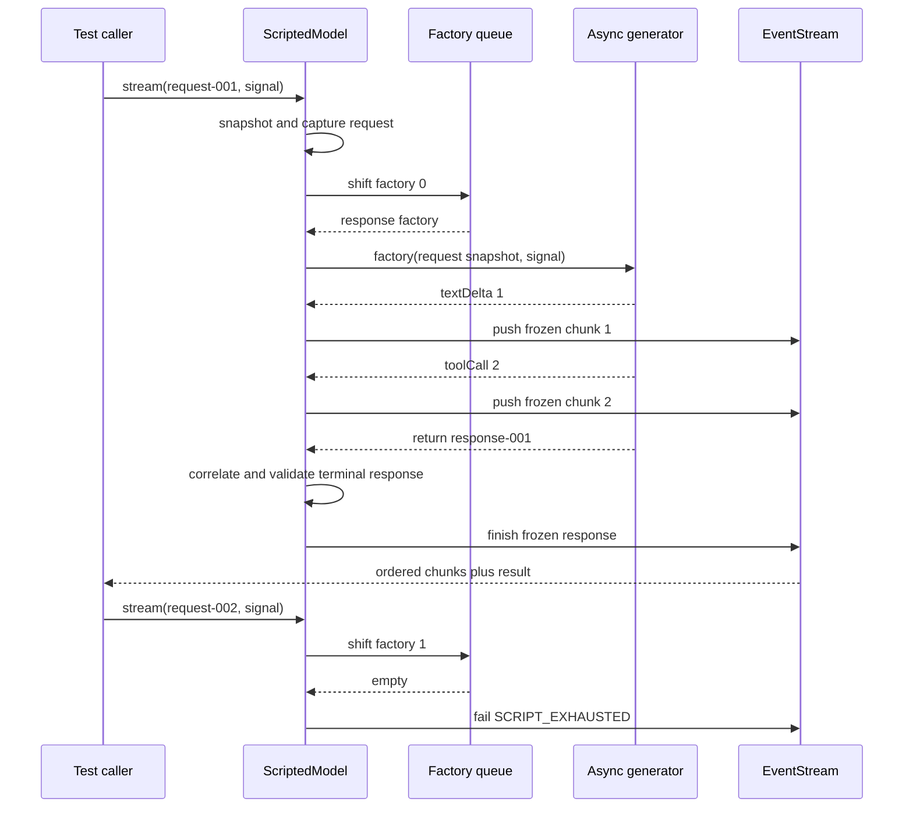

## Kết quả

Bạn sẽ thay trace cố định từ checkpoint `00` bằng một test double deterministic cho model, tức thành phần thay thế có kiểm soát trong khi test. `ScriptedModel` sở hữu hàng đợi FIFO hữu hạn gồm các function `ScriptedResponseFactory`. Mỗi call tạo snapshot cho request, tiêu thụ tối đa một factory, chuyển tiếp chunk của factory theo đúng thứ tự và settle qua terminal result của `EventStream`.

Model ghi lại mọi request đã thử, kể cả call được thực hiện sau khi hàng đợi đã hết. Nhờ vậy, nhu cầu gọi model có thể được quan sát mà không cần log. Hàng đợi trống fail bằng `ScriptedModelError` với code `SCRIPT_EXHAUSTED`; test double không tự tạo fallback answer. Cancellation được kiểm tra trước khi lấy factory khỏi hàng đợi, giữa các iterator step, trước khi publish từng chunk và trước khi chấp nhận terminal response.

:::note[Course implementation]

`ScriptedModel`, `ScriptedResponseFactory` và bốn code `SCRIPT_*` là contract của workshop. Chúng mô hình hóa ranh giới hẹp mà các checkpoint sau cần dùng và không phải alias cho export của Pi.

:::

## Điều kiện tiên quyết

Hoàn thành [checkpoint 03](03-message-ir.md). Bạn cần hiểu `EventStream`, async generator, `AbortController`, các normalized message constructor, request/response correlation cùng khác biệt giữa streamed chunk và terminal response.

Đọc module tích lũy và bằng chứng tập trung cùng nhau:

| Vai trò | Đường dẫn chính xác | Nội dung cần kiểm tra |
| --- | --- | --- |
| Source tích lũy | `course/src/scripted-model.ts` | Factory queue, request capture, iterator ownership, snapshot, terminal check và abort race |
| Bằng chứng tập trung | `course/test/04-deterministic-model.test.ts` | Hành vi replace/append FIFO, ordered chunk, exhaustion, cancellation, correlation và iterator reuse |

Không có clock, random value, provider credential hay network connection nào chọn response. Test quyết định trước queue, ID, chunk, usage và stop reason.

## Cơ chế

Một `ScriptedResponseFactory` nhận immutable snapshot của `CourseModelRequest` cùng `AbortSignal` từ caller. Factory trả async generator có các giá trị yield là record `CourseModelChunk`, còn return value là một `CourseModelResponse`. Factory có thể đọc request hiện tại khi dựng response, vì vậy request correlation luôn tường minh thay vì phụ thuộc global fixture.

`stream()` thực hiện phần việc tại ranh giới theo cách synchronous trước. Hàm snapshot request, append snapshot đó vào `capturedRequests`, tăng `callCount`, tạo `EventStream` rồi khởi động producer. Getter public `requests` trả một array mới đã freeze, trong khi captured message và Tool arguments lồng bên trong đã được copy và freeze từ trước. Mutation request của caller sau `stream()` không thể thay đổi dữ liệu mà factory hoặc assertion quan sát.

Producer kiểm tra cancellation trước khi shift queue. Thứ tự này có chủ đích: request bị cancel trước production vẫn được tính là attempted call và xuất hiện trong `requests`, nhưng không tiêu tốn scripted response. Lần retry sau có thể dùng chính factory đó. Sau khi factory đã bị shift, failure hoặc cancellation giữa stream không đưa nó trở lại vì execution đã bắt đầu.

Mỗi factory sở hữu đúng một iterator. `claimIteratorOnce()` từ chối concurrent hoặc sequential reuse bằng `SCRIPT_ITERATOR_REUSED`, kể cả giữa nhiều model instance. Nếu thiếu rule này, hai request có thể cùng gọi `next()` trên một generator rồi nhận các chunk xen kẽ từ cùng một response. Reusable iterable chỉ hợp lệ khi nó tạo iterator mới cho mỗi response.

Với từng giá trị được yield, model snapshot chunk rồi so sánh `requestId` với active request. Text delta giữ nguyên thứ tự. Tool call đi qua ranh giới snapshot của Message IR, nơi JSON arguments được copy và freeze. Khi generator return, response được copy, correlate và kiểm tra theo `stopReason`: `toolCall` cần ít nhất một Tool-call block, còn `stop` cấm Tool-call block. Usage count phải là non-negative safe integer.

`waitForAbort()` race một `next()` đang pending với signal mà không polling hay sleep. Nếu cancellation thắng, producer reject cả event iteration lẫn `stream.result`, sau đó yêu cầu generator cleanup. Cleanup error không thể thay primary failure. Factory exception, correlation error hoặc invalid terminal response đi qua cùng failure path của EventStream, nên consumer không thể nhận successful result sau khi event channel fail.

## Dấu vết hoặc mô hình



| Ranh giới | Trạng thái trước | Trạng thái sau | Contract quan sát được |
| --- | --- | --- | --- |
| `stream()` | Caller sở hữu mutable request | Model sở hữu frozen snapshot | `requests` ghi lại chính xác call input |
| Queue shift | `pendingResponseCount = n` | `n - 1` sau khi production bắt đầu | Factory được tiêu thụ theo FIFO |
| Chunk yield | Generator sở hữu raw chunk | Stream nhận frozen correlated chunk | Thứ tự ở consumer bằng thứ tự generator |
| Generator return | Raw response và usage | Frozen validated response | `stream.result` settle đúng một lần |
| Empty queue | Không còn factory | Failed stream | Code là `SCRIPT_EXHAUSTED` |

Timeline phân biệt attempted call với consumed factory. `callCount` tăng trước asynchronous production, còn `pendingResponseCount` chỉ giảm sau abort pre-check và queue shift.

## Xây dựng

Module tích lũy là `course/src/scripted-model.ts`. Hãy bắt đầu bằng một factory helper nhỏ, rồi thêm factory có control flow biểu lộ đúng hành vi cần test. Đoạn sau được chép nguyên văn từ `course/test/04-deterministic-model.test.ts`; nó compile trong file đó vì `ScriptedResponseFactory` và `responseFor()` được định nghĩa ở surrounding test context:

```ts
function textFactory(text: string, id: string): ScriptedResponseFactory {
  return async function* (request) {
    yield { type: "textDelta", requestId: request.id, delta: text };
    return responseFor(request.id, text, id);
  };
}
```

Factory lấy `requestId` từ argument cho cả chunk lẫn response. Hard-code một request ID khác sẽ kiểm thử correlation failure thay vì normal response. Việc trả async generator cũng có ý nghĩa: ordinary promise không thể cung cấp ordered chunk channel mà course model boundary yêu cầu.

Dùng `setResponses()` khi test cần replace toàn bộ pending behavior và `appendResponse()` khi cần nối dài queue. Cả hai validate factory trước mutation. `setResponses()` snapshot toàn bộ replacement trước, vì vậy sparse hoặc invalid array không thể khiến queue bị replace một phần.

Không chỉ assert final text. Hãy collect async iterable và await `stream.result`, rồi kiểm tra chunk order, correlation ID, terminal field, freeze boundary, `callCount` cùng queue length còn lại. Các quan sát này phân biệt model double đúng contract với stub trả expected sentence nhưng vi phạm protocol.

## Chạy focused test

Focused test là `course/test/04-deterministic-model.test.ts`. Chạy đúng command:

```bash
npm run test:course:checkpoint -- course/test/04-deterministic-model.test.ts
```

File này chứng minh immutable request capture, thứ tự text và Tool-call chunk, immutable terminal snapshot, replace và append queue, typed exhaustion, cancellation trước và giữa stream, factory-failure propagation, chunk/response correlation, stop-reason semantics cùng quyền sở hữu duy nhất đối với response iterator. Test không đưa ra claim về production retry policy, provider conversion, độ chính xác token accounting hay network behavior.

## Thử nghiệm lỗi

Yêu cầu thêm một response sau khi hàng đợi hữu hạn đã hết. Focused test đã chứa chính xác trường hợp này:

```ts
test("fails closed with SCRIPT_EXHAUSTED instead of inventing a response", async () => {
  const model = new ScriptedModel();
  const stream = model.stream(
    {
      id: "request-exhausted",
      messages: [
        { id: "message-exhausted", role: "user", content: "One more." },
      ],
    },
    new AbortController().signal,
  );

  await expect(collect(stream)).rejects.toMatchObject({
    code: "SCRIPT_EXHAUSTED",
  });
  await expect(stream.result).rejects.toEqual(
    expect.objectContaining({
      name: "ScriptedModelError",
      code: "SCRIPT_EXHAUSTED",
    }),
  );
  expect(model.callCount).toBe(1);
  expect(model.requests).toHaveLength(1);
});
```

Chạy focused command. Cả hai consumption path reject với cùng typed code, trong khi attempted request vẫn được capture. Sau đó prepend một `textFactory(...)` rồi chạy lại: call đầu pass còn call thứ hai fail. Không thêm default factory vì nó sẽ che giấu một model turn dư ngoài dự kiến trong test cho vòng lặp Agent (Agent Loop) về sau.

## Tiêu chí chấp nhận

- Focused command chỉ chọn `course/test/04-deterministic-model.test.ts` và pass offline.
- `ScriptedModel` capture deeply immutable request trước caller mutation và expose frozen request list.
- Response factory chỉ được replace hoặc append sau khi input đã validate, rồi được tiêu thụ theo FIFO.
- Text và Tool-call chunk đến consumer theo thứ tự generator với active `requestId`.
- Final response là immutable, correlated, đồng thời nhất quán với `stopReason` và non-negative usage count.
- Request bị cancel trước production không tiêu thụ queued response; cancellation giữa stream ngắt pending iterator step.
- Một response iterator không thể được chia sẻ giữa nhiều call hoặc model instance.
- Queue exhaustion reject event iteration và `stream.result` bằng `SCRIPT_EXHAUSTED` nhưng vẫn giữ call evidence.

## So sánh với Pi SDK 0.84.3

:::info[Pi SDK 0.84.3]

`@earendil-works/pi-ai` export các testing helper `fauxProvider()`, `fauxAssistantMessage()`, `fauxToolCall()`, `FauxResponseFactory` và `FauxProviderHandle`. Cùng package đó export `EventStream` cùng `AssistantMessageEventStream` cho protocol truyền dữ liệu theo luồng (streaming) phong phú hơn.

:::

Faux provider của Pi có `Provider` mang production shape, tích hợp models collection, cùng assistant event cho text, thinking, Tool call, completion, error, abort và deferred response. Nó có thể ước lượng usage và chia content thành chunk. Default ID, timestamp và chunk size của nó có thể dùng thời gian hoặc randomness, vì vậy đây không phải exact-sequence test double giống `ScriptedModel`.

Course implementation cố ý nhỏ hơn. Nó chỉ nhận `textDelta` và complete `toolCall` chunk, dùng Message IR của course, có hai stop reason và yêu cầu test chọn mọi ID cùng usage value. Nó còn dùng property tên `result`; `EventStream` của Pi expose `result()` dưới dạng method. Không thay thế interface này bằng interface kia.

Dùng exported faux helper của Pi khi kiểm thử Pi integration với `AssistantMessage` và provider behavior mang release shape. Dùng `ScriptedModel` để nghiên cứu FIFO demand, correlation, cancellation boundary và deterministic Agent Loop trace trong workshop này.

## Checkpoint tiếp theo

[Checkpoint 05](05-provider-adapter.md) đẩy trust boundary ra ngoài. Bạn sẽ parse unknown transport fixture record thành cùng model chunk và terminal response mà không thêm credential hay network client.
