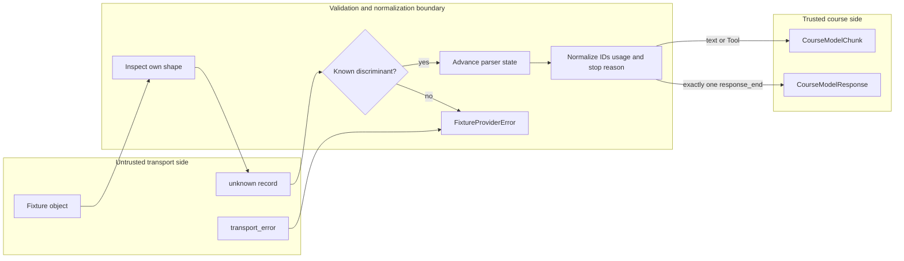

## Kết quả

Bạn sẽ xây dựng một adapter cho provider chạy không cần mạng, nhận dữ liệu chưa đáng tin cậy từ tầng vận chuyển và trả ra protocol model đã được khóa học kiểm tra. `FixtureProviderAdapter` nhận một fixture có phiên bản (versioned fixture), tức tập record kiểm thử cố định có phiên bản schema tường minh, sở hữu hàng đợi phản hồi hữu hạn, phân tích từng record từ `unknown`, rồi phát các `CourseModelChunk` bất biến cùng đúng một `CourseModelResponse` cuối.

Ranh giới này giữ nguyên thứ tự text delta và ID Tool call do provider cung cấp. Nó chuẩn hóa lý do dừng `tool_call` của tầng vận chuyển thành `toolCall`, chấp nhận field usage dạng camel-case hoặc snake-case nhưng từ chối bí danh trùng, đồng thời liên kết `response_start` với `response_end`. Mỗi phản hồi phải chứa đúng một record kết thúc. Record bị thiếu, trùng, không khớp, sai hình dạng, không nhận biết được hoặc xuất hiện sau điểm kết thúc đều tạo mã lỗi `FixtureProviderError` ổn định.

:::note[Course implementation]

Adapter này chỉ phân tích schema fixture do Pify lưu trong repository. Nó không phải phần triển khai provider của Pi, không thực hiện xác thực hay HTTP và không tuyên bố tương thích với định dạng truyền dẫn của bất kỳ nhà cung cấp nào.

:::

## Điều kiện tiên quyết

Hoàn thành [checkpoint 04](04-deterministic-model.md). Bạn cần hiểu cách thu hẹp `unknown`, record có trường phân biệt, thuộc tính riêng, giá trị tương thích JSON, iterable bất đồng bộ, `EventStream`, tín hiệu hủy, cách liên kết phản hồi và lý do một phép khẳng định type của TypeScript không thể biến dữ liệu từ tầng vận chuyển thành dữ liệu đáng tin cậy.

Kiểm tra các file sau như một ranh giới thống nhất:

| Vai trò | Đường dẫn chính xác | Nội dung cần kiểm tra |
| --- | --- | --- |
| Mã nguồn tích lũy | `course/src/provider-adapter.ts` | Bản chụp fixture, con trỏ record, trạng thái parser, bước chuẩn hóa, lỗi có type và dọn dẹp |
| Dữ liệu trong repository | `course/fixtures/provider-tool-roundtrip.json` | Hai phản hồi hữu hạn: một Tool call rồi text cuối |
| Bằng chứng tập trung | `course/test/05-provider-adapter.test.ts` | Guard cấm mạng, các trường hợp JSON `unknown`, quy tắc terminal, việc hủy, trạng thái hết hàng đợi và quyền sở hữu iterator |

Adapter chỉ cần object fixture cùng `AbortSignal`. Nó vẫn phải hoạt động khi `fetch` và `WebSocket` bị thay bằng các hàm luôn ném lỗi.

## Cơ chế

Protocol của tầng vận chuyển và protocol model là hai bộ từ vựng tách biệt. Record vận chuyển dùng `response_start`, `text_delta`, `tool_call`, `response_end` và `transport_error`. Phía đã chuẩn hóa dùng `textDelta`, `toolCall`, `CourseAssistantMessage`, `CourseModelUsage` cùng lý do dừng của khóa học. Mọi phép chuyển đổi đều tường minh; parser không ép trực tiếp một Tool call `unknown` thành type của khóa học.

Constructor kiểm tra `schemaVersion: 1` rồi chụp lại toàn bộ danh sách phản hồi. Mỗi phản hồi sở hữu một mảng đặc gồm các record `unknown` hoặc một nguồn record bất đồng bộ. Các record trong mảng được sao chép trước khi lượt gọi bắt đầu, kể cả giá trị JSON thuần lồng nhau; vì vậy, việc sửa fixture về sau không thể viết lại phản hồi đang chờ. Mảng thưa, prototype không được hỗ trợ, accessor bị lỗi, chu trình và container không an toàn đều trở thành `PROVIDER_INVALID_FIXTURE` thay vì thoát ra dưới dạng lỗi tùy ý.

`stream()` chỉ ghi lại ID yêu cầu vì fixture không cần transcript để chọn phản hồi tiếp theo. Bộ phát kiểm tra tín hiệu hủy trước khi lấy phản hồi khỏi hàng đợi hữu hạn. Một lượt gọi đã bị hủy từ trước vẫn làm tăng `callCount`, nhưng phản hồi đang chờ được giữ lại cho lần thử sau. Nếu hàng đợi trống, cả phép lặp lẫn `result` đều bị từ chối bằng `PROVIDER_EXHAUSTED`.

Parser dùng một object trạng thái nhỏ gồm `responseId` tùy chọn, `content` có thứ tự của assistant, tập hợp ID Tool call và `terminal` tùy chọn. `response_start` phải xuất hiện đúng một lần và khai báo `role: "assistant"`; record text và record Tool không được đứng trước nó. Mỗi `text_delta` thêm một text block và phát một text chunk. Mỗi `tool_call` cần ID và name không rỗng cùng một object JSON khác `null` cho arguments. Adapter sao chép object đó theo chiều sâu, giữ các chuỗi nguy hiểm như `"__proto__"` dưới dạng key riêng bình thường mà không làm thay đổi prototype.

Khi chuẩn hóa usage, parser xét riêng sự hiện diện và giá trị của từng field. Payload có thể dùng `inputTokens`/`outputTokens` hoặc `input_tokens`/`output_tokens`. Nếu cả hai bí danh của cùng một giá trị đếm đều có mặt, kể cả khi một giá trị là `undefined`, sự kiện không hợp lệ. Giá trị được chấp nhận phải là số nguyên an toàn không âm rồi được đặt trong object `{ inputTokens, outputTokens }` đã đóng băng.

Quy tắc chuyển sang trạng thái kết thúc rất chặt. `response_end.responseId` phải khớp ID lúc bắt đầu. `tool_call` được đổi thành `toolCall` và yêu cầu ít nhất một Tool call; `stop` không được đi cùng Tool call. Message assistant cuối nhận ID `message-${responseId}` và giữ thứ tự content đã tích lũy. Nếu nguồn kết thúc mà thiếu `response_end`, adapter trả `PROVIDER_MISSING_TERMINAL`; record kết thúc thứ hai tạo `PROVIDER_DUPLICATE_TERMINAL`; record loại khác xuất hiện sau điểm kết thúc tạo `PROVIDER_INVALID_TERMINAL`.

Nguồn record bất đồng bộ vẫn là dữ liệu chưa đáng tin cậy. Adapter nhận quyền sở hữu iterator đúng một lần, kiểm tra `next()` an toàn, cho bước đang chờ chạy đua với tín hiệu hủy, bỏ qua giá trị không liên quan của bước đã hoàn tất và yêu cầu dọn dẹp khi xử lý dừng sớm. Lỗi bất ngờ từ nguồn trở thành `PROVIDER_INVALID_FIXTURE` do khóa học sở hữu. Một `FixtureProviderError` giả do nguồn ném ra không được coi là lỗi nội bộ.

## Dấu vết hoặc mô hình



| Record vận chuyển | Trạng thái và field bắt buộc | Hiệu ứng sau chuẩn hóa | Lỗi tiêu biểu |
| --- | --- | --- | --- |
| `response_start` | Lần bắt đầu đầu tiên, role assistant khớp, `responseId` không rỗng | Lưu danh tính của phản hồi | `PROVIDER_DUPLICATE_START` hoặc `PROVIDER_INVALID_EVENT` |
| `text_delta` | Đã thấy record bắt đầu, `text` là string | Thêm text block rồi phát `textDelta` | `PROVIDER_MISSING_START` |
| `tool_call` | Đã thấy record bắt đầu, ID/name duy nhất, arguments là object JSON | Thêm rồi phát `toolCall` đã đóng băng với cùng ID | `PROVIDER_INVALID_EVENT` |
| `response_end` | ID khớp, lý do dừng và usage hợp lệ | Dựng rồi hoàn tất một phản hồi cuối | `PROVIDER_RESPONSE_MISMATCH` |
| Hết record | Record kết thúc đã được lưu | Hoàn tất luồng | `PROVIDER_MISSING_TERMINAL` |

Ranh giới tin cậy không biến một giá trị đoán mò thành dữ liệu hợp lệ. Nó phải chứng minh đủ hình dạng và thứ tự để dựng protocol đã chuẩn hóa; nếu không, nó trả một lỗi có type.

## Xây dựng

Module tích lũy là `course/src/provider-adapter.ts`. Hãy cấp fixture trong repository cho adapter thay vì dùng một object chép lại từ tài liệu. Đoạn sau được chép nguyên văn từ phản hồi đầu trong `course/fixtures/provider-tool-roundtrip.json`:

```json
{
  "records": [
    {
      "type": "response_start",
      "responseId": "response-tool-001",
      "role": "assistant"
    },
    {
      "type": "tool_call",
      "id": "call-add-001",
      "name": "add",
      "arguments": {
        "left": 20,
        "right": 22
      }
    },
    {
      "type": "response_end",
      "responseId": "response-tool-001",
      "stopReason": "tool_call",
      "usage": {
        "inputTokens": 12,
        "outputTokens": 8
      }
    }
  ]
}
```

Đoạn này là một phần tử trong mảng `responses` của fixture. File đầy đủ chứa phản hồi thứ hai với `text_delta: "The sum is 42."`. Hai lượt gọi lấy các phần tử theo thứ tự. Phản hồi đầu sau chuẩn hóa kết thúc bằng `stopReason: "toolCall"`; phản hồi thứ hai kết thúc bằng `stopReason: "stop"`.

Hãy giữ tên của định dạng truyền dẫn bên trong parser. Mã phía sau không nên rẽ nhánh theo `response_end` hoặc `input_tokens`; nó chỉ nhận type của khóa học. Ngược lại, đừng viết lại `call-add-001` của provider thành ID sinh cục bộ. Cùng một ID không diễn giải phải tồn tại trong Tool-call block của assistant và mối liên kết tới Tool result về sau.

## Chạy focused test

Test tập trung nằm tại `course/test/05-provider-adapter.test.ts`. Hãy chạy đúng lệnh:

```bash
npm run test:course:checkpoint -- course/test/05-provider-adapter.test.ts
```

Bài kiểm thử dùng chốt chặn để chứng minh lượt đi-về qua fixture không gọi `fetch` hay `WebSocket`. Nó kiểm tra thứ tự đầu ra, ID Tool, bí danh usage, bản chụp bất biến, key JSON nguy hiểm, field kế thừa, sự kiện `unknown` hoặc sai hình dạng, cách chuẩn hóa lỗi, số lượng record kết thúc, quy tắc ID/lý do dừng, trạng thái hết hàng đợi, việc hủy, dọn dẹp nguồn bất đồng bộ và quyền sở hữu iterator. Bài kiểm thử không gọi endpoint từ xa, luồng thông tin xác thực, cơ chế thử lại HTTP, schema của nhà cung cấp hay hệ thống tính token thật.

## Thử nghiệm lỗi

Sao chép fixture thành một giá trị tạm rồi xóa `response_end` khỏi phản hồi đầu, chỉ để lại record bắt đầu và Tool call:

```json
{
  "schemaVersion": 1,
  "responses": [
    {
      "records": [
        {
          "type": "response_start",
          "responseId": "response-tool-001",
          "role": "assistant"
        },
        {
          "type": "tool_call",
          "id": "call-add-001",
          "name": "add",
          "arguments": {
            "left": 20,
            "right": 22
          }
        }
      ]
    }
  ]
}
```

Đưa phản hồi đó qua luồng rồi chờ cả chunk lẫn kết quả cuối. Tool-call chunk có thể được quan sát trước khi nguồn kết thúc, nhưng cả hai đường tiêu thụ đều không được báo thành công. Chúng cùng bị từ chối bằng `PROVIDER_MISSING_TERMINAL`. Khôi phục `response_end` với ID khớp, `stopReason: "tool_call"` và usage hợp lệ; phản hồi sau đó hoàn tất với `toolCall`. Thử nghiệm này cho thấy việc nhận được delta hữu ích chưa chứng minh phản hồi đã kết thúc đầy đủ.

## Tiêu chí chấp nhận

- Lệnh kiểm thử tập trung chỉ chọn `course/test/05-provider-adapter.test.ts` và chạy đạt khi không có mạng, không cần thông tin xác thực.
- Adapter chỉ chấp nhận phiên bản schema `1`, hàng đợi phản hồi hữu hạn dạng mảng đặc và nguồn record là mảng hoặc iterable bất đồng bộ an toàn.
- Mọi record vận chuyển bắt đầu dưới dạng `unknown` và được kiểm tra trước khi tạo chunk hoặc phản hồi của khóa học.
- Thứ tự text cùng ID Tool call không diễn giải được giữ qua bước chuẩn hóa mà không bị tự sinh lại hay đổi vị trí.
- Usage dạng camel-case hoặc snake-case trở thành một object usage của khóa học đã đóng băng; bí danh trùng bị từ chối.
- Bắt buộc có đúng một record kết thúc được liên kết đúng, và lý do dừng phải đồng thuận với các Tool call đã tích lũy.
- Sự kiện không nhận biết được, payload sai hình dạng, lỗi vận chuyển, nguồn thù địch và trạng thái hết hàng đợi đều tạo mã ổn định do khóa học sở hữu.
- Xóa `response_end` khiến phép lặp và `result` cùng bị từ chối bằng `PROVIDER_MISSING_TERMINAL`, kể cả sau khi chunk trước đó đã được phát.

## So sánh với Pi SDK 0.84.3

:::info[Pi SDK 0.84.3]

`@earendil-works/pi-ai` xuất `Provider`, `createProvider()`, `createModels()`, `MutableModels`, `AssistantMessageEventStream`, `AssistantMessageEvent`, `ToolCall`, `Usage` và `StopReason`. `createProvider()` dựng rồi trả về một `Provider` dùng trong production từ các thành phần xác thực, model và luồng API; hàm này không đăng ký provider. `createModels()` trả về `MutableModels`; phương thức `models.setProvider(provider)` thêm mới hoặc thay thế provider trong tập hợp đó.

:::

Luồng assistant của Pi có các sự kiện vòng đời cho lúc bắt đầu, text, thinking, quá trình ghép Tool call, hoàn tất và lỗi. `AssistantMessage` công khai của Pi giữ danh tính provider/model, usage cùng chi phí chi tiết hơn, timestamp, dữ liệu chẩn đoán, metadata của phản hồi, nhiều lý do dừng hơn, content dạng image/thinking và phản hồi trì hoãn. Một module provider thực tế của Pi còn đảm nhiệm việc chuyển yêu cầu cho nhà cung cấp, xử lý đầu vào xác thực, phân tích phản hồi và áp dụng hành vi lỗi riêng của bản phát hành.

Adapter của khóa học là một bài tập parser nhỏ hơn. Nó nhận biết năm loại record vận chuyển, không có registry cho provider, phát Tool-call chunk hoàn chỉnh thay vì chuỗi sự kiện Tool call dạng bắt đầu/delta/kết thúc và chỉ ghi hai giá trị đếm token. Các mã `FixtureProviderError` cùng fixture `schemaVersion: 1` không phải API của Pi.

Khi triển khai provider cho Pi, hãy dùng quy ước `Provider` cùng các sự kiện assistant đã phát hành và đọc module provider tương ứng tại commit của bản phát hành đã ghim. Giữ các nguyên tắc ranh giới từ checkpoint này: phân tích đầu vào `unknown`, bảo toàn ID không diễn giải, chỉ chuẩn hóa một lần, từ chối trạng thái kết thúc mâu thuẫn và giữ chi tiết vận chuyển bên ngoài vòng lặp Agent (Agent Loop).

## Checkpoint tiếp theo

[Checkpoint 06](06-tool-contract.md) xử lý Tool call đã chuẩn hóa. Bạn sẽ kiểm tra arguments trước mọi tác dụng phụ, đăng ký Tool theo cách nguyên tử, truyền tín hiệu hủy và chuyển lỗi Tool thông thường thành result có giới hạn, được liên kết đúng.
