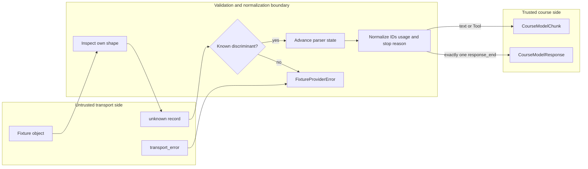

## Kết quả

Bạn sẽ xây dựng một offline provider adapter có input là untrusted transport data và output là trusted course model protocol. `FixtureProviderAdapter` nhận versioned fixture, tức bộ dữ liệu kiểm thử cố định có version, sở hữu finite response queue, parse từng record từ `unknown`, rồi emit immutable `CourseModelChunk` cùng đúng một terminal `CourseModelResponse`.

Ranh giới này giữ nguyên thứ tự text delta và provider Tool-call ID. Nó chuẩn hóa transport stop reason `tool_call` thành `toolCall`, chấp nhận usage field dạng camel-case hoặc snake-case nhưng không chấp nhận alias trùng, đồng thời correlate `response_start` với `response_end`. Một response phải chứa đúng một terminal record. Record bị thiếu, trùng, không khớp, malformed, unknown hoặc xuất hiện sau terminal đều fail bằng code `FixtureProviderError` ổn định.

:::note[Course implementation]

Adapter này parse fixture schema được Pify check vào repository. Nó không phải Pi provider implementation, không triển khai authentication hay HTTP và không tuyên bố tương thích với wire format của vendor nào.

:::

## Điều kiện tiên quyết

Hoàn thành [checkpoint 04](04-deterministic-model.md). Bạn cần hiểu cách narrow `unknown`, discriminated record, own property, giá trị tương thích JSON, async iterable, `EventStream`, cancellation, response correlation cùng lý do transport input không thể được tin cậy qua TypeScript assertion.

Kiểm tra các file sau như một ranh giới thống nhất:

| Vai trò | Đường dẫn chính xác | Nội dung cần kiểm tra |
| --- | --- | --- |
| Source tích lũy | `course/src/provider-adapter.ts` | Fixture snapshot, record cursor, parser state, normalization, typed failure và cleanup |
| Dữ liệu đã check in | `course/fixtures/provider-tool-roundtrip.json` | Hai finite response: một Tool call rồi final text |
| Bằng chứng tập trung | `course/test/05-provider-adapter.test.ts` | No-network guard, unknown JSON case, terminal rule, cancellation, queue exhaustion và iterator ownership |

Adapter chỉ cần fixture object cùng `AbortSignal`. Nó vẫn phải hoạt động khi `fetch` và `WebSocket` bị thay bằng các function luôn ném lỗi.

## Cơ chế

Transport protocol và model protocol là hai bộ từ vựng tách biệt. Transport record dùng `response_start`, `text_delta`, `tool_call`, `response_end` và `transport_error`. Phía normalized dùng `textDelta`, `toolCall`, `CourseAssistantMessage`, `CourseModelUsage` cùng course stop reason. Việc chuyển đổi luôn tường minh; parser không cast unknown Tool call trực tiếp thành course type.

Construction validate `schemaVersion: 1` rồi snapshot toàn bộ response list. Mỗi response sở hữu dense array gồm unknown record hoặc async record source. Array record được copy trước khi call bắt đầu, kể cả nested plain JSON value, vì vậy fixture mutation về sau không thể viết lại queued response. Sparse array, unsupported prototype, accessor failure, cycle và unsafe container trở thành `PROVIDER_INVALID_FIXTURE` thay vì thoát ra dưới dạng arbitrary error.

`stream()` chỉ capture request ID vì fixture không cần transcript để chọn response tiếp theo. Producer kiểm tra cancellation trước khi shift finite queue. Pre-cancelled call làm tăng `callCount` nhưng giữ pending response cho lần retry. Nếu queue trống, cả iteration lẫn `result` reject bằng `PROVIDER_EXHAUSTED`.

Parser dùng state object nhỏ: optional `responseId`, assistant `content` có thứ tự, set các Tool-call ID cùng optional `terminal`. `response_start` phải xuất hiện đúng một lần và khai báo `role: "assistant"`. Text và Tool record không được đứng trước nó. Mỗi `text_delta` append một text block và emit một text chunk. Mỗi `tool_call` cần ID cùng name non-empty và non-null JSON object cho arguments. Adapter copy object đó theo chiều sâu, giữ các string nguy hiểm như `"__proto__"` dưới dạng own key bình thường mà không gây prototype mutation.

Usage normalization xem sự hiện diện của field tách biệt với value. Payload có thể dùng `inputTokens`/`outputTokens` hoặc `input_tokens`/`output_tokens`. Nếu cả hai alias của cùng một count đều hiện diện, kể cả khi một value là `undefined`, event không hợp lệ. Count được chấp nhận phải là non-negative safe integer rồi trở thành frozen object `{ inputTokens, outputTokens }`.

Terminal transition rất chặt. `response_end.responseId` phải khớp start ID. `tool_call` trở thành `toolCall` và cần ít nhất một Tool call; `stop` cấm Tool call. Final assistant message nhận ID `message-${responseId}` và giữ thứ tự content đã tích lũy. Source kết thúc mà thiếu `response_end` tạo `PROVIDER_MISSING_TERMINAL`; terminal thứ hai tạo `PROVIDER_DUPLICATE_TERMINAL`; record loại khác sau terminal tạo `PROVIDER_INVALID_TERMINAL`.

Async record source vẫn là dữ liệu không tin cậy. Adapter claim iterator của nó đúng một lần, inspect `next()` an toàn, race pending step với cancellation, bỏ qua value không liên quan của completed step và yêu cầu cleanup khi processing dừng sớm. Unexpected source failure trở thành course-owned error `PROVIDER_INVALID_FIXTURE`. Một `FixtureProviderError` giả do source ném ra không được tin là internal error.

## Dấu vết hoặc mô hình



| Transport record | State và field bắt buộc | Hiệu ứng normalized | Failure tiêu biểu |
| --- | --- | --- | --- |
| `response_start` | First start, matching assistant role, non-empty `responseId` | Lưu response identity | `PROVIDER_DUPLICATE_START` hoặc `PROVIDER_INVALID_EVENT` |
| `text_delta` | Đã thấy start, string `text` | Append text block và emit `textDelta` | `PROVIDER_MISSING_START` |
| `tool_call` | Đã thấy start, ID/name duy nhất, JSON object arguments | Append rồi emit frozen `toolCall` với cùng ID | `PROVIDER_INVALID_EVENT` |
| `response_end` | Matching ID, valid stop reason và usage | Dựng rồi settle một terminal response | `PROVIDER_RESPONSE_MISMATCH` |
| Hết record | Terminal đã được lưu | Finish stream | `PROVIDER_MISSING_TERMINAL` |

Trust boundary không sửa một giá trị đoán mò thành dữ liệu tốt. Nó chứng minh đủ shape cùng ordering để dựng normalized protocol hoặc trả typed failure.

## Xây dựng

Module tích lũy là `course/src/provider-adapter.ts`. Hãy cấp checked-in fixture cho adapter thay vì dùng object chép lại trong prose. Fragment này được chép nguyên văn từ response đầu trong `course/fixtures/provider-tool-roundtrip.json`:

```json
{
  "records": [
    {
      "type": "response_start",
      "responseId": "response-tool-001",
      "role": "assistant"
    },
    {
      "type": "tool_call",
      "id": "call-add-001",
      "name": "add",
      "arguments": {
        "left": 20,
        "right": 22
      }
    },
    {
      "type": "response_end",
      "responseId": "response-tool-001",
      "stopReason": "tool_call",
      "usage": {
        "inputTokens": 12,
        "outputTokens": 8
      }
    }
  ]
}
```

Fragment là một entry bên trong array `responses` của fixture. File đầy đủ chứa response thứ hai với `text_delta: "The sum is 42."`. Hai call tiêu thụ các entry theo thứ tự. Normalized response đầu kết thúc bằng `stopReason: "toolCall"`; response thứ hai kết thúc bằng `stopReason: "stop"`.

Giữ wire name bên trong parser. Downstream code không nên branch theo `response_end` hoặc `input_tokens`; nó chỉ nhận course type. Ngược lại, đừng viết lại `call-add-001` của provider thành ID được sinh local. Cùng opaque identity phải tồn tại trong assistant Tool-call block và Tool-result linkage về sau.

## Chạy focused test

Focused test là `course/test/05-provider-adapter.test.ts`. Chạy đúng command:

```bash
npm run test:course:checkpoint -- course/test/05-provider-adapter.test.ts
```

Test dùng guard để chứng minh fixture round trip không thực hiện call `fetch` hay `WebSocket`. Nó kiểm tra output order, Tool ID, usage alias, immutable snapshot, dangerous JSON key, inherited field, unknown và malformed event, error normalization, terminal cardinality, ID/stop-reason rule, finite exhaustion, cancellation, async-source cleanup cùng iterator ownership. Test không gọi remote endpoint, credential flow, HTTP retry, vendor schema hay live token billing.

## Thử nghiệm lỗi

Copy fixture thành temporary value rồi xóa `response_end` khỏi response đầu, chỉ để lại start và Tool call:

```json
{
  "schemaVersion": 1,
  "responses": [
    {
      "records": [
        {
          "type": "response_start",
          "responseId": "response-tool-001",
          "role": "assistant"
        },
        {
          "type": "tool_call",
          "id": "call-add-001",
          "name": "add",
          "arguments": {
            "left": 20,
            "right": 22
          }
        }
      ]
    }
  ]
}
```

Stream response đó rồi await cả chunk lẫn terminal result. Tool-call chunk có thể được quan sát trước khi source kết thúc, nhưng cả hai path đều không được báo success. Chúng cùng reject bằng `PROVIDER_MISSING_TERMINAL`. Khôi phục `response_end` với matching ID, `stopReason: "tool_call"` và valid usage; response sau đó settle thành `toolCall`. Thử nghiệm cho thấy việc nhận useful delta không chứng minh terminal completeness.

## Tiêu chí chấp nhận

- Focused command chỉ chọn `course/test/05-provider-adapter.test.ts` và pass offline mà không cần credential.
- Adapter chỉ chấp nhận schema version `1` với dense finite response queue cùng safe array hoặc async record source.
- Mọi transport record bắt đầu dưới dạng `unknown` và được inspect trước khi tạo course chunk hoặc response.
- Text order cùng opaque Tool-call ID tồn tại qua normalization mà không bị synthesize hay reorder.
- Usage camel-case hoặc snake-case trở thành một frozen course usage object; alias trùng bị từ chối.
- Đúng một correlated terminal record là bắt buộc, và stop reason phải đồng thuận với các Tool call đã tích lũy.
- Unknown event, malformed payload, transport error, hostile source và queue exhaustion tạo code ổn định do course sở hữu.
- Xóa `response_end` khiến iteration và result reject bằng `PROVIDER_MISSING_TERMINAL`, kể cả sau khi chunk trước đó đã emit.

## So sánh với Pi SDK 0.84.3

:::info[Pi SDK 0.84.3]

`@earendil-works/pi-ai` export `Provider`, `createProvider()`, `AssistantMessageEventStream`, `AssistantMessageEvent`, `ToolCall`, `Usage` và `StopReason`. `createProvider()` đăng ký model cùng API stream function hướng production thay vì fixture record grammar của course.

:::

Assistant stream của Pi có lifecycle event cho start, text, thinking, Tool-call assembly, done và error. Public `AssistantMessage` của Pi giữ provider/model identity, usage cùng cost chi tiết hơn, timestamp, diagnostic, response metadata, nhiều stop reason hơn, image/thinking content và deferred response. Một Pi provider module thực còn sở hữu vendor request conversion, authentication input, response parsing cùng release-specific error behavior.

Course adapter là parser exercise nhỏ hơn. Nó nhận biết năm loại transport record, không có provider registry, emit complete Tool-call chunk thay vì Tool-call event dạng start/delta/end và chỉ ghi hai token count. Các code `FixtureProviderError` cùng fixture `schemaVersion: 1` không phải Pi API.

Khi triển khai Pi provider, hãy dùng contract `Provider` cùng assistant event đã phát hành và đọc provider module tương ứng tại release pin. Giữ kỷ luật boundary từ checkpoint này: parse unknown input, bảo toàn opaque ID, normalize đúng một lần, từ chối terminal state mâu thuẫn và giữ transport detail bên ngoài vòng lặp Agent (Agent Loop).

## Checkpoint tiếp theo

[Checkpoint 06](06-tool-contract.md) tiêu thụ normalized Tool call. Bạn sẽ validate arguments trước effect, đăng ký Tool atomically, propagate cancellation và chuyển ordinary Tool failure thành bounded linked result.
