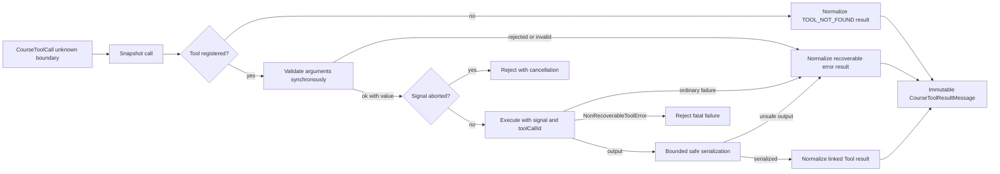

## Kết quả

Bạn sẽ xây dựng Tool boundary biến untrusted `CourseToolCall` thành một successful Tool-result message, một recoverable error result hoặc exceptional cancellation/programmer failure. `defineTool()` snapshot Tool definition. `ToolRegistry` sở hữu immutable definition và đăng ký batch atomically. `executeToolCall()` validate arguments trước effect, chuyển cancellation vào execution, serialize output trong fixed budget và giữ call/result linkage.

Invalid arguments không bao giờ invoke Tool. Unknown name, rejected arguments, ordinary validator failure, ordinary execution failure và unsafe output trở thành message `isError: true` để model turn tiếp theo inspect. Cancellation reject thay vì bị encode thành Tool result. `NonRecoverableToolError` chỉ dành cho authenticated invariant hoặc programmer failure buộc Agent run phải dừng.

:::note[Course implementation]

`CourseTool`, `ToolRegistry`, `defineTool()`, `executeToolCall()`, các serializer limit cùng error code thuộc workshop. Validator shape và string-only result content của chúng không phải interface trong Pi SDK.

:::

## Điều kiện tiên quyết

Hoàn thành [checkpoint 05](05-provider-adapter.md). Bạn cần hiểu normalized Tool call, JSON snapshot, own-property inspection, synchronous validation, promise và thenable, `AbortSignal`, immutable message cùng các call/result rule từ checkpoint `03`.

Đọc Tool module bên cạnh focused test:

| Vai trò | Đường dẫn chính xác | Nội dung cần kiểm tra |
| --- | --- | --- |
| Source tích lũy | `course/src/tool.ts` | Definition snapshot, atomic registry, validation/effect boundary, cancellation, provenance, serialization và result linkage |
| Bằng chứng tập trung | `course/test/06-tool-contract.test.ts` | Hostile input, rollback, recoverable/fatal failure, abort race, output budget, immutable result và parallel call |

Serializer là một phần của security và resource contract. Tool đã execute khi serialization bắt đầu, vì vậy unsafe hoặc unbounded output không được thoát vào transcript.

## Cơ chế

Course Tool definition có bốn own field: `name` non-empty, `description` non-empty, `validate` synchronous và `execute`. `defineTool()` đọc mỗi field đúng một lần, wrap hai function bằng stable call rồi freeze definition kết quả. Inherited field bị từ chối mà không invoke inherited getter. Mutation về sau trên object của caller không thể đổi tên registered Tool hoặc thay function của nó.

`ToolRegistry.registerMany()` có hai phase. Trước tiên nó snapshot mọi definition rồi kiểm tra duplicate name trong pending batch và với membership hiện có. Chỉ sau khi toàn batch pass, nó mới mutate internal `Map`. Hostile definition thứ hai, sparse array hoặc duplicate bất kỳ đều để registry nguyên trạng. `snapshot()` copy registry membership và reuse các immutable Tool snapshot đã có; checkpoint `07` dùng hành vi này để đóng băng Tool set cho một Agent run.

Execution bắt đầu bằng kiểm tra cancellation và snapshot Tool call. Invalid call shape ném `ToolContractError` với `INVALID_TOOL_CALL`. Unknown Tool có shape hợp lệ không làm thay đổi registry và không throw. Nó trả linked error message có code `TOOL_NOT_FOUND`.

Với known Tool, `validate(arguments)` chạy trước `execute`. Validator phải synchronously trả `{ ok: true, value }` hoặc `{ ok: false, error }`. False decision tạo `TOOL_ARGUMENTS_INVALID`; decision bị throw hoặc malformed tạo `TOOL_VALIDATION_FAILED`. Promise và thenable bị từ chối vì là asynchronous validator, còn rejection của chúng được observe để test process không nhận unhandled rejection. Nhờ đó, no-effect decision hoàn tất trước khi execution bắt đầu.

Sau successful validation, execution nhận validated value cùng frozen context `{ signal, toolCallId }`. Cancellation được kiểm tra trước validation, sau validation, trước execution, trong lúc await execution, sau resolution và sau output inspection. Nếu cancellation thắng, reason của nó propagate và không có Tool-result message được append. Tool cũng nhận cùng signal để có thể dừng công việc của chính nó.

Ordinary thrown value và rejected execution promise trở thành result `TOOL_EXECUTION_FAILED`. `NonRecoverableToolError` đi qua recoverable boundary đó và reject execution. Class dùng private shared provenance thay vì writable public flag, vì vậy forged object hoặc prototype không thể làm ordinary failure trở thành fatal. Provenance của `ToolContractError` cũng là internal; untrusted Tool không thể throw look-alike để bypass normalization.

Successful output được serialize mà không gọi `toJSON`, getter hay user collection method. Plain object và null-prototype object được chấp nhận, own enumerable string key được sort để output deterministic, accessor bị omit, cycle nhận marker, còn unsupported Proxy hoặc exotic prototype tạo `TOOL_OUTPUT_SERIALIZATION_FAILED`. Serializer work bị giới hạn bởi depth `32`, node `128`, collection visit `256`, string/key character `4096` và BigInt magnitude `4096` bit.

Final `content` bị cap chính xác ở `4096` Unicode code point, tính cả marker duy nhất `\n[Tool output truncated]`. Successful hoặc recoverable result được freeze và link ngược bằng `toolCallId`, `toolName` cùng generated message ID `tool-result-${toolCall.id}`. Error content là deterministic JSON chứa stable code cùng human-readable message.

## Dấu vết hoặc mô hình



| Phase | Tool effect có thể chạy? | Success output | Failure behavior |
| --- | ---: | --- | --- |
| Definition snapshot | Không | Frozen registered shape | `ToolContractError` trước mutation |
| Batch validation | Không | Commit toàn bộ batch | Atomic rollback khi có invalid entry |
| Argument validation | Không | Narrowed value | Linked recoverable error result |
| Execution | Có | Unknown output | Recoverable result, cancellation hoặc fatal rejection |
| Serialization | Effect đã hoàn tất | Bounded deterministic string | Linked serialization error result |
| Linkage | Không có effect mới | Frozen `toolResult` | Giữ original call ID/name |

Validation ngăn một effect; serialization giới hạn dữ liệu effect có thể trả vào transcript. Đây là hai boundary riêng và cả hai đều phải giữ contract.

## Xây dựng

Module tích lũy là `course/src/tool.ts`. Định nghĩa Tool bằng pure synchronous validator và asynchronous executor chỉ nhận validated shape. Đăng ký definition trước khi vòng lặp Agent (Agent Loop) bắt đầu, sau đó gọi `executeToolCall()` với normalized call cùng run signal.

Focused fragment này được chép nguyên văn từ `course/test/06-tool-contract.test.ts`. Nó compile trong file đó, nơi `vi`, `ToolRegistry`, `defineTool`, `executeToolCall`, `call`, `expect` và `test` đã được import hoặc khai báo:

```ts
test("argument validation runs before effects and preserves validation details", async () => {
  const execute = vi.fn(async () => ({ unreachable: true }));
  const registry = new ToolRegistry([
    defineTool({
      name: "add",
      description: "Add numbers.",
      validate: () => ({ ok: false, error: "left must be a number" }),
      execute,
    }),
  ]);

  await expect(
    executeToolCall(
      registry,
      call("add", { left: "twenty", right: 22 }, "call-invalid-add"),
      new AbortController().signal,
    ),
  ).resolves.toMatchObject({
    toolCallId: "call-invalid-add",
    toolName: "add",
    isError: true,
    content:
      '{"error":{"code":"TOOL_ARGUMENTS_INVALID","message":"left must be a number"}}',
  });
  expect(execute).not.toHaveBeenCalled();
});
```

Result vẫn là một phần của transcript dù nó là error. Nhờ đó, model turn sau có thể sửa arguments hoặc giải thích failure. Cancelled call thì khác: nó reject current operation và không tạo result để append.

Không làm yếu `validate` thành cast hoặc chuyển side effect vào đó. Validator ghi file rồi trả `{ ok: false }` vẫn đúng return shape nhưng vi phạm effect boundary của checkpoint.

## Chạy focused test

Focused test là `course/test/06-tool-contract.test.ts`. Chạy đúng command:

```bash
npm run test:course:checkpoint -- course/test/06-tool-contract.test.ts
```

File chứng minh one-read immutable definition, inherited-field rejection, atomic batch registration, duplicate handling, immutable registry ownership, argument validation trước effect, deterministic linked result, recoverable và non-recoverable error, quan sát rejection của async validator, cancellation tại nhiều boundary, bounded safe serialization, output truncation, hostile call normalization, snapshot isolation cùng independent parallel execution. Nó không tuyên bố filesystem sandboxing, process isolation, schema generation, provider-side constrained decoding hay automatic rollback đối với effect đã chạy.

## Thử nghiệm lỗi

Dùng nguyên focused fragment phía trên. Call gửi `left: "twenty"`, trong khi spy executor sẽ trả object hợp lệ nếu được gọi. Chạy focused command rồi xác nhận hai quan sát độc lập: result chứa `TOOL_ARGUMENTS_INVALID` được link với `call-invalid-add`, và `execute` có zero call.

Sau đó chỉ đổi validator để trả `{ ok: true, value: { left: 20, right: 22 } }`. Spy được invoke một lần và result trở thành success. Khôi phục rejecting validator trước khi tiếp tục. Không làm executor throw trong thử nghiệm này; throw sẽ kiểm tra error normalization sau khi effect đã bắt đầu, không phải validation trước effect.

## Tiêu chí chấp nhận

- Focused command chỉ chọn `course/test/06-tool-contract.test.ts` và pass offline.
- Tool definition được copy từ bốn own field, freeze và cách ly khỏi caller mutation về sau.
- `registerMany()` validate toàn batch cùng mọi name trước một registry mutation.
- Arguments được snapshot và synchronously validate trước khi `execute` có thể chạy.
- Unknown Tool cùng ordinary validation, execution hoặc serialization failure trở thành immutable linked error result.
- Cancellation propagate trước effect và trong khi await execution; nó không trở thành Tool result gây hiểu nhầm.
- Chỉ authentic `NonRecoverableToolError` thoát recoverable Tool boundary dưới dạng fatal programmer failure.
- Serialized content không vượt `4096` Unicode code point tính cả một truncation marker, và traversal tuân theo explicit work budget.
- Invalid arguments gửi đến spy Tool tạo `TOOL_ARGUMENTS_INVALID` và zero side effect.

## So sánh với Pi SDK 0.84.3

:::info[Pi SDK 0.84.3]

`@earendil-works/pi-ai` export `Tool`, `ToolCall`, `ToolResultMessage`, `Type`, `Static`, `TSchema` và `validateToolArguments()`. `@earendil-works/pi-agent-core` export `AgentTool`, `AgentToolResult` phong phú hơn cùng các Tool lifecycle member của `AgentEvent`.

:::

Public `Tool` của Pi dùng TypeBox `parameters` schema. `AgentTool` thêm UI `label`, optional `prepareArguments`, asynchronous `execute(toolCallId, params, signal, onUpdate)`, optional `executionMode` cùng structured `AgentToolResult` content/details/usage. Pi Agent Loop validate arguments trước execution, có thể chạy Tool call sequentially hoặc parallel, emit start/update/end event và chuyển ordinary Tool failure thành record `ToolResultMessage`.

Course contract đơn giản hơn và nghiêm ngặt theo các hướng khác. Validator của nó trả explicit synchronous decision, executor nhận context object, result chứa một string thay vì text/image block cùng details của Pi, còn custom serializer/output cap là workshop behavior. `ToolRegistry`, `ToolContractError`, `NonRecoverableToolError` và các hằng `COURSE_TOOL_*` không phải export của Pi.

Hãy dùng TypeBox schema cùng `AgentTool` shape đã phát hành trong ứng dụng Pi. Giữ các invariant có thể chuyển giao: validate trước effect, mang `toolCallId` qua mọi event/result, truyền cancellation vào execution, coi Tool failure là dữ liệu model có thể thấy khi còn khả năng recovery và giới hạn mọi nội dung được lưu trong long-lived transcript.

## Checkpoint tiếp theo

[Checkpoint 07](07-agent-loop.md) kết hợp model cùng Tool boundary. Bạn sẽ sở hữu transcript, thực thi complete Tool round, áp dụng step budget và emit một event sequence có global order.
