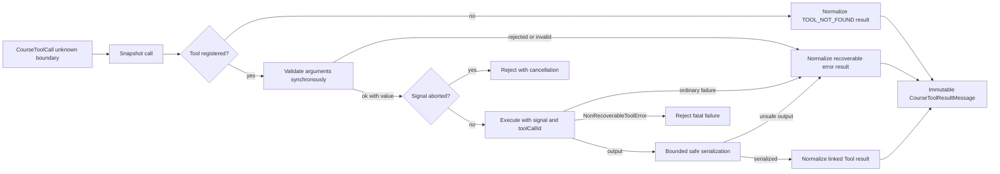

## Kết quả

Bạn sẽ xây dựng ranh giới Tool để biến `CourseToolCall` chưa đáng tin cậy thành một Tool-result message thành công, một result chứa lỗi có thể phục hồi (recoverable), hoặc một exception do hủy hay lỗi lập trình. `defineTool()` chụp lại định nghĩa Tool. `ToolRegistry` sở hữu các định nghĩa bất biến và đăng ký cả batch theo cách nguyên tử. `executeToolCall()` kiểm tra arguments trước mọi tác dụng phụ, truyền tín hiệu hủy vào lần thực thi, tuần tự hóa đầu ra trong ngân sách cố định và giữ đúng liên kết giữa call với result.

Arguments không hợp lệ không bao giờ làm Tool được gọi. Tên không tồn tại, arguments bị từ chối, lỗi thông thường từ validator hoặc lần thực thi và đầu ra không an toàn đều trở thành message `isError: true` để lượt model tiếp theo đọc được. Việc hủy làm thao tác bị từ chối thay vì được mã hóa thành Tool result. `NonRecoverableToolError` chỉ dành cho invariant đã được xác thực hoặc lỗi lập trình buộc lượt chạy Agent phải dừng.

:::note[Course implementation]

`CourseTool`, `ToolRegistry`, `defineTool()`, `executeToolCall()`, các giới hạn của bộ tuần tự hóa và mã lỗi đều thuộc workshop. Hình dạng validator và quy ước dùng một string duy nhất làm `content` của result không thuộc các interface trong Pi SDK.

:::

## Điều kiện tiên quyết

Hoàn thành [checkpoint 05](05-provider-adapter.md). Bạn cần hiểu Tool call đã chuẩn hóa, bản chụp JSON, cách kiểm tra thuộc tính riêng, phép kiểm tra đồng bộ, promise và thenable, `AbortSignal`, message bất biến cùng các quy tắc liên kết call/result từ checkpoint `03`.

Hãy đọc module Tool cùng bài kiểm thử tập trung:

| Vai trò | Đường dẫn chính xác | Nội dung cần kiểm tra |
| --- | --- | --- |
| Mã nguồn tích lũy | `course/src/tool.ts` | Bản chụp định nghĩa, registry nguyên tử, ranh giới kiểm tra/tác dụng phụ, việc hủy, nguồn gốc lỗi, tuần tự hóa và liên kết result |
| Bằng chứng tập trung | `course/test/06-tool-contract.test.ts` | Đầu vào thù địch, hoàn tác, lỗi có thể phục hồi hoặc lỗi nghiêm trọng, race khi hủy, ngân sách đầu ra, result bất biến và các lượt gọi song song |

Bộ tuần tự hóa là một phần của quy ước an toàn và tài nguyên. Tool đã chạy khi quá trình tuần tự hóa bắt đầu, vì vậy đầu ra không an toàn hoặc không giới hạn không được đi vào transcript.

## Cơ chế

Định nghĩa Tool của khóa học có bốn field riêng: `name` không rỗng, `description` không rỗng, `validate` đồng bộ và `execute`. `defineTool()` đọc mỗi field đúng một lần, bọc hai hàm bằng cách gọi ổn định rồi đóng băng định nghĩa kết quả. Field kế thừa bị từ chối mà getter kế thừa không được gọi. Việc bên gọi sửa object về sau không thể đổi tên Tool đã đăng ký hoặc thay hàm của Tool.

`ToolRegistry.registerMany()` có hai giai đoạn. Trước tiên, hàm chụp lại mọi định nghĩa rồi kiểm tra name trùng trong batch đang chờ và trong registry hiện có. Chỉ khi toàn bộ batch đạt kiểm tra, hàm mới thay đổi `Map` nội bộ. Một định nghĩa thù địch ở vị trí thứ hai, mảng thưa hoặc name trùng đều để registry nguyên trạng. `snapshot()` sao chép danh sách thành viên và dùng lại các bản chụp Tool bất biến đã có; checkpoint `07` dựa vào hành vi này để đóng băng tập Tool cho một lượt chạy Agent.

Lần thực thi bắt đầu bằng việc kiểm tra tín hiệu hủy và chụp lại Tool call. Call có hình dạng không hợp lệ ném `ToolContractError` với `INVALID_TOOL_CALL`. Một Tool chưa đăng ký nhưng có call hợp lệ không làm thay đổi registry và không ném lỗi. Thay vào đó, hàm trả về message lỗi được liên kết đúng với mã `TOOL_NOT_FOUND`.

Với Tool đã đăng ký, `validate(arguments)` chạy trước `execute`. Validator phải trả đồng bộ `{ ok: true, value }` hoặc `{ ok: false, error }`. Quyết định từ chối tạo `TOOL_ARGUMENTS_INVALID`; validator ném lỗi hoặc trả quyết định sai hình dạng tạo `TOOL_VALIDATION_FAILED`. Promise và thenable bị từ chối vì validator không được chạy bất đồng bộ, nhưng lần từ chối của chúng vẫn được quan sát để tiến trình kiểm thử không nhận lỗi promise chưa được xử lý. Nhờ đó, quyết định không tạo tác dụng phụ đã hoàn tất trước khi lần thực thi bắt đầu.

Sau khi arguments hợp lệ, hàm thực thi nhận giá trị đã kiểm tra cùng ngữ cảnh `{ signal, toolCallId }` đã đóng băng. Tín hiệu hủy được kiểm tra trước và sau bước kiểm tra arguments, trước khi thực thi, trong lúc chờ, sau khi promise resolve và sau khi kiểm tra đầu ra. Nếu tín hiệu hủy thắng race tại một trong các ranh giới này, lý do hủy được truyền ra và không có Tool-result message nào được công bố. Việc hủy vẫn có thể thắng sau khi promise thực thi của Tool đã resolve, hoặc sau khi đầu ra đã được tuần tự hóa và kiểm tra nhưng trước lúc công bố result. Tool cũng nhận cùng tín hiệu để tự dừng công việc.

Giá trị lỗi thông thường và promise thực thi bị từ chối đều được chuẩn hóa thành result `TOOL_EXECUTION_FAILED`. Một `NonRecoverableToolError` được tạo đúng constructor sẽ được đăng ký vào registry dùng chung trong cùng realm rồi vượt qua ranh giới có thể phục hồi đó. Look-alike chưa đăng ký, chỉ giả field hoặc prototype, vẫn là lỗi có thể phục hồi; quy tắc này bao gồm cả object giả prototype của `NonRecoverableToolError`. Registry cùng brand dùng `Symbol.for` hỗ trợ module reload và subclass, nhưng code bất kỳ trong cùng realm có thể tìm thấy chúng, nên đây không phải security boundary. `ToolContractError` dùng ownership trong `WeakSet` cục bộ của module; look-alike chưa đăng ký do Tool chưa đáng tin cậy ném ra vẫn được chuẩn hóa.

Đầu ra thành công được tuần tự hóa mà không gọi `toJSON`, getter hay phương thức của collection do bên gọi cung cấp. Object thuần và object có prototype `null` được chấp nhận; các key string riêng có thể liệt kê được sắp xếp để đầu ra deterministic; accessor bị bỏ qua; chu trình nhận marker; Proxy không hỗ trợ hoặc prototype khác thường tạo `TOOL_OUTPUT_SERIALIZATION_FAILED`. Công việc của bộ tuần tự hóa bị giới hạn ở độ sâu `32`, `128` node, `256` lượt thăm collection, `4096` ký tự trong string/key và độ lớn BigInt `4096` bit.

`content` cuối cùng bị giới hạn chính xác ở `4096` Unicode code point, tính cả marker duy nhất `\n[Tool output truncated]`. Cả result thành công lẫn result chứa lỗi có thể phục hồi đều được đóng băng, rồi liên kết ngược bằng `toolCallId`, `toolName` cùng ID message được sinh theo mẫu `tool-result-${toolCall.id}`. `content` lỗi là JSON deterministic, chứa mã ổn định cùng message dễ đọc.

## Dấu vết hoặc mô hình



| Giai đoạn | Tác dụng phụ của Tool có thể chạy? | Đầu ra khi thành công | Hành vi khi lỗi |
| --- | ---: | --- | --- |
| Bản chụp định nghĩa | Không | Hình dạng đã đăng ký và đóng băng | `ToolContractError` trước khi thay đổi trạng thái |
| Kiểm tra batch | Không | Ghi nhận toàn bộ batch | Hoàn tác nguyên tử khi có phần tử không hợp lệ |
| Kiểm tra arguments | Không | Giá trị đã được thu hẹp type | Result lỗi có thể phục hồi và liên kết đúng |
| Thực thi | Có | Đầu ra `unknown` | Result có thể phục hồi, việc hủy hoặc lỗi nghiêm trọng |
| Tuần tự hóa | Tác dụng phụ đã hoàn tất | String deterministic, có giới hạn | Result lỗi tuần tự hóa được liên kết đúng |
| Liên kết | Không có tác dụng phụ mới | `toolResult` đã đóng băng | Giữ ID/name của call ban đầu |

Việc kiểm tra arguments ngăn tác dụng phụ bắt đầu; quá trình tuần tự hóa giới hạn dữ liệu mà tác dụng phụ có thể trả vào transcript. Đây là hai ranh giới riêng và cả hai đều phải giữ đúng quy ước.

## Xây dựng

Module tích lũy là `course/src/tool.ts`. Hãy định nghĩa Tool bằng validator đồng bộ, không có tác dụng phụ và hàm thực thi bất đồng bộ chỉ nhận dữ liệu đã được kiểm tra. Đăng ký định nghĩa trước khi vòng lặp Agent (Agent Loop) bắt đầu, sau đó gọi `executeToolCall()` với call đã chuẩn hóa cùng tín hiệu của lượt chạy.

Đoạn tập trung này được chép nguyên văn từ `course/test/06-tool-contract.test.ts`. Nó biên dịch trong file đó, nơi `vi`, `ToolRegistry`, `defineTool`, `executeToolCall`, `call`, `expect` và `test` đã được import hoặc khai báo:

```ts
test("argument validation runs before effects and preserves validation details", async () => {
  const execute = vi.fn(async () => ({ unreachable: true }));
  const registry = new ToolRegistry([
    defineTool({
      name: "add",
      description: "Add numbers.",
      validate: () => ({ ok: false, error: "left must be a number" }),
      execute,
    }),
  ]);

  await expect(
    executeToolCall(
      registry,
      call("add", { left: "twenty", right: 22 }, "call-invalid-add"),
      new AbortController().signal,
    ),
  ).resolves.toMatchObject({
    toolCallId: "call-invalid-add",
    toolName: "add",
    isError: true,
    content:
      '{"error":{"code":"TOOL_ARGUMENTS_INVALID","message":"left must be a number"}}',
  });
  expect(execute).not.toHaveBeenCalled();
});
```

Result vẫn là một phần của transcript dù mang lỗi. Nhờ đó, lượt model sau có thể sửa arguments hoặc giải thích nguyên nhân. Tool call bị hủy thì khác: thao tác hiện tại bị từ chối và không có result nào được thêm vào transcript.

Đừng làm yếu `validate` thành một phép ép type hoặc chuyển tác dụng phụ vào validator. Một validator ghi file rồi trả `{ ok: false }` vẫn đúng hình dạng trả về nhưng đã vi phạm ranh giới tác dụng phụ của checkpoint.

## Chạy focused test

Test tập trung nằm tại `course/test/06-tool-contract.test.ts`. Hãy chạy đúng lệnh:

```bash
npm run test:course:checkpoint -- course/test/06-tool-contract.test.ts
```

File này kiểm chứng rằng mỗi field của định nghĩa bất biến chỉ được đọc một lần, field kế thừa bị từ chối, batch được đăng ký nguyên tử, name trùng được xử lý, registry sở hữu dữ liệu bất biến, arguments được kiểm tra trước tác dụng phụ, result deterministic và liên kết đúng, lỗi có thể hoặc không thể phục hồi được phân loại, lần từ chối của validator bất đồng bộ được quan sát, tín hiệu hủy được kiểm tra tại nhiều ranh giới, quá trình tuần tự hóa an toàn có giới hạn, đầu ra được cắt, call thù địch được chuẩn hóa, bản chụp được cách ly và các lần thực thi song song không nối nhầm dữ liệu. Bài kiểm thử không khẳng định có sandbox cho filesystem, cô lập process, sinh schema, giải mã có ràng buộc phía provider hay tự động hoàn tác tác dụng phụ đã chạy.

## Thử nghiệm lỗi

Hãy dùng nguyên đoạn phía trên. Call gửi `left: "twenty"`, trong khi hàm thực thi gián điệp sẽ trả object hợp lệ nếu được gọi. Chạy lệnh kiểm thử tập trung rồi xác nhận hai quan sát độc lập: result chứa `TOOL_ARGUMENTS_INVALID` được liên kết với `call-invalid-add`, và `execute` chưa được gọi lần nào.

Sau đó chỉ đổi validator để trả `{ ok: true, value: { left: 20, right: 22 } }`. Hàm gián điệp được gọi một lần và lần gọi trả về result thành công. Khôi phục validator từ chối trước khi tiếp tục. Đừng làm hàm thực thi ném lỗi trong thử nghiệm này; thao tác đó kiểm tra cách chuẩn hóa lỗi sau khi tác dụng phụ đã bắt đầu, không còn kiểm tra arguments trước tác dụng phụ.

## Tiêu chí chấp nhận

- Lệnh kiểm thử tập trung chỉ chọn `course/test/06-tool-contract.test.ts` và chạy đạt khi không có mạng.
- Định nghĩa Tool được sao chép từ bốn field riêng, đóng băng và cách ly khỏi thay đổi về sau của bên gọi.
- `registerMany()` kiểm tra toàn bộ batch cùng mọi name trước khi thay đổi registry.
- Arguments được chụp lại và kiểm tra đồng bộ trước khi `execute` có thể chạy.
- Tool chưa đăng ký cùng lỗi thông thường khi kiểm tra, thực thi hoặc tuần tự hóa đều trở thành result lỗi bất biến, được liên kết đúng.
- Tín hiệu hủy được truyền qua trước tác dụng phụ, trong khi chờ thực thi, sau khi promise của Tool resolve và sau khi kiểm tra đầu ra; nó không trở thành Tool result gây hiểu nhầm.
- `NonRecoverableToolError` đã đăng ký thoát khỏi ranh giới Tool có thể phục hồi; look-alike chưa đăng ký chỉ giả field hoặc prototype vẫn là lỗi có thể phục hồi.
- Content đã tuần tự hóa không vượt `4096` Unicode code point tính cả một marker báo cắt, và quá trình duyệt tuân theo ngân sách công việc tường minh.
- Arguments không hợp lệ gửi đến spy Tool tạo `TOOL_ARGUMENTS_INVALID` và không gây tác dụng phụ.

## So sánh với Pi SDK 0.85.0

:::info[Pi SDK 0.85.0]

`@earendil-works/pi-ai` xuất `Tool`, `ToolCall`, `ToolResultMessage`, `Type`, `Static`, `TSchema` và `validateToolArguments()`. `@earendil-works/pi-agent-core` xuất `AgentTool`, `AgentToolResult` phong phú hơn cùng các member về vòng đời Tool trong `AgentEvent`.

:::

`Tool` công khai của Pi dùng schema `parameters` của TypeBox. `AgentTool` thêm `label` cho UI, `prepareArguments` tùy chọn, hàm bất đồng bộ `execute(toolCallId, params, signal, onUpdate)`, `executionMode` tùy chọn và `AgentToolResult` có cấu trúc với content/details/usage. Pi Agent Loop kiểm tra arguments trước khi thực thi, có thể chạy Tool call tuần tự hoặc song song, phát các sự kiện bắt đầu/cập nhật/kết thúc và chuyển lỗi Tool thông thường thành record `ToolResultMessage`.

Quy ước của khóa học đơn giản hơn và nghiêm ngặt theo các hướng khác. Validator trả một quyết định đồng bộ tường minh, hàm thực thi nhận object ngữ cảnh, result chứa một string thay vì block text/image cùng details của Pi, còn bộ tuần tự hóa tùy chỉnh và giới hạn đầu ra là hành vi riêng của workshop. `ToolRegistry`, `ToolContractError`, `NonRecoverableToolError` và các hằng `COURSE_TOOL_*` không phải export của Pi.

Hãy dùng schema TypeBox cùng hình dạng `AgentTool` đã phát hành trong ứng dụng Pi. Giữ các invariant có thể chuyển giao: kiểm tra trước tác dụng phụ, mang `toolCallId` qua mọi sự kiện/result, truyền tín hiệu hủy vào lần thực thi, coi lỗi Tool là dữ liệu model có thể thấy khi vẫn còn khả năng phục hồi và giới hạn mọi nội dung được lưu trong transcript dài hạn.

## Checkpoint tiếp theo

[Checkpoint 07](07-agent-loop.md) kết hợp ranh giới model và Tool. Bạn sẽ sở hữu transcript, thực thi một lượt Tool hoàn chỉnh, áp dụng ngân sách bước và phát chuỗi sự kiện có thứ tự toàn cục.
