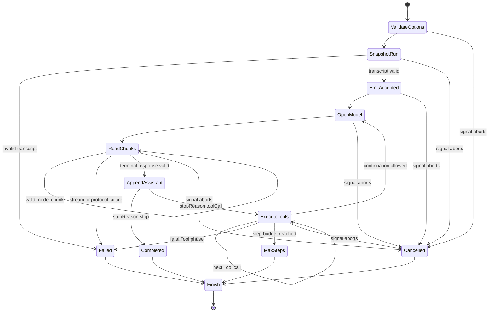

## Kết quả

Bạn sẽ kết hợp `CourseModel`, `ToolRegistry`, Message IR và `EventStream` thành một vòng lặp Agent (Agent Loop) nhiều bước. `runAgentLoop()` sở hữu transcript snapshot, mở một model request cho mỗi step, append complete assistant response, execute mọi Tool được yêu cầu theo assistant order, append linked Tool result rồi tiếp tục cho đến khi model stop hoặc run đạt terminal condition khác.

Returned stream có một total event order bao trùm accepted message, model chunk, Tool start, Tool finish cùng final run event. `RunResult` của nó luôn là một trong `completed`, `cancelled`, `maxSteps` hoặc `failed`. One-step budget có thể hoàn tất một Tool-heavy turn, nhưng không được mở continuation model request vượt budget.

:::note[Course implementation]

`runAgentLoop()`, các event string, result status, request ID, limit cùng sequential Tool execution là contract của course. Chúng dạy control flow nhưng không tương thích với public Agent Loop interface của Pi.

:::

## Điều kiện tiên quyết

Hoàn thành [checkpoint 06](06-tool-contract.md). Bạn cần hiểu normalized transcript linkage, model chunk so với terminal response, immutable snapshot, recoverable Tool-result message, cancellation propagation cùng lý do Agent phải validate model output trước khi thực hiện effect.

Đọc loop và focused evidence cùng nhau:

| Vai trò | Đường dẫn chính xác | Nội dung cần kiểm tra |
| --- | --- | --- |
| Source tích lũy | `course/src/agent-loop.ts` | Option validation, transcript ownership, model invocation, Tool round, limit, cancellation, event emission và terminal mapping |
| Bằng chứng tập trung | `course/test/07-agent-loop.test.ts` | Direct answer, continuation request, multiple call, recoverable error, abort path, `maxSteps`, protocol failure, event order và resource ceiling |

Loop dùng lại model và Tool boundary đã được test trong các checkpoint `04` đến `06`. Nó không mở lại transport hoặc serialization internals của các boundary đó.

## Cơ chế

`runAgentLoop()` validate construction option synchronously. `maxSteps` phải là positive safe integer không lớn hơn `MAX_AGENT_STEPS`, tức `64`. Optional `requestSequenceStart` phải giữ requested range trong cùng ceiling. `model.stream`, `ToolRegistry` cùng `AbortSignal` phải có expected boundary shape. Invalid construction throw trước khi `EventStream` được trả.

Trước asynchronous work, loop snapshot Tool registry cùng starting transcript. Caller có thể mutate input array hoặc register thêm Tool về sau mà không thay đổi active run. Initial message bị cap ở `4096`, được copy qua Message IR constructor, freeze và validate như complete transcript. Invalid starting transcript tạo đúng một `run.finished` event với failed result `INVALID_TRANSCRIPT` và không invoke model.

Loop sở hữu private mutable transcript bắt nguồn từ frozen start đó. Trước hết nó emit một `message.accepted` event cho mỗi starting message. Mỗi event nhận số nguyên `sequence` tiếp theo; không component nào sở hữu counter riêng. Model và Tool phase dùng chung một counter, vì vậy ordering vẫn là total dù observer nhận event qua async iteration.

Với mỗi step, `requestSnapshot()` freeze current transcript rồi tạo `request-001`, `request-002` và tiếp tục như vậy, có offset từ `requestSequenceStart` khi owning lifecycle đã tiêu thụ request number. Loop gọi `model.stream()` rồi drain event channel trước khi await terminal response. Mỗi valid chunk trở thành `model.chunk`. Loop cap một step ở `1024` chunk, `65.536` Unicode code point cho text và `1024` assistant block.

Model chunk và terminal assistant message phải đồng thuận chính xác về content cùng order. Request ID phải khớp active request. Tool arguments phải là plain bounded JSON có depth `32`, tối đa `257` value tính cả root, `256` object field cộng array slot cùng `4096` Unicode code point trên key/string value. Các check này chạy trước Tool effect. Contradiction hoặc vượt limit trở thành failed result `MODEL_PROTOCOL_ERROR`.

Khi `stopReason` là `stop`, assistant message được append và `textFromAssistant()` trở thành `finalText`. Loop emit `run.finished` cùng `completed` result. Tool call bị cấm trong stop response.

Khi `stopReason` là `toolCall`, assistant message được append trước. Sau đó loop duyệt mọi Tool-call block theo assistant order. Với mỗi call, nó emit `tool.started`, await `executeToolCall()`, append linked Tool-result message rồi emit `tool.finished`. Nhiều call execute sequentially trong workshop này. Recoverable Tool error vẫn được append và gửi cho model request tiếp theo; bản thân nó không kết thúc run.

Sau complete Tool batch, `validateTranscript()` chứng minh mọi call có đúng một matching result xuất hiện sau. Nếu current step bằng `maxSteps`, loop emit `run.finished` với status `maxSteps` và không mở model request khác. Vị trí check này khiến budget đếm model turn, không đếm từng Tool call. Mọi call trong accepted assistant response đều hoàn tất trước khi step terminal được báo cáo.

Cancellation có thể đến trong initial emission, khi model truyền dữ liệu theo luồng (streaming), trong terminal response wait, Tool execution hoặc giữa các phase. Result chỉ giữ complete message. Partial model chunk có thể đã có event nhưng unfinished assistant message không được append. Cancellation trong Tool execution giữ complete assistant Tool-call message, emit `tool.started` và không append fabricated result. Event cuối quan sát được vẫn là `run.finished` với `cancelled` result khi terminal bookkeeping còn khả dụng.

## Dấu vết hoặc mô hình



| Phase | Transcript ownership | Event effect | Terminal có thể có |
| --- | --- | --- | --- |
| Start | Frozen copy của caller message | `message.accepted` cho mỗi complete input | `failed` hoặc `cancelled` |
| Model stream | Chưa append assistant | Một `model.chunk` cho mỗi accepted chunk | `failed` hoặc `cancelled` |
| Model terminal | Append một complete assistant message | Không có assistant event riêng | `completed` cho `stop` |
| Tool batch | Append từng complete linked result | `tool.started`, sau đó `tool.finished` | `cancelled` hoặc `failed` |
| Step boundary | Có frozen transcript | Chỉ có `run.finished` khi terminal | `maxSteps` hoặc tiếp tục |

Event có thể mô tả partial progress trong khi transcript chỉ chứa complete protocol message. Phân biệt này ngăn cancelled delta trở thành durable assistant history.

## Xây dựng

Module tích lũy là `course/src/agent-loop.ts`. Hãy kết hợp nó với scripted model và registered Tool; đừng lặp lại model parsing hoặc Tool validation bên trong loop. Complete focused fragment này được chép nguyên văn từ `course/test/07-agent-loop.test.ts` và cho thấy continuation boundary đầu tiên:

```ts
test("appends one Tool call and its matching result before the second model request", async () => {
  const addCall = call("add", "call-add-001", { left: 20, right: 22 });
  const model = new ScriptedModel([
    scriptedResponse("response-tool-001", [addCall], "toolCall"),
    scriptedResponse(
      "response-tool-002",
      [{ type: "text", text: "The sum is 42." }],
      "stop",
    ),
  ]);

  const { events, result } = await settleRun(
    runAgentLoop({
      messages: [user()],
      model,
      tools: new ToolRegistry([addTool()]),
      maxSteps: 2,
      signal: new AbortController().signal,
    }),
  );

  expect(model.callCount).toBe(2);
  expect(model.requests.map(({ id }) => id)).toEqual([
    "request-001",
    "request-002",
  ]);
  expect(model.requests[1].messages).toEqual([
    user(),
    {
      id: "message-response-tool-001",
      role: "assistant",
      content: [addCall],
    },
    {
      id: "tool-result-call-add-001",
      role: "toolResult",
      toolCallId: "call-add-001",
      toolName: "add",
      content: '{"sum":42}',
      isError: false,
    },
  ]);
  expect(events.map(({ type }) => type)).toEqual([
    "message.accepted",
    "model.chunk",
    "tool.started",
    "tool.finished",
    "model.chunk",
    "run.finished",
  ]);
  expect(events.map(({ sequence }) => sequence)).toEqual([0, 1, 2, 3, 4, 5]);
  expect(result).toMatchObject({
    status: "completed",
    finalText: "The sum is 42.",
  });
});
```

Request thứ hai chứa assistant Tool call trước result của nó, và cả hai dùng chung `call-add-001`. Transcript ordering đó là continuation input của model, không phải test-only display.

## Chạy focused test

Focused test là `course/test/07-agent-loop.test.ts`. Chạy đúng command:

```bash
npm run test:course:checkpoint -- course/test/07-agent-loop.test.ts
```

File chứng minh option validation, request numbering, immutable snapshot, direct completion, một và nhiều Tool round, recoverable Tool continuation, cancellation trong model cùng Tool work, one-step termination, invalid transcript handling, model correlation cùng chunk/response agreement, typed failure, registry snapshot, exact event sequence, `maxSteps = 64` và explicit input/chunk/text/block/argument limit. Nó không tuyên bố concurrent Tool execution, steering/follow-up queue, context transformation, provider retry, persistent session state hay production scheduling policy.

## Thử nghiệm lỗi

Cấp cho model một first response chứa Tool call cùng second continuation response, rồi đặt `maxSteps: 1`. Focused test dùng ba `echo` call để chứng minh accepted Tool batch hoàn tất trong khi response thứ hai không được dùng:

```ts
const model = new ScriptedModel([
  scriptedResponse("response-budget-001", calls, "toolCall"),
  scriptedResponse(
    "response-budget-002",
    [{ type: "text", text: "must not run" }],
    "stop",
  ),
]);

const { events, result } = await settleRun(
  runAgentLoop({
    messages: [user("Echo three values.")],
    model,
    tools: new ToolRegistry([echo]),
    maxSteps: 1,
    signal: new AbortController().signal,
  }),
);

expect(executed).toEqual(["call-echo-001", "call-echo-002", "call-echo-003"]);
expect(model.callCount).toBe(1);
expect(result).toMatchObject({ status: "maxSteps", maxSteps: 1 });
expect(events.at(-1)).toMatchObject({
  type: "run.finished",
  sequence: events.length - 1,
  payload: { result: { status: "maxSteps", maxSteps: 1 } },
});
```

Fragment này nằm nguyên văn trong body của `course/test/07-agent-loop.test.ts`; surrounding test khai báo `calls`, `echo`, `executed`, `expect` cùng helper. Chạy focused command. Cả ba call execute theo thứ tự, `model.callCount` vẫn là `1`, còn result là `maxSteps`. Chỉ đổi `maxSteps` thành `2`; queued continuation có thể chạy và complete. Khôi phục one-step value sau khi quan sát boundary.

## Tiêu chí chấp nhận

- Focused command chỉ chọn `course/test/07-agent-loop.test.ts` và pass offline.
- Construction từ chối invalid option, gồm `maxSteps` lớn hơn `64`, trước khi model work bắt đầu.
- Run sở hữu snapshot của starting message cùng Tool registry membership.
- Mỗi model step nhận complete frozen transcript cùng correlated stable request ID.
- Assistant message đứng trước Tool result; nhiều Tool call execute và append result theo assistant order.
- Recoverable Tool error vẫn là linked transcript message và có thể đến continuation model turn.
- Giá trị `sequence` của event tăng một qua message, model, Tool cùng terminal event; `run.finished` đứng cuối.
- Cancellation chỉ giữ complete message và không bao giờ fabricate Tool result cho interrupted execution.
- Với `maxSteps: 1`, current Tool batch hoàn tất, không continuation request nào mở và terminal result là `maxSteps`.

## So sánh với Pi SDK 0.84.3

:::info[Pi SDK 0.84.3]

`@earendil-works/pi-agent-core` export `Agent`, `agentLoop()`, `agentLoopContinue()`, `runAgentLoop()`, `runAgentLoopContinue()`, `AgentContext`, `AgentLoopConfig`, `AgentTool` và `AgentEvent`.

:::

Agent Loop của Pi dùng `AgentMessage` xuyên suốt rồi convert thành message tương thích LLM qua `convertToLlm` tại request boundary. Nó emit `agent_start`/`agent_end`, `turn_start`/`turn_end`, message lifecycle event cùng Tool execution start/update/end event. Configuration có thể transform context, intercept Tool call trước và sau execution, stop sau một turn, nhận steering và follow-up message, đồng thời chọn sequential hoặc parallel Tool execution với per-Tool constraint.

Course loop có một transcript vocabulary, năm event type, sequential Tool execution, không có message queue, không có context hook cùng workshop-specific hard ceiling `64` model step. Các ID `request-001`, status `RunResult`, hành vi `maxSteps` và resource constant không phải public contract của Pi.

Hãy dùng trực tiếp export của Pi cho production integration. Workshop cung cấp control-flow model nhỏ hơn để suy luận về transcript ownership, complete Tool round trip, terminal settlement, cancellation và total observer order. Khi hành vi khác nhau, Pi SDK `0.84.3` là authoritative.

## Checkpoint tiếp theo

[Checkpoint 08](08-coding-tools.md) cung cấp bounded coding capability cho loop. Bạn sẽ thêm filesystem và process Tool chỉ hoạt động trong temporary workspace và expose explicit output, argument, timeout cùng cancellation limit.
