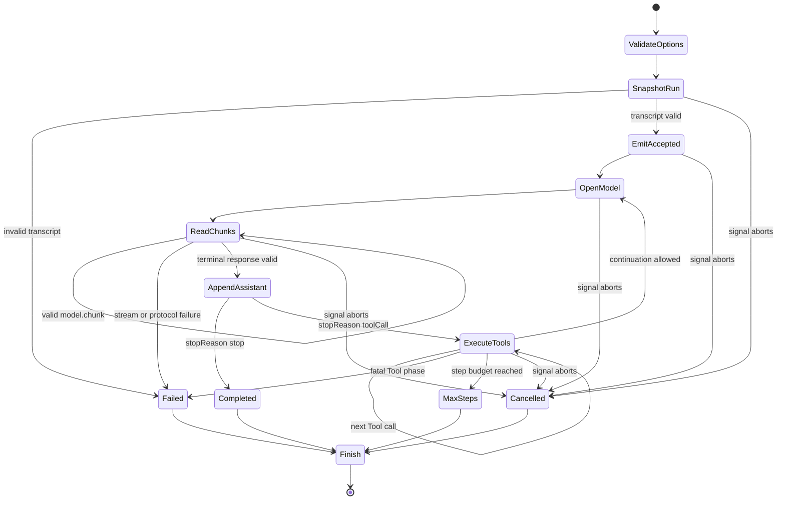

## Kết quả

Bạn sẽ kết hợp `CourseModel`, `ToolRegistry`, Message IR và `EventStream` thành một vòng lặp Agent (Agent Loop) nhiều bước. `runAgentLoop()` sở hữu bản chụp transcript, mở một yêu cầu model cho mỗi bước, thêm phản hồi assistant hoàn chỉnh, thực thi mọi Tool theo thứ tự assistant yêu cầu, thêm các Tool result đã liên kết rồi tiếp tục cho đến khi model dừng hoặc lượt chạy đạt điều kiện kết thúc khác.

Luồng trả về duy trì một thứ tự toàn phần của sự kiện (total event order) trên các message đã nhận, chunk từ model, thời điểm Tool bắt đầu và kết thúc, cùng sự kiện cuối của lượt chạy. `RunResult` luôn là một trong `completed`, `cancelled`, `maxSteps` hoặc `failed`. Ngân sách một bước vẫn có thể hoàn tất một lượt có nhiều Tool, nhưng không được mở yêu cầu model tiếp theo nếu yêu cầu đó vượt ngân sách.

:::note[Course implementation]

`runAgentLoop()`, các chuỗi sự kiện, trạng thái kết quả, ID yêu cầu, giới hạn và cách thực thi Tool tuần tự đều là quy ước của khóa học. Chúng minh họa luồng điều khiển nhưng không tương thích với interface Agent Loop công khai của Pi.

:::

## Điều kiện tiên quyết

Hoàn thành [checkpoint 06](06-tool-contract.md). Bạn cần hiểu cách liên kết transcript đã chuẩn hóa, quan hệ giữa chunk của model và phản hồi cuối, bản chụp bất biến, Tool-result message chứa lỗi có thể phục hồi, cách truyền tín hiệu hủy và lý do Agent phải kiểm tra đầu ra model trước khi gây tác dụng phụ.

Hãy đọc vòng lặp cùng bằng chứng kiểm thử tập trung:

| Vai trò | Đường dẫn chính xác | Nội dung cần kiểm tra |
| --- | --- | --- |
| Mã nguồn tích lũy | `course/src/agent-loop.ts` | Kiểm tra option, quyền sở hữu transcript, cách gọi model, các lượt Tool, giới hạn, việc hủy, phát sự kiện và ánh xạ kết quả cuối |
| Bằng chứng tập trung | `course/test/07-agent-loop.test.ts` | Câu trả lời trực tiếp, yêu cầu tiếp nối, nhiều Tool call, lỗi có thể phục hồi, đường hủy, `maxSteps`, lỗi protocol, thứ tự sự kiện và trần tài nguyên |

Vòng lặp dùng lại ranh giới model và Tool đã được kiểm thử ở các checkpoint `04` đến `06`. Nó không can thiệp lại vào chi tiết vận chuyển hoặc tuần tự hóa bên trong các ranh giới đó.

## Cơ chế

`runAgentLoop()` kiểm tra đồng bộ các option khởi tạo. `maxSteps` phải là số nguyên dương an toàn, không lớn hơn `MAX_AGENT_STEPS`, tức `64`. Nếu có `requestSequenceStart`, toàn bộ dải số yêu cầu cũng phải nằm trong cùng giới hạn. `model.stream`, `ToolRegistry` và `AbortSignal` phải có đúng hình dạng mà ranh giới yêu cầu. Dữ liệu khởi tạo không hợp lệ làm hàm ném lỗi trước khi trả về `EventStream`.

Trước khi bắt đầu công việc bất đồng bộ, vòng lặp chụp lại Tool registry và transcript đầu vào. Bên gọi có thể sửa mảng đầu vào hoặc đăng ký thêm Tool về sau mà không ảnh hưởng đến lượt chạy đang hoạt động. Số message ban đầu bị giới hạn ở `4096`; từng message được sao chép qua constructor của Message IR, đóng băng rồi kiểm tra như một transcript hoàn chỉnh. Transcript đầu vào không hợp lệ chỉ tạo một sự kiện `run.finished` với kết quả `failed` mang mã `INVALID_TRANSCRIPT`, và model không được gọi.

Vòng lặp sở hữu một transcript riêng có thể thay đổi, bắt nguồn từ bản đầu vào đã đóng băng. Trước hết, nó phát một sự kiện `message.accepted` cho mỗi message ban đầu. Mỗi sự kiện nhận số nguyên `sequence` kế tiếp; không thành phần nào giữ bộ đếm riêng. Các pha model và Tool dùng chung bộ đếm, nên mọi sự kiện vẫn có thứ tự toàn phần dù bên quan sát nhận chúng qua phép lặp bất đồng bộ.

Ở mỗi bước, `requestSnapshot()` đóng băng transcript hiện tại rồi tạo `request-001`, `request-002` và các ID tiếp theo. `requestSequenceStart` dịch điểm bắt đầu khi vòng đời bên ngoài đã dùng một số thứ tự yêu cầu. Vòng lặp gọi `model.stream()`, đọc hết kênh sự kiện rồi mới chờ phản hồi cuối. Mỗi chunk hợp lệ trở thành một sự kiện `model.chunk`. Mỗi bước bị giới hạn ở `1024` chunk, `65,536` Unicode code point cho text và `1024` block của assistant.

Trước khi so sánh, vòng lặp gộp các text delta liền kề của luồng và các text block liền kề của message cuối; Tool call là ranh giới giữa các nhóm. Hai dãy block sau chuẩn hóa phải có cùng nội dung và thứ tự, còn cách chia chunk text ban đầu có thể khác nhau. ID yêu cầu phải khớp yêu cầu đang hoạt động. Arguments của Tool phải là JSON thuần có giới hạn: độ sâu `32`, tối đa `257` giá trị tính cả gốc, tổng cộng `256` field object và phần tử mảng, cùng `4096` Unicode code point trên key và giá trị string. Các phép kiểm tra này chạy trước tác dụng phụ của Tool. Mâu thuẫn hoặc vượt giới hạn tạo kết quả `failed` với mã `MODEL_PROTOCOL_ERROR`.

Khi `stopReason` là `stop`, message của assistant được thêm vào transcript và `textFromAssistant()` trở thành `finalText`. Vòng lặp phát `run.finished` với kết quả `completed`. Phản hồi có lý do dừng `stop` không được chứa Tool call.

Khi `stopReason` là `toolCall`, message của assistant được thêm vào trước. Sau đó vòng lặp duyệt mọi Tool-call block theo thứ tự trong phản hồi. Với mỗi call, nó phát `tool.started`, chờ `executeToolCall()`, thêm Tool-result message đã liên kết rồi phát `tool.finished`. Trong workshop này, nhiều call được thực thi tuần tự. Lỗi Tool có thể phục hồi vẫn được thêm vào transcript và gửi cho yêu cầu model tiếp theo; bản thân lỗi đó không kết thúc lượt chạy.

Sau khi hoàn tất cả batch Tool, `validateTranscript()` chứng minh mỗi call có đúng một result tương ứng xuất hiện phía sau. Nếu bước hiện tại bằng `maxSteps`, vòng lặp phát `run.finished` với trạng thái `maxSteps` và không mở yêu cầu model khác. Vị trí kiểm tra này khiến ngân sách đếm lượt model thay vì từng Tool call. Mọi call trong phản hồi assistant đã được chấp nhận đều hoàn tất trước khi báo kết quả cuối của bước.

Tín hiệu hủy có thể đến khi phát các sự kiện ban đầu, khi model truyền dữ liệu theo luồng (streaming), trong lúc chờ phản hồi cuối, khi Tool đang chạy hoặc giữa các pha. Kết quả chỉ giữ các message hoàn chỉnh. Một chunk chưa trọn vẹn của model có thể đã được phát thành sự kiện, nhưng message assistant chưa hoàn tất không được thêm vào transcript. Nếu hủy trong khi Tool chạy, transcript vẫn giữ message assistant chứa Tool call hoàn chỉnh và sự kiện `tool.started`, nhưng không bịa thêm result. Khi còn có thể ghi nhận trạng thái kết thúc, sự kiện quan sát được cuối cùng vẫn là `run.finished` với kết quả `cancelled`.

## Dấu vết hoặc mô hình



| Pha | Quyền sở hữu transcript | Tác động lên sự kiện | Kết quả cuối có thể có |
| --- | --- | --- | --- |
| Khởi đầu | Bản sao đã đóng băng của message từ bên gọi | `message.accepted` cho mỗi đầu vào hoàn chỉnh | `failed` hoặc `cancelled` |
| Luồng model | Chưa thêm message assistant | Một `model.chunk` cho mỗi chunk được chấp nhận | `failed` hoặc `cancelled` |
| Kết quả cuối của model | Thêm một message assistant hoàn chỉnh | Không có sự kiện riêng cho assistant | `completed` khi `stop` |
| Batch Tool | Thêm từng result hoàn chỉnh đã liên kết | `tool.started`, sau đó `tool.finished` | `cancelled` hoặc `failed` |
| Ranh giới bước | Có transcript đã đóng băng | Chỉ có `run.finished` khi lượt chạy kết thúc | `maxSteps` hoặc tiếp tục |

Sự kiện có thể mô tả tiến độ dở dang, trong khi transcript chỉ chứa các message protocol hoàn chỉnh. Việc giữ sự kiện dở dang ngoài transcript ngăn một delta bị hủy trở thành lịch sử assistant được lưu lâu dài.

## Xây dựng

Module tích lũy là `course/src/agent-loop.ts`. Hãy kết hợp nó với scripted model và các Tool đã đăng ký; đừng lặp lại việc phân tích model hoặc kiểm tra Tool bên trong vòng lặp. Đoạn kiểm thử tập trung hoàn chỉnh dưới đây được chép nguyên văn từ `course/test/07-agent-loop.test.ts` và cho thấy ranh giới tiếp nối đầu tiên:

```ts
test("appends one Tool call and its matching result before the second model request", async () => {
  const addCall = call("add", "call-add-001", { left: 20, right: 22 });
  const model = new ScriptedModel([
    scriptedResponse("response-tool-001", [addCall], "toolCall"),
    scriptedResponse(
      "response-tool-002",
      [{ type: "text", text: "The sum is 42." }],
      "stop",
    ),
  ]);

  const { events, result } = await settleRun(
    runAgentLoop({
      messages: [user()],
      model,
      tools: new ToolRegistry([addTool()]),
      maxSteps: 2,
      signal: new AbortController().signal,
    }),
  );

  expect(model.callCount).toBe(2);
  expect(model.requests.map(({ id }) => id)).toEqual([
    "request-001",
    "request-002",
  ]);
  expect(model.requests[1].messages).toEqual([
    user(),
    {
      id: "message-response-tool-001",
      role: "assistant",
      content: [addCall],
    },
    {
      id: "tool-result-call-add-001",
      role: "toolResult",
      toolCallId: "call-add-001",
      toolName: "add",
      content: '{"sum":42}',
      isError: false,
    },
  ]);
  expect(events.map(({ type }) => type)).toEqual([
    "message.accepted",
    "model.chunk",
    "tool.started",
    "tool.finished",
    "model.chunk",
    "run.finished",
  ]);
  expect(events.map(({ sequence }) => sequence)).toEqual([0, 1, 2, 3, 4, 5]);
  expect(result).toMatchObject({
    status: "completed",
    finalText: "The sum is 42.",
  });
});
```

Yêu cầu thứ hai chứa Tool call của assistant trước result tương ứng, và cả hai dùng chung `call-add-001`. Thứ tự transcript này chính là đầu vào tiếp nối cho model, không phải dữ liệu chỉ dùng để hiển thị trong test.

## Chạy focused test

Test tập trung nằm tại `course/test/07-agent-loop.test.ts`. Hãy chạy đúng lệnh:

```bash
npm run test:course:checkpoint -- course/test/07-agent-loop.test.ts
```

File này kiểm chứng việc kiểm tra option, đánh số yêu cầu, bản chụp bất biến, hoàn tất trực tiếp, lượt chạy có một hoặc nhiều Tool, tiếp tục sau lỗi Tool có thể phục hồi, hủy trong khi model hoặc Tool hoạt động, dừng sau một bước, xử lý transcript không hợp lệ, liên kết yêu cầu model, so khớp chunk và phản hồi sau chuẩn hóa, lỗi có type, bản chụp registry, thứ tự sự kiện chính xác, `maxSteps = 64` và các giới hạn tường minh cho đầu vào, chunk, text, block và arguments. Nó không khẳng định có thực thi Tool đồng thời, hàng đợi message điều hướng (steering) hoặc message tiếp nối (follow-up), biến đổi ngữ cảnh, thử lại provider, trạng thái phiên bền vững hoặc chính sách lập lịch production.

## Thử nghiệm lỗi

Cấp cho model một phản hồi đầu chứa các Tool call và một phản hồi tiếp nối thứ hai, rồi đặt `maxSteps: 1`. Test tập trung dùng ba call tới `echo` để chứng minh batch Tool đã được chấp nhận vẫn hoàn tất, còn phản hồi thứ hai không được dùng:

```ts
const model = new ScriptedModel([
  scriptedResponse("response-budget-001", calls, "toolCall"),
  scriptedResponse(
    "response-budget-002",
    [{ type: "text", text: "must not run" }],
    "stop",
  ),
]);

const { events, result } = await settleRun(
  runAgentLoop({
    messages: [user("Echo three values.")],
    model,
    tools: new ToolRegistry([echo]),
    maxSteps: 1,
    signal: new AbortController().signal,
  }),
);

expect(executed).toEqual(["call-echo-001", "call-echo-002", "call-echo-003"]);
expect(model.callCount).toBe(1);
expect(result).toMatchObject({ status: "maxSteps", maxSteps: 1 });
expect(events.at(-1)).toMatchObject({
  type: "run.finished",
  sequence: events.length - 1,
  payload: { result: { status: "maxSteps", maxSteps: 1 } },
});
```

Đoạn này được chép nguyên văn từ phần thân của test trong `course/test/07-agent-loop.test.ts`; phần bao quanh khai báo `calls`, `echo`, `executed`, `expect` và các helper. Chạy lệnh kiểm thử tập trung. Cả ba call được thực thi theo thứ tự, `model.callCount` vẫn là `1`, còn kết quả là `maxSteps`. Chỉ đổi `maxSteps` thành `2`; phản hồi tiếp nối trong hàng đợi có thể chạy và hoàn tất. Sau khi quan sát ranh giới, hãy trả giá trị về một bước.

## Tiêu chí chấp nhận

- Lệnh kiểm thử tập trung chỉ chọn `course/test/07-agent-loop.test.ts` và chạy đạt khi không có mạng.
- Phần khởi tạo từ chối option không hợp lệ, kể cả `maxSteps` lớn hơn `64`, trước khi model bắt đầu hoạt động.
- Lượt chạy sở hữu bản chụp các message ban đầu và danh sách Tool trong registry.
- Mỗi bước model nhận transcript hoàn chỉnh đã đóng băng cùng ID yêu cầu ổn định, được liên kết đúng.
- Message assistant đứng trước Tool result tương ứng; nhiều Tool call được thực thi và thêm result theo thứ tự trong phản hồi assistant.
- Lỗi Tool có thể phục hồi vẫn là một message trong transcript được liên kết đúng và có thể đến lượt model tiếp nối.
- Giá trị `sequence` tăng một qua các sự kiện message, model, Tool và kết thúc; `run.finished` luôn đứng cuối.
- Việc hủy chỉ giữ các message hoàn chỉnh và không bao giờ bịa Tool result cho lần thực thi bị ngắt.
- Với `maxSteps: 1`, batch Tool hiện tại hoàn tất, không có yêu cầu tiếp nối nào được mở và kết quả cuối là `maxSteps`.

## So sánh với Pi SDK 0.85.0

:::info[Pi SDK 0.85.0]

`@earendil-works/pi-agent-core` xuất `Agent`, `agentLoop()`, `agentLoopContinue()`, `runAgentLoop()`, `runAgentLoopContinue()`, `AgentContext`, `AgentLoopConfig`, `AgentTool` và `AgentEvent`.

:::

Agent Loop của Pi dùng `AgentMessage` xuyên suốt rồi chuyển thành message tương thích với LLM bằng `convertToLlm` tại ranh giới yêu cầu. Nó phát `agent_start`/`agent_end`, `turn_start`/`turn_end`, các sự kiện vòng đời message và sự kiện bắt đầu/cập nhật/kết thúc việc thực thi Tool. Cấu hình có thể biến đổi ngữ cảnh, chặn Tool call trước và sau khi thực thi, dừng sau một lượt, nhận message điều hướng và message tiếp nối, đồng thời chọn thực thi Tool tuần tự hoặc song song với ràng buộc riêng cho từng Tool.

Vòng lặp của khóa học dùng một bộ khái niệm transcript, năm loại sự kiện, cách thực thi Tool tuần tự, không có hàng đợi message hay hook cho ngữ cảnh, và có trần riêng của workshop là `64` bước model. Các ID như `request-001`, trạng thái `RunResult`, hành vi `maxSteps` và hằng số tài nguyên không thuộc API công khai của Pi.

Hãy dùng trực tiếp các export của Pi khi tích hợp vào production. Workshop cung cấp một mô hình luồng điều khiển nhỏ hơn để phân tích quyền sở hữu transcript, một lượt Tool hoàn chỉnh, cách kết thúc, việc hủy và thứ tự toàn phần mà bên quan sát thấy. Khi hành vi khác nhau, Pi SDK `0.85.0` là nguồn có thẩm quyền.

## Checkpoint tiếp theo

[Checkpoint 08](08-coding-tools.md) bổ sung khả năng viết mã có giới hạn cho vòng lặp. Bạn sẽ thêm Tool cho filesystem và process, chỉ cho phép chúng hoạt động trong workspace tạm thời, đồng thời công khai rõ giới hạn đầu ra, arguments, timeout và việc hủy.
