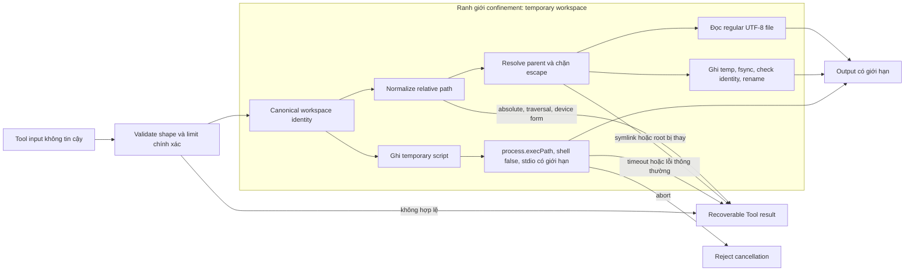

## Kết quả

Bạn sẽ cấp cho Agent ba Coding Tool có giới hạn: `read_file`, `write_file` và `node_process`. Mọi file path phải resolve bên trong một canonical workspace. Thao tác đọc chỉ nhận regular file có UTF-8 hợp lệ. Thao tác ghi thay thế một target theo kiểu atomic bằng temporary file đã được kiểm tra identity. Process execution dùng đúng Node.js executable hiện tại, argument array, working directory cố định, giới hạn output độc lập, timeout, cancellation và cleanup.

Các biện pháp này thu hẹp tác động ngoài ý muốn hoặc input đối nghịch đủ cho một workshop deterministic. Chúng không cô lập JavaScript khỏi operating system. Code truyền vào `node_process` vẫn chạy với quyền của process hiện tại và vẫn có thể dùng Node.js API.

:::note[Course implementation]

`createReadTool()`, `createWriteTool()`, `createNodeProcessTool()`, tên Tool, error string và các fixed limit là contract của Course implementation. Workshop chủ động nhận JavaScript source thay vì một shell command tổng quát.

:::

## Điều kiện tiên quyết

Hoàn thành [checkpoint 07](07-agent-loop.md). Bạn cần hiểu vòng lặp Agent (Agent Loop), `ToolRegistry`, validation trước effect, Tool result có liên kết, `AbortSignal`, Tool execution tuần tự và khác biệt giữa recoverable Tool error với cancellation.

Đọc cumulative module cùng focused evidence:

| Vai trò | Path chính xác | Nội dung cần kiểm tra |
| --- | --- | --- |
| Cumulative source | `course/src/coding-tools.ts` | Workspace capture, path normalization, symlink check, atomic replacement, process launch, limit, cancellation và cleanup |
| Focused evidence | `course/test/08-coding-tools.test.ts` | Các dạng traversal, workspace replacement, symlink race, byte cap chính xác, concurrent write, process output, timeout, abort và temporary-file cleanup |

Focused test tạo một temporary workspace mới. Test không gọi provider, không đọc credential và dùng `process.execPath` thay vì giả định lệnh `node` luôn có trong `PATH`.

## Cơ chế

Mỗi factory canonicalize `root` một lần bằng `realpathSync.native()`, xác nhận đó là directory rồi ghi lại device/inode identity. Mọi thao tác sau đó đều kiểm tra entry ban đầu còn resolve đến đúng canonical directory và identity ấy. Việc xóa rồi tạo lại path, hoặc đổi đích của workspace symlink, sẽ trả `WORKSPACE_ROOT_CHANGED`; Tool không âm thầm nhận replacement.

Path validation từ chối path rỗng, NUL, absolute path kiểu POSIX và Windows, drive-relative form, UNC/device prefix, `..`, segment chứa dấu hai chấm, Windows device name và segment kết thúc bằng dấu chấm hoặc khoảng trắng. Nó bỏ segment rỗng và `.`, sau đó chỉ join các portable segment hợp lệ. Lexical normalization chưa phải ranh giới cuối: thao tác đọc resolve canonical cả parent lẫn target, còn thao tác ghi đi qua và resolve lại từng parent directory. Vì vậy symlink hoặc junction thoát khỏi root vẫn bị chặn dù input string trông có vẻ relative.

`read_file` mở regular file rồi so sánh identity của handle đã mở với canonical target hiện tại trước khi trả content. Tool đọc tối đa `65,536 + 1` byte để phát hiện file quá lớn, decode bằng fatal UTF-8 validation và trả `{ path, content, bytes }`. Cancellation được kiểm tra trước và trong lúc đọc.

`write_file` kiểm tra UTF-8 size trước khi chạm filesystem. Một in-process lock serialize các concurrent write trên cùng canonical target. Tool tạo sibling bằng exclusive mode `wx` và permission `0600`, ghi và `fsync`, xác nhận pathname vẫn trỏ đến đúng file đã mở, kiểm tra lại workspace, parent, target cùng cancellation, rồi rename temporary file lên destination. Nếu rename thất bại, destination cũ còn nguyên; cleanup chỉ xóa temporary identity thuộc về thao tác hiện tại. Các check này giảm race trong threat model của course, nhưng không biến workspace thành hardened multi-tenant sandbox.

`node_process` nhận JavaScript `source` và một string `arguments` array. Tool ghi temporary CommonJS file trong workspace, chạy `process.execPath` với `shell: false`, đặt `cwd` thành canonical root, ẩn Windows console rồi truyền arguments sau `--`. Source bị giới hạn ở `32,768` UTF-8 byte. Tối đa có `32` argument, mỗi argument không quá `2,048` byte và tổng không quá `8,192` byte; Windows command-line quoting còn được kiểm tra với ngưỡng an toàn `30,000` UTF-16 unit.

Child process có `500 ms`. `stdout` và `stderr` giữ tối đa `32,768` byte cho từng stream, đồng thời trả truncation flag độc lập mà không cắt giữa một UTF-8 character. Cancellation hoặc timeout sẽ kill child/process group khi platform hỗ trợ, destroy output stream rồi reject. Nonzero exit thông thường là dữ liệu: result chứa `exitCode`, `signal`, hai output và truncation flag. Timeout trở thành recoverable Tool-layer error `NODE_PROCESS_TIMEOUT`. Temporary script luôn được xóa trong `finally`.

| Ranh giới | Giới hạn chính xác của course | Cách settle khi vượt giới hạn |
| --- | --- | --- |
| Đọc/ghi file | `65,536` UTF-8 byte | `FILE_TOO_LARGE` |
| JavaScript source | `32,768` UTF-8 byte | `NODE_SOURCE_TOO_LARGE` |
| Process argument | `32`; mỗi mục `2,048` byte; tổng `8,192` byte | Stable validation error |
| `stdout` / `stderr` | Mỗi stream `32,768` byte | Text đã truncate kèm boolean flag |
| Process wall time | `500 ms` | Terminate child; `NODE_PROCESS_TIMEOUT` |

## Dấu vết hoặc mô hình



String check chặn các cú pháp escape portable đã biết; canonical resolution và identity check xử lý filesystem indirection cùng replacement. Atomic rename bảo vệ destination khỏi partial write. Cơ chế này không tạo confidentiality trước một process khác vốn có quyền đọc workspace.

## Xây dựng

Cumulative module là `course/src/coding-tools.ts`. Hãy đăng ký các factory của module qua Tool layer từ checkpoint `06`. Đoạn trích nguyên văn từ focused process test dưới đây xác minh execution context thay vì giả định:

```ts
const tool = createNodeProcessTool(workspace);
const source = [
  "process.stdout.write(JSON.stringify({",
  "  execPath: process.execPath,",
  "  args: process.argv.slice(1),",
  "  cwd: process.cwd(),",
  "}));",
  "process.stderr.write('diagnostic');",
].join("\n");
const output = await tool.execute(
  validatedInput(tool, { source, arguments: ["alpha", "two words"] }),
  executionContext(),
);

expect(output.exitCode).toBe(0);
expect(output.signal).toBeNull();
expect(output.stderr).toBe("diagnostic");
expect(output.timedOut).toBe(false);
expect(output.stdoutTruncated).toBe(false);
expect(output.stderrTruncated).toBe(false);
expect(JSON.parse(output.stdout)).toEqual({
  execPath: process.execPath,
  args: ["alpha", "two words"],
  cwd: await realpath(workspace),
});
```

`validatedInput()` và `executionContext()` là helper của focused test. Production path vẫn gọi Tool qua `executeToolCall()` để validate input, truyền cancellation và serialize record được trả về.

## Chạy focused test

Focused test là `course/test/08-coding-tools.test.ts`. Chạy chính xác:

```bash
npm run test:course:checkpoint -- course/test/08-coding-tools.test.ts
```

File này kiểm tra UTF-8 read/write hợp lệ, path normalization, traversal form của POSIX/Windows, ADS/device name, symlink và junction escape, root replacement, file/source limit, atomic rename và rollback, target write serialization, temporary-path substitution, exact argument boundary, output cap an toàn với UTF-8, nonzero exit, timeout, cancellation, process cleanup và hostile input shape. Đây là offline filesystem/process contract, không phải penetration test cho OS sandbox.

## Thử nghiệm lỗi

Tạo một parent directory rỗng cùng child `workspace`, sau đó thử ghi `../outside.txt`. Validator phải từ chối trước khi bất kỳ temporary file hoặc destination nào xuất hiện:

```ts
const outsidePath = join(workspace, "..", "outside.txt");
const registry = new ToolRegistry([createWriteTool(workspace)]);
const result = await executeToolCall(
  registry,
  call("write_file", {
    path: "../outside.txt",
    content: "must stay inside",
  }),
  new AbortController().signal,
);

expect(result.isError).toBe(true);
expect(parseToolContent(result.content)).toMatchObject({
  error: {
    code: "TOOL_ARGUMENTS_INVALID",
    message: "INVALID_RELATIVE_PATH",
  },
});
await expect(access(outsidePath)).rejects.toMatchObject({ code: "ENOENT" });
```

Thử nghiệm nhỏ này dùng cùng helper và contract với `course/test/08-coding-tools.test.ts`. Hãy cleanup temporary directory sau khi chạy. Nếu `outside.txt` tồn tại, path rejection đã xảy ra quá muộn và checkpoint thất bại dù Tool có trả error.

## Tiêu chí chấp nhận

- Focused command chỉ chọn `course/test/08-coding-tools.test.ts` và pass offline.
- Mỗi Tool capture canonical directory identity rồi từ chối workspace đã bị thay hoặc repoint.
- Relative-path validation từ chối traversal, absolute, drive, UNC, device, ADS, reserved-name và ambiguous trailing-character form trước effect.
- Read/write resolution chặn symlink và junction escape; thao tác đọc chỉ nhận regular file có UTF-8 hợp lệ.
- Thao tác ghi serialize theo target, `fsync` temporary do nó sở hữu, kiểm tra identity, rename atomically và giữ destination cũ khi lỗi.
- Các giới hạn file, source, argument, output và time phải bằng đúng documented constant.
- Process launch dùng `process.execPath`, `shell: false`, canonical `cwd`, hai output độc lập có giới hạn và temporary script luôn được cleanup.
- Cancellation và timeout terminate process đang chạy rồi settle mà không để lại `.pify-node-*` hoặc `.pify-tmp-*` artifact.
- Thử nghiệm traversal không tạo `outside.txt` bên ngoài temporary root.

## So sánh với Pi SDK 0.84.3

:::info[Pi SDK 0.84.3]

`@earendil-works/pi-coding-agent` public export `createCodingTools()`, `createReadOnlyTools()`, `createReadTool()`, `createWriteTool()`, `createBashTool()`, `createPowerShellTool()`, `createEditTool()`, `createGrepTool()`, `createFindTool()` và `createLsTool()` cho `cwd` do caller truyền vào.

:::

Ở pinned release, `createCodingTools(cwd)` của Pi ghép read, Bash, edit và write Tool; `createReadOnlyTools(cwd)` ghép read, grep, find và list Tool. Public tool package còn có option/operation type, truncation helper, mutation queue và process Tool theo platform.

Course chỉ cung cấp ba Tool và chủ động thay shell bằng JavaScript có giới hạn qua `process.execPath`. Fixed byte value, tên `read_file`/`write_file`/`node_process`, portable-path grammar, error code và temporary-file algorithm của course không phải API promise từ Pi. Khi tích hợp Pi, hãy dùng public factory cùng option của Pi và áp dụng trust/isolation control của host phù hợp với code sẽ được thực thi.

## Checkpoint tiếp theo

[Checkpoint 09](09-stateful-agent.md) bọc stateless loop trong một stateful owner. Bạn sẽ serialize prompt, công bố immutable history, quản lý subscriber và lập lịch steering/follow-up tại safe point rõ ràng.
