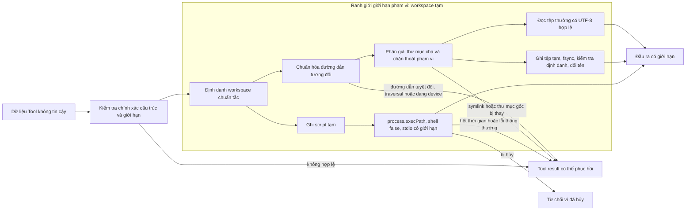

## Kết quả

Bạn sẽ cấp cho Agent ba Coding Tool có giới hạn: `read_file`, `write_file` và `node_process`. Mọi đường dẫn tệp phải phân giải bên trong một workspace đã được chuẩn hóa. Thao tác đọc chỉ chấp nhận tệp thường có UTF-8 hợp lệ. Thao tác ghi thay thế một tệp đích theo cơ chế atomic qua tệp tạm đã kiểm tra định danh. Thao tác chạy tiến trình dùng đúng tệp thực thi Node.js hiện tại, mảng đối số, thư mục làm việc cố định, giới hạn riêng cho từng luồng đầu ra, thời gian chờ, khả năng hủy và quy trình dọn dẹp.

Các biện pháp này thu hẹp tác động ngoài ý muốn hoặc dữ liệu đầu vào đối nghịch trong phạm vi workshop có tính xác định. Chúng không cô lập JavaScript khỏi hệ điều hành. Mã truyền cho `node_process` vẫn chạy với quyền của tiến trình hiện tại và có thể gọi Node.js API.

:::note[Course implementation]

`createReadTool()`, `createWriteTool()`, `createNodeProcessTool()`, tên Tool, chuỗi lỗi và các giới hạn cố định tạo thành contract của phần triển khai trong khóa học. Workshop chủ động nhận mã nguồn JavaScript thay vì một lệnh shell tổng quát.

:::

## Điều kiện tiên quyết

Hoàn thành [checkpoint 07](07-agent-loop.md). Bạn cần hiểu vòng lặp Agent (Agent Loop), `ToolRegistry`, việc kiểm tra dữ liệu đầu vào trước khi gây tác dụng phụ, Tool result có liên kết, `AbortSignal`, cách thực thi Tool tuần tự và khác biệt giữa lỗi Tool có thể phục hồi với việc hủy.

Đọc module tích lũy cùng bằng chứng kiểm thử tập trung:

| Vai trò | Đường dẫn chính xác | Nội dung cần kiểm tra |
| --- | --- | --- |
| Mã nguồn tích lũy | `course/src/coding-tools.ts` | Cách giữ workspace, chuẩn hóa đường dẫn, kiểm tra symlink, thay tệp theo cơ chế atomic, chạy tiến trình, áp giới hạn, xử lý việc hủy và dọn dẹp |
| Bằng chứng tập trung | `course/test/08-coding-tools.test.ts` | Các dạng traversal, workspace bị thay, race qua symlink, giới hạn byte chính xác, ghi đồng thời, đầu ra tiến trình, hết thời gian, hủy và dọn tệp tạm |

Bài kiểm thử tập trung tạo một workspace tạm mới. Nó không gọi provider, không đọc thông tin xác thực và dùng `process.execPath` thay vì giả định lệnh `node` luôn có trong `PATH`.

## Cơ chế

Mỗi factory chuẩn hóa `root` một lần bằng `realpathSync.native()`, xác nhận đó là thư mục rồi lưu định danh device/inode. Trước mỗi thao tác sau đó, Tool kiểm tra entry ban đầu còn phân giải tới đúng thư mục chuẩn tắc với đúng định danh hay không. Nếu đường dẫn bị xóa rồi tạo lại, hoặc symlink của workspace bị đổi đích, Tool trả `WORKSPACE_ROOT_CHANGED` thay vì âm thầm nhận thư mục mới.

Bộ kiểm tra đường dẫn từ chối chuỗi rỗng, NUL, đường dẫn tuyệt đối theo cả POSIX lẫn Windows, dạng tương đối theo ổ đĩa, tiền tố UNC/device, `..`, đoạn chứa dấu hai chấm, tên thiết bị Windows và đoạn kết thúc bằng dấu chấm hoặc khoảng trắng. Nó bỏ đoạn rỗng và `.`, sau đó chỉ nối các đoạn hợp lệ trên mọi nền tảng. Kiểm tra chuỗi chưa phải ranh giới cuối: thao tác đọc phân giải chuẩn tắc cả thư mục cha lẫn tệp đích, còn thao tác ghi đi qua và phân giải lại từng thư mục cha. Vì vậy, symlink hoặc junction dẫn ra ngoài thư mục gốc vẫn bị chặn dù chuỗi ban đầu trông giống đường dẫn tương đối.

`read_file` mở một tệp thường rồi so sánh định danh của handle với tệp đích chuẩn tắc hiện tại trước khi trả nội dung. Tool đọc tối đa `65,536 + 1` byte để phát hiện tệp quá lớn, giải mã UTF-8 ở chế độ nghiêm ngặt và trả `{ path, content, bytes }`. Tín hiệu hủy được kiểm tra trước và trong lúc đọc.

`write_file` kiểm tra kích thước UTF-8 trước khi chạm tới hệ thống tệp. Một khóa nội bộ tiến trình tuần tự hóa các lần ghi đồng thời vào cùng tệp đích chuẩn tắc. Tool tạo tệp tạm trong cùng thư mục bằng chế độ độc quyền `wx` với quyền `0600`, ghi dữ liệu, gọi `fsync`, xác nhận pathname vẫn chỉ đúng tệp đã mở, rồi kiểm tra lại workspace, thư mục cha, tệp đích và tín hiệu hủy trước khi đổi tên tệp tạm lên tệp đích. Nếu chính thao tác đổi tên thất bại, tệp đích cũ còn nguyên và bước dọn dẹp chỉ xóa tệp tạm mang định danh thuộc thao tác hiện tại. Nếu đổi tên đã thành công nhưng định danh của tệp vừa cài đặt không đúng, Tool phát hiện lỗi và xóa tệp đích khi nó vẫn mang định danh vừa kiểm tra; khóa học không cam kết khôi phục tệp đích trước đó ở giai đoạn này. Các phép kiểm tra trên giảm race trong mô hình đe dọa của khóa học, nhưng không biến workspace thành sandbox được gia cố cho nhiều tenant không tin cậy nhau.

`node_process` nhận `source` JavaScript cùng mảng chuỗi `arguments`. Tool ghi một tệp CommonJS tạm trong workspace, chạy `process.execPath` với `shell: false`, đặt `cwd` thành thư mục gốc chuẩn tắc, ẩn cửa sổ console trên Windows rồi truyền các đối số sau `--`. Mã nguồn được giới hạn ở `32,768` byte UTF-8. Có tối đa `32` đối số, mỗi đối số không quá `2,048` byte và tổng không quá `8,192` byte; chuỗi lệnh sau khi quoting trên Windows còn phải nằm trong ngưỡng an toàn `30,000` đơn vị UTF-16.

Tiến trình con được chạy tối đa `500 ms`. `stdout` và `stderr` được giữ riêng, mỗi luồng tối đa `32,768` byte, kèm cờ cắt ngắn độc lập mà không cắt giữa một ký tự UTF-8. Khi bị hủy hoặc hết thời gian, Tool dừng tiến trình con hay nhóm tiến trình nếu nền tảng hỗ trợ, đóng các luồng đầu ra rồi từ chối Promise. Mã thoát khác `0` thông thường được xem là dữ liệu: kết quả chứa `exitCode`, `signal`, hai đầu ra và hai cờ cắt ngắn. Hết thời gian trở thành lỗi ở tầng Tool có thể phục hồi với mã `NODE_PROCESS_TIMEOUT`. Tệp script tạm luôn được xóa trong `finally`.

| Ranh giới | Giới hạn chính xác của khóa học | Cách kết thúc khi vượt giới hạn |
| --- | --- | --- |
| Đọc/ghi tệp | `65,536` byte UTF-8 | `FILE_TOO_LARGE` |
| Mã nguồn JavaScript | `32,768` byte UTF-8 | `NODE_SOURCE_TOO_LARGE` |
| Đối số tiến trình | `32`; mỗi mục `2,048` byte; tổng `8,192` byte | Lỗi kiểm tra ổn định |
| `stdout` / `stderr` | Mỗi luồng `32,768` byte | Văn bản bị cắt ngắn kèm cờ boolean |
| Thời gian chạy tiến trình | `500 ms` | Dừng tiến trình con; `NODE_PROCESS_TIMEOUT` |

## Dấu vết hoặc mô hình



Kiểm tra chuỗi chặn các cú pháp thoát phạm vi đã biết trên nhiều nền tảng; phép phân giải chuẩn tắc và kiểm tra định danh xử lý việc chuyển hướng qua hệ thống tệp cũng như trường hợp đường dẫn bị thay. Đổi tên theo cơ chế atomic bảo vệ tệp đích khỏi dữ liệu ghi dở. Cơ chế này không bảo mật nội dung trước tiến trình khác vốn có quyền đọc workspace.

## Xây dựng

Module tích lũy là `course/src/coding-tools.ts`. Hãy đăng ký các factory của module qua tầng Tool từ checkpoint `06`. Đoạn trích nguyên văn từ bài kiểm thử tiến trình tập trung dưới đây xác minh môi trường thực thi thay vì dựa vào giả định:

```ts
const tool = createNodeProcessTool(workspace);
const source = [
  "process.stdout.write(JSON.stringify({",
  "  execPath: process.execPath,",
  "  args: process.argv.slice(1),",
  "  cwd: process.cwd(),",
  "}));",
  "process.stderr.write('diagnostic');",
].join("\n");
const output = await tool.execute(
  validatedInput(tool, { source, arguments: ["alpha", "two words"] }),
  executionContext(),
);

expect(output.exitCode).toBe(0);
expect(output.signal).toBeNull();
expect(output.stderr).toBe("diagnostic");
expect(output.timedOut).toBe(false);
expect(output.stdoutTruncated).toBe(false);
expect(output.stderrTruncated).toBe(false);
expect(JSON.parse(output.stdout)).toEqual({
  execPath: process.execPath,
  args: ["alpha", "two words"],
  cwd: await realpath(workspace),
});
```

`validatedInput()` và `executionContext()` là hàm hỗ trợ của bài kiểm thử tập trung. Trong đường chạy chính, Agent vẫn gọi Tool qua `executeToolCall()` để kiểm tra dữ liệu đầu vào, truyền tín hiệu hủy và tuần tự hóa bản ghi được trả về.

## Chạy focused test

Bài kiểm thử tập trung là `course/test/08-coding-tools.test.ts`. Chạy chính xác:

```bash
npm run test:course:checkpoint -- course/test/08-coding-tools.test.ts
```

Tệp này kiểm tra thao tác đọc/ghi UTF-8 hợp lệ, chuẩn hóa đường dẫn, các dạng traversal trên POSIX/Windows, ADS/tên thiết bị, symlink và junction thoát phạm vi, thư mục gốc bị thay, giới hạn tệp/mã nguồn, lỗi đổi tên atomic và việc giữ tệp đích cũ, tuần tự hóa các lần ghi cùng đích, thay thế đường dẫn tạm, ranh giới đối số chính xác, giới hạn đầu ra không cắt hỏng UTF-8, mã thoát khác `0`, hết thời gian, hủy, dọn tiến trình và cấu trúc dữ liệu đầu vào đối nghịch. Đây là contract ngoại tuyến cho hệ thống tệp và tiến trình, không phải phép kiểm thử xâm nhập đối với sandbox của hệ điều hành.

## Thử nghiệm lỗi

Tạo một thư mục tạm được quản lý, thêm thư mục con `workspace`, rồi thử ghi `../outside.txt`. Tệp đích ở ngoài workspace vẫn nằm trong thư mục tạm này; khối `finally` chỉ xóa đúng thư mục do thử nghiệm tạo ra:

```ts
import { access, mkdir, mkdtemp, rm } from "node:fs/promises";
import { tmpdir } from "node:os";
import { join } from "node:path";

import { expect, test } from "vitest";

import {
  ToolRegistry,
  createWriteTool,
  executeToolCall,
  type CourseToolCall,
} from "../src/index";

function call(
  name: string,
  argumentsValue: CourseToolCall["arguments"],
): CourseToolCall {
  return {
    type: "toolCall",
    id: `call-${name}-failure`,
    name,
    arguments: argumentsValue,
  };
}

function parseToolContent(content: string): unknown {
  return JSON.parse(content) as unknown;
}

test("rejects traversal before creating an outside file", async () => {
  const parent = await mkdtemp(join(tmpdir(), "pify-course-08-failure-"));
  const workspace = join(parent, "workspace");
  const outsidePath = join(parent, "outside.txt");

  try {
    await mkdir(workspace);
    const registry = new ToolRegistry([createWriteTool(workspace)]);
    const result = await executeToolCall(
      registry,
      call("write_file", {
        path: "../outside.txt",
        content: "must stay inside",
      }),
      new AbortController().signal,
    );

    expect(result.isError).toBe(true);
    expect(parseToolContent(result.content)).toMatchObject({
      error: {
        code: "TOOL_ARGUMENTS_INVALID",
        message: "INVALID_RELATIVE_PATH",
      },
    });
    await expect(access(outsidePath)).rejects.toMatchObject({ code: "ENOENT" });
  } finally {
    await rm(parent, { recursive: true, force: true });
  }
});
```

Hãy lưu tệp Vitest chạy được này bên cạnh `course/test/08-coding-tools.test.ts` để `../src/index` phân giải tới module tích lũy. Đoạn mã không bao giờ nhắm tới `%TEMP%/outside.txt` hoặc `/tmp/outside.txt` dùng chung. Nếu `outsidePath` được quản lý xuất hiện trước bước dọn dẹp, Tool đã từ chối đường dẫn quá muộn và checkpoint thất bại dù có trả lỗi.

## Tiêu chí chấp nhận

- Lệnh tập trung chỉ chọn `course/test/08-coding-tools.test.ts` và chạy đạt khi ngoại tuyến.
- Mỗi Tool lưu định danh thư mục chuẩn tắc rồi từ chối workspace đã bị thay hoặc đổi đích.
- Bước kiểm tra đường dẫn tương đối chặn traversal, đường dẫn tuyệt đối, ổ đĩa, UNC, device, ADS, tên dành riêng và dạng có ký tự cuối mơ hồ trước khi gây tác dụng phụ.
- Phép phân giải khi đọc/ghi chặn symlink và junction thoát phạm vi; thao tác đọc chỉ nhận tệp thường có UTF-8 hợp lệ.
- Thao tác ghi tuần tự hóa theo tệp đích, gọi `fsync` trên tệp tạm do nó sở hữu, kiểm tra định danh, đổi tên theo cơ chế atomic và giữ tệp đích cũ khi chính thao tác đổi tên thất bại; khóa học không tuyên bố có rollback sau khi đổi tên.
- Các giới hạn tệp, mã nguồn, đối số, đầu ra và thời gian phải bằng đúng hằng số đã ghi trong tài liệu.
- Lệnh chạy tiến trình dùng `process.execPath`, `shell: false`, `cwd` chuẩn tắc, hai luồng đầu ra có giới hạn độc lập và luôn dọn tệp script tạm.
- Việc hủy và hết thời gian dừng tiến trình đang chạy rồi kết thúc mà không để lại tệp `.pify-node-*` hoặc `.pify-tmp-*`.
- Thử nghiệm traversal không tạo `outside.txt` bên ngoài workspace nhưng bên trong thư mục tạm được quản lý.

## So sánh với Pi SDK 0.99.2

:::info[Pi SDK 0.99.2]

`@earendil-works/pi-coding-agent` xuất công khai `createCodingTools()`, `createReadOnlyTools()`, `createReadTool()`, `createWriteTool()`, `createBashTool()`, `createPowerShellTool()`, `createEditTool()`, `createGrepTool()`, `createFindTool()` và `createLsTool()` cho `cwd` do mã gọi truyền vào.

:::

Ở release đã ghim, `createCodingTools(cwd)` của Pi ghép các Tool đọc, Bash, chỉnh sửa và ghi; `createReadOnlyTools(cwd)` ghép các Tool đọc, grep, tìm và liệt kê. Gói Tool công khai còn có các kiểu option/operation, hàm hỗ trợ cắt ngắn, hàng đợi mutation và Tool tiến trình theo từng nền tảng.

Khóa học chỉ cung cấp ba Tool và chủ động thay shell bằng JavaScript có giới hạn qua `process.execPath`. Các giá trị byte cố định, tên `read_file`/`write_file`/`node_process`, văn phạm đường dẫn đa nền tảng, mã lỗi và thuật toán tệp tạm của khóa học không phải cam kết API từ Pi. Khi tích hợp Pi, hãy dùng factory công khai cùng option của Pi và áp dụng cơ chế kiểm soát mức tin cậy/cô lập của host phù hợp với mã sẽ được thực thi.

Course implementation là bản triển khai giảng dạy nguyên bản do Pify tự xây dựng, có phạm vi nhỏ hơn và không cam kết tương thích API với Pi.

## Checkpoint tiếp theo

[Checkpoint 09](09-stateful-agent.md) bọc vòng lặp không trạng thái trong một thành phần có trạng thái và sở hữu dữ liệu. Bạn sẽ tuần tự hóa prompt, công bố lịch sử bất biến, quản lý subscriber và lập lịch message điều hướng/tiếp nối tại các điểm an toàn rõ ràng.
