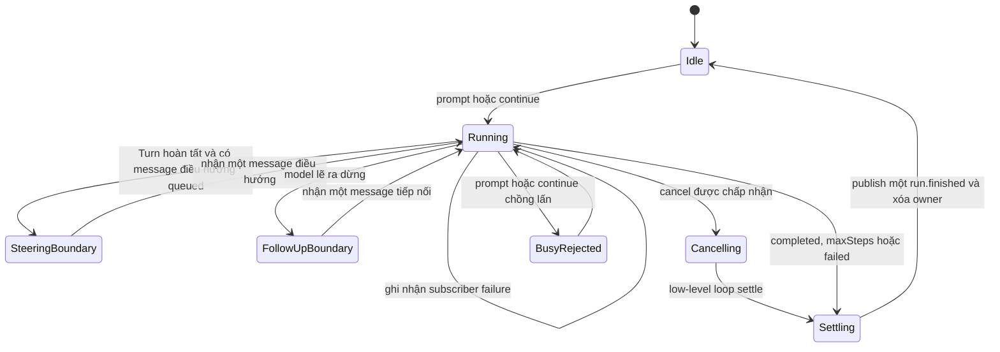

## Kết quả

Bạn sẽ bổ sung `Agent`, một stateful owner bao quanh `runAgentLoop()`. Nó sở hữu transcript qua nhiều lần gọi, từ chối prompt ownership chồng lấn, cung cấp bản sao message snapshot bất biến ở mọi tầng, publish event cho subscriber và quay lại idle sau completion, cancellation hoặc failure. Message điều hướng (steering) được đưa vào tại ranh giới Turn đã hoàn tất; message tiếp nối (follow-up) chỉ chạy sau khi model lẽ ra đã dừng.

Một logical run có thể gọi nhiều low-level loop một bước. Wrapper đánh lại số event của chúng thành một total sequence rồi chỉ phát đúng một `run.finished`. Các queue giữ explicit work sau run lỗi hoặc bị cancel để caller tự quyết định có resume bằng `continue()` hay không.

:::note[Course implementation]

Course `Agent`, `AgentBusyError`, message ID, queue limit, subscriber diagnostic và `EventStream` return value là API của Course implementation. Chúng nhỏ hơn và có settlement semantics khác public `Agent` của Pi.

:::

## Điều kiện tiên quyết

Hoàn thành [checkpoint 08](08-coding-tools.md). Bạn cần hiểu vòng lặp Agent (Agent Loop) không giữ state, một Tool round hoàn chỉnh, các terminal variant của `RunResult`, `AbortSignal`, Tool registry snapshot và lý do cancellation không được tạo transcript message giả.

Đọc cả hai file trước khi thay đổi lifecycle behavior:

| Vai trò | Path chính xác | Nội dung cần kiểm tra |
| --- | --- | --- |
| Cumulative source | `course/src/agent.ts` | Busy guard, owned transcript, queue reservation, safe point, event forwarding, cancellation race, subscriber và recovery |
| Focused evidence | `course/test/09-stateful-agent.test.ts` | Prompt ownership, concurrent rejection, immutable getter, queue, cancellation, listener isolation, recovery và capacity ceiling |

Model và Tool registry được snapshot trong lúc tạo Agent. Việc đăng ký Tool muộn hơn hoặc thay model method không thể làm đổi configuration của Agent ấy.

## Cơ chế

`prompt()` áp dụng busy guard trước tiên. Method này reserve đủ transcript capacity, tạo một immutable user message, append vào state do Agent sở hữu rồi bắt đầu logical run. `continue()` dựa vào tail hiện tại: message điều hướng đang queue có ưu tiên; nếu tail là assistant thì cần message tiếp nối. Trong lúc một run sở hữu transcript, `prompt()` hoặc `continue()` khác sẽ throw `AgentBusyError` đồng bộ. Caller dùng `steer()` hoặc `followUp()` thay vì tạo một owner thứ hai chạy đua.

Public getter `messages` trả một frozen array mới ở mỗi lần đọc. Mọi nested message và assistant block đã được dựng lại rồi freeze. Caller có thể giữ, so sánh hoặc chia sẻ snapshot nhưng không thể `push` hay sửa Tool call bên trong. Agent cũng freeze model method và một `ToolRegistry.snapshot()` ngay lúc construction.

Bên trong, wrapper gọi `runAgentLoop()` với `maxSteps: 1`. Message điều hướng đã queue khi idle có thể đi cùng prompt mới tại initial safe boundary. Trong lúc run, message điều hướng chờ complete Turn settle và wrapper chỉ nhận validated returned transcript. Nếu low-level result là `maxSteps`, các assistant Tool call và result của Turn hiện tại đã hoàn chỉnh; ranh giới này an toàn để nhận đúng một message điều hướng. Message điều hướng cũng chạy trước final completion nếu đang queued. Message tiếp nối được xét sau đó, chỉ khi một `completed` response lẽ ra kết thúc logical run. Mỗi queued item vẫn là một user message riêng.

Wrapper duy trì một logical request counter và một event counter xuyên suốt các subloop. Nó bỏ inner `message.accepted` cùng `run.finished`, publish accepted queue message của riêng mình, forward model/Tool event với `sequence` mới rồi publish một terminal event. `maxSteps` giới hạn tổng số subloop, không reset riêng cho từng subloop.

`subscribe()` lưu listener theo insertion order và trả idempotent unsubscribe function. Khi publish, Agent snapshot listener list hiện tại cho event đó. Synchronous failure và rejected listener Promise trở thành immutable `subscriberErrors`; chúng không chặn listener phía sau hay thay đổi Agent settlement. Listener Promise được observe nhưng không await, vì vậy một subscriber await active run không thể gây deadlock. Unsubscribe ngăn future event delivery và giải phóng listener reference đã lưu.

`cancel(reason)` trả `false` khi Agent idle, đã abort hoặc terminal outcome đã được chọn. Một cancellation được chấp nhận sẽ abort active low-level loop. Nó thắng completed-result adoption race xảy ra gần đồng thời và tạo đúng một `cancelled` result. Message điều hướng/tiếp nối đang queue vẫn còn tường minh để resume sau. Trong `finally`, owner xóa `#activeRun`; internal failure thông thường được normalize thành `AGENT_STATE_FAILED`, capacity failure thành `AGENT_MESSAGE_LIMIT`, rồi Agent dùng lại được.

Queued work bị giới hạn ở `256` message và owned transcript ở `4096`. Reservation tính cả cặp user/assistant cho queued work; trong một active Tool Turn chưa biết kết quả, nó còn reserve worst-case output theo low-level chunk ceiling. Công việc bất khả thi bị từ chối ngay lúc enqueue thay vì được nhận rồi mắc kẹt ở cap.

## Dấu vết hoặc mô hình



| Action trong khi running | Được nhận? | Thời điểm tác động transcript |
| --- | --- | --- |
| `prompt()` / `continue()` | Không; throw `AgentBusyError` | Không bao giờ |
| `steer()` | Có nếu còn capacity | Ranh giới Turn hoàn tất kế tiếp |
| `followUp()` | Có nếu còn capacity | Sau response lẽ ra đã complete |
| `cancel(reason)` | Một lần | Chọn cancellation trước final adoption |
| `subscribe()` / unsubscribe | Có | Listener set cho các lần publish sau |

## Xây dựng

Cumulative module là `course/src/agent.ts`. Đoạn trích nguyên văn từ focused test dưới đây thể hiện normal ownership transition và single terminal event:

```ts
const model = new ScriptedModel([
  scriptedResponse("response-001", [{ type: "text", text: "Hello." }]),
]);
const agent = new Agent({ model });

const stream = agent.prompt("Hi");
expect(agent.isRunning).toBe(true);

const { events, result } = await settle(stream);
expect(result).toMatchObject({ status: "completed", finalText: "Hello." });
expect(agent.isRunning).toBe(false);
expect(agent.messages.map((message) => message.role)).toEqual([
  "user",
  "assistant",
]);
expect(events.map((event) => event.type)).toEqual([
  "message.accepted",
  "model.chunk",
  "run.finished",
]);
expect(events.map((event) => event.sequence)).toEqual([0, 1, 2]);
expect(events.filter((event) => event.type === "run.finished")).toHaveLength(
  1,
);
```

`settle()` drain event iterator rồi await result của chính stream đó. Production code cũng nên consume hoặc chủ động observe cả hai channel để event handling và terminal state luôn tường minh.

## Chạy focused test

Focused test là `course/test/09-stateful-agent.test.ts`. Chạy chính xác:

```bash
npm run test:course:checkpoint -- course/test/09-stateful-agent.test.ts
```

File này chứng minh lifecycle ownership, busy guard, deep snapshot immutability, cancellation settlement, thứ tự message điều hướng/tiếp nối, subscriber isolation/unsubscribe, Promise listener không blocking, cancellation race, reentrant message điều hướng, failure recovery, construction snapshot, total `maxSteps` cùng queue/transcript reservation limit. Test đi qua public method của wrapper thay vì sửa private state.

## Thử nghiệm lỗi

Giữ model request đầu tiên ở trạng thái chờ rồi phát hai concurrent prompt. Lần gọi thứ hai phải lỗi đồng bộ trong khi lần đầu còn ownership. Đoạn dưới đây được lấy nguyên văn từ focused test:

```ts
const entered = deferred<void>();
const release = deferred<void>();
const model = new ScriptedModel([
  async function* (request) {
    entered.resolve();
    await release.promise;
    yield { type: "textDelta", requestId: request.id, delta: "done" };
    return responseFor(
      request,
      "response-busy",
      [{ type: "text", text: "done" }],
      "stop",
    );
  },
]);
const agent = new Agent({ model });
const active = agent.prompt("first");
await entered.promise;

expect(() => agent.prompt("second")).toThrow(AgentBusyError);
expect(() => agent.continue()).toThrowError("Agent is already running");

release.resolve();
await settle(active);
expect(model.callCount).toBe(1);
```

Nếu model nhận hai request thì hai caller đã đồng thời sở hữu một transcript. Không “sửa” thử nghiệm bằng cách tự động queue `prompt()` thứ hai; course yêu cầu caller chọn `steer()` hoặc `followUp()` để timing intent được thể hiện rõ.

## Tiêu chí chấp nhận

- Focused command chỉ chọn `course/test/09-stateful-agent.test.ts` và pass offline.
- `prompt()` và `continue()` từ chối active owner thứ hai bằng stable `AgentBusyError` behavior.
- `messages` trả fresh frozen array với các nested transcript value bất biến.
- Message điều hướng chỉ vào sau complete Turn; message tiếp nối chỉ vào sau otherwise-terminal response; hai loại không merge user message.
- Agent phát một total event sequence và đúng một `run.finished` cho mỗi logical run.
- Subscriber chạy theo registration order, unsubscribe sạch và không thể chặn settlement hoặc phá Agent state khi chúng lỗi.
- Accepted cancellation thắng terminal adoption, settle một lần và giữ explicit queued work.
- Completion, cancellation, capacity failure và internal failure đều xóa active owner để lần `continue()` hợp lệ sau đó có thể phục hồi.
- Queue/transcript reservation từ chối công việc bất khả thi trước khi vượt `256` queued hoặc `4096` owned message.

## So sánh với Pi SDK 0.84.3

:::info[Pi SDK 0.84.3]

`@earendil-works/pi-agent-core` export `Agent`, `AgentOptions`, `AgentState`, `AgentEvent` và các queue-related type. `Agent` của Pi cung cấp `prompt()`, `continue()`, `steer()`, `followUp()`, `subscribe()`, `abort()`, `waitForIdle()`, queue control và `reset()`.

:::

Public Agent của Pi cũng từ chối processing chồng lấn và cung cấp queue cho message điều hướng/tiếp nối. Ở pinned release, queue drain mode có thể cấu hình, `prompt()` resolve `Promise<void>`, `abort()` không nhận result string kiểu course và subscriber Promise được await theo registration order như một phần của run settlement. Pi còn cung cấp state, Tool execution policy, retry configuration và event lifecycle phong phú hơn.

Course trả `EventStream<AgentEvent, RunResult>`, observe nhưng không await subscriber Promise, nhận text-only queue helper, cố định one-at-a-time scheduling và áp dụng capacity rule riêng cho workshop. Đây là teaching constraint có chủ đích chứ không phải compatibility shim. Với code Pi, hãy import và làm theo contract của Pi SDK `0.84.3`.

## Checkpoint tiếp theo

[Checkpoint 10](10-session-tree.md) persist Agent message thành parent-linked JSONL tree. Bạn sẽ di chuyển active leaf để branch mà không rewrite logical history, đồng thời reload an toàn sau một final record thật sự chưa hoàn chỉnh.
