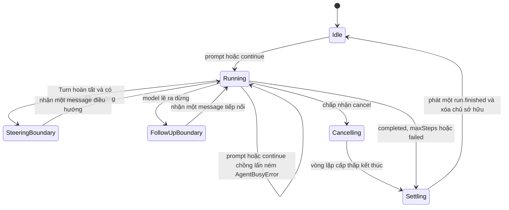

## Kết quả

Bạn sẽ bổ sung `Agent`, một thành phần có trạng thái bao quanh `runAgentLoop()` và sở hữu dữ liệu. Nó giữ transcript qua nhiều lần gọi, từ chối các prompt giành quyền sở hữu chồng lấn, cung cấp bản chụp message bất biến ở mọi tầng, phát sự kiện cho subscriber và quay lại trạng thái chờ sau khi hoàn tất, bị hủy hoặc gặp lỗi. Message điều hướng (steering) được đưa vào tại ranh giới Turn đã hoàn tất; message tiếp nối (follow-up) chỉ chạy sau khi model lẽ ra đã dừng.

Một lần chạy logic có thể gọi vòng lặp cấp thấp một bước nhiều lần. Lớp bọc đánh lại số sự kiện thành một dãy thứ tự toàn phần rồi chỉ phát đúng một `run.finished`. Các hàng đợi giữ công việc đã được yêu cầu rõ ràng sau khi lần chạy gặp lỗi hoặc bị hủy, nhờ đó mã gọi tự quyết định có tiếp tục bằng `continue()` hay không.

:::note[Course implementation]

`Agent`, `AgentBusyError`, ID message, giới hạn hàng đợi, chẩn đoán subscriber và giá trị trả về từ `EventStream` là API của phần triển khai trong khóa học. Phạm vi của chúng nhỏ hơn và quy tắc kết thúc cũng khác `Agent` công khai của Pi.

:::

## Điều kiện tiên quyết

Hoàn thành [checkpoint 08](08-coding-tools.md). Bạn cần hiểu vòng lặp Agent (Agent Loop) không giữ trạng thái, một lượt Tool hoàn chỉnh, các biến thể kết thúc của `RunResult`, `AbortSignal`, bản chụp Tool registry và lý do việc hủy không được tạo message giả trong transcript.

Đọc cả hai tệp trước khi thay đổi hành vi vòng đời:

| Vai trò | Đường dẫn chính xác | Nội dung cần kiểm tra |
| --- | --- | --- |
| Mã nguồn tích lũy | `course/src/agent.ts` | Busy guard, transcript do Agent sở hữu, sức chứa dành trước cho hàng đợi, điểm an toàn, chuyển tiếp sự kiện, race khi hủy, subscriber và phục hồi |
| Bằng chứng tập trung | `course/test/09-stateful-agent.test.ts` | Quyền sở hữu prompt, từ chối lần gọi đồng thời, getter bất biến, hàng đợi, việc hủy, cô lập listener, phục hồi và trần sức chứa |

Model và Tool registry được chụp lại trong lúc tạo Agent. Đăng ký thêm Tool hoặc thay phương thức của model sau thời điểm đó không thể làm đổi cấu hình Agent.

## Cơ chế

`prompt()` áp dụng busy guard trước tiên. Phương thức này dành trước đủ sức chứa transcript, tạo một user message bất biến, thêm message vào trạng thái do Agent sở hữu rồi bắt đầu một lần chạy logic. `continue()` dựa vào phần cuối hiện tại: message điều hướng đang chờ được ưu tiên; nếu message cuối là của assistant thì phải có message tiếp nối. Trong lúc một lần chạy giữ transcript, lời gọi `prompt()` hoặc `continue()` khác sẽ ném `AgentBusyError` ngay lập tức. Mã gọi dùng `steer()` hoặc `followUp()` để nêu rõ thời điểm mong muốn thay vì tạo chủ sở hữu thứ hai.

Getter công khai `messages` trả một mảng mới đã đóng băng sau mỗi lần đọc. Mọi message lồng nhau và block của assistant đều được dựng lại rồi đóng băng. Mã gọi có thể giữ, so sánh hoặc chia sẻ bản chụp nhưng không thể `push` hay sửa Tool call bên trong. Agent cũng cố định phương thức của model và một `ToolRegistry.snapshot()` ngay lúc khởi tạo.

Bên trong, lớp bọc gọi `runAgentLoop()` với `maxSteps: 1`. Message điều hướng đã nằm trong hàng đợi khi Agent ở trạng thái chờ có thể đi cùng prompt mới tại điểm an toàn ban đầu. Trong lúc chạy, message điều hướng phải chờ một Turn hoàn tất; lớp bọc chỉ nhận transcript mà vòng lặp cấp thấp đã kiểm tra. Nếu kết quả cấp thấp là `maxSteps`, các Tool call của assistant và Tool result trong Turn hiện tại đã đầy đủ, nên ranh giới này nhận đúng một message điều hướng. Message điều hướng cũng được xét trước khi lần chạy hoàn tất. Message tiếp nối chỉ được xét sau đó, khi một response `completed` lẽ ra đã kết thúc lần chạy logic. Mỗi phần tử trong hàng đợi vẫn là một user message riêng.

Lớp bọc giữ một bộ đếm request và một bộ đếm sự kiện cho toàn bộ lần chạy logic. Nó bỏ `message.accepted` và `run.finished` do vòng lặp bên trong phát, tự phát sự kiện nhận message từ hàng đợi, chuyển tiếp sự kiện model/Tool với `sequence` mới rồi phát một sự kiện kết thúc. `maxSteps` giới hạn tổng số vòng lặp con thay vì được đặt lại cho từng vòng.

`subscribe()` lưu listener theo thứ tự đăng ký và trả một hàm hủy đăng ký có thể gọi lặp lại an toàn. Mỗi lần phát sự kiện, Agent chụp lại danh sách listener hiện tại. Lỗi đồng bộ và Promise bị listener từ chối được ghi thành `subscriberErrors` bất biến; chúng không chặn listener phía sau và không đổi kết quả của Agent. Agent quan sát nhưng không `await` Promise của listener, nên subscriber chờ lần chạy hiện tại sẽ không gây deadlock. Hủy đăng ký ngăn các sự kiện sau đi tới listener và giải phóng tham chiếu đã lưu.

`cancel(reason)` trả `false` khi Agent đang chờ, đã bị hủy hoặc đã chọn kết quả cuối. Một yêu cầu hủy được chấp nhận sẽ hủy vòng lặp cấp thấp đang chạy. Nếu kết quả `completed` xuất hiện gần như đồng thời, việc hủy vẫn thắng khi lớp bọc nhận kết quả và tạo đúng một kết quả `cancelled`. Message điều hướng/tiếp nối trong hàng đợi vẫn được giữ để tiếp tục sau. Khối `finally` xóa `#activeRun`; lỗi nội bộ thông thường trở thành `AGENT_STATE_FAILED`, còn lỗi sức chứa thành `AGENT_MESSAGE_LIMIT`, sau đó Agent có thể dùng lại.

Hàng đợi chứa tối đa `256` message, còn transcript do Agent giữ có tối đa `4096` message. Phép dành trước sức chứa tính cả cặp user/assistant cho công việc đang chờ. Trong một Tool Turn đang chạy mà chưa biết kết quả, phép tính còn dành chỗ cho đầu ra lớn nhất theo trần chunk cấp thấp. Công việc không thể nằm trong giới hạn sẽ bị từ chối ngay lúc đưa vào hàng đợi thay vì được nhận rồi mắc kẹt ở trần.

## Dấu vết hoặc mô hình



| Thao tác khi Agent đang chạy | Được nhận? | Thời điểm tác động transcript |
| --- | --- | --- |
| `prompt()` / `continue()` | Không; ném `AgentBusyError` | Không bao giờ |
| `steer()` | Có nếu còn sức chứa | Ranh giới Turn hoàn tất kế tiếp |
| `followUp()` | Có nếu còn sức chứa | Sau response lẽ ra đã hoàn tất |
| `cancel(reason)` | Một lần | Chọn việc hủy trước khi nhận kết quả cuối |
| `subscribe()` / hủy đăng ký | Có | Tập listener áp dụng cho các lần phát sự kiện sau |

## Xây dựng

Module tích lũy là `course/src/agent.ts`. Đoạn trích nguyên văn từ bài kiểm thử tập trung dưới đây thể hiện chuyển giao quyền sở hữu thông thường và một sự kiện kết thúc duy nhất:

```ts
const model = new ScriptedModel([
  scriptedResponse("response-001", [{ type: "text", text: "Hello." }]),
]);
const agent = new Agent({ model });

const stream = agent.prompt("Hi");
expect(agent.isRunning).toBe(true);

const { events, result } = await settle(stream);
expect(result).toMatchObject({ status: "completed", finalText: "Hello." });
expect(agent.isRunning).toBe(false);
expect(agent.messages.map((message) => message.role)).toEqual([
  "user",
  "assistant",
]);
expect(events.map((event) => event.type)).toEqual([
  "message.accepted",
  "model.chunk",
  "run.finished",
]);
expect(events.map((event) => event.sequence)).toEqual([0, 1, 2]);
expect(events.filter((event) => event.type === "run.finished")).toHaveLength(
  1,
);
```

`settle()` đọc hết iterator sự kiện rồi chờ kết quả của chính stream đó. Mã production cũng nên tiêu thụ hoặc chủ động quan sát cả hai kênh để việc xử lý sự kiện và trạng thái cuối luôn rõ ràng.

## Chạy focused test

Bài kiểm thử tập trung là `course/test/09-stateful-agent.test.ts`. Chạy chính xác:

```bash
npm run test:course:checkpoint -- course/test/09-stateful-agent.test.ts
```

Tệp này chứng minh quyền sở hữu theo vòng đời, busy guard, tính bất biến sâu của bản chụp, cách kết thúc khi hủy, thứ tự message điều hướng/tiếp nối, việc cô lập và hủy đăng ký subscriber, Promise của listener không gây chặn, race khi hủy, message điều hướng gọi lồng, phục hồi sau lỗi, bản chụp lúc khởi tạo, tổng `maxSteps` cùng giới hạn sức chứa dành trước cho hàng đợi/transcript. Bài kiểm thử chỉ gọi phương thức công khai của lớp bọc, không sửa trạng thái riêng tư.

## Thử nghiệm lỗi

Giữ request đầu tiên của model ở trạng thái chờ rồi gọi hai prompt đồng thời. Lần gọi thứ hai phải lỗi ngay trong khi lần đầu còn giữ quyền sở hữu. Đoạn dưới đây được lấy nguyên văn từ bài kiểm thử tập trung:

```ts
const entered = deferred<void>();
const release = deferred<void>();
const model = new ScriptedModel([
  async function* (request) {
    entered.resolve();
    await release.promise;
    yield { type: "textDelta", requestId: request.id, delta: "done" };
    return responseFor(
      request,
      "response-busy",
      [{ type: "text", text: "done" }],
      "stop",
    );
  },
]);
const agent = new Agent({ model });
const active = agent.prompt("first");
await entered.promise;

expect(() => agent.prompt("second")).toThrow(AgentBusyError);
expect(() => agent.continue()).toThrowError("Agent is already running");

release.resolve();
await settle(active);
expect(model.callCount).toBe(1);
```

Nếu model nhận hai request thì hai mã gọi đã cùng lúc giữ một transcript. Không tự động đưa `prompt()` thứ hai vào hàng đợi chỉ để bài kiểm thử đạt; khóa học yêu cầu mã gọi chọn `steer()` hoặc `followUp()` để thể hiện rõ thời điểm mong muốn.

## Tiêu chí chấp nhận

- Lệnh tập trung chỉ chọn `course/test/09-stateful-agent.test.ts` và chạy đạt khi ngoại tuyến.
- `prompt()` và `continue()` từ chối chủ sở hữu đang chạy thứ hai bằng `AgentBusyError` ổn định.
- `messages` trả một mảng mới đã đóng băng, trong đó mọi giá trị transcript lồng nhau đều bất biến.
- Message điều hướng chỉ được đưa vào sau một Turn hoàn chỉnh; message tiếp nối chỉ được đưa vào sau response lẽ ra đã kết thúc; hai loại không gộp user message.
- Agent phát một dãy sự kiện có thứ tự toàn phần và đúng một `run.finished` cho mỗi lần chạy logic.
- Subscriber chạy theo thứ tự đăng ký, được hủy đăng ký sạch và không thể chặn việc kết thúc hoặc làm hỏng trạng thái Agent khi gặp lỗi.
- Việc hủy đã được chấp nhận thắng bước nhận kết quả cuối, chỉ kết thúc một lần và giữ nguyên công việc đã được đưa vào hàng đợi.
- Khi hoàn tất, bị hủy, vượt sức chứa hoặc gặp lỗi nội bộ, Agent đều xóa chủ sở hữu đang chạy để lần `continue()` hợp lệ sau đó có thể phục hồi.
- Phép dành trước cho hàng đợi/transcript từ chối công việc không thể chứa trước khi vượt `256` message trong hàng đợi hoặc `4096` message do Agent sở hữu.

## So sánh với Pi SDK 0.99.2

:::info[Pi SDK 0.99.2]

`@earendil-works/pi-agent-core` xuất công khai `Agent`, `AgentOptions`, `AgentState`, `AgentEvent` cùng các kiểu liên quan tới hàng đợi. `Agent` của Pi cung cấp `prompt()`, `continue()`, `steer()`, `followUp()`, `subscribe()`, `abort()`, `waitForIdle()`, cơ chế điều khiển hàng đợi và `reset()`.

:::

`Agent` công khai của Pi cũng từ chối các lần xử lý chồng lấn và cung cấp hàng đợi cho steering/follow-up message. Ở release đã ghim, mã gọi có thể cấu hình chế độ rút hàng đợi, `prompt()` resolve `Promise<void>`, `abort()` không nhận chuỗi lý do như khóa học, còn Promise của subscriber được `await` theo thứ tự đăng ký như một phần của quá trình settle run. Chính sách sau turn dùng `finishTurn`: `{ action: "end" }` kết thúc normal response, còn `undefined` giữ nguyên scheduling và để response lỗi hoặc bị abort theo hard-exit path mặc định. Pi còn cung cấp state, chính sách thực thi Tool, retry config và event lifecycle phong phú hơn.

Khóa học trả `EventStream<AgentEvent, RunResult>`, quan sát nhưng không `await` Promise của subscriber, chỉ nhận văn bản trong hàm hỗ trợ hàng đợi, cố định cách lập lịch từng message một và áp dụng quy tắc sức chứa riêng cho workshop. Đây là giới hạn phục vụ giảng dạy có chủ đích, không phải lớp tương thích. Với mã Pi, hãy import và làm theo contract của Pi SDK `0.99.2`.

Course implementation là bản triển khai giảng dạy nguyên bản do Pify tự xây dựng, có phạm vi nhỏ hơn và không cam kết tương thích API với Pi.

## Checkpoint tiếp theo

[Checkpoint 10](10-session-tree.md) lưu message của Agent thành một cây JSONL nối bằng `parentId`. Bạn sẽ di chuyển leaf hiện tại để tạo nhánh mà không viết lại lịch sử logic, đồng thời tải lại an toàn sau bản ghi cuối thực sự chưa hoàn chỉnh.
