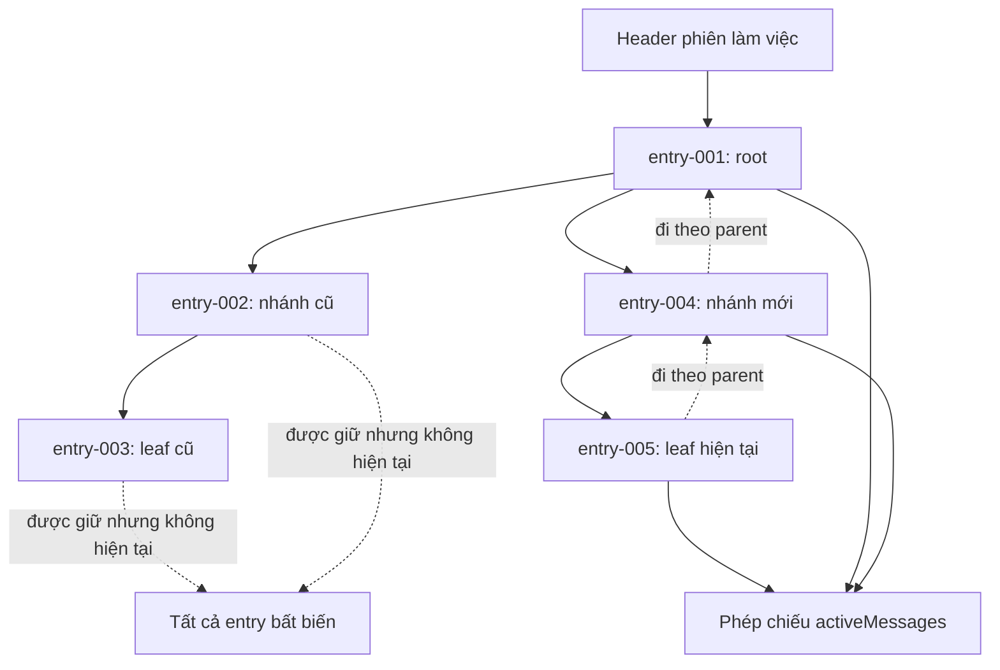

## Kết quả

Bạn sẽ lưu message của khóa học thành một cây phiên làm việc (Session Tree) có phiên bản. Một header JSONL định danh phiên làm việc (session). Mỗi bản ghi phía sau là một entry bất biến có `id`, `parentId`, timestamp và giá trị Message IR riêng. `SessionTree` theo dõi leaf hiện tại rồi chỉ chiếu đường đi từ root tới leaf vào `activeMessages`; chuyển nhánh không bao giờ xóa các node con không còn hiện tại.

Lịch sử logic tuân theo nguyên tắc chỉ thêm mới: mỗi thao tác tạo entry mới và không API nào sửa hoặc xóa entry cũ. Để việc phục hồi có kết quả xác định hơn trong workshop, `SessionStore` ghi toàn bộ tập bản ghi dự kiến thành một thế hệ tệp mới rồi thay thế theo cơ chế atomic, thay vì gọi syscall `append` không được bảo vệ. Loader chỉ chấp nhận object JSON cuối cùng chưa hoàn tất về mặt cú pháp. Với dữ liệu hỏng đã hoàn chỉnh hoặc nằm giữa tệp, loader áp dụng fail-closed: từ chối cả phiên làm việc thay vì đoán hay bỏ qua dữ liệu.

:::note[Course implementation]

`SessionStore`, `SessionTree`, phiên bản định dạng `1`, mã lỗi, thuật toán tệp, các giới hạn chính xác và quy tắc lấy entry mới nhất đã lưu làm leaf hiện tại ban đầu tạo thành contract của phần triển khai trong khóa học. Chúng không tương thích với tệp phiên làm việc của Pi.

:::

## Điều kiện tiên quyết

Hoàn thành [checkpoint 09](09-stateful-agent.md). Bạn cần hiểu giá trị Message IR bất biến, liên kết Tool call/result, bản chụp transcript do Agent sở hữu, thay đổi trạng thái được tuần tự hóa và cách phục hồi sau lỗi mà không âm thầm bỏ công việc trong hàng đợi.

Kiểm tra mã lưu trữ cùng bằng chứng về các trường hợp lỗi:

| Vai trò | Đường dẫn chính xác | Nội dung cần kiểm tra |
| --- | --- | --- |
| Mã nguồn tích lũy | `course/src/session.ts` | Bản ghi có phiên bản, phân tích cú pháp, kiểm tra parent/link, định danh đường dẫn, thế hệ atomic, rollback, phép chiếu trên cây và hàng đợi thao tác |
| Bằng chứng tập trung | `course/test/10-session-tree.test.ts` | Tạo nhánh, tải lại, phần cuối chưa hoàn chỉnh, dữ liệu hỏng, dữ liệu đối nghịch, nhiều store cùng thao tác, rollback, phát hiện đường dẫn bị thay và các giới hạn |

Bài kiểm thử tạo một tệp phiên làm việc trong thư mục tạm mới. Đồng hồ và factory tạo ID có kết quả xác định, nhờ đó bài kiểm thử có thể kiểm tra trực tiếp thứ tự bản ghi cùng parent đã chọn.

## Cơ chế

`SessionStore.create()` ghi đúng một header đã đóng băng gồm `type: "session"`, `version: 1`, ID phiên làm việc không rỗng và timestamp tạo phiên. Nó tạo tệp ở chế độ độc quyền, ghi đủ byte, gọi `fsync`, kiểm tra định danh qua handle đã mở rồi đồng bộ thư mục cha. `load()` từ chối đường dẫn không trỏ tới tệp thường, tệp bị thay, tệp quá lớn hoặc UTF-8 không hợp lệ trước khi trả `SessionStore`.

Mỗi entry có `type: "entry"`, `version: 1`, `id` duy nhất và không rỗng, `parentId` bằng `null` hoặc trỏ tới entry xuất hiện trước đó, timestamp và một `CourseMessage` đã được chụp sâu. Khi tải lại, loader dựng lại từng bản ghi mà không gọi accessor. Nó từ chối field thừa hoặc thiếu, ID trùng, parent nằm phía sau hoặc không tồn tại, phiên bản không được hỗ trợ, Message IR không hợp lệ và Tool result không tìm thấy call tương ứng trong chuỗi ancestor của nhánh đó.

JSONL dành một object JSON có giới hạn cho mỗi dòng. Một dòng tối đa `65,536` byte; cả tệp tối đa `4,194,304` byte; một phiên làm việc tối đa `4,096` entry. CRLF và dòng cuối hợp lệ nhưng không có `\n` vẫn được chấp nhận. UTF-8 không hợp lệ luôn gây lỗi nghiêm trọng. Tiền tố chuỗi/object cuối chưa kết thúc, chẳng hạn `{"type":"entry","id":"cut`, được nhận diện là chưa hoàn tất rồi bỏ qua trong lần tải đó. Văn bản tùy ý, tiền tố JSON không thể hoàn thành, JSON hợp lệ kèm dữ liệu rác phía sau hoặc JSON sai cú pháp đã có newline đều là dữ liệu hỏng, không phải phần cuối bị cắt khi tiến trình dừng đột ngột.

Ban đầu, quá trình phục hồi chỉ thay phần dữ liệu đã phân tích; các byte chưa hoàn chỉnh vẫn còn trên đĩa. Lần `append()` kế tiếp tuần tự hóa header/entry đã chấp nhận cùng entry mới thành một thế hệ chuẩn có newline cuối, qua đó loại phần đuôi bị bỏ lại. Loader không được bỏ dòng hỏng ở giữa, vì mọi `parentId`, ID và liên kết Tool phía sau khi ấy sẽ bị diễn giải dựa trên lịch sử giả.

`append(parentId, message)` chụp dữ liệu đầu vào trước khi đưa vào hàng đợi. Bên trong cả hàng đợi riêng của store lẫn khóa theo đường dẫn chuẩn tắc, phương thức kiểm tra lại định danh thư mục gốc/tệp, sức chứa và parent, tạo bản ghi, kiểm tra liên kết Tool trong nhánh rồi chuẩn bị toàn bộ mảng entry dự kiến. Chỉ sau khi commit bền vững thành công, nó mới cập nhật mảng trong bộ nhớ và bảng ánh xạ ID. Vì vậy, khi append lỗi, cả hai phần dữ liệu vẫn ở thế hệ cũ; công việc phía sau trong hàng đợi vẫn có thể thử lại.

Commit atomic ghi một tệp tạm cùng cấp ở chế độ độc quyền rồi gọi `fsync`. Nó kiểm tra định danh tệp tạm, tạo hard link từ thế hệ hiện tại làm dấu mốc phục hồi, kiểm tra lại định danh nơi lưu trữ, đổi tên tệp tạm vào đường dẫn chính, xác minh thế hệ vừa cài, đồng bộ thư mục rồi xóa dấu mốc. Bước dọn dẹp chỉ đụng tới định danh do thao tác sở hữu. Nếu bước cài đặt hoặc hoàn tất gặp lỗi, rollback khôi phục thế hệ trước. Nếu không thể chứng minh rollback thành công, trạng thái có kiểu `SESSION_ROLLBACK_FAILED` giữ dấu mốc phục hồi và khóa các lần dùng sau thay vì phỏng đoán.

`SessionTree` bắt đầu tại entry đã lưu cuối cùng. `moveTo(id)` chỉ đổi leaf hiện tại trong bộ nhớ sau khi kiểm tra entry có thuộc cây; `moveTo(null)` chọn vị trí tạo root mới. `append(message)` chờ các thao tác cây trước đó, dùng leaf hiện tại làm `parentId`, rồi chỉ chuyển leaf sau khi store commit thành công. `activeEntries` lần theo parent từ leaf về root, đảo ngược đường đi đã thu thập và trả một phép chiếu đã đóng băng. Node con không còn hiện tại vẫn nằm trong `entries` và trên đĩa.

## Dấu vết hoặc mô hình



| Dữ liệu đã lưu | Có đổi khi `moveTo()`? | Có trong phép chiếu hiện tại? |
| --- | --- | --- |
| Header và dòng entry | Không | Header là metadata, không phải message |
| Node con không còn hiện tại | Không | Không |
| Entry đã chọn và các ancestor | Không | Có, theo thứ tự root tới leaf |
| Con trỏ leaf hiện tại | Có, trong bộ nhớ | Quyết định phép chiếu |
| Entry được thêm kế tiếp | Node con mới đã lưu bền vững | Có sau khi commit thành công |

## Xây dựng

Module tích lũy là `course/src/session.ts`. Đoạn trích nguyên văn từ bài kiểm thử tập trung dưới đây tạo nhánh và chứng minh leaf bị bỏ lại vẫn được giữ:

```ts
const store = await SessionStore.create(sessionPath, deterministicOptions());
const tree = new SessionTree(store);
const root = await tree.append(user("message-001", "root"));
const oldLeaf = await tree.append(user("message-002", "old branch"));

await tree.moveTo(root.id);
const newLeaf = await tree.append(user("message-003", "new branch"));

expect(newLeaf.parentId).toBe(root.id);
expect(tree.activeLeafId).toBe(newLeaf.id);
expect(tree.activeMessages.map((message) => message.content)).toEqual([
  "root",
  "new branch",
]);
expect(tree.entries.map((entry) => entry.id)).toEqual([
  root.id,
  oldLeaf.id,
  newLeaf.id,
]);
expect(tree.entries.find((entry) => entry.id === oldLeaf.id)).toBe(oldLeaf);
```

Một nhánh chỉ cần liên kết parent và một con trỏ tới leaf hiện tại. Tiền tố chung không bị sao chép, còn `oldLeaf` không bị xóa.

## Chạy focused test

Bài kiểm thử tập trung là `course/test/10-session-tree.test.ts`. Chạy chính xác:

```bash
npm run test:course:checkpoint -- course/test/10-session-tree.test.ts
```

Tệp này kiểm tra việc tạo header, thứ tự parent có kết quả xác định, tạo nhánh, thay leaf trong bộ nhớ, dữ liệu CRLF hoặc thiếu newline cuối, phục hồi chính xác phần cuối bị cắt, dữ liệu hỏng ở giữa/cuối tệp, UTF-8 không hợp lệ, kiểm tra bản ghi/message, liên kết Tool, option đối nghịch, tuần tự hóa giữa nhiều store, flush atomic, các giai đoạn rollback, dấu mốc phục hồi, thao tác cây đồng thời, thư mục gốc/tệp bị thay, lỗi có kiểu và mọi trần theo dòng/tệp/bản ghi.

## Thử nghiệm lỗi

So sánh hai tệp bị hỏng. Trước tiên, cắt bản ghi cuối bên trong một chuỗi JSON chưa hoàn thành. Loader được phép giữ các bản ghi trước đó, và lần append sau sẽ chuẩn hóa lại tệp. Tiếp theo, đặt dữ liệu hỏng vào một dòng hoàn chỉnh ở giữa; loader phải từ chối toàn bộ phiên làm việc:

```ts
await writeFile(
  sessionPath,
  `${headerLine()}\n${entryLine()}\n{"type":"entry","id":"cut`,
  "utf8",
);
const recovered = await SessionStore.load(sessionPath, deterministicOptions());
expect(recovered.entries.map((entry) => entry.id)).toEqual(["entry-001"]);

await writeFile(
  sessionPath,
  `${headerLine()}\nnot-json\n${entryLine()}\n`,
  "utf8",
);
await expectSessionError(
  SessionStore.load(sessionPath, deterministicOptions()),
  "SESSION_INVALID_JSON",
);
```

Hai đoạn dùng đúng hàm hỗ trợ và dữ liệu từ `course/test/10-session-tree.test.ts`. Không mở rộng khả năng phục hồi cho mọi phần cuối chưa kết thúc: `not-json`, tiền tố JSON không thể hoàn thành, UTF-8 không hợp lệ và dữ liệu rác hoàn chỉnh vẫn là lỗi nghiêm trọng ngay cả khi nằm ở dòng vật lý cuối.

## Tiêu chí chấp nhận

- Lệnh tập trung chỉ chọn `course/test/10-session-tree.test.ts` và chạy đạt khi ngoại tuyến.
- Header có phiên bản đứng trước một object JSON có giới hạn cho mỗi entry được chấp nhận.
- ID entry là duy nhất; mỗi `parentId` khác `null` trỏ tới bản ghi phía trước; message và liên kết Tool trong nhánh được kiểm tra trước khi nhận.
- `moveTo()` không đổi byte nào trong tệp, còn lần append thành công kế tiếp trở thành node con của leaf đã chọn.
- `activeEntries` và `activeMessages` là phép chiếu đã đóng băng từ root tới leaf; nhánh không còn hiện tại vẫn được lưu.
- Chỉ object JSON cuối chưa hoàn tất đúng cú pháp mới phục hồi được; dữ liệu hỏng ở giữa, dữ liệu rác hoàn chỉnh, tiền tố không hợp lệ và UTF-8 không hợp lệ đều khiến loader từ chối toàn bộ phiên.
- Lần append sau phần cuối có thể phục hồi sẽ ghi một thế hệ chuẩn có newline cuối.
- Append/flush commit qua tệp tạm đã kiểm tra định danh, dấu mốc phục hồi, đổi tên, đồng bộ thư mục, dọn dẹp và rollback; bộ nhớ chỉ đổi sau commit.
- Giới hạn giữ nguyên `65,536` byte mỗi dòng, `4,194,304` byte mỗi tệp và `4,096` entry.

## So sánh với Pi SDK 0.87.1

:::info[Pi SDK 0.87.1]

`@earendil-works/pi-coding-agent` xuất công khai `SessionManager`, `SessionEntry`, `SessionHeader`, `SessionTreeNode`, `buildContextEntries()`, `buildSessionContext()` và `CURRENT_SESSION_VERSION`.

:::

`SessionManager` ở release đã ghim là nguồn canonical cho provider context trong tương lai. Nó mô tả cây JSONL chỉ thêm mới với `id`/`parentId`, leaf hiện tại, `getBranch()`, `getTree()`, `branch()` và `buildSessionProjection()` có xét compaction. Định dạng của release là phiên bản `3` và hỗ trợ thêm model/thinking change, compaction, branch summary, custom entry, label, session info và `context_edit`.

Gán `session.agent.state.messages` không thay thế canonical projection đó. Hãy dùng session API để navigate, append qua `session.sessionManager`, rồi gọi `session.refreshContext()` khi external append cần làm mới public finalized transcript. `appendContextEdit(targetId, null)` append một omission mà không viết lại target; replacement khác null có shape `{ content }`. Raw transcript và UI history vẫn append-only.

Định dạng của khóa học là phiên bản `1`, chỉ lưu header cùng entry Message IR, dùng commit atomic cho toàn bộ thế hệ và giao thức dấu mốc phục hồi riêng cho workshop, đồng thời lấy bản ghi mới nhất làm leaf hiện tại sau khi tải. Tệp JSONL của khóa học không phải phiên làm việc Pi, và loader này cũng không nhận tệp phiên làm việc Pi. Hãy dùng `SessionManager` cùng hàm chuyển đổi phiên bản của Pi cho phiên làm việc thực tế.

## Checkpoint tiếp theo

[Checkpoint 11](11-context-compaction.md) tạo ngữ cảnh có giới hạn từ các nhóm message hoàn chỉnh. Bạn sẽ tóm tắt tiền tố cũ mà không tách Tool call của assistant khỏi bất kỳ result tương ứng nào.
