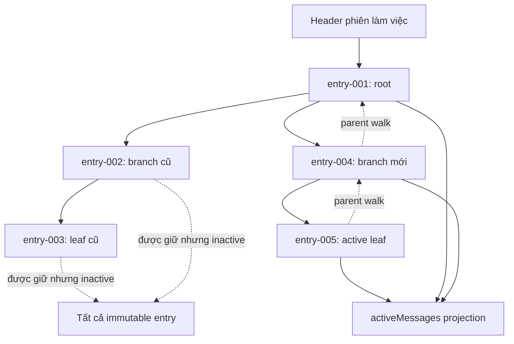

## Kết quả

Bạn sẽ persist course message thành một cây phiên làm việc (Session Tree) có version. Một JSONL header định danh phiên làm việc (session). Mọi record sau đó là immutable entry có `id`, `parentId`, timestamp và Message IR value riêng. `SessionTree` theo dõi active leaf rồi chỉ project root-to-leaf path vào `activeMessages`; việc chuyển branch không bao giờ xóa inactive descendant.

Logical history là append-only: action mới tạo entry mới và không API nào sửa hoặc xóa entry cũ. Để recovery deterministic hơn trong workshop này, `SessionStore` persist mỗi prospective record set thành một atomically replaced file generation thay vì gọi append syscall không được bảo vệ. Loader chỉ chấp nhận một final JSON object chưa hoàn tất về mặt cú pháp. Complete corruption hoặc middle corruption sẽ fail closed.

:::note[Course implementation]

`SessionStore`, `SessionTree`, format version `1`, error code, file algorithm, exact limit và quy tắc chọn stored entry mới nhất làm initial active leaf là contract của Course implementation. Chúng không tương thích với file phiên làm việc của Pi.

:::

## Điều kiện tiên quyết

Hoàn thành [checkpoint 09](09-stateful-agent.md). Bạn cần hiểu immutable Message IR value, Tool call/result linkage, Agent-owned transcript snapshot, serialized state change và failure recovery không âm thầm bỏ queued work.

Kiểm tra storage code cùng failure evidence:

| Vai trò | Path chính xác | Nội dung cần kiểm tra |
| --- | --- | --- |
| Cumulative source | `course/src/session.ts` | Versioned record, parsing, parent/link validation, path identity, atomic generation, rollback, tree projection và operation queue |
| Focused evidence | `course/test/10-session-tree.test.ts` | Branching, reload, incomplete tail, corruption, hostile data, concurrent store, rollback, replacement detection và bound |

Test tạo một file phiên làm việc trong temporary directory mới. Deterministic clock và ID factory giúp record order cùng parent selection có thể assert trực tiếp.

## Cơ chế

`SessionStore.create()` ghi đúng một frozen header gồm `type: "session"`, `version: 1`, non-empty ID phiên làm việc và creation timestamp. Nó dùng exclusive creation, ghi đủ byte, `fsync` file, kiểm tra identity của file handle đã mở rồi sync parent directory. `load()` từ chối non-regular file, replaced file, oversized file hoặc file có UTF-8 không hợp lệ trước khi trả store.

Một entry có `type: "entry"`, `version: 1`, non-empty `id` duy nhất, `parentId` là `null` hoặc tên của entry xuất hiện trước đó, timestamp và `CourseMessage` đã deep snapshot. Reload dựng lại từng record mà không gọi accessor. Nó từ chối field thừa/thiếu, duplicate ID, forward/missing parent, unsupported version, Message IR không hợp lệ và Tool result không tìm thấy matching call trong ancestor chain của branch đó.

JSONL dành một bounded JSON object cho mỗi line. Một line tối đa `65,536` byte; cả file tối đa `4,194,304` byte; một phiên làm việc tối đa `4,096` entry. CRLF và final line hợp lệ nhưng không có `\n` vẫn được chấp nhận. Invalid UTF-8 luôn là fatal. Final unterminated string/object prefix như `{"type":"entry","id":"cut` được nhận diện là chưa hoàn tất rồi bỏ qua trong lần load ấy. Arbitrary text, impossible JSON prefix, valid JSON kèm trailing garbage hoặc malformed JSON đã kết thúc bằng newline đều là corruption chứ không phải crash tail.

Ban đầu recovery chỉ thay parsed view: incomplete byte vẫn còn trên disk. Lần `append()` kế tiếp serialize accepted header/entry cùng entry mới thành canonical newline-terminated generation và loại abandoned tail. Không được bỏ qua corrupt middle line vì mọi `parentId`, ID và Tool linkage phía sau khi đó sẽ bị diễn giải dựa trên một history giả.

`append(parentId, message)` snapshot input trước khi vào queue. Bên trong cả store-local queue lẫn canonical-path lock, nó kiểm tra lại root/file identity, validate capacity cùng parent, tạo record, validate branch-local Tool linkage rồi chuẩn bị full prospective entry array. Chỉ sau khi durable commit thành công nó mới update in-memory array và ID map. Vì vậy failed append giữ cả hai view ở old generation, còn queued work phía sau vẫn có thể retry.

Atomic commit ghi một exclusive sibling temporary rồi `fsync`. Nó kiểm tra temporary identity, hard-link current generation thành recovery marker, kiểm tra lại storage identity, rename temporary vào đúng path, xác minh installed generation, sync directory rồi xóa marker. Cleanup chỉ nhắm identity do thao tác sở hữu. Nếu installation hoặc finalization lỗi, rollback khôi phục prior generation; nếu không thể chứng minh rollback thành công, typed state `SESSION_ROLLBACK_FAILED` giữ recovery marker và poison các lần dùng sau thay vì phỏng đoán.

`SessionTree` bắt đầu tại stored entry cuối cùng. `moveTo(id)` chỉ đổi in-memory active leaf sau khi validate membership; `moveTo(null)` chọn vị trí tạo root mới. `append(message)` chờ các tree operation trước đó, dùng current leaf làm `parentId`, rồi chỉ advance leaf sau store commit thành công. `activeEntries` đi ngược parent từ leaf đến root, reverse path đã thu thập và trả frozen projection. Inactive descendant vẫn nằm trong `entries` và trên disk.

## Dấu vết hoặc mô hình



| Stored fact | Có đổi khi `moveTo()`? | Có trong active projection? |
| --- | --- | --- |
| Header và entry line | Không | Header là metadata, không phải message |
| Inactive descendant | Không | Không |
| Selected entry và ancestor | Không | Có, theo thứ tự root đến leaf |
| Active leaf pointer | Có, trong memory | Chọn projection |
| Entry được append kế tiếp | Durable child mới | Có sau successful commit |

## Xây dựng

Cumulative module là `course/src/session.ts`. Đoạn trích nguyên văn từ focused test dưới đây tạo branch đồng thời chứng minh abandoned leaf vẫn được giữ:

```ts
const store = await SessionStore.create(sessionPath, deterministicOptions());
const tree = new SessionTree(store);
const root = await tree.append(user("message-001", "root"));
const oldLeaf = await tree.append(user("message-002", "old branch"));

await tree.moveTo(root.id);
const newLeaf = await tree.append(user("message-003", "new branch"));

expect(newLeaf.parentId).toBe(root.id);
expect(tree.activeLeafId).toBe(newLeaf.id);
expect(tree.activeMessages.map((message) => message.content)).toEqual([
  "root",
  "new branch",
]);
expect(tree.entries.map((entry) => entry.id)).toEqual([
  root.id,
  oldLeaf.id,
  newLeaf.id,
]);
expect(tree.entries.find((entry) => entry.id === oldLeaf.id)).toBe(oldLeaf);
```

Branch được biểu diễn hoàn toàn bằng parent link và một active pointer. Common prefix không bị copy, còn `oldLeaf` không bị xóa.

## Chạy focused test

Focused test là `course/test/10-session-tree.test.ts`. Chạy chính xác:

```bash
npm run test:course:checkpoint -- course/test/10-session-tree.test.ts
```

File này kiểm tra header creation, deterministic parent order, branch, in-memory leaf movement, CRLF/no-final-newline input, exact truncated-tail recovery, middle/final corruption, invalid UTF-8, record/message validation, Tool linkage, hostile option, serialization qua nhiều store, atomic flush, các rollback stage, recovery marker, concurrent tree operation, root/file replacement, typed error và mọi line/file/record ceiling.

## Thử nghiệm lỗi

So sánh hai file bị hỏng. Đầu tiên, truncate final record bên trong một JSON string chưa hoàn thành. Loader được phép giữ prior record và lần append sau sẽ canonicalize file. Tiếp theo, đặt corruption ở complete middle line; loader phải reject toàn bộ phiên làm việc:

```ts
await writeFile(
  sessionPath,
  `${headerLine()}\n${entryLine()}\n{"type":"entry","id":"cut`,
  "utf8",
);
const recovered = await SessionStore.load(sessionPath, deterministicOptions());
expect(recovered.entries.map((entry) => entry.id)).toEqual(["entry-001"]);

await writeFile(
  sessionPath,
  `${headerLine()}\nnot-json\n${entryLine()}\n`,
  "utf8",
);
await expectSessionError(
  SessionStore.load(sessionPath, deterministicOptions()),
  "SESSION_INVALID_JSON",
);
```

Hai fragment dùng đúng helper và payload từ `course/test/10-session-tree.test.ts`. Không mở rộng recovery cho mọi unterminated tail: `not-json`, syntactically impossible prefix, invalid UTF-8 và complete garbage vẫn là fatal ngay cả khi nằm ở physical line cuối.

## Tiêu chí chấp nhận

- Focused command chỉ chọn `course/test/10-session-tree.test.ts` và pass offline.
- Versioned header đứng trước một bounded JSON object cho mỗi accepted entry.
- Entry ID là duy nhất; mỗi non-null parent gọi đúng record trước đó; message và branch-local Tool linkage validate trước adoption.
- `moveTo()` không đổi file byte nào, còn successful append kế tiếp trở thành child của selected leaf.
- `activeEntries` và `activeMessages` là frozen root-to-leaf projection; inactive branch vẫn được lưu.
- Chỉ syntactically incomplete final JSON object là recoverable; middle corruption, complete garbage, invalid prefix và invalid UTF-8 đều fail closed.
- Lần append sau recoverable tail ghi một canonical newline-terminated generation.
- Append/flush commit bằng identity-checked temporary, recovery marker, rename, directory sync, cleanup và rollback; memory chỉ đổi sau commit.
- Giới hạn giữ nguyên `65,536` byte mỗi line, `4,194,304` byte mỗi file và `4,096` entry.

## So sánh với Pi SDK 0.84.3

:::info[Pi SDK 0.84.3]

`@earendil-works/pi-coding-agent` export `SessionManager`, `SessionEntry`, `SessionHeader`, `SessionTreeNode`, `buildContextEntries()`, `buildSessionContext()` và `CURRENT_SESSION_VERSION`.

:::

Pinned `SessionManager` của Pi mô tả append-only JSONL tree với `id`/`parentId`, current leaf, `getBranch()`, `getTree()`, `branch()` và compaction-aware context building. Release format của Pi là version `3` và hỗ trợ thêm nhiều entry kind, gồm model/thinking change, compaction, branch summary, custom entry, label và thông tin phiên làm việc.

Course format là version `1`, chỉ lưu header cùng Message IR entry, dùng atomic whole-generation commit và recovery-marker protocol riêng cho workshop, đồng thời chọn record mới nhất làm active leaf sau load. JSONL file của course không phải phiên làm việc Pi và loader này cũng không nhận file phiên làm việc Pi. Hãy dùng `SessionManager` cùng migration function của Pi cho phiên làm việc thực tế.

## Checkpoint tiếp theo

[Checkpoint 11](11-context-compaction.md) tạo bounded active context từ các complete message group. Bạn sẽ summarize old prefix mà không cắt assistant Tool call khỏi bất kỳ matching result nào.
