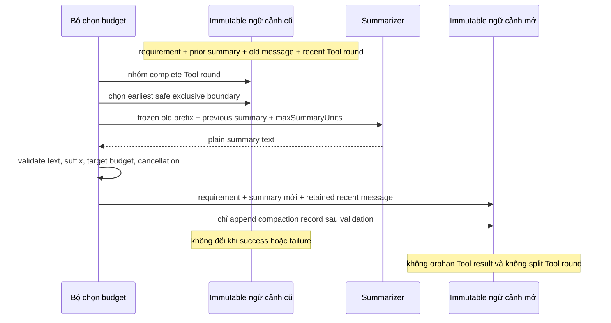

## Kết quả

Bạn sẽ biến một valid transcript thành immutable `ActiveContext` với requirement riêng, optional prior summary, recent message và append-only compaction record list. Khi deterministic unit budget của ngữ cảnh vượt `maxUnits`, `compactContext()` chọn một complete old prefix, yêu cầu summarizer được inject trả plain text, validate prospective context rồi trả state mới.

Không compaction boundary nào được cắt assistant Tool call khỏi matching Tool result. Summary lỗi, thiếu safe boundary, cancellation, malformed transcript hoặc over-budget result đều giữ input object không đổi từng byte và không append compaction record.

:::note[Course implementation]

`ActiveContext`, deterministic unit formula, `groupToolRounds()`, `selectCompactionBoundary()`, `compactContext()`, limit và error code là contract của Course implementation. Unit này không phải provider token, còn summary shape không phải compaction format của Pi.

:::

## Điều kiện tiên quyết

Hoàn thành [checkpoint 10](10-session-tree.md). Bạn cần hiểu validated Message IR, parent-linked history, root-to-leaf projection, complete Tool call/result linkage, immutable snapshot, cancellation và state transition chỉ commit sau validation.

Đọc mechanism cùng test song song:

| Vai trò | Path chính xác | Nội dung cần kiểm tra |
| --- | --- | --- |
| Cumulative source | `course/src/context.ts` | Snapshot ngữ cảnh, Tool-round grouping, exact unit estimator, boundary selection, summary observation, validation, cancellation và immutable commit |
| Focused evidence | `course/test/11-context-compaction.test.ts` | Overlapping round, exact budget, retention, summary attack, linkage failure, cancellation race, thenable, depth bound và repeated compaction |

Course summarizer được inject. Focused test trả scripted text và không gọi network. Runtime ở checkpoint sau có thể cung cấp model-backed implementation, nhưng checkpoint này kiểm tra boundary một cách độc lập.

## Cơ chế

`buildActiveContext()` snapshot bốn channel tách biệt: tối đa `128` requirement, một nullable summary, tối đa `4,096` message và tối đa `256` compaction record. Nó chỉ đọc plain own data, từ chối sparse/hostile/deep structure, validate transcript, copy nested JSON rồi freeze mọi exposed layer. Validation work bị giới hạn ở depth `32`, `16,384` collection item, `65,536` Unicode code point cho mỗi bounded string và `1,000,000` aggregate deterministic unit.

`groupToolRounds()` trước tiên index mỗi Tool result bằng `toolCallId`. Với mỗi assistant message có Tool call, nó tạo interval từ assistant đến matching result cuối cùng. Overlapping interval được merge để nested/interleaved call không thể lộ cut giữa related work. Ordinary adjacent message vẫn là group riêng. Missing, duplicate, mismatched hoặc orphaned result làm transcript validation fail thay vì tạo best-effort group.

Budgeting đếm Unicode code point và fixed structural weight. Requirement, summary ID/content, message ID/role, text block, Tool name/ID/arguments, result linkage và scalar JSON value đều góp unit theo cách deterministic; object key được sort. Phép tính cho cùng kết quả trên mọi supported platform, nhưng đây là educational estimator chứ không phải model tokenizer.

`selectCompactionBoundary()` reserve toàn bộ `summaryMaxUnits`, giữ ít nhất `retainRecentMessages` rồi scan complete group từ cũ đến mới. Nó trừ cả group trong một bước và trả exclusive transcript index đầu tiên mà fixed requirement, reserved summary cùng retained message vừa `targetUnits`. Nếu một group vượt latest allowed boundary hoặc không whole-group cut nào đủ, function trả `null`.

`compactContext()` trả chính ngữ cảnh đó với status `unchanged` khi current unit nhỏ hơn hoặc bằng `maxUnits`; summarizer không được gọi trên path này. Nếu cần nén, function kiểm tra cancellation và unique `recordId`, chọn positive safe boundary rồi truyền cho summarizer một frozen request gồm requirement, previous summary, exact compacted prefix, boundary cùng summary limit.

Returned value phải resolve thành string, chứa non-whitespace text, không vượt ordinary string ceiling và vừa `summaryMaxUnits` sau khi tính ID cùng structural cost. Object không thể inject assistant hoặc Tool block. Retained suffix phải tự validate như transcript, còn requirement + summary mới + retained message phải vừa `targetUnits`. Chỉ sau đó function mới append frozen record chứa compacted message ID cùng before/after unit, rebuild và revalidate final context, kiểm tra cancellation lần cuối rồi expose state mới.

Cancellation được kiểm tra trước summarization, trong lúc await, sau khi resolve và trước final exposure. Boundary observe ordinary Promise cùng thenable adoption chain tối đa `64` level mà không cho foreign object giả `ContextCompactionError` code. Late rejection được observe để tránh process-level noise. Thrown/rejected/malformed async value hoặc chain sâu hơn thành `CONTEXT_SUMMARIZER_FAILED`; accepted abort thành `CONTEXT_CANCELLED`. Không path nào mutate old summary, message hoặc record.

## Dấu vết hoặc mô hình



| Trước compaction | Boundary rule | Sau compaction |
| --- | --- | --- |
| Requirement | Không bao giờ compact | Giữ nguyên frozen requirement |
| Prior summary | Truyền vào summarizer | Thay bằng validated summary |
| Old complete prefix | Chỉ whole message/Tool group | Ghi ID vào một compaction record |
| Recent suffix | Ít nhất bằng configured count | Giữ nguyên và transcript-valid |
| Existing record | Không rewrite | Append một immutable record mới |

## Xây dựng

Cumulative module là `course/src/context.ts`. Fragment nguyên văn từ focused success test dưới đây thể hiện commit point cùng retained suffix:

```ts
const result = await compactContext(
  context,
  compactionOptions(context, summarizer, summaryMaxUnits),
);

expect(result.status).toBe("compacted");
if (result.status !== "compacted") throw new Error("compaction expected");
expect(result.context.requirements).toEqual(context.requirements);
expect(result.context.summary).toEqual(summary);
expect(result.context.messages.map((message) => message.id)).toEqual([
  "recent-user",
]);
expect(result.context.compactions).toHaveLength(1);
expect(result.record).toMatchObject({
  id: "compaction-001",
  summaryId: "summary-001",
  boundary: 4,
  compactedMessageIds: ["old-user", "tool-round", "result-a", "result-b"],
  unitsBefore: estimateContextUnits(context),
  unitsAfter: estimateContextUnits(result.context),
});
```

Exclusive boundary là `4`, nằm sau assistant Tool-call message cùng cả hai result. Chỉ `recent-user` còn trong live transcript; requirement và validated summary vẫn là các channel ngữ cảnh riêng.

## Chạy focused test

Focused test là `course/test/11-context-compaction.test.ts`. Chạy chính xác:

```bash
npm run test:course:checkpoint -- course/test/11-context-compaction.test.ts
```

File này chứng minh grouping cùng overlapping Tool interval, exact Unicode budgeting, earliest safe boundary selection, recent retention, unchanged fast path, summary validation, no mutation on failure, hostile/deep/aggregate-limit rejection, cancellation timing, Promise/thenable observation, bounded async adoption, unavailable boundary và propagation của prior summary vào immutable record kế tiếp.

## Thử nghiệm lỗi

Dùng transcript có index `0 = old user`, `1 = assistant với hai Tool call`, `2..3 = matching result` và `4 = recent user`. Đặt budget mà một naïve slicer có thể đạt ở index `2`. Safe selector chỉ được tiến theo whole group và phải trả `4`, không bao giờ trả `2` hoặc `3`:

```ts
const context = buildActiveContext({
  requirements: [{ id: "system", content: "Never invent file contents." }],
  messages: toolTranscript(),
});
const summaryMaxUnits = estimateContextUnits(
  buildActiveContext({ summary: { id: "summary-001", content: "summary" } }),
);
const targetUnits =
  estimateContextUnits(
    buildActiveContext({
      requirements: context.requirements,
      messages: [context.messages[4]],
    }),
  ) + summaryMaxUnits;

expect(
  selectCompactionBoundary(context, {
    targetUnits,
    summaryMaxUnits,
    retainRecentMessages: 1,
  }),
).toBe(4);
```

Đây là exact boundary assertion từ `course/test/11-context-compaction.test.ts`. Buộc `retainRecentMessages` bằng toàn transcript thì selector trả `null`; `compactContext()` sau đó reject `CONTEXT_BOUNDARY_UNAVAILABLE` mà không gọi summarizer. Nếu nhận index `2` hoặc `3`, boundary đã tách Tool call khỏi một hoặc cả hai result và checkpoint thất bại.

## Tiêu chí chấp nhận

- Focused command chỉ chọn `course/test/11-context-compaction.test.ts` và pass offline.
- Active-context snapshot bất biến ở mọi tầng và tuân thủ toàn bộ message, requirement, record, depth, collection, string cùng aggregate ceiling.
- Mỗi Tool call với tất cả matching result tạo một group; overlapping interval được merge và invalid linkage fail closed.
- Unit estimate là phép tính Unicode-code-point deterministic với documented structural cost.
- Boundary selection reserve summary capacity, giữ recent message và chỉ bỏ whole group.
- Ngữ cảnh dưới threshold được trả unchanged mà không gọi summarizer.
- Summary output phải là plain non-empty text, vừa cả summary budget lẫn target budget và để lại valid transcript suffix.
- Cancellation trước, trong hoặc sau summary selection trả stable error và không append record.
- Mọi failure giữ prior ngữ cảnh nguyên vẹn; success append đúng một frozen record sau khi prospective validation hoàn tất.

## So sánh với Pi SDK 0.84.3

:::info[Pi SDK 0.84.3]

`@earendil-works/pi-coding-agent` export `compact()`, `prepareCompaction()`, `shouldCompact()`, `findCutPoint()`, `findTurnStartIndex()`, `estimateTokens()`, `calculateContextTokens()`, `DEFAULT_COMPACTION_SETTINGS` cùng related result/settings type.

:::

Pinned compaction implementation của Pi estimate mức sử dụng ngữ cảnh model, tìm turn-aware cut point, preserve recent token, đưa previous compaction vào quá trình xử lý, generate hoặc update LLM summary và có thể kèm file-operation detail. `SessionManager` của Pi lưu compaction entry rồi rebuild ngữ cảnh của active branch quanh chúng.

Course dùng provider-independent deterministic unit, injected offline summarizer, requirement/summary channel tách biệt và Tool-call/result grouping trên Message IR nhỏ hơn. `summaryMaxUnits`, ID, record, thenable defense và boundary đều riêng cho workshop. Hãy dùng public compaction/session API của Pi trong ứng dụng Pi; không chuyển course unit thành tuyên bố về model token.

## Checkpoint tiếp theo

[Checkpoint 12](12-resources-extensions.md) discover trusted resource mà chưa activate, sau đó đăng ký Extension contribution như một transaction có rollback và reverse-order disposal.
