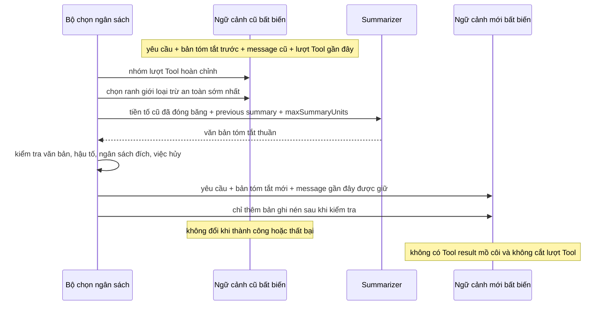

## Kết quả

Bạn sẽ biến một transcript hợp lệ thành `ActiveContext` bất biến, gồm các yêu cầu tách biệt, một bản tóm tắt trước đó nếu có, các message gần đây và danh sách bản ghi nén chỉ thêm mới. Khi ngân sách đơn vị có tính xác định của ngữ cảnh vượt `maxUnits`, `compactContext()` chọn một tiền tố cũ nhưng hoàn chỉnh, yêu cầu summarizer được truyền vào trả văn bản thuần, kiểm tra ngữ cảnh dự kiến rồi trả trạng thái mới.

Không ranh giới nén nào được tách Tool call của assistant khỏi Tool result tương ứng. Nếu bản tóm tắt lỗi, không có ranh giới an toàn, có yêu cầu hủy, transcript sai hoặc kết quả vượt ngân sách, hàm không sửa dữ liệu đầu vào hay ngữ cảnh trước đó và không thêm bản ghi nén.

:::note[Course implementation]

`ActiveContext`, công thức đơn vị có tính xác định, `groupToolRounds()`, `selectCompactionBoundary()`, `compactContext()`, các giới hạn và mã lỗi tạo thành contract của phần triển khai trong khóa học. Đơn vị này không phải token của provider, còn cấu trúc bản tóm tắt không phải định dạng nén của Pi.

:::

## Điều kiện tiên quyết

Hoàn thành [checkpoint 10](10-session-tree.md). Bạn cần hiểu Message IR đã được kiểm tra, lịch sử nối bằng parent, phép chiếu từ root tới leaf, liên kết Tool call/result hoàn chỉnh, bản chụp bất biến, việc hủy và chuyển trạng thái chỉ commit sau khi kiểm tra xong.

Đọc phần cơ chế song song với bài kiểm thử:

| Vai trò | Đường dẫn chính xác | Nội dung cần kiểm tra |
| --- | --- | --- |
| Mã nguồn tích lũy | `course/src/context.ts` | Bản chụp ngữ cảnh, nhóm lượt Tool, bộ ước lượng đơn vị chính xác, chọn ranh giới, quan sát bản tóm tắt, kiểm tra dữ liệu, xử lý việc hủy và commit bất biến |
| Bằng chứng tập trung | `course/test/11-context-compaction.test.ts` | Các lượt Tool chồng lấn, ngân sách chính xác, giữ message, tấn công qua bản tóm tắt, lỗi liên kết, race khi hủy, thenable, giới hạn độ sâu và nhiều lần nén |

Khóa học nhận summarizer từ bên ngoài. Bài kiểm thử tập trung trả văn bản theo kịch bản và không gọi mạng. Runtime ở checkpoint sau có thể cung cấp phần triển khai dùng model, nhưng checkpoint này kiểm tra ranh giới một cách độc lập.

## Cơ chế

`buildActiveContext()` chụp bốn kênh riêng: tối đa `128` yêu cầu, một bản tóm tắt có thể bằng `null`, tối đa `4,096` message và tối đa `256` bản ghi nén. Hàm chỉ đọc các thuộc tính trực tiếp của dữ liệu thuần, từ chối mảng thưa cùng cấu trúc đối nghịch hoặc quá sâu, kiểm tra transcript, sao chép JSON lồng nhau rồi đóng băng mọi tầng được công bố. Quá trình kiểm tra bị giới hạn ở độ sâu `32`, `16,384` phần tử trong tập hợp, `65,536` code point Unicode cho mỗi chuỗi có giới hạn và tổng `1,000,000` đơn vị có tính xác định.

`groupToolRounds()` trước tiên lập chỉ mục cho từng Tool result bằng `toolCallId`. Với mỗi message của assistant có Tool call, hàm tạo một khoảng từ assistant tới result tương ứng cuối cùng. Các khoảng chồng lấn được gộp, nên những call lồng hoặc xen kẽ không thể tạo điểm cắt giữa các phần liên quan. Message thông thường liền kề vẫn là nhóm riêng. Result bị thiếu, trùng, sai liên kết hoặc mồ côi làm bước kiểm tra transcript thất bại thay vì tạo một nhóm gần đúng.

Phép tính ngân sách đếm code point Unicode cùng các trọng số cấu trúc cố định. ID và nội dung của yêu cầu/bản tóm tắt, ID/role của message, block văn bản, tên/ID/arguments của Tool, liên kết result và giá trị JSON vô hướng đều góp đơn vị theo quy tắc có tính xác định; các key của object được sắp xếp. Cùng một dữ liệu đầu vào cho cùng kết quả trên mọi nền tảng được hỗ trợ, nhưng đây là bộ ước lượng phục vụ học tập chứ không phải tokenizer của model.

Bộ ước lượng áp dụng các công thức chính xác sau, trong đó `u(value)` là số code point Unicode:

| Giá trị | Công thức đơn vị chính xác |
| --- | --- |
| Requirement | `3 + u(id) + u(content)` |
| Summary | `5 + u(id) + u(content)` |
| User message | `4 + u(id) + u(content)` |
| Phần cơ sở của assistant message | `4 + u(id)` |
| Text block của assistant | `2 + u(text)` |
| Tool-call block của assistant | `6 + u(id) + u(name) + json(arguments)` |
| Tool-result message | `6 + u(id) + u(toolCallId) + u(toolName) + u(content) + 1` cho `isError` |
| JSON `null`, string, number, boolean | `1`; `1 + u(value)`; `1 + String(value).length`; `5` cho `true` hoặc `6` cho `false` |
| JSON array | `2 + sum(1 + json(item))` |
| JSON object | `2 + sum(1 + u(sortedKey) + json(value))` |

Trong ca ASCII của focused test, requirement `{ id: "r", content: "AB" }` tốn `3 + 1 + 2 = 6`; user message `{ id: "u", content: "a" }` tốn `4 + 1 + 1 = 6`; tổng chi phí ngữ cảnh là `12`. Thay `"a"` bằng `"😀"` vẫn cho tổng `12` vì emoji đó là một code point Unicode.

`selectCompactionBoundary()` dành đủ toàn bộ `summaryMaxUnits`, giữ ít nhất `retainRecentMessages` rồi duyệt các nhóm hoàn chỉnh từ cũ tới mới. Hàm trừ cả nhóm trong một bước và trả chỉ mục transcript loại trừ đầu tiên mà phần yêu cầu cố định, phần dành cho bản tóm tắt cùng các message được giữ vừa `targetUnits`. Nếu một nhóm vượt ranh giới muộn nhất được phép, hoặc không có điểm cắt theo nhóm nguyên vẹn nào đáp ứng ngân sách, hàm trả `null`.

`compactContext()` trả chính ngữ cảnh đó với trạng thái `unchanged` khi số đơn vị hiện tại nhỏ hơn hoặc bằng `maxUnits`; summarizer không được gọi trên nhánh này. Nếu cần nén, hàm kiểm tra yêu cầu hủy và tính duy nhất của `recordId`, chọn một ranh giới an toàn lớn hơn `0` rồi truyền cho summarizer một request đã đóng băng, gồm yêu cầu, `previousSummary`, tiền tố cần nén chính xác, ranh giới và giới hạn bản tóm tắt.

Giá trị trả về phải phân giải thành chuỗi, có ký tự khác khoảng trắng, không vượt giới hạn chuỗi thông thường và vừa `summaryMaxUnits` sau khi tính cả ID cùng chi phí cấu trúc. Object không thể chèn block của assistant hoặc Tool. Hậu tố được giữ phải tự tạo thành transcript hợp lệ; tổng yêu cầu, bản tóm tắt mới và các message được giữ phải vừa `targetUnits`. Chỉ sau các bước đó, hàm mới thêm một bản ghi đã đóng băng chứa ID của các message đã nén cùng số đơn vị trước/sau, dựng và kiểm tra lại ngữ cảnh cuối, kiểm tra việc hủy lần cuối rồi công bố trạng thái mới.

Yêu cầu hủy được kiểm tra trước lúc tóm tắt, trong khi `await`, sau khi phân giải và trước khi công bố kết quả. Phần mã ở ranh giới này theo dõi Promise thông thường cùng chuỗi tiếp nhận thenable tối đa `64` tầng, đồng thời không cho object bên ngoài giả mã `ContextCompactionError`. Lần từ chối muộn cũng được theo dõi để tránh nhiễu ở cấp tiến trình. Giá trị async thông thường bị ném, bị từ chối, sai cấu trúc hoặc có chuỗi sâu hơn sẽ trở thành `CONTEXT_SUMMARIZER_FAILED`. Native Promise được bọc trong Proxy, hoặc native Promise có constructor/species bị khóa khiến intrinsic không thể bảo đảm theo dõi, sẽ trở thành `CONTEXT_ASYNC_VALUE_UNOBSERVABLE` theo creator-observation contract. Yêu cầu hủy được chấp nhận trở thành `CONTEXT_CANCELLED`. Không đường lỗi nào sửa bản tóm tắt, message hay bản ghi cũ.

## Dấu vết hoặc mô hình



| Trước khi nén | Quy tắc ranh giới | Sau khi nén |
| --- | --- | --- |
| Yêu cầu | Không bao giờ bị nén | Giữ nguyên yêu cầu đã đóng băng |
| Bản tóm tắt trước | Truyền vào summarizer | Thay bằng bản tóm tắt đã kiểm tra |
| Tiền tố cũ hoàn chỉnh | Chỉ nhóm message/Tool nguyên vẹn | Ghi ID vào một bản ghi nén |
| Hậu tố gần đây | Ít nhất bằng số lượng đã cấu hình | Giữ nguyên và tạo transcript hợp lệ |
| Bản ghi hiện có | Không viết lại | Thêm một bản ghi bất biến mới |

## Xây dựng

Module tích lũy là `course/src/context.ts`. Đoạn nguyên văn từ bài kiểm thử tập trung thành công dưới đây thể hiện điểm commit cùng hậu tố được giữ:

```ts
const result = await compactContext(
  context,
  compactionOptions(context, summarizer, summaryMaxUnits),
);

expect(result.status).toBe("compacted");
if (result.status !== "compacted") throw new Error("compaction expected");
expect(result.context.requirements).toEqual(context.requirements);
expect(result.context.summary).toEqual(summary);
expect(result.context.messages.map((message) => message.id)).toEqual([
  "recent-user",
]);
expect(result.context.compactions).toHaveLength(1);
expect(result.record).toMatchObject({
  id: "compaction-001",
  summaryId: "summary-001",
  boundary: 4,
  compactedMessageIds: ["old-user", "tool-round", "result-a", "result-b"],
  unitsBefore: estimateContextUnits(context),
  unitsAfter: estimateContextUnits(result.context),
});
```

Ranh giới loại trừ là `4`, nằm sau message Tool call của assistant cùng cả hai result. Chỉ `recent-user` còn trong transcript đang dùng; các yêu cầu và bản tóm tắt đã kiểm tra vẫn nằm ở kênh ngữ cảnh riêng.

## Chạy focused test

Bài kiểm thử tập trung là `course/test/11-context-compaction.test.ts`. Chạy chính xác:

```bash
npm run test:course:checkpoint -- course/test/11-context-compaction.test.ts
```

Tệp này chứng minh cách nhóm các khoảng Tool chồng lấn, phép tính ngân sách Unicode chính xác, cách chọn ranh giới an toàn sớm nhất, giữ message gần đây, nhánh không cần nén, kiểm tra bản tóm tắt, không sửa trạng thái khi lỗi, từ chối dữ liệu đầu vào đối nghịch/quá sâu hoặc vượt giới hạn tổng, thời điểm hủy, quan sát Promise/thenable, tiếp nhận giá trị bất đồng bộ có giới hạn, trường hợp không có ranh giới và việc đưa bản tóm tắt trước vào bản ghi bất biến kế tiếp.

## Thử nghiệm lỗi

Dùng transcript có chỉ mục `0 = user message cũ`, `1 = assistant với hai Tool call`, `2..3 = result tương ứng` và `4 = user message gần đây`. Đặt ngân sách mà một bộ cắt ngây thơ có thể đạt ở chỉ mục `2`. Bộ chọn an toàn chỉ được tiến theo nhóm nguyên vẹn và phải trả `4`, không bao giờ trả `2` hoặc `3`:

```ts
const context = buildActiveContext({
  requirements: [{ id: "system", content: "Never invent file contents." }],
  messages: toolTranscript(),
});
const summaryMaxUnits = estimateContextUnits(
  buildActiveContext({ summary: { id: "summary-001", content: "summary" } }),
);
const targetUnits =
  estimateContextUnits(
    buildActiveContext({
      requirements: context.requirements,
      messages: [context.messages[4]],
    }),
  ) + summaryMaxUnits;

expect(
  selectCompactionBoundary(context, {
    targetUnits,
    summaryMaxUnits,
    retainRecentMessages: 1,
  }),
).toBe(4);
```

Đây là phép khẳng định ranh giới chính xác từ `course/test/11-context-compaction.test.ts`. Nếu đặt `retainRecentMessages` bằng toàn bộ transcript, bộ chọn trả `null`; `compactContext()` sau đó từ chối với `CONTEXT_BOUNDARY_UNAVAILABLE` mà không gọi summarizer. Nếu nhận chỉ mục `2` hoặc `3`, ranh giới đã tách Tool call khỏi một hoặc cả hai result và checkpoint thất bại.

## Tiêu chí chấp nhận

- Lệnh tập trung chỉ chọn `course/test/11-context-compaction.test.ts` và chạy đạt khi ngoại tuyến.
- Bản chụp ngữ cảnh đang dùng bất biến ở mọi tầng và tuân thủ toàn bộ trần về message, yêu cầu, bản ghi, độ sâu, collection, chuỗi và tổng đơn vị.
- Mỗi Tool call cùng tất cả result tương ứng tạo một nhóm; các khoảng chồng lấn được gộp và liên kết không hợp lệ khiến thao tác từ chối toàn bộ dữ liệu.
- Phép ước lượng đơn vị đếm code point Unicode theo cách có tính xác định với chi phí cấu trúc đã ghi trong tài liệu.
- Việc chọn ranh giới dành đủ sức chứa cho bản tóm tắt, giữ message gần đây và chỉ bỏ nhóm nguyên vẹn.
- Ngữ cảnh dưới ngưỡng được trả `unchanged` mà không gọi summarizer.
- Đầu ra của summarizer phải là văn bản thuần không rỗng, vừa cả ngân sách tóm tắt lẫn ngân sách đích và để lại hậu tố transcript hợp lệ.
- Native Promise không thể theo dõi trả `CONTEXT_ASYNC_VALUE_UNOBSERVABLE`; các lỗi summarizer khác vẫn là `CONTEXT_SUMMARIZER_FAILED`.
- Yêu cầu hủy trước, trong hoặc sau lúc chọn bản tóm tắt trả lỗi ổn định và không thêm bản ghi.
- Mọi lỗi giữ ngữ cảnh trước đó nguyên vẹn; khi thành công, hàm chỉ thêm đúng một bản ghi đã đóng băng sau khi kiểm tra toàn bộ trạng thái dự kiến.

## So sánh với Pi SDK 0.99.2

:::info[Pi SDK 0.99.2]

`@earendil-works/pi-coding-agent` xuất công khai `compact()`, `shouldCompact()`, `findCutPoint()`, `findTurnStartIndex()`, `estimateTokens()`, `calculateContextTokens()`, `DEFAULT_COMPACTION_SETTINGS` cùng các kiểu kết quả/cấu hình liên quan.

:::

Phần triển khai compaction ở release đã ghim của Pi ước lượng model context usage, tìm cut point có xét ranh giới Turn, giữ token gần đây, đưa lần compaction trước vào quá trình xử lý, tạo hoặc cập nhật summary bằng LLM và có thể kèm chi tiết thao tác file. `SessionManager` lưu compaction entry rồi dựng lại active-branch projection quanh các entry đó. `appendCompaction(summary, null, tokensBefore)` tạo retain-none boundary, trong đó compaction entry tự giữ chính nó và không giữ entry nào đứng trước.

Context accounting theo projected branch, bao gồm replacement hoặc omission từ `context_edit`, thay vì xem mọi raw entry đều hiển thị cho provider. Retry/recovery attempt bị bỏ có thể vẫn nằm trong append-only history nhưng bị loại khỏi provider context sau này. Summary record nhỏ hơn của course không có projection/edit contract tương đương.

Khóa học dùng đơn vị có tính xác định, độc lập với provider; summarizer ngoại tuyến được truyền vào; kênh yêu cầu/bản tóm tắt tách biệt; mô hình nhóm Tool call/result trên Message IR cũng được giản lược hơn. `summaryMaxUnits`, ID, bản ghi, biện pháp phòng vệ trước thenable và ranh giới đều riêng cho workshop. Hãy dùng API nén/phiên làm việc công khai của Pi trong ứng dụng Pi; không diễn giải đơn vị của khóa học thành token của model.

Course implementation là bản triển khai giảng dạy nguyên bản do Pify tự xây dựng, có phạm vi nhỏ hơn và không cam kết tương thích API với Pi.

## Checkpoint tiếp theo

[Checkpoint 12](12-resources-extensions.md) tìm tài nguyên tin cậy nhưng chưa kích hoạt, sau đó đăng ký phần đóng góp của Extension như một transaction có rollback và dọn dẹp theo thứ tự ngược.
