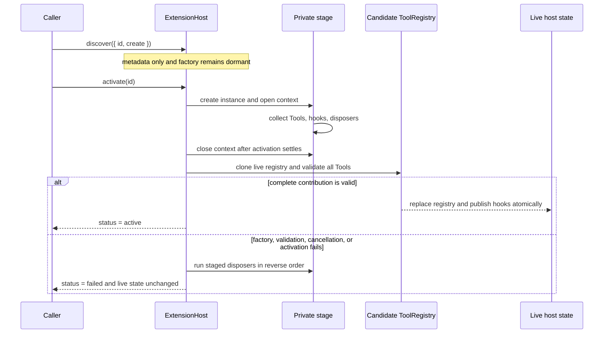

## Kết quả

Bạn sẽ nạp text Resource UTF-8 từ một tập trusted root có thứ tự, sau đó thêm host cho [Extension](../glossary.md#extension) với ranh giới rõ ràng giữa discovery và activation. Discovery chỉ ghi ID cùng factory bất biến, không chạy code của người dùng. Activation chỉ chạy khi được yêu cầu, đưa mọi Tool, event hook và disposer vào vùng staging, kiểm tra toàn bộ contribution rồi công bố chúng bằng một lần commit.

Nếu factory, activation callback, Tool definition, bước kiểm tra hủy hoặc rollback gặp lỗi, không Tool hay hook nào trong vùng staging trở thành trạng thái live. Host thử mọi disposer đã lấy trước lỗi theo thứ tự đăng ký ngược, rồi aggregate lỗi cleanup sau khi hoàn tất mọi lần thử. Khi shutdown, host áp dụng cùng quy tắc thử toàn bộ trong khi đảo ngược activation order của Extension, nên ownership vẫn được tháo từ dependency mới nhất về dependency cũ nhất dù một cleanup thất bại.

:::note[Course implementation]

`ResourceLoader`, `ExtensionHost`, `ExtensionDefinition`, `ExtensionContext`, giới hạn text `1,048,576` byte, status và error code là contract của Course implementation. Đây là API phục vụ học tập, không tương thích API với resource hoặc Extension runtime của Pi.

:::

## Điều kiện tiên quyết

Hoàn thành [checkpoint 11](11-context-compaction.md). Bạn cần hiểu canonical workspace path, immutable snapshot, `ToolRegistry`, kiểm tra trước effect, `AbortSignal`, chuyển trạng thái tuần tự và cleanup theo thứ tự ngược.

Hãy đọc boundary cùng bằng chứng của nó:

| Vai trò | Đường dẫn chính xác | Nội dung cần kiểm tra |
| --- | --- | --- |
| Mã nguồn tích lũy | `course/src/resources.ts` | Ghi nhận trusted root, đọc text có giới hạn, discovery, activation có staging, thứ tự hook, rollback, cancellation và disposal |
| Bằng chứng tập trung | `course/test/12-resources-extensions.test.ts` | Ưu tiên root, tấn công path, giới hạn byte và UTF-8, factory chưa chạy, commit Tool nguyên tử, cô lập lỗi hook, activation một phần và cleanup ngược |

Focused test chỉ dùng directory tạm được tạo bằng `mkdtemp()`. Test không đọc cấu hình người dùng, không liên hệ provider và không kích hoạt Extension bên ngoài fixture.

## Cơ chế

`ResourceLoader.create()` yêu cầu ít nhất một root có ID ổn định và duy nhất. Hàm resolve từng directory được cấu hình, ghi canonical directory cùng filesystem identity rồi giữ nguyên thứ tự input. `loadText()` duyệt các root theo thứ tự khai báo; root xuất hiện sớm hơn có độ ưu tiên cao hơn, vì vậy Resource của workspace có thể chủ đích che một bundled fallback. Path không tồn tại sẽ chuyển sang root tiếp theo và cuối cùng trả `undefined`.

Mỗi lần đọc đều kiểm tra confinement theo cả lexical path lẫn canonical path. Absolute path, traversal ra ngoài root, escape qua symlink hoặc junction, Windows device name, dạng alternate data stream và root bị thay sau lần ghi identity đầu tiên đều bị từ chối theo fail-closed. Loader mở regular file ở chế độ chỉ đọc, kiểm tra identity quanh lần đọc, nhận tối đa `MAX_RESOURCE_TEXT_BYTES` (`1,048,576` byte đã encode) và decode UTF-8 ở chế độ fatal. Boundary này thu hẹp phạm vi file; nó không biến code Extension tùy ý thành process sandbox.

`ExtensionHost.discover()` chụp một definition array đặc, kiểm tra toàn bộ ID cùng factory trước khi thêm bất kỳ definition nào. Hàm không gọi `create()`. ID trùng trong batch mới làm cả lời gọi discovery bị từ chối, còn metadata trước đó giữ nguyên. Mỗi Extension được khám phá bắt đầu ở `discovered`; lời gọi tường minh `activate(id)` đưa nó qua `activating` tới `active` hoặc `failed`.

Activation và event work dùng chung một hàng đợi tuần tự: operation mới chỉ bắt đầu sau khi phần việc đã xếp trước trên hàng đợi hoàn tất. Host tạo một vùng staging riêng rồi cấp cho `activate()` một `ExtensionContext` đã đóng băng với năm field: `resources` đáng tin cậy, `signal` của activation, `registerTool()`, `onAgentEvent()` và `onDispose()`. Các hàm đăng ký chỉ mở trong thời gian kết quả activation đã chọn đang settle. Đăng ký muộn và thao tác reentrant trên host bị từ chối thay vì sửa live state.

Tool, hook và disposer ở lại vùng staging trong khi factory cùng `activate()` settle. Host clone live `ToolRegistry`, đăng ký toàn bộ tập Tool đang staging vào candidate đó rồi chụp các registration mới. Chỉ sau khi mọi Tool hợp lệ, host mới thay live registry, công bố hook, thêm activation order và đánh dấu Extension là `active`. Nếu một Tool phía sau trong batch trùng tên, toàn bộ candidate bị từ chối; những Tool đã được đưa vào staging trước điểm lỗi cũng không xuất hiện trong live registry.

`emit()` chụp một `AgentEvent`, sau đó gọi hook theo activation order của Extension rồi registration order của hook. Lỗi từ một hook trở thành diagnostic bất biến; các hook sau vẫn chạy. `dispose()` hủy activation đang chờ, được xếp sau các operation đang chờ trên cùng hàng đợi tuần tự rồi cleanup Extension đang active theo activation order ngược. Trong một Extension, callback `onDispose()` chạy theo registration order ngược, sau đó mới tới `dispose` của instance. Mọi cleanup đều được thử; nhiều lỗi được giữ lại trong một aggregate đã đóng băng.

## Dấu vết hoặc mô hình



| Giai đoạn | Có thể chạy code Extension? | Public state khi thành công | Public state khi thất bại |
| --- | --- | --- | --- |
| Discovery | Không | Metadata `discovered` bất biến | Cả batch không hợp lệ bị từ chối |
| Factory và activation | Có, theo thứ tự | Chưa công bố gì | Ownership trong staging được rollback |
| Kiểm tra candidate | Không có callback mới | Chưa công bố gì | Live Tool và hook giữ nguyên |
| Commit | Không | Tool, hook, order và status `active` xuất hiện cùng lúc | Không xuất hiện contribution một phần |
| Disposal | Có, theo thứ tự | Thử cleanup toàn bộ Resource sở hữu theo thứ tự ngược | Aggregate lỗi sau khi đã thử cleanup |

## Xây dựng

Module tích lũy là `course/src/resources.ts`. Đoạn nguyên văn sau từ `course/test/12-resources-extensions.test.ts` cho thấy discovery giữ factory ở trạng thái chưa chạy và activation công bố Tool mới trước khi hook được gọi:

```ts
host.discover([definition]);
expect(host.tools.names).toEqual(["base"]);
await host.activate("logger");
expect(host.tools.names).toEqual(["base", "extension"]);
expect(host.extensions).toEqual([{ id: "logger", status: "active" }]);

const failures = await host.emit(finishedEvent(7));

expect(observations).toEqual(["first:7", "second", "third"]);
expect(failures).toMatchObject([
  { extensionId: "logger", hookIndex: 1, message: "isolated hook failure" },
]);
```

Hook thứ hai gặp lỗi nhưng hook thứ ba vẫn quan sát cùng event bất biến. `host.tools` trả một registry snapshot tách rời, nên caller không thể sửa membership của host giữa activation và emission.

Với Resource loading, hãy giữ việc chọn root và lấy nội dung trong cùng một operation:

```ts
const loader = await ResourceLoader.create([
  { id: "project", directory: project },
  { id: "bundled", directory: bundled },
]);

await expect(loader.loadText("instructions.md")).resolves.toMatchObject({
  rootId: "project",
  path: "instructions.md",
  content: "project",
});
```

Đoạn này cũng được trích nguyên văn từ focused test. `rootId` được trả về ghi lại chính xác root nào trong chuỗi ưu tiên đã cung cấp text.

## Chạy focused test

Focused test là `course/test/12-resources-extensions.test.ts`. Chạy chính xác:

```bash
npm run test:course:checkpoint -- course/test/12-resources-extensions.test.ts
```

File này chứng minh việc ghi root identity, thứ tự ưu tiên, confinement, path grammar dùng được trên nhiều nền tảng, yêu cầu regular file và UTF-8, boundary chính xác `1 MiB`, metadata-only discovery, lazy factory, activation tuần tự, contribution nguyên tử, thứ tự và cô lập hook, cancellation, từ chối reentrancy, phục hồi sau rollback, aggregate lỗi cleanup và reverse disposal.

## Thử nghiệm lỗi

Hãy kích hoạt một Extension cấp phát đúng một disposable resource rồi throw. Thêm `test()` hoàn chỉnh này cạnh rollback test hiện có. Test tự tạo và dispose host; helper `emptyResources()` của focused file đăng ký temporary root để `afterEach` cleanup:

```ts
test("rolls back one disposable after activation fails", async () => {
  const cleanup: string[] = [];
  const host = new ExtensionHost({
    resources: await emptyResources(),
    tools: [echoTool("base")],
  });

  try {
    host.discover([
      {
        id: "fails-after-allocation",
        create: () => ({
          activate(context) {
            context.onDispose(() => cleanup.push("allocated-resource"));
            context.registerTool(echoTool("never-live"));
            throw new Error("activation failed after allocation");
          },
        }),
      },
    ]);

    await expect(host.activate("fails-after-allocation")).rejects.toMatchObject({
      code: "EXTENSION_ACTIVATION_FAILED",
    });
    expect(cleanup).toEqual(["allocated-resource"]);
    expect(host.tools.names).toEqual(["base"]);
    expect(host.extensions).toContainEqual({
      id: "fails-after-allocation",
      status: "failed",
    });
  } finally {
    await host.dispose();
  }
});
```

Chạy lại focused command. Thử nghiệm chỉ pass khi disposer chạy đúng một lần, Tool trong staging không bao giờ lộ ra và host vẫn dùng tiếp được. Nếu disposer cũng throw, public error đổi thành `EXTENSION_ACTIVATION_ROLLBACK_FAILED` và giữ cả lỗi activation lẫn cleanup.

## Tiêu chí chấp nhận

- Focused command chỉ chọn `course/test/12-resources-extensions.test.ts` và pass offline.
- Trusted root có thứ tự được canonicalize và kiểm tra identity; traversal, symlink, device path, root replacement, non-file, file quá lớn và UTF-8 sai đều bị từ chối theo fail-closed.
- Text content bị giới hạn chính xác ở `1,048,576` byte đã encode trước khi decode UTF-8 ở chế độ fatal.
- Discovery kiểm tra rồi commit metadata như một batch, không gọi bất kỳ Extension factory nào.
- Activation là lazy và chạy tuần tự; context đóng lại khi async result đã chọn settle.
- Contribution của Tool, hook và disposer giữ riêng tư cho tới khi mọi Tool trong staging hợp lệ.
- Hook chạy theo activation order rồi registration order; lỗi được báo mà không bỏ qua hook phía sau.
- Activation thất bại thử mọi disposer đã lấy theo thứ tự ngược, aggregate lỗi rollback và không công bố contribution một phần.
- Host disposal đảo ngược activation của Extension và thứ tự đăng ký Resource trong từng Extension, thử mọi cleanup rồi aggregate lỗi.

## So sánh với Pi SDK 0.99.2

:::info[Pi SDK 0.99.2]

`@earendil-works/pi-coding-agent` công khai `DefaultResourceLoader`, type `ResourceLoader`, `loadProjectContextFiles()`, `discoverAndLoadExtensions()`, `createExtensionRuntime()`, `ExtensionRunner`, `defineTool()` và các type Extension được ghi trong package entry point.

:::

`DefaultResourceLoader` của Pi phối hợp Resource của project và agent như Extension, Skill, prompt, theme, context file, package resolution, diagnostic, project trust và reload. Pi Extension nhận `ExtensionAPI` cùng `ExtensionContext` giàu capability hơn, có thể đăng ký Tool và command, theo dõi lifecycle event và đóng góp thêm resource path qua `resources_discover`. `ExtensionRunner` kết nối handler đã nạp với một `AgentSession` đang chạy.

Boundary lifecycle hiện tại biến `TurnEndEvent` và `AgentBeforeSettleEvent` thành event có thể hành động: handler có thể trả về append-only entry draft và yêu cầu một continuation. Host dispatch các boundary này qua `emitBoundary(baseEvent, buildContext)`, hàm sẽ dựng lại projected preview sau mỗi handler. Với request transform, `context` nhận conversation message không có system message và Pi khôi phục trạng thái prompt/Tool; `context_with_system` nhận full transcript và danh sách nó trả về được dùng nguyên văn.

Codemode và MCP là hai Extension tích hợp sẵn của Pi 0.99.2, được công bố qua `createCodemodeExtension()` và `createMcpExtension()`. Chúng vẫn tuân theo các boundary về Extension và project trust của Pi; Course host không triển khai Codemode hoặc MCP.

Khóa học tách một bài toán nhỏ hơn thành hai boundary dễ quan sát: loader chỉ đọc text trong trusted root và transaction `discover()`/`activate()` tường minh. `ResourceLoader`, `ExtensionHost`, status model, fixed byte cap, hook diagnostic và rollback code của khóa học không tồn tại như public API của Pi. Khi xây trên Pi, hãy dùng loader cùng Extension contract do Pi export, bao gồm project-trust policy của Pi; chỉ dùng type của khóa học để nghiên cứu ownership và atomic publication.

Course implementation là bản triển khai giảng dạy nguyên bản do Pify tự xây dựng, có phạm vi nhỏ hơn và không cam kết tương thích API với Pi.

## Checkpoint tiếp theo

[Checkpoint 13](13-runtime-composition.md) dựng một composition root quanh Agent, Session, Resource, Extension và Tool, sau đó thay toàn bộ owner gắn với workspace mà không làm lộ runtime mới chỉ được dựng một phần.
