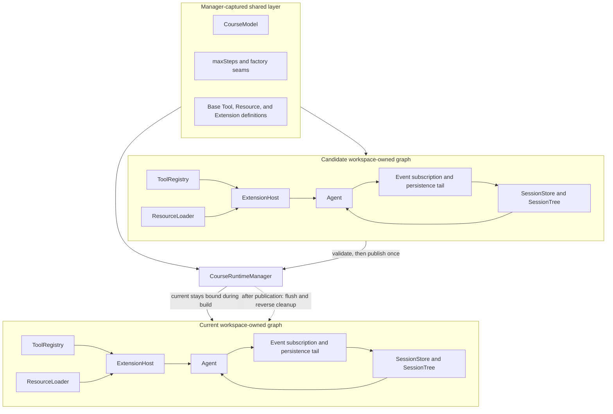

## Kết quả

Bạn sẽ thêm một [composition root](../glossary.md#composition-root) để tạo Tool registry, Resource loader, Session owner, Extension host và Agent theo dependency order cho một canonical workspace. `CourseRuntime` được trả về sở hữu subscription dùng để persist các Agent message đã được chấp nhận và chuyển tiếp event có thứ tự tới Extension. `flush()` của runtime chứng minh transcript của Agent, active Session branch, durable store và workspace identity vẫn đồng nhất.

Bạn cũng sẽ thêm `CourseRuntimeManager`, owner duy nhất của public runtime reference. Request thay thế được serialize. Một candidate được dựng và kiểm tra hoàn chỉnh trong khi runtime trước vẫn live; chỉ sau đó manager mới swap reference, bind lại persistence gắn với workspace và dispose graph cũ. Construction thất bại theo nguyên tắc [fail-closed](../glossary.md#fail-closed): candidate được rollback còn runtime cũ vẫn dùng được.

:::note[Course implementation]

`CourseRuntime`, `CourseRuntimeManager`, `createCourseRuntime()`, `createCourseRuntimeManager()`, factory override, ownership ledger, swap order và error code là API của Course implementation. Chúng mô hình hóa ownership của host và không phải type runtime của Pi.

:::

## Điều kiện tiên quyết

Hoàn thành [checkpoint 12](12-resources-extensions.md). Bạn cần hiểu stateful Agent, độ bền của Session Tree, workspace confinement, lazy Extension activation, atomic Tool publication, thứ tự event hook, cancellation và reverse disposal.

Hãy xem hai file sau như một contract:

| Vai trò | Đường dẫn chính xác | Nội dung cần kiểm tra |
| --- | --- | --- |
| Mã nguồn tích lũy | `course/src/runtime.ts` | Ghi nhận workspace, thứ tự construction, ownership ledger, event persistence, flush, replacement queue, publication, rollback và disposal |
| Bằng chứng tập trung | `course/test/13-runtime-composition.test.ts` | Dependency identity, resume Session, thứ tự event, swap lỗi, hành vi rebind, cleanup order, replacement đồng thời, cancellation và path race |

Runtime dùng `ScriptedModel` của workshop; mọi focused test đều chạy offline. Mỗi test workspace cùng Session file nằm dưới một temporary root riêng.

## Cơ chế

`createCourseRuntime()` trước tiên chụp option dưới dạng own data và pin relative path theo working directory tại thời điểm gọi. Shared layer chứa model, `maxSteps`, base Tool definition, Resource root bổ sung, Extension definition và factory override. `CourseRuntimeManager` chỉ chụp layer này một lần. Initial runtime và mỗi replacement đều dựng lại workspace layer: canonical root cùng Session path, coding Tool, `ResourceLoader`, `SessionStore` kèm `SessionTree`, `ExtensionHost`, final Tool snapshot, `Agent`, event subscription và persistence queue.

Construction tuân theo một dependency order: Tool, Resource, Session, Extension, Agent. Workspace root được canonicalize và filesystem identity của nó được kiểm tra quanh từng async factory. Relative Session path phải nằm dưới root đó; các dạng absolute, device-like, có dấu hai chấm, traversal và symlink escape bị từ chối. Create-mode parent directory cùng Session file mới đi vào ownership ledger trước khi factory phía sau có thể thất bại.

Mỗi factory override nhận frozen input cùng `fallback()` đã memoize. Ledger đăng ký fallback product và selected product ngay khi chúng xuất hiện. Owned value không được chọn được cleanup đúng một lần. Nếu bước sau throw, ledger duyệt các ownership record còn lại theo thứ tự ngược. Nó dispose Extension host, chỉ xóa create-mode Session file chưa bị thay đổi và chỉ xóa parent directory rỗng chưa bị thay đổi. Sự thay thế hoặc chỉnh sửa từ bên ngoài khiến rollback từ chối xóa và báo `RUNTIME_SESSION_ROLLBACK_FAILED`.

`OwnedCourseRuntime` subscribe Agent ngay trong construction. Snapshot của `message.accepted` và `run.finished` đi vào một event tail. Trước mỗi lần phát event tới Extension, runtime reconcile từng transcript message mới lên active Session branch theo thứ tự. Sau đó runtime mới chạy Extension hook. Lỗi persistence hoặc hook làm runtime đó chuyển sang trạng thái lỗi với `RUNTIME_EVENT_FAILED` ổn định; lời gọi `flush()` sau đó trả lại chính lỗi này thay vì giả vờ store đang cập nhật. Session bị di chuyển từ bên ngoài hoặc transcript không khớp trở thành `RUNTIME_SESSION_DIVERGED`.

`flush()` đợi sau các event đã chấp nhận, kiểm tra lại canonical workspace identity cùng tính nhất quán của transcript, flush `SessionStore` rồi kiểm tra cả hai lần nữa. Disposal là idempotent. Nó cancel Agent run đang active, đợi terminal event đi vào persistence, drain event work, gỡ subscription, kiểm tra tính nhất quán, flush Session rồi mới yêu cầu `ExtensionHost` cleanup graph theo thứ tự ngược. Mọi lỗi được thu lại trước khi runtime trở thành `disposed`.

`CourseRuntimeManager.replace()` đặt mọi replacement vào một queue. Khi candidate đang được dựng, `manager.current` vẫn trả runtime trước. Candidate lỗi được rollback mà không đổi reference đó. Candidate hợp lệ đã sở hữu Session binding cùng Agent subscription; manager công bố nó bằng một phép gán rồi mới dispose runtime trước. Nếu cleanup runtime cũ thất bại, lời gọi báo `RUNTIME_REPLACEMENT_CLEANUP_FAILED`, nhưng runtime mới vẫn là current owner đang live. Các replacement đồng thời lặp lại toàn bộ workspace build theo thứ tự request.

## Dấu vết hoặc mô hình



| Owner | Lifetime | Quy tắc replacement | Quy tắc cleanup |
| --- | --- | --- | --- |
| Shared model và definition | Manager | Chụp một lần, cấp cho mọi build | Được host đang sở hữu manager giải phóng |
| Workspace identity và Session path | Một runtime | Canonicalize lại cho từng candidate | Rollback có identity check và durable flush |
| Tool, Resource, Session, Extension, Agent | Một runtime | Dựng lại; không tái sử dụng object gắn với workspace | Ownership ledger khi construction lỗi |
| Agent subscription và persistence tail | Một runtime | Candidate bind trước publication | Drain, unsubscribe, flush rồi dispose Extension |
| Public reference `current` | Manager | Một phép gán sau khi candidate hợp lệ | Manager disposal đóng runtime đã chọn |

## Xây dựng

Module tích lũy là `course/src/runtime.ts`. Đoạn nguyên văn sau từ `course/test/13-runtime-composition.test.ts` biến composition order thành bằng chứng có thể chạy:

```ts
const runtime = await createCourseRuntime(
  runtimeOptions(cwd, new ScriptedModel([]), { factories }),
);

expect(order).toEqual([
  "tools",
  "resources",
  "session",
  "extensions",
  "agent",
]);
expect(Object.isFrozen(runtime)).toBe(true);
expect(Object.isFrozen(runtime.workspace)).toBe(true);
```

Thứ tự này đi theo dependency: Extension host cần Resource và base Tool; Agent cần active Session message cùng Tool snapshot sau khi Extension activation hoàn tất.

Swap boundary xuất hiện trong một đoạn test nguyên văn khác:

```ts
const replacement = manager.replace({
  cwd: second,
  session: { path: "course-session.jsonl", mode: "create" },
});
await candidateEntered.promise;
expect(manager.current).toBe(old);
expect(manager.current.workspace.root).toBe(resolve(first));

releaseCandidate.resolve();
const next = await replacement;
expect(manager.current).toBe(next);
```

Code cần runtime active nên đọc `manager.current` tại operation boundary. Code đó không nên giữ object gắn với workspace qua một replacement đã hoàn tất.

## Chạy focused test

Focused test là `course/test/13-runtime-composition.test.ts`. Chạy chính xác:

```bash
npm run test:course:checkpoint -- course/test/13-runtime-composition.test.ts
```

File này chứng minh construction order, immutable ownership, resume Session, persistence có thứ tự cho Tool call/result, hook sequencing, truyền poisoned event, kiểm tra Session divergence, candidate-first replacement, atomic rebind, construction rollback, fallback ownership, từ chối rollback Session đã đổi, flush-before-dispose, serialize swap, pin path tại thời điểm gọi, từ chối reentrancy, cancel active run và bảo vệ workspace identity.

## Thử nghiệm lỗi

Chỉ làm replacement Session factory throw. Đây là thử nghiệm fail-closed nguyên văn từ `course/test/13-runtime-composition.test.ts`:

```ts
const factories: CourseRuntimeFactoryOverrides = {
  createSession: async (input, fallback) => {
    if (input.workspace.root === resolve(second)) {
      throw new Error("candidate session failed");
    }
    return fallback(input);
  },
};
const model = new ScriptedModel([scriptedResponse("old-live", "Still live")]);
const manager = await createCourseRuntimeManager(
  runtimeOptions(first, model, { factories }),
);
const old = manager.current;

await expect(
  manager.replace({
    cwd: second,
    session: { path: "course-session.jsonl", mode: "create" },
  }),
).rejects.toMatchObject({
  name: "CourseRuntimeError",
  code: "RUNTIME_CONSTRUCTION_FAILED",
});
expect(manager.current).toBe(old);

await drain(old.agent.prompt("Are you there?"));
await old.flush();
expect(old.session.activeMessages).toEqual(old.agent.messages);
```

Chạy lại focused command. Replacement phải reject, value thuộc candidate phải rollback và Agent cũ vẫn persist được prompt mới. Công bố candidate trước khi Session factory settle, dispose graph cũ trước hoặc để lại Session file một phần đều làm checkpoint thất bại.

## Tiêu chí chấp nhận

- Focused command chỉ chọn `course/test/13-runtime-composition.test.ts` và pass offline.
- Composition root dựng Tool, Resource, Session, Extension và Agent theo dependency order cho một canonical workspace.
- Shared model, definition, limit và factory seam được chụp một lần; mọi owner cùng subscription gắn với workspace được dựng lại.
- Agent event persist transcript message trước Extension hook, còn `flush()` chứng minh Session, Agent, store và workspace đồng nhất.
- Runtime disposal cancel active work, đợi terminal persistence, unsubscribe, flush rồi mới reverse cleanup Extension.
- Construction lỗi rollback mọi owned product theo thứ tự ngược và từ chối xóa Session state đã bị thay từ bên ngoài.
- Replacement được serialize; runtime cũ vẫn public cho tới khi có candidate nhất quán hoàn chỉnh.
- Publication bind Session persistence cùng Extension hook sang candidate trước khi cleanup runtime cũ bắt đầu.
- Replacement lỗi giữ runtime cũ live; lỗi dispose runtime cũ giữ candidate đã công bố ở trạng thái live và báo cleanup failure.

## So sánh với Pi SDK 0.84.3

:::info[Pi SDK 0.84.3]

`@earendil-works/pi-coding-agent` công khai `createAgentSession()`, `createAgentSessionRuntime()`, `AgentSessionRuntime`, `createAgentSessionServices()`, `createAgentSessionFromServices()`, các option và result type tương ứng, cùng `SessionManager`.

:::

`createAgentSession()` của Pi là composition entry point thường dùng cho programmatic API. `AgentSessionRuntime` sở hữu một `AgentSession` cùng service gắn với cwd, hỗ trợ luồng new, resume, fork, switch và import, công bố `setRebindSession()`, đồng thời settle active response trước khi vô hiệu Session cũ. Ở bản phát hành đã pin, replacement method teardown Session hiện tại trước khi đợi construction của runtime tiếp theo. Lifecycle đó không hứa hẹn guarantee candidate-first của course manager rằng replacement lỗi vẫn giữ runtime cũ live.

Khóa học dựng lại một graph offline nhỏ hơn và ghi ownership trong construction ledger có kiểm tra chặt. Manager queue, phép swap `current`, `flush()`, thuật toán event persistence, factory fallback và error code đều dành riêng cho workshop. Với host dùng Pi, hãy dùng public session factory cùng `AgentSessionRuntime`, bind lại host subscription qua callback được hỗ trợ và tuân theo replacement lifecycle của Pi thay vì sao chép API course manager.

## Checkpoint tiếp theo

[Checkpoint 14](14-agent-evaluation.md) tạo runtime mới cho từng held-out repetition, chuyển public evidence thành deterministic verdict và so sánh baseline với candidate mà không lưu prompt hoặc transcript content trong report.
