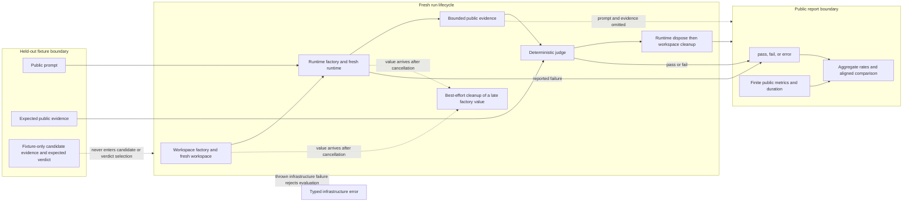

## Kết quả

Bạn sẽ dựng một [harness](../glossary.md#harness) offline cho [held-out evaluation](../glossary.md#held-out-evaluation). Harness đọc fixture data chưa biết theo cách phòng thủ, tạo workspace cùng runtime mới cho từng lần lặp task, chỉ đưa public prompt cho candidate rồi yêu cầu một [judge](../glossary.md#judge) có tính xác định chuyển public evidence có giới hạn thành [verdict](../glossary.md#verdict) `pass` hoặc `fail`.

Harness ghi verdict `error` riêng khi candidate runtime báo rằng nó không tạo được observation hợp lệ. Exception từ factory, runtime, judge hoặc clock, cancellation hay lỗi trong cleanup ownership đã đăng ký sẽ làm evaluation bị reject như infrastructure failure. Baseline và candidate report chỉ được so sánh khi có cùng task identity và run identity. Aggregate rate ổn định cùng report allowlist nghiêm ngặt giúp review nhiều lần chạy offline mà không serialize prompt, expected evidence, candidate evidence, transcript hay file content.

:::note[Course implementation]

`EvaluationCandidate`, `runEvaluation()`, `deterministicEvaluationJudge`, `compareEvaluations()`, `serializeEvaluationReport()`, fixture schema, limit, verdict ranking và error code là contract của Course implementation. Harness không dùng Pi package, provider, API key hay network request.

:::

## Điều kiện tiên quyết

Hoàn thành [checkpoint 13](13-runtime-composition.md). Bạn cần hiểu runtime ownership, temporary workspace mới, deterministic test double, cancellation, cleanup trong boundary kiểu `finally`, immutable snapshot từ unknown data và khác biệt giữa hành vi task quan sát được với test environment bị hỏng.

Hãy đọc implementation, fixture và bằng chứng cùng nhau:

| Vai trò | Đường dẫn chính xác | Nội dung cần kiểm tra |
| --- | --- | --- |
| Mã nguồn tích lũy | `course/src/eval.ts` | Chụp fixture, lập lịch work, runtime ownership, judging, report projection, aggregate, comparison, cancellation và cleanup timeout |
| Bằng chứng tập trung | `course/test/14-agent-evaluation.test.ts` | Runtime mới, hidden field, verdict class, tính lặp lại, baseline pairing, cap, cancellation race, serialization an toàn và cleanup aggregate |
| Held-out fixture | `course/fixtures/eval-tasks.json` | Hai case số học offline với public prompt, public evidence bắt buộc và test oracle chỉ dùng trong fixture |

Fixture là test data cố định, không phải training data. Đừng xem expected field trong lúc tune candidate mà bạn định đo; hãy thêm một development set hiển thị riêng cho công việc đó.

## Cơ chế

`loadEvaluationTasks()` xử lý JSON như `unknown`. Hàm yêu cầu `schemaVersion: 1`, một dense array gồm `1` tới `256` task duy nhất, ID ổn định có giới hạn, `split: "held-out"`, prompt có giới hạn, các item không trùng nhau bên trong `expectedPublicEvidence.includes`, cùng `candidatePublicEvidence` và `expectedVerdict` chỉ dùng trong fixture. Hàm chụp rồi đóng băng mọi tầng được chấp nhận. Khi chạy evaluation, `EvaluationJudgeInput.candidatePublicEvidence` là output có giới hạn của candidate; nó có thể trùng với các item bắt buộc và được so sánh với danh sách đó. Ngược lại, hai field `candidatePublicEvidence` và `expectedVerdict` trong task fixture chỉ là test oracle. Chúng không đi vào input của candidate hoặc judge, còn `expectedVerdict` không bao giờ chọn production verdict.

`runEvaluation()` khai triển task theo thứ tự fixture và số repetition từ `1` tới `64`, gán `run-000001`, `run-000002` và tiếp tục như vậy. Tích số task với repetition không được vượt `4,096` run. Mặc định execution chạy tuần tự; concurrency tùy chọn bị giới hạn ở `8`. Mỗi work item nhận workspace mới, sau đó là `EvaluationRuntime` mới với candidate ID, task ID, run ID, repetition, workspace path và cancellation signal. `run()` của runtime chỉ nhận `{ prompt, signal }`.

Runtime hoàn tất trả `publicEvidence` cùng public metric tùy chọn. Judge nhận prompt, required public evidence, candidate public evidence, các ID và signal. Default judge dùng phép membership trên set có giới hạn rồi đếm evidence bắt buộc và evidence khớp; nó không gọi model. Judge result hợp lệ chỉ là `pass` hoặc `fail`. Runtime cũng có thể trả `{ status: "failed", errorCode }`; trường hợp này tạo run với `verdict: "error"`, bỏ qua judge và giữ code đã sanitize.

Exception không được catch nghĩa là harness không lấy được observation hợp lệ. Lỗi khi dựng runtime, thực thi hoặc chấm điểm trở thành `EVALUATION_RUNTIME_FACTORY_FAILED`, `EVALUATION_RUNTIME_FAILED` hoặc `EVALUATION_JUDGE_FAILED`, rồi reject toàn bộ evaluation. Cancellation dùng chung một internal signal: infrastructure failure đầu tiên ngăn work mới và cancel các worker đang chạy đồng thời.

Sau khi ownership của runtime hoặc workspace đã được đăng ký, `runOne()` đợi runtime disposer hoàn tất rồi mới đợi workspace cleanup qua `settleOwnedCleanup()`. Mỗi cleanup đã đăng ký bỏ qua cancellation của run và có `cleanupTimeoutMs` riêng đã cấu hình, tối đa `1,000` ms. Nếu cleanup lỗi, harness tạo `EVALUATION_CLEANUP_FAILED`; khi đã có primary infrastructure failure, aggregate giữ lỗi đó trước các cleanup failure.

Một đường riêng xử lý Promise của workspace hoặc runtime factory chỉ hoàn tất với owned value sau khi cancellation đã thắng race. `invokeFactoryAbortable()` chuyển value về muộn đó cho `observeLateCleanup()`. Hàm này gọi cleanup theo kiểu best-effort và quan sát Promise được trả về nhưng không await. Đường này không có cleanup cap `1,000` ms; synchronous throw hoặc asynchronous rejection được quan sát rồi bỏ qua thay vì đưa vào failure aggregate của evaluation. Nhờ vậy cancellation không bị trì hoãn và không phát sinh unhandled rejection.

Evidence và metric có work budget rõ ràng. Required evidence và candidate evidence mỗi phía nhận tối đa `32` item; mỗi item nhận `4,096` code point Unicode; tổng evidence hai phía cho mỗi task là `65,536` code point. Runtime metric và judge metric mỗi nguồn nhận `64` entry hữu hạn, còn run report sau khi gộp nhận `128`. Việc kiểm tra prompt bị giới hạn ở `100,000` code unit UTF-16. Các ceiling này chặn local work và kích thước report; chúng không làm evidence tùy ý trở nên an toàn để tiết lộ.

`EvaluationReport` chứa candidate ID, run có thứ tự cùng aggregate count và rate cho `pass`, `fail`, `error`. `compareEvaluations()` kiểm tra hai report, căn đúng tập `taskId` cộng `runId`, xếp hạng `error < fail < pass` rồi báo row improved, regressed hoặc unchanged cùng rate delta. Duration không tham gia chọn outcome. Muốn baseline/candidate comparison có nghĩa, hãy dùng cùng held-out task, repetition count, judge definition, candidate setting và code revision.

`serializeEvaluationReport()` tự xuất một allowlist có thứ tự ổn định: task, run và candidate ID; verdict; public metric hữu hạn đã sort; duration; error code; aggregate rate. Hàm bỏ qua `toJSON`, từ chối record bọc Proxy và loại prompt cùng evidence. ID và metric vẫn có thể làm lộ label hoặc phép đo nhạy cảm, vì vậy hãy chọn identifier trung tính và kiểm tra serialized artifact trước khi chia sẻ.

## Dấu vết hoặc mô hình



| Kết quả tại boundary | Có gọi judge? | Kết quả run/report | Cách diễn giải |
| --- | --- | --- | --- |
| Runtime trả `completed` | Có | `pass` hoặc `fail` | Observation hợp lệ của task được chấm theo contract đã khai báo |
| Runtime trả `failed` | Không | `error` cùng code đã sanitize | Candidate không tạo được observation có thể chấm |
| Factory, runtime hoặc judge throw | Tùy giai đoạn | Evaluation reject bằng typed infrastructure error | Sửa harness, environment hoặc adapter trước khi so sánh chất lượng |
| Cancellation hoặc cleanup đã đăng ký lỗi | Không chạy work tiếp | Evaluation reject; lỗi cleanup đã đăng ký được aggregate | Không tồn tại report hoàn chỉnh có thể tái lập |
| Factory trả owned value sau cancellation | Không chạy work tiếp | Cancellation đã chọn không bị trì hoãn hoặc thay thế | Cleanup là best-effort, được quan sát, không await và không có trong aggregate |

## Xây dựng

Module tích lũy là `course/src/eval.ts`. Đoạn nguyên văn sau từ `course/test/14-agent-evaluation.test.ts` chạy cùng held-out fixture hai lần rồi kiểm tra deterministic verdict cùng aggregate:

```ts
const first = await runEvaluation({
  candidate,
  tasks: await fixture(),
  repetitions: 2,
});
const second = await runEvaluation({
  candidate,
  tasks: await fixture(),
  repetitions: 2,
});

expect(first.runs.map((run) => run.verdict)).toEqual([
  "pass",
  "pass",
  "fail",
  "fail",
]);
expect(second.runs.map((run) => run.verdict)).toEqual(
  first.runs.map((run) => run.verdict),
);
expect(first.publicMetrics).toEqual(second.publicMetrics);
```

Focused test đó còn chứng minh tám runtime object riêng và tám temporary path riêng trong hai report bốn run, dispose cả tám runtime và xác nhận mọi workspace path đã bị xóa.

Chỉ dùng `compareEvaluations(baseline, candidate)` sau khi cả hai report được tạo từ cùng layout task/repetition. Comparison kiểm tra identity thay vì chỉ ghép row theo vị trí array.

## Chạy focused test

Focused test là `course/test/14-agent-evaluation.test.ts`. Chạy chính xác:

```bash
npm run test:course:checkpoint -- course/test/14-agent-evaluation.test.ts
```

File này chứng minh việc cô lập held-out fixture, ownership của runtime và workspace mới, deterministic pass/fail evaluation, phân loại `error`, tiếp nhận custom judge, baseline alignment chính xác, cô lập duration, bounded concurrency, cancellation, cleanup những workspace/runtime value mà factory chỉ trả về sau cancellation, aggregate lỗi và timeout của cleanup đã đăng ký, report allowlisting, từ chối duplicate identity, cap cho evidence và metric cùng cơ chế chống hostile object.

## Thử nghiệm lỗi

Làm một operation bên trong candidate runtime throw, catch tại candidate adapter boundary rồi báo runtime thất bại. Harness phải ghi `error`; nó không được đổi observation bị thiếu thành verdict `fail`:

```ts
const report = await runEvaluation({
  candidate: {
    id: "caught-harness-failure",
    createRuntime: () => ({
      run: () => {
        try {
          throw new Error("model timed out");
        } catch {
          return {
            status: "failed" as const,
            errorCode: "MODEL_TIMEOUT",
            publicMetrics: { attempts: 1 },
          };
        }
      },
      dispose: () => undefined,
    }),
  },
  tasks: singleTask("held-out-timeout"),
});

expect(report.runs[0]).toMatchObject({
  verdict: "error",
  errorCode: "MODEL_TIMEOUT",
  publicMetrics: { attempts: 1 },
});
expect(report.publicMetrics).toMatchObject({
  failedRuns: 0,
  errorRuns: 1,
});
```

Sau đó bỏ `try`/`catch` và để `run()` throw. `runEvaluation()` phải reject với `EVALUATION_RUNTIME_FAILED`, vì chính harness đã mất observation. Cả hai trường hợp đều khác completed output được judge trả `fail`. Chạy focused command sau mỗi thay đổi, rồi khôi phục phiên bản có catch hoặc test fixture ban đầu.

## Tiêu chí chấp nhận

- Focused command chỉ chọn `course/test/14-agent-evaluation.test.ts` và pass offline, không có credential hay network access.
- Fixture chỉ nhận từ `1` tới `256` held-out task duy nhất và không đưa expected evidence cùng fixture oracle vào candidate input.
- Mỗi task repetition nhận workspace và runtime mới; repetition bị giới hạn ở `64`, tổng run ở `4,096`.
- Deterministic judge chỉ trả `pass` hoặc `fail`; runtime báo lỗi trở thành `error` và bỏ qua judging.
- Exception từ runtime, factory, judge hoặc clock, cancellation hay lỗi trong cleanup ownership đã đăng ký vẫn là typed infrastructure failure, không phải task verdict tự bịa.
- Shared cancellation dừng work phía sau; `settleOwnedCleanup()` đợi registered runtime disposal và workspace cleanup đúng một lần theo ownership order, áp dụng mức tối đa đã cấu hình là `1,000` ms cho từng cleanup đã đăng ký và aggregate lỗi của chúng với primary failure nếu có.
- `observeLateCleanup()` xử lý workspace/runtime value do factory trả về sau cancellation theo kiểu best-effort, không await và không có cleanup cap đã cấu hình; cleanup failure được quan sát rồi bỏ qua, không đưa vào aggregate.
- Evidence bị giới hạn ở `32` item mỗi phía, `4,096` code point mỗi item và tổng `65,536` code point cho mỗi task.
- Source metric bị giới hạn ở `64` cho mỗi runtime hoặc judge, merged report ở `128`; chỉ nhận giá trị hữu hạn có tên hợp lệ.
- Baseline và candidate comparison yêu cầu task/run identity giống nhau và báo rate có thể tái lập riêng cho `pass`, `fail`, `error`.
- Stable serialization chỉ xuất public allowlist và loại prompt, expected evidence, candidate evidence, transcript cùng file content.

## So sánh với Pi SDK 0.84.3

:::info[Pi SDK 0.84.3]

Workspace `packages/evals` đã pin của Pi có `private: true`. Đây là release source cho evaluation system của chính Pi, không phải public export của `@earendil-works/pi-coding-agent` và không phải npm dependency cho application.

:::

Private workspace của Pi nối một `AgentSession` thật với `vitest-evals`, tạo project directory và agent directory tạm đã cô lập, chạy hành vi Coding Agent có model hỗ trợ, ghi usage cùng timing và đính kèm Session artifact gốc. `createPiCodingAgentHarness()` cùng comparative reporter nội bộ hỗ trợ chọn provider/model thật, deterministic hoặc model-backed judge, baseline/candidate treatment lặp lại và telemetry delta. Provider request có thể phát sinh chi phí, còn Session artifact được giữ có thể chứa prompt, response, source code, Tool input và Tool output.

Course implementation là deterministic local harness trên synthetic evidence. Nó không có Pi `AgentSession`, provider telemetry, native Session artifact hay API `vitest-evals`; không type nào của nó nên được import vào application dùng Pi. Để chạy private Pi suite đã pin theo bản phát hành, hãy làm theo [Chạy Pi eval](../how-to/run-pi-evals.md); hướng dẫn đó bao quát exact checkout, smoke eval, model-backed execution tùy chọn, phương pháp baseline/candidate, kiểm tra artifact, redaction và cleanup.

## Checkpoint tiếp theo

Bạn đã hoàn thành runnable workshop. Quay lại [tổng quan khóa học](index.mdx) để audit từng checkpoint theo focused test, sau đó dùng [Chương 11](../ch11-testing-evaluation.md) để đặt các contract offline này trong chiến lược testing và evaluation rộng hơn cho Pi.
