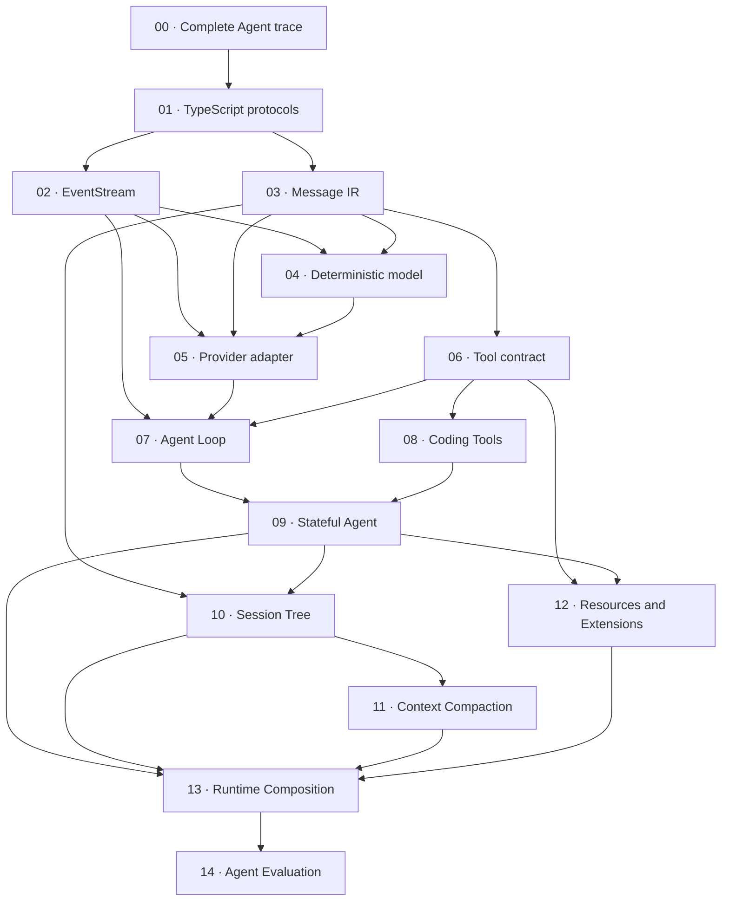

Khóa học này dành cho lập trình viên TypeScript muốn hiểu Agent bằng cách tự xây từng ranh giới, thay vì bọc một model call trong framework lớn. Bạn sẽ theo một bản triển khai được mở rộng từng bước, bắt đầu từ dấu vết hoàn chỉnh rồi đi qua protocol có kiểu rõ ràng, truyền dữ liệu theo luồng, Tool, phiên làm việc bền vững, nén ngữ cảnh, nạp Extension, Runtime Composition và đánh giá deterministic.

:::caution[Phục vụ học tập và không chính thức]

Code trong `course/src/` là **Course implementation**. Đây là hệ thống phục vụ giảng dạy, đã được đơn giản hóa và do Pify tự xây dựng, duy trì. Nó không phải gói Pi (Pi package) chính thức, không import phần nội bộ chưa phát hành của Pi và không cam kết tương thích API với Pi. Chỉ nội dung mang nhãn **Pi SDK 0.87.1** mới mô tả bản SDK được phát hành riêng hoặc gọi tên export công khai đã được kiểm chứng của bản đó.

:::

## Bạn sẽ xây dựng gì

Workshop hoàn chỉnh là một Agent stack nhỏ nhưng chạy trọn vẹn. Message của user đi vào vòng lặp Agent (Agent Loop). Model có đầu ra deterministic sẽ phát text hoặc yêu cầu một Tool. Vòng lặp kiểm tra dữ liệu rồi thực thi Tool, liên kết kết quả với Tool call ban đầu và tiếp tục cho đến khi nhận được terminal result có type rõ ràng. Các checkpoint sau bổ sung một Agent có state để sở hữu vòng đời prompt, cây phiên làm việc chỉ ghi nối tiếp, cách chọn ngữ cảnh có giới hạn, Resource và Extension, runtime có thể thay thế cùng bộ khung đánh giá (evaluation harness).

Khóa học phù hợp khi bạn xây hạ tầng Agent, tích hợp Pi SDK, rà soát một Agent framework hoặc cần test làm lộ lỗi protocol và vòng đời. Nội dung đi thẳng vào các cơ chế như quyền sở hữu iterator, hủy tác vụ, xác thực transcript, đăng ký atomic, dọn dẹp và giới hạn output. Khóa học không dạy cách viết prompt, thiết lập tài khoản provider hay triển khai sandbox cho production.

Mỗi checkpoint giữ nguyên contract của các checkpoint trước. Workshop vì thế có hai góc nhìn song song:

- các trang đánh số cô lập một cơ chế mới và một thử nghiệm lỗi có kiểm soát;
- toàn bộ thư mục `course/` cho thấy cách ghép các cơ chế đó thành một runtime.

## Điều kiện tiên quyết

Hãy dùng Node.js 22 và các dependency ở repository root. Bạn cần đọc được discriminated union, type `Readonly`, generic interface và hàm `async` trong TypeScript. Các checkpoint về truyền dữ liệu theo luồng giả định bạn đã biết cơ bản về `Promise`, `AsyncIterable`, `for await...of` và `AbortSignal`. Quy trình test sử dụng Vitest, fixture filesystem tạm thời, assertion và test double.

Bạn không cần tài khoản provider, API key, model trả phí, database hoặc container runtime. Model và record của provider trong workshop đều là fixture cục bộ có kết quả deterministic. Sau khi cài dependency ở root, mọi checkpoint test và toàn bộ workshop suite đều chạy mà không tạo network request đến provider. Trên máy mới, `npm ci` vẫn có thể cần kết nối npm registry để tải các dependency đó.

Repository đã chứa bản triển khai tham chiếu hoàn chỉnh. Để thực hiện thử nghiệm lỗi mà không làm xáo trộn bản này, hãy làm trên một branch hoặc copy `course/` sang thư mục thực hành tạm thời. Bản phát hành hiện tại không có checkpoint generator và cũng không có solution branch ẩn riêng.

## Thiết lập và kiểm tra workshop

Chạy các lệnh từ repository root. Cài đặt một lần, sau đó chọn một checkpoint test cụ thể hoặc toàn bộ test suite tích lũy:

```bash
npm ci
npm run test:course:checkpoint -- course/test/00-complete-agent-trace.test.ts
npm run test:course
```

`test:course:checkpoint` chuyển file selector cho Vitest và bắt buộc nhận đúng một đường dẫn `course/test/*.test.ts`. Lệnh trên chỉ chọn checkpoint `00`, không chạy mười bốn file còn lại. `test:course` chạy đủ mười lăm checkpoint file và chứng minh lớp thêm sau không phá contract của lớp trước.

Lockfile ở root là lockfile duy nhất của workshop. Không tạo `course/package.json` hoặc `course/package-lock.json`. Khi workshop nằm ngay trong repository tài liệu, nội dung, mã nguồn, focused test, cấu hình TypeScript và version của dependency có thể được rà soát trong cùng một thay đổi.

## Kiến trúc tích lũy

Các mũi tên dưới đây biểu diễn dependency chính trong quá trình xây dựng. Đây không phải import graph: một số module về sau dùng lại nhiều contract trước đó. Hãy học checkpoint theo thứ tự số ngay cả khi sơ đồ tách nhánh.



Bảy checkpoint triển khai đầu tiên thiết lập mặt phẳng dữ liệu (data plane) và mặt phẳng thực thi (execution plane): protocol xác định các giá trị hợp lệ, `EventStream` chuyển sự kiện tiến trình theo đúng thứ tự, Message IR chuẩn hóa transcript, `ScriptedModel` cung cấp response đã lập script với kết quả deterministic mà không cần provider bên ngoài hay network request, adapter xác thực dữ liệu vận chuyển không đáng tin cậy, Tool cô lập side effect và vòng lặp Agent điều phối round-trip.

Checkpoint `08` đến `13` bổ sung các yêu cầu khi đưa workshop vào host. Coding Tool giới hạn side effect của filesystem và process trong workspace đã khai báo. Stateful Agent sở hữu vòng đời của prompt, dùng busy guard để từ chối các run chồng lấn và chỉ dùng hàng đợi cho message điều hướng (steering) cùng message tiếp nối (follow-up); nó cũng quản lý subscription. Cây phiên làm việc lưu lịch sử liên kết bằng parent mà không làm phẳng branch. Nén ngữ cảnh giữ nguyên một Tool round hoàn chỉnh. Resource và Extension đăng ký capability theo cách atomic. Runtime Composition đặt các resource đó dưới một owner, với thứ tự thay thế và dispose xác định. Checkpoint `14` bổ sung một lớp đánh giá độc lập: nó xác thực fixture chứa held-out task, nhận từng `EvaluationCandidate` do mã gọi cung cấp, tạo một `EvaluationRuntime` riêng cho mỗi task và lần lặp, rồi chuyển `expectedPublicEvidence` từ fixture cùng `publicEvidence` từ runtime cho judge. Báo cáo tuần tự hóa có giới hạn chỉ giữ ID, verdict, `publicMetrics`, `durationMs` và `errorCode`, không giữ prompt hoặc evidence. Lớp này không tự khởi tạo hoặc tự đánh giá `CourseRuntime` của checkpoint `13`; muốn nối runtime đó vào bộ khung đánh giá, bạn cần một adapter triển khai candidate contract.

## Bản đồ checkpoint

Cột điều kiện tiên quyết ghi checkpoint đứng ngay trước trong lộ trình tích lũy. Cột source và focused test chứa đường dẫn nguyên văn trong repository; hãy dùng chúng thay vì tìm một production API có tên gần giống.

| Checkpoint | Kết quả | Course source | Focused test | Điều kiện tiên quyết |
| --- | --- | --- | --- | --- |
| [00 · Complete Agent trace](00-complete-agent-trace.md) | Dựng lại một dấu vết bất biến user → model → Tool → model → final response; kiểm tra thứ tự sự kiện và liên kết call/result ổn định. | `course/src/demo/prologue.ts` | `course/test/00-complete-agent-trace.test.ts` | Thiết lập repository |
| [01 · TypeScript protocols](01-typescript-protocols.md) | Biểu diễn message, chunk, Tool, sự kiện và terminal result bằng readonly discriminated union với xử lý exhaustive. | `course/src/protocol.ts` | `course/test/01-typescript-protocols.test.ts` | Checkpoint 00 |
| [02 · EventStream](02-event-stream.md) | Xây kênh sự kiện `AsyncIterable` chỉ cho phép một consumer hoạt động tại một thời điểm, trả sự kiện theo thứ tự từ `buffer` hoặc cho consumer đang chờ, hoàn tất terminal result riêng và dọn các waiter. | `course/src/event-stream.ts` | `course/test/02-event-stream.test.ts` | Checkpoint 01 |
| [03 · Message IR](03-message-ir.md) | Chuẩn hóa message của user, assistant và Tool result; từ chối Tool linkage sai; giữ nguyên JSON round-trip hợp lệ. | `course/src/messages.ts` | `course/test/03-message-ir.test.ts` | Checkpoint 02 |
| [04 · Deterministic model](04-deterministic-model.md) | Lập script cho response factory, ghi lại request, giữ thứ tự chunk, đồng thời làm rõ queue exhaustion và cơ chế hủy trong test. | `course/src/scripted-model.ts` | `course/test/04-deterministic-model.test.ts` | Checkpoint 03 |
| [05 · Provider adapter](05-provider-adapter.md) | Xác thực fixture record có type `unknown`, chuẩn hóa dữ liệu provider và yêu cầu đúng một sự kiện kết thúc mà không dùng network. | `course/src/provider-adapter.ts` | `course/test/05-provider-adapter.test.ts` | Checkpoint 04 |
| [06 · Tool contract](06-tool-contract.md) | Xác thực trước khi tạo side effect, đăng ký Tool theo cách atomic, giới hạn serialized output, truyền tín hiệu hủy và biểu diễn recoverable error. | `course/src/tool.ts` | `course/test/06-tool-contract.test.ts` | Checkpoint 05 |
| [07 · Vòng lặp Agent](07-agent-loop.md) | Điều phối model turn và nhiều Tool call với quyền sở hữu transcript, sự kiện đúng thứ tự, step budget, cơ chế hủy và stop reason có type. | `course/src/agent-loop.ts` | `course/test/07-agent-loop.test.ts` | Checkpoint 06 |
| [08 · Coding Tools](08-coding-tools.md) | Giới hạn Tool đọc ghi file và chạy Node process bằng canonical path, atomic write, output có giới hạn, timeout và cách thực thi không phụ thuộc platform. | `course/src/coding-tools.ts` | `course/test/08-coding-tools.test.ts` | Checkpoint 07 |
| [09 · Stateful Agent](09-stateful-agent.md) | Sở hữu vòng đời prompt và state thay đổi qua immutable snapshot; dùng busy guard để từ chối run chồng lấn; chỉ xếp message điều hướng/message tiếp nối vào hàng đợi; quản lý subscription và khả năng phục hồi. | `course/src/agent.ts` | `course/test/09-stateful-agent.test.ts` | Checkpoint 08 |
| [10 · Cây phiên làm việc](10-session-tree.md) | Lưu JSONL entry liên kết bằng parent, chọn active leaf, chiếu từng branch, phục hồi phần cuối bị cắt và từ chối dữ liệu hỏng ở giữa file. | `course/src/session.ts` | `course/test/10-session-tree.test.ts` | Checkpoint 09 |
| [11 · Nén ngữ cảnh](11-context-compaction.md) | Tính budget cho ngữ cảnh đang hoạt động theo cách deterministic, giữ trọn Tool round, xác thực summary, giữ message gần đây và không sửa state khi lỗi. | `course/src/context.ts` | `course/test/11-context-compaction.test.ts` | Checkpoint 10 |
| [12 · Resources and Extensions](12-resources-extensions.md) | Tìm metadata dưới trusted root, chỉ activate khi cần, commit contribution theo cách atomic, rollback khi lỗi và dispose theo thứ tự ngược. | `course/src/resources.ts` | `course/test/12-resources-extensions.test.ts` | Checkpoint 11 |
| [13 · Runtime Composition](13-runtime-composition.md) | Ghép workspace, Tool, Resource, Extension, phiên làm việc và Agent dưới một owner có thể thay thế, với teardown deterministic. | `course/src/runtime.ts` | `course/test/13-runtime-composition.test.ts` | Checkpoint 12 |
| [14 · Agent Evaluation](14-agent-evaluation.md) | Chạy offline task có giới hạn bằng runtime do từng `EvaluationCandidate` cung cấp, tách task verdict khỏi infrastructure error, so sánh candidate và xuất báo cáo an toàn cho dữ liệu. | `course/src/eval.ts` | `course/test/14-agent-evaluation.test.ts` | Checkpoint 13 |

Các đường dẫn trong bảng là một phần của course contract. Mỗi trang checkpoint lặp lại đúng module, test file, focused command, thử nghiệm lỗi và tiêu chí chấp nhận của nó. Nếu prose và code không khớp, focused test đã commit xác định điều workshop hiện chứng minh; trang tài liệu phải được sửa trong cùng thay đổi.

## Cách học từng checkpoint

Hãy dùng một vòng lặp red/green ngắn thay vì đọc hết prose trước:

1. Đọc kết quả, điều kiện tiên quyết và cơ chế cho đến khi bạn có thể dự đoán sự kiện hoặc state transition mà test sẽ quan sát.
2. Chạy focused test một lần trên bản triển khai tham chiếu chưa sửa và xác nhận chỉ file được nêu là pass.
3. Áp dụng thay đổi có kiểm soát trong thử nghiệm lỗi trên branch hoặc bản copy thực hành. Chạy lại cùng lệnh và đọc assertion bị fail; kết quả red đó phải chỉ ra contract, không phải một syntax error tùy ý.
4. Khôi phục dòng đã sửa, sau đó đọc hoặc tự triển khai module tương ứng trong `course/src/`. Giữ đúng tên protocol và limit mà focused test sử dụng.
5. Chạy lại focused test để nhận green, rồi chạy `npm run test:course` nhằm bắt lỗi hồi quy ở lớp trước.
6. Đọc phần so sánh với Pi sau cùng. Ánh xạ cơ chế sang SDK đã ghim theo release mà không thay identifier của workshop bằng identifier của Pi.

Ví dụ, vòng lặp cho checkpoint `04` dùng đúng các lệnh sau:

```bash
npm run test:course:checkpoint -- course/test/04-deterministic-model.test.ts
npm run test:course
```

Kết quả red do queue exhaustion chỉ có ý nghĩa khi thử nghiệm yêu cầu thêm một response vượt quá script hữu hạn. TypeScript compile error, file selector sai, lỗi cài dependency hoặc checkpoint khác bị fail không chứng minh hành vi đó. Hãy giữ thử nghiệm đủ hẹp để thông báo lỗi chỉ đúng cơ chế được mô tả trên trang.

## Course implementation và Pi SDK 0.87.1

Callout **Course implementation** mô tả type và function được export từ `course/src/` trong repository này. Các tên như `EventStream`, `ScriptedModel`, `ToolRegistry`, `SessionTree` và `CourseRuntimeManager` giúp workshop tách riêng từng mối quan tâm. Signature, giới hạn, error class, định dạng lưu trữ và quy tắc vòng đời của chúng đều thuộc về workshop.

Callout **Pi SDK 0.87.1** so sánh mối quan tâm đó với các gói Pi đã phát hành ở phiên bản `0.87.1`. Nội dung so sánh có thể gọi tên một export công khai đã kiểm chứng, hoặc giải thích rằng Pi có contract phong phú hơn về provider, Tool, sự kiện, phiên làm việc hay runtime. Đây là hướng dẫn đọc, không phải chỉ dẫn đưa object thuộc Course vào một function của Pi. Đừng suy ra khả năng tương thích API chỉ vì có các thuật ngữ giống nhau như Agent, Tool, message, phiên làm việc hoặc nén ngữ cảnh.

Sự phân tách này cũng xác định căn cứ khi hai bên khác nhau. Focused test của course là chuẩn cho Course implementation. Gói `0.87.1` đã phát hành và mã nguồn tương ứng của release đó là chuẩn cho phần so sánh Pi SDK. Hành vi trên upstream chưa phát hành nằm ngoài khóa học, trừ khi một trang ghi rõ đó là nội dung chưa phát hành.

## Tiêu chí hoàn thành

Bạn hoàn thành khóa học khi chứng minh được các contract, không phải chỉ khi đã đọc mười lăm trang:

- Node.js báo version `22.x` và repository dùng root lockfile;
- từng focused command chính xác chỉ chọn một checkpoint file và pass mà không cần API key hoặc network request đến provider;
- `npm run test:course` pass đủ mười lăm checkpoint file sau mỗi thay đổi tích lũy;
- bạn lần theo được Tool call ID từ assistant request qua Tool result đến continuation, đồng thời xác định terminal run status;
- bạn giải thích được thành phần nào sở hữu iteration, cơ chế hủy, thay đổi transcript, lưu phiên làm việc, thay thế runtime và dọn dẹp ở từng ranh giới;
- thử nghiệm lỗi fail đúng invariant dự kiến và trở lại green sau khi khôi phục;
- bạn phân biệt được task failure với infrastructure failure và xác định evidence nào an toàn để lưu;
- bạn chỉ đúng **Course implementation** khi nói về workshop và **Pi SDK 0.87.1** khi nói về production SDK mà không trộn API của hai bên.

Bắt đầu với [checkpoint 00](00-complete-agent-trace.md). Trang đó cho bạn một dấu vết hoàn chỉnh trước khi checkpoint `01` tách dấu vết thành các protocol.
